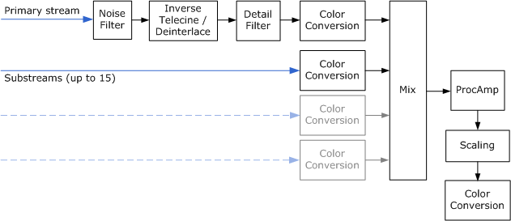
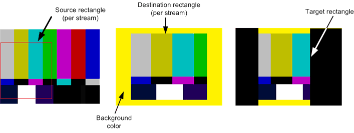
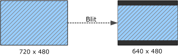
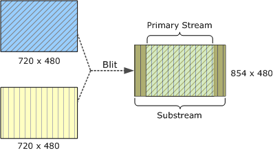
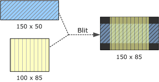
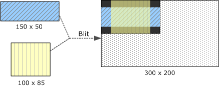
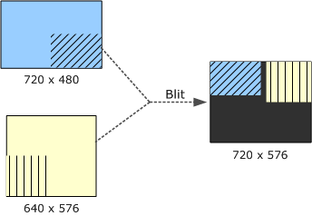
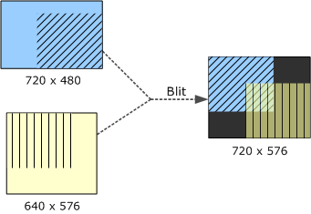
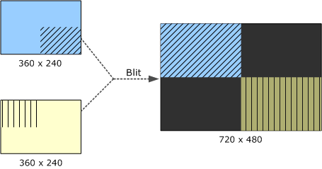

# DXVA Video Processing

DXVA video processing encapsulates the functions of the graphics hardware that are devoted to processing uncompressed video images. Video processing services include deinterlacing and video mixing.

This topic contains the following sections:

-   [Overview](#overview)
-   [Creating a Video Processing Device](#creating-a-video-processing-device)
    -   [Get the IDirectXVideoProcessorService Pointer](#get-the-idirectxvideoprocessorservice-pointer)
    -   [Enumerate the Video Processing Devices](#enumerate-the-video-processing-devices)
    -   [Enumerate Render-Target Formats](#enumerate-render-target-formats)
    -   [Query the Device Capabilities](#query-the-device-capabilities)
    -   [Create the Device](#create-the-device)
-   [Video Process Blit](#video-process-blit)
    -   [Blit Parameters](#blit-parameters)
    -   [Input Samples](#input-samples)
-   [Image Composition](#image-composition)
    -   [Example 1: Letterboxing](#example-1-letterboxing)
    -   [Example 2: Stretching Substream Images](#example-2-stretching-substream-images)
    -   [Example 3: Mismatched Stream Heights](#example-3-mismatched-stream-heights)
    -   [Example 4: Target Rectangle Smaller Than Destination Surface](#example-4-target-rectangle-smaller-than-destination-surface)
    -   [Example 5: Source Rectangles](#example-5-source-rectangles)
    -   [Example 6: Intersecting Destination Rectangles](#example-6-intersecting-destination-rectangles)
    -   [Example 7: Stretching and Cropping Video](#example-7-stretching-and-cropping-video)
-   [Input Sample Order](#input-sample-order)
    -   [Example 1](#example-1-letterboxing)
    -   [Example 2](#example-2-stretching-substream-images)
    -   [Example 3](#example-3-mismatched-stream-heights)
    -   [Example 4](#example-4-target-rectangle-smaller-than-destination-surface)
-   [Related topics](#related-topics)

## Overview

Graphics hardware can use the graphics processing unit (GPU) to process uncompressed video images. A *video processing* device is a software component that encapsulates these functions. Applications can use a video processing device to perform functions such as:

-   Deinterlacing and inverse telecine
-   Mixing video substreams onto the main video image
-   Color adjustment (ProcAmp) and image filtering
-   Image scaling
-   Color-space conversion
-   Alpha blending

The following diagram shows the stages in the video processing pipeline. The diagram is not meant to show an actual implementation. For example, the graphics driver might combine several stages into a single operation. All of these operations can be performed in a single call to the video processing device. Some stages shown here, such as noise and detail filtering, might not be supported by the driver.



The input to the video processing pipeline always includes a *primary* video stream, which contains the main image data. The primary video stream determines the frame rate for the output video. Each frame of the output video is calculated relative to the input data from the primary video stream. Pixels in the primary stream are always opaque, with no per-pixel alpha data. The primary video stream can be progressive or interlaced.

Optionally, the video processing pipeline can receive up to 15 video substreams. A substream contains auxiliary image data, such as closed captions or DVD subpictures. These images are displayed over the primary video stream, and are generally not meant to be shown by themselves. Substream pictures can contain per-pixel alpha data, and are always progressive frames. The video processing device alpha-blends the substream images with the current deinterlaced frame from the primary video stream.

In the remainder of this topic, the term *picture* is used for the input data to a video processing device. A picture might consist of a progressive frame, a single field, or two interleaved fields. The output is always a deinterlaced frame.

A video driver can implement more than one video processing device, to provide different sets of video processing capabilities. Devices are identified by GUID. The following GUIDs are predefined:

-   **DXVA2\_VideoProcBobDevice**. This device performs bob deinterlacing.
-   **DXVA2\_VideoProcProgressiveDevice**. This device is used if the video contains only progressive frames, with no interlaced frames. (Some video content contains a mix of progressive and interlaced frames. The progressive device cannot be used for this kind of "mixed" video content, because a deinterlacing step is required for the interlaced frames.)

Every graphics driver that supports DXVA video processing must implement at least these two devices. The graphics driver may also provide other devices, which are identified by driver-specific GUIDs. For example, a driver might implement a proprietary deinterlacing algorithm that produces better quality output than bob deinterlacing. Some deinterlacing algorithms may require forward or backward reference pictures from the primary stream. If so, the caller must provide these pictures to the driver in the correct sequence, as described later in this section.

A reference software device is also provided. The software device is optimized for quality rather than speed, and may not be adequate for real-time video processing. The reference software device uses the GUID value DXVA2\_VideoProcSoftwareDevice.

## Creating a Video Processing Device

Before using DXVA video processing, the application must create a video processing device. Here is a brief outline of the steps, which are explained in greater detail in the remainder of this section:

1.  Get a pointer to the [**IDirectXVideoProcessorService**](/windows/desktop/api/dxva2api/nn-dxva2api-idirectxvideoprocessorservice) interface.
2.  Create a description of the video format for the primary video stream. Use this description to get a list of the video processing devices that support the video format. Devices are identified by GUID.
3.  For a particular device, get a list of render-target formats supported by the device. The formats are returned as a list of **D3DFORMAT** values. If you plan to mix substreams, get a list of the supported substream formats as well.
4.  Query the capabilities of each device.
5.  Create the video processing device.

Sometimes you can omit some of these steps. For example, instead of getting the list of render-target formats, you could simply try creating the video processing device with your preferred format, and see if it succeeds. A common format such as D3DFMT\_X8R8G8B8 is likely to succeed.

The remainder of this section describes these steps in detail.

### Get the IDirectXVideoProcessorService Pointer

The [**IDirectXVideoProcessorService**](/windows/desktop/api/dxva2api/nn-dxva2api-idirectxvideoprocessorservice) interface is obtained from the Direct3D device. There are two ways to get a pointer to this interface:

-   From a Direct3D device.
-   From the [Direct3D Device Manager](direct3d-device-manager.md).

If you have a pointer to a Direct3D device, you can get an [**IDirectXVideoProcessorService**](/windows/desktop/api/dxva2api/nn-dxva2api-idirectxvideoprocessorservice) pointer by calling the [**DXVA2CreateVideoService**](/windows/desktop/api/dxva2api/nf-dxva2api-dxva2createvideoservice) function. Pass in a pointer to the device's **IDirect3DDevice9** interface, and specify **IID\_IDirectXVideoProcessorService** for the *riid* parameter, as shown in the following code:


```C++
    // Create the DXVA-2 Video Processor service.
    hr = DXVA2CreateVideoService(g_pD3DD9, IID_PPV_ARGS(&g_pDXVAVPS));
```


n some cases, one object creates the Direct3D device and then shares it with other objects through the [Direct3D Device Manager](direct3d-device-manager.md). In this situation, you can call [**IDirect3DDeviceManager9::GetVideoService**](/windows/desktop/api/dxva2api/nf-dxva2api-idirect3ddevicemanager9-getvideoservice) on the device manager to get the [**IDirectXVideoProcessorService**](/windows/desktop/api/dxva2api/nn-dxva2api-idirectxvideoprocessorservice) pointer, as shown in the following code:


```C++
HRESULT GetVideoProcessorService(
    IDirect3DDeviceManager9 *pDeviceManager,
    IDirectXVideoProcessorService **ppVPService
    )
{
    *ppVPService = NULL;

    HANDLE hDevice;

    HRESULT hr = pDeviceManager->OpenDeviceHandle(&hDevice);
    if (SUCCEEDED(hr))
    {
        // Get the video processor service 
        HRESULT hr2 = pDeviceManager->GetVideoService(
            hDevice, 
            IID_PPV_ARGS(ppVPService)
            );

        // Close the device handle.
        hr = pDeviceManager->CloseDeviceHandle(hDevice);

        if (FAILED(hr2))
        {
            hr = hr2;
        }
    }

    if (FAILED(hr))
    {
        SafeRelease(ppVPService);
    }

    return hr;
}
```


### Enumerate the Video Processing Devices

To get a list of video processing devices, fill in a [**DXVA2\_VideoDesc**](/windows/desktop/api/dxva2api/ns-dxva2api-dxva2_videodesc) structure with the format of the primary video stream, and pass this structure to the [**IDirectXVideoProcessorService::GetVideoProcessorDeviceGuids**](/windows/desktop/api/dxva2api/nf-dxva2api-idirectxvideoprocessorservice-getvideoprocessordeviceguids) method. The method returns an array of GUIDs, one for each video processing device that can be used with this video format.

Consider an application that renders a video stream in YUY2 format, using the BT.709 definition of YUV color, with a frame rate of 29.97 frames per second. Assume that the video content consists entirely of progressive frames. The following code fragment shows how to fill in the format description and get the device GUIDs:


```C++
    // Initialize the video descriptor.

    g_VideoDesc.SampleWidth                         = VIDEO_MAIN_WIDTH;
    g_VideoDesc.SampleHeight                        = VIDEO_MAIN_HEIGHT;
    g_VideoDesc.SampleFormat.VideoChromaSubsampling = DXVA2_VideoChromaSubsampling_MPEG2;
    g_VideoDesc.SampleFormat.NominalRange           = DXVA2_NominalRange_16_235;
    g_VideoDesc.SampleFormat.VideoTransferMatrix    = EX_COLOR_INFO[g_ExColorInfo][0];
    g_VideoDesc.SampleFormat.VideoLighting          = DXVA2_VideoLighting_dim;
    g_VideoDesc.SampleFormat.VideoPrimaries         = DXVA2_VideoPrimaries_BT709;
    g_VideoDesc.SampleFormat.VideoTransferFunction  = DXVA2_VideoTransFunc_709;
    g_VideoDesc.SampleFormat.SampleFormat           = DXVA2_SampleProgressiveFrame;
    g_VideoDesc.Format                              = VIDEO_MAIN_FORMAT;
    g_VideoDesc.InputSampleFreq.Numerator           = VIDEO_FPS;
    g_VideoDesc.InputSampleFreq.Denominator         = 1;
    g_VideoDesc.OutputFrameFreq.Numerator           = VIDEO_FPS;
    g_VideoDesc.OutputFrameFreq.Denominator         = 1;

    // Query the video processor GUID.

    UINT count;
    GUID* guids = NULL;

    hr = g_pDXVAVPS->GetVideoProcessorDeviceGuids(&g_VideoDesc, &count, &guids);
```


The code for this example is taken from the [DXVA2\_VideoProc](dxva2-videoproc-sample.md) SDK sample.

The *pGuids* array in this example is allocated by the [**GetVideoProcessorDeviceGuids**](/windows/desktop/api/dxva2api/nf-dxva2api-idirectxvideoprocessorservice-getvideoprocessordeviceguids) method, so the application must free the array by calling [**CoTaskMemFree**](/windows/win32/api/combaseapi/nf-combaseapi-cotaskmemfree). The remaining steps can be performed using any of the device GUIDs returned by this method.

### Enumerate Render-Target Formats

To get the list of render-target formats supported by the device, pass the device GUID and the [**DXVA2\_VideoDesc**](/windows/desktop/api/dxva2api/ns-dxva2api-dxva2_videodesc) structure to the [**IDirectXVideoProcessorService::GetVideoProcessorRenderTargets**](/windows/desktop/api/dxva2api/nf-dxva2api-idirectxvideoprocessorservice-getvideoprocessorrendertargets) method, as shown in the following code:


```C++
    // Query the supported render-target formats.

    UINT i, count;
    D3DFORMAT* formats = NULL;

    HRESULT hr = g_pDXVAVPS->GetVideoProcessorRenderTargets(
        guid, &g_VideoDesc, &count, &formats);

    if (FAILED(hr))
    {
        DBGMSG((L"GetVideoProcessorRenderTargets failed: 0x%x.\n", hr));
        return FALSE;
    }

    for (i = 0; i < count; i++)
    {
        if (formats[i] == VIDEO_RENDER_TARGET_FORMAT)
        {
            break;
        }
    }

    CoTaskMemFree(formats);

    if (i >= count)
    {
        DBGMSG((L"The device does not support the render-target format.\n"));
        return FALSE;
    }
```


The method returns an array of **D3DFORMAT** values. In this example, where the input type is YUY2, a typical list of formats might be D3DFMT\_X8R8G8B8 (32-bit RGB) and D3DMFT\_YUY2 (the input format). However, the exact list will depend on the driver.

The list of available formats for the substreams can vary depending on the render-target format and the input format. To get the list of substream formats, pass the device GUID, the format structure, and the render-target format to the [**IDirectXVideoProcessorService::GetVideoProcessorSubStreamFormats**](/windows/desktop/api/dxva2api/nf-dxva2api-idirectxvideoprocessorservice-getvideoprocessorsubstreamformats) method, as shown in the following code:


```C++
    // Query the supported substream formats.

    formats = NULL;

    hr = g_pDXVAVPS->GetVideoProcessorSubStreamFormats(
        guid, &g_VideoDesc, VIDEO_RENDER_TARGET_FORMAT, &count, &formats);

    if (FAILED(hr))
    {
        DBGMSG((L"GetVideoProcessorSubStreamFormats failed: 0x%x.\n", hr));
        return FALSE;
    }

    for (i = 0; i < count; i++)
    {
        if (formats[i] == VIDEO_SUB_FORMAT)
        {
            break;
        }
    }

    CoTaskMemFree(formats);

    if (i >= count)
    {
        DBGMSG((L"The device does not support the substream format.\n"));
        return FALSE;
    }
```


This method returns another array of **D3DFORMAT** values. Typical substream formats are AYUV and AI44.

### Query the Device Capabilities

To get the capabilities of a particular device, pass the device GUID, the format structure, and a render-target format to the [**IDirectXVideoProcessorService::GetVideoProcessorCaps**](/windows/desktop/api/dxva2api/nf-dxva2api-idirectxvideoprocessorservice-getvideoprocessorcaps) method. The method fills in a [**DXVA2\_VideoProcessorCaps**](/windows/desktop/api/dxva2api/ns-dxva2api-dxva2_videoprocessorcaps) structure structure with the device capabilities.


```C++
    // Query video processor capabilities.

    hr = g_pDXVAVPS->GetVideoProcessorCaps(
        guid, &g_VideoDesc, VIDEO_RENDER_TARGET_FORMAT, &g_VPCaps);

    if (FAILED(hr))
    {
        DBGMSG((L"GetVideoProcessorCaps failed: 0x%x.\n", hr));
        return FALSE;
    }
```


### Create the Device

To create the video processing device, call [**IDirectXVideoProcessorService::CreateVideoProcessor**](/windows/desktop/api/dxva2api/nf-dxva2api-idirectxvideoprocessorservice-createvideoprocessor). The input to this method is the device GUID, the format description, the render-target format, and the maximum number of substreams that you plan to mix. The method returns a pointer to the [**IDirectXVideoProcessor**](/windows/desktop/api/dxva2api/nn-dxva2api-idirectxvideoprocessor) interface, which represents the video processing device.


```C++
    // Finally create a video processor device.

    hr = g_pDXVAVPS->CreateVideoProcessor(
        guid,
        &g_VideoDesc,
        VIDEO_RENDER_TARGET_FORMAT,
        SUB_STREAM_COUNT,
        &g_pDXVAVPD
        );
```


## Video Process Blit

The main video processing operation is the *video processing blit*. (A *blit* is any operation that combines two or more bitmaps into a single bitmap. A video processing blit combines input pictures to create an output frame.) To perform a video processing blit, call [**IDirectXVideoProcessor::VideoProcessBlt**](/windows/desktop/api/dxva2api/nf-dxva2api-idirectxvideoprocessor-videoprocessblt). This method passes a set of video samples to the video processing device. In response, the video processing device processes the input pictures and generates one output frame. Processing can include deinterlacing, color-space conversion, and substream mixing. The output is written to a destination surface provided by the caller.

The [**VideoProcessBlt**](/windows/desktop/api/dxva2api/nf-dxva2api-idirectxvideoprocessor-videoprocessblt) method takes the following parameters:

-   *pRT* points to an **IDirect3DSurface9** render target surface that will receive the processed video frame.
-   *pBltParams* points to a [**DXVA2\_VideoProcessBltParams**](/windows/desktop/api/dxva2api/ns-dxva2api-dxva2_videoprocessbltparams) structure that specifies the parameters for the blit.
-   *pSamples* is the address of an array of [**DXVA2\_VideoSample**](/windows/desktop/api/dxva2api/ns-dxva2api-dxva2_videosample) structures. These structures contain the input samples for the blit.
-   *NumSamples* gives the size of the *pSamples* array.
-   The *Reserved* parameter is reserved and should be set to **NULL**.

In the *pSamples* array, the caller must provide the following input samples:

-   The current picture from the primary video stream.
-   Forward and backward reference pictures, if required by the deinterlacing algorithm.
-   Zero or more substream pictures, up to a maximum of 15 substreams.

The driver expects this array to be in a particular order, as described in [Input Sample Order](#input-sample-order).

### Blit Parameters

The [**DXVA2\_VideoProcessBltParams**](/windows/desktop/api/dxva2api/ns-dxva2api-dxva2_videoprocessbltparams) structure contains general parameters for the blit. The most important parameters are stored in the following members of the structure:

-   **TargetFrame** is the presentation time of the output frame. For progressive content, this time must equal the start time for the current frame from the primary video stream. This time is specified in the **Start** member of the [**DXVA2\_VideoSample**](/windows/desktop/api/dxva2api/ns-dxva2api-dxva2_videosample) structure for that input sample.

    For interlaced content, a frame with two interleaved fields produces two deinterlaced output frames. On the first output frame, the presentation time must equal the start time of the current picture in the primary video stream, just like progressive content. On the second output frame, the start time must equal the midpoint between the start time of the current picture in the primary video stream and the start time of the next picture in the stream. For example, if the input video is 25 frames per second (50 fields per second), the output frames will have the time stamps shown in the following table. Time stamps are shown in units of 100 nanoseconds.

    

    | Input picture | **TargetFrame** (1) | **TargetFrame** (2) |
    |---------------|---------------------|---------------------|
    | 0             | 0                   | 200000              |
    | 400000        | 0                   | 600000              |
    | 800000        | 800000              | 1000000             |
    | 1200000       | 1200000             | 1400000             |

    

     

    If interlaced content consists of single fields rather than interleaved fields, the output times always match the input times, as with progressive content.

-   **TargetRect** defines a rectangular region within the destination surface. The blit will write the output to this region. Specifically, every pixel inside **TargetRect** will be modified, and no pixels outside of **TargetRect** will be modified. The target rectangle defines the bounding rectangle for all of the input video streams. Placement of individual streams within that rectangle is controlled through the *pSamples* parameter of [**IDirectXVideoProcessor::VideoProcessBlt**](/windows/desktop/api/dxva2api/nf-dxva2api-idirectxvideoprocessor-videoprocessblt).
-   **BackgroundColor** gives the color of the background wherever no video image appears. For example, when a 16 x 9 video image is displayed within a 4 x 3 area (letterboxing), the letterboxed regions are displayed with the background color. The background color applies only within the target rectangle (**TargetRect**). Any pixels outside of **TargetRect** are not modified.
-   **DestFormat** describes the color space for the output video—for example, whether ITU-R BT.709 or BT.601 color is used. This information can affect how the image is displayed. For more information, see [Extended Color Information](extended-color-information.md).

Other parameters are described on the reference page for the [**DXVA2\_VideoProcessBltParams**](/windows/desktop/api/dxva2api/ns-dxva2api-dxva2_videoprocessbltparams) structure.

### Input Samples

The *pSamples* parameter of [**IDirectXVideoProcessor::VideoProcessBlt**](/windows/desktop/api/dxva2api/nf-dxva2api-idirectxvideoprocessor-videoprocessblt) points to an array of [**DXVA2\_VideoSample**](/windows/desktop/api/dxva2api/ns-dxva2api-dxva2_videosample) structures. Each of these structures contains information about one input sample and a pointer to the Direct3D surface that contains the sample. Each sample is one of the following:

-   The current picture from the primary stream.
-   A forward or backward reference picture from the primary stream, used for deinterlacing.
-   A substream picture.

The exact order in which the samples must appear in the array is described later, in the section [Input Sample Order](#input-sample-order).

Up to 15 substream pictures can be provided, although most video applications need only one substream, at the most. The number of substreams can change with each call to [**VideoProcessBlt**](/windows/desktop/api/dxva2api/nf-dxva2api-idirectxvideoprocessor-videoprocessblt). Substream pictures are indicated by setting the **SampleFormat.SampleFormat** member of the [**DXVA2\_VideoSample**](/windows/desktop/api/dxva2api/ns-dxva2api-dxva2_videosample) structure equal to DXVA2\_SampleSubStream. For the primary video stream, this member describes the interlacing of the input video. For more information, see [**DXVA2\_SampleFormat**](/windows/desktop/api/dxva2api/ne-dxva2api-dxva2_sampleformat) enumeration.

For the primary video stream, the **Start** and **End** members of the [**DXVA2\_VideoSample**](/windows/desktop/api/dxva2api/ns-dxva2api-dxva2_videosample) structure give the start and end times of the input sample. For substream pictures, set these values to zero, because the presentation time is always calculated from the primary stream. The application is responsible for tracking when each substream picture should be presented and submitting it to [**VideoProcessBlt**](/windows/desktop/api/dxva2api/nf-dxva2api-idirectxvideoprocessor-videoprocessblt) at the proper time.

Two rectangles define how the source video is positioned for each stream:

-   The **SrcRect** member of the [**DXVA2\_VideoSample**](/windows/desktop/api/dxva2api/ns-dxva2api-dxva2_videosample) structure specifies the *source rectangle*, a rectangular region of the source picture that will appear in the composited output frame. To crop the picture, set this to a value smaller than the frame size. Otherwise, set it equal to the frame size.
-   The **DstRect** member of the same structure specifies the *destination rectangle*, a rectangular region of the destination surface where the video frame will appear.

The driver blits pixels from the source rectangle into the destination rectangle. The two rectangles can have different sizes or aspect ratios; the driver will scale the image as needed. Moreover, each input stream can use a different scaling factor. In fact, scaling might be necessary to produce the correct aspect ratio in the output frame. The driver does not take the source's pixel aspect ratio into account, so if the source image uses non-square pixels, it is up to the application to calculate the correct destination rectangle.

The preferred substream formats are AYUV and AI44. The latter is a palletized format with 16 colors. Palette entries are specified in the **Pal** member of the [**DXVA2\_VideoSample**](/windows/desktop/api/dxva2api/ns-dxva2api-dxva2_videosample) structure. (If your source video format is originally expressed as a Media Foundation media type, the palette entries are stored in the [**MF\_MT\_PALETTE**](mf-mt-palette-attribute.md) attribute.) For non-palletized formats, clear this array to zero.

## Image Composition

Every blit operation is defined by the following three rectangles:

-   The *target* rectangle (**TargetRect**) defines the region within the destination surface where the output will appear. The output image is clipped to this rectangle.
-   The *destination* rectangle for each stream (**DstRect**) defines where the input stream appears in the composited image.
-   The *source* rectangle for each stream (**SrcRect**) defines which part of the source image appears.

The target and destination rectangles are specified relative to the destination surface. The source rectangle is specified relative to the source image. All rectangles are specified in pixels.



The video processing device alpha blends the input pictures, using any of the following sources of alpha data:

-   Per-pixel alpha data from substreams.
-   A planar alpha value for each video stream, specified in the **PlanarAlpha** member of the [**DXVA2\_VideoSample**](/windows/desktop/api/dxva2api/ns-dxva2api-dxva2_videosample) structure.
-   The planar alpha value of the composited image, specified in the **Alpha** member of the [**DXVA2\_VideoProcessBltParams**](/windows/desktop/api/dxva2api/ns-dxva2api-dxva2_videoprocessbltparams) structure. This value is used to blend the entire composited image with the background color.

This section gives a series of examples that show how the video processing device creates the output image.

### Example 1: Letterboxing

This example shows how to letterbox the source image, by setting the destination rectangle to be smaller than the target rectangle. The primary video stream in this example is a 720 × 480 image, and is meant to be displayed at a 16:9 aspect ratio. The destination surface is 640 × 480 pixels (4:3 aspect ratio). To achieve the correct aspect ratio, the destination rectangle must be 640 × 360. For simplicity, this example does not include a substream. The following diagram shows the source and destination rectangles.



The preceding diagram shows the following rectangles:

-   Target rectangle: { 0, 0, 640, 480 }
-   Primary video:

    -   Source rectangle: { 0, 0, 720, 480 }
    -   Destination rectangle: { 0, 60, 640, 420 }

The driver will deinterlace the video, shrink the deinterlaced frame to 640 × 360, and blit the frame into the destination rectangle. The target rectangle is larger than the destination rectangle, so the driver will use the background color to fill the horizontal bars above and below the frame. The background color is specified in the [**DXVA2\_VideoProcessBltParams**](/windows/desktop/api/dxva2api/ns-dxva2api-dxva2_videoprocessbltparams) structure.

### Example 2: Stretching Substream Images

Substream pictures can extend beyond the primary video picture. In DVD video, for example, the primary video stream can have a 4:3 aspect ratio while the substream is 16:9. In this example, both video streams have the same source dimensions (720 × 480), but the substream is intended to be shown at a 16:9 aspect ratio. To achieve this aspect ratio, the substream image is stretched horizontally. The source and destination rectangles are shown in the following diagram.



The preceding diagram shows the following rectangles:

-   Target rectangle: { 0, 0, 854, 480 }
-   Primary video:

    -   Source rectangle: { 0, 0, 720, 480 }
    -   Destination rectangle: { 0, 107, 474, 480 }

-   Substream:
    -   Source rectangle: { 0, 0, 720, 480 }
    -   Destination rectangle: { 0, 0, 854, 480 }

These values preserve the image height and scale both images horizontally. In the regions where both images appear, they are alpha blended. Where the substream picture exends beyond the primay video, the substream is alpha blended with the background color. This alpha blending accounts for the altered colors in the right-hand side of the diagram.

### Example 3: Mismatched Stream Heights

In the previous example, the substream and the primary stream are the same height. Streams can also have mismatched heights, as shown in this example. Areas within the target rectangle where no video appears are drawn using the background color—black in this example. The source and destination rectangles are shown in the following diagram.



The preceding diagram shows the following rectangles:

-   Target rectangle: { 0, 0, 150, 85 }
-   Primary video:
    -   Source rectangle: { 0, 0, 150, 50 }
    -   Destination rectangle: { 0, 17, 150, 67 }
-   Substream:
    -   Source rectangle: { 0, 0, 100, 85 }
    -   Destination rectangle: { 25, 0, 125, 85 }

### Example 4: Target Rectangle Smaller Than Destination Surface

This example shows a case where the target rectangle is smaller than the destination surface.



The preceding diagram shows the following rectangles:

-   Destination surface: { 0, 0, 300, 200 }
-   Target rectangle: { 0, 0, 150, 85 }
-   Primary video:
    -   Source rectangle: { 0, 0, 150, 50 }
    -   Destination rectangle: { 0, 17, 150, 67 }
-   Substream:
    -   Source rectangle: { 0, 0, 100, 85 }
    -   Destination rectangle: { 25, 0, 125, 85 }

Pixels outside of the target rectangle are not modified, so the background color appears only within the target rectangle. The dotted area indicates portions of the destination surface that are not affected by the blit.

### Example 5: Source Rectangles

If you specify a source rectangle that is smaller than the source picture, the driver will blit just that portion of the picture. In this example, the source rectangles specify the lower-right quadrant of the primary video stream and the lower-left quadrant of the substream (indicated by hash marks in the diagram). The destination rectangles are the same sizes as the source rectangles, so the video is not stretched. The source and destination rectangles are shown in the following diagram.



The preceding diagram shows the following rectangles:

-   Target rectangle: { 0, 0, 720, 576 }
-   Primary video:
    -   Source surface size: { 0, 0, 720, 480 }
    -   Source rectangle: { 360, 240, 720, 480 }
    -   Destination rectangle: { 0, 0, 360, 240 }
-   Substream:
    -   Source surface size: { 0, 0, 640, 576 }
    -   Source rectangle: { 0, 288, 320, 576 }
    -   Destination rectangle: { 400, 0, 720, 288 }

### Example 6: Intersecting Destination Rectangles

This example is similar to previous one, but the destination rectangles intersect. The surface dimensions are the same as in the previous example, but the source and destination rectangles are not. Again, the video is cropped but not stretched. The source and destination rectangles are shown in the following diagram.



The preceding diagram shows the following rectangles:

-   Target rectangle: { 0, 0, 720, 576 }
-   Primary video:
    -   Source surface size: { 0, 0, 720, 480 }
    -   Source rectangle: { 260, 92, 720, 480 }
    -   Destination rectangle: { 0, 0, 460, 388 }
-   Substream:
    -   Source surface size: { 0, 0, 640, 576 }
    -   Source rectangle: { 0, 0, 460, 388 }
    -   Destination rectangle: { 260, 188, 720, 576 }

### Example 7: Stretching and Cropping Video

In this example, the video is stretched as well as cropped. A 180 × 120 region from each stream is stretched to cover a 360 × 240 area in the destination rectangle.



The preceding diagram shows the following rectangles:

-   Target rectangle: { 0, 0, 720, 480 }
-   Primary video:
    -   Source surface size: { 0, 0, 360, 240 }
    -   Source rectangle: { 180, 120, 360, 240 }
    -   Destination rectangle: { 0, 0, 360, 240 }
-   Substream:
    -   Source surface size: { 0, 0, 360, 240 }
    -   Source rectangle: { 0, 0, 180, 120 }
    -   Destination rectangle: { 360, 240, 720, 480 }

## Input Sample Order

The *pSamples* parameter of the [**VideoProcessBlt**](/windows/desktop/api/dxva2api/nf-dxva2api-idirectxvideoprocessor-videoprocessblt) method is a pointer to an array of input samples. Samples from the primary video stream appear first, followed by substream pictures in Z-order. Samples must be placed into the array in the following order:

-   Samples for the primary video stream appear first in the array, in temporal order. Depending on the deinterlace mode, the driver may require one or more reference samples from the primary video stream. The **NumForwardRefSamples** and **NumBackwardRefSamples** members of the [**DXVA2\_VideoProcessorCaps**](/windows/desktop/api/dxva2api/ns-dxva2api-dxva2_videoprocessorcaps) structure specify how many forward and backward reference samples are needed. The caller must provide these reference samples even if the video content is progressive and does not require deinterlacing. (This can occur when progressive frames are given to a deinterlacing device, for example when the source contains a mix of both interlaced and progressive frames.)
-   After the samples for the primary video stream, the array can contain up to 15 substream samples, arranged in Z-order, from bottom to top. Substreams are always progressive and do not require reference pictures.

At any time, the primary video stream can switch between interlaced and progressive content, and the number of substreams can change.

The **SampleFormat.SampleFormat** member of the [**DXVA2\_VideoSample**](/windows/desktop/api/dxva2api/ns-dxva2api-dxva2_videosample) structure indicates the type of picture. For substream pictures, set this value to DXVA2\_SampleSubStream. For progressive pictures, the value is DXVA2\_SampleProgressiveFrame. For interlaced pictures, the value depends on the field layout.

If the driver requires forward and backward reference samples, the full number of samples might not be available at the start of the video sequence. In that case, include entries for them in the *pSamples* array, but mark the missing samples as having type DXVA2\_SampleUnknown.

The **Start** and **End** members of the [**DXVA2\_VideoSample**](/windows/desktop/api/dxva2api/ns-dxva2api-dxva2_videosample) structure give the temporal location of each sample. These values are used only for samples from the primary video stream. For substream pictures, set both members to zero.

The following examples may help to clarify these requirements.

### Example 1

The simplest case occurs when there are no substreams and the deinterlacing algorithm does not require reference samples (**NumForwardRefSamples** and **NumBackwardRefSamples** are both zero). Bob deinterlacing is an example of such an algorithm. In this case, the *pSamples* array should contain a single input surface, as shown in the following table.


| Index           | Surface type        | Temporal location |
|-----------------|---------------------|-------------------|
| *pSamples*\[0\] | Interlaced picture. | *T*               |


 

The time value *T* is assumed to be the start time of the current video frame.

### Example 2

In this example, the application mixes two substreams with the primary stream. The deinterlacing algorithm does not require reference samples. The following table shows how these samples are arranged in the *pSamples* array.


| Index           | Surface type       | Temporal location | Z-order |
|-----------------|--------------------|-------------------|---------|
| *pSamples*\[0\] | Interlaced picture | *T*               | 0       |
| *pSamples*\[1\] | Substream          | 0                 | 1       |
| *pSamples*\[2\] | Substream          | 0                 | 2       |


 

### Example 3

Now suppose that the deinterlacing algorithm requires one backward reference sample and one forward reference sample. In addition, two substream pictures are provided, for a total of five surfaces. The correct ordering is shown in the following table.


| Index           | Surface type                   | Temporal location | Z-order        |
|-----------------|--------------------------------|-------------------|----------------|
| *pSamples*\[0\] | Interlaced picture (reference) | *T* −1            | Not applicable |
| *pSamples*\[1\] | Interlaced picture             | *T*               | 0              |
| *pSamples*\[2\] | Interlaced picture (reference) | *T* +1            | Not applicable |
| *pSamples*\[3\] | Substream                      | 0                 | 1              |
| *pSamples*\[4\] | Substream                      | 0                 | 2              |


 

The time *T* −1 is the start time of the frame before the current frame, and *T* +1 is the start time of the following frame.

If the video stream switches to progressive content, using the same deinterlacing mode, the application must provide the same number of samples, as shown in the following table.


| Index           | Surface type                    | Temporal location | Z-order        |
|-----------------|---------------------------------|-------------------|----------------|
| *pSamples*\[0\] | Progressive picture (reference) | *T* −1            | Not applicable |
| *pSamples*\[1\] | Progressive picture             | *T*               | 0              |
| *pSamples*\[2\] | Progressive picture (reference) | *T* +1            | Not applicable |
| *pSamples*\[3\] | Substream                       | 0                 | 1              |
| *pSamples*\[4\] | Substream                       | 0                 | 2              |


 

### Example 4

At the start of a video sequence, forward and backward reference samples might not be available. When this happens, entries for the missing samples are included in the *pSamples* array, with sample type DXVA2\_SampleUnknown.

Assuming that the deinterlacing mode needs one forward and one backward reference sample, the first three calls to [**VideoProcessBlt**](/windows/desktop/api/dxva2api/nf-dxva2api-idirectxvideoprocessor-videoprocessblt) would have the sequences of inputs shown in the following three tables.


| Index           | Surface type                   | Temporal location |
|-----------------|--------------------------------|-------------------|
| *pSamples*\[0\] | Unknown                        | 0                 |
| *pSamples*\[1\] | Unknown                        | 0                 |
| *pSamples*\[2\] | Interlaced picture (reference) | *T* +1            |


 


| Index           | Surface type                   | Temporal location |
|-----------------|--------------------------------|-------------------|
| *pSamples*\[0\] | Unknown                        | 0                 |
| *pSamples*\[1\] | Interlaced picture             | *T*               |
| *pSamples*\[2\] | Interlaced picture (reference) | *T* +1            |


 


| Index           | Surface type                   | Temporal location |
|-----------------|--------------------------------|-------------------|
| *pSamples*\[0\] | Interlaced picture             | *T* −1            |
| *pSamples*\[1\] | Interlaced picture             | *T*               |
| *pSamples*\[2\] | Interlaced picture (reference) | *T* +1            |


 

## Related topics

<dl> <dt>

[DirectX Video Acceleration 2.0](directx-video-acceleration-2-0.md)
</dt> <dt>

[DXVA2\_VideoProc Sample](dxva2-videoproc-sample.md)
</dt> </dl>

 

 
