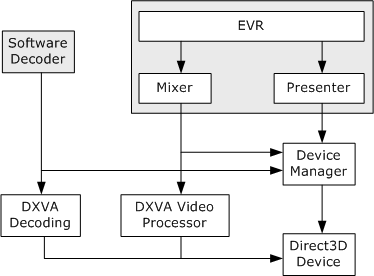

# Enhanced Video Renderer

The enhanced video renderer (EVR) is a component that displays video on the user's monitor. Two versions of the EVR exist:

-   The EVR media sink, for Media Foundation applications.
-   The EVR filter, for DirectShow applications.

Both versions use the same internal objects to render video, and they share many of the same interfaces.

The EVR can mix up to 16 video streams. The first input stream is called the *reference stream*. The reference stream always appears first in the z-order. Any additional streams are called *substreams*, and are mixed on top of the reference stream. The application can change the z-order of the substreams, but no substream can be first in the z-order.

The graphics driver determines which video formats are supported, but typically they are limited to the following:

-   Reference stream: Progressive or interlaced YUV with no per-pixel alpha (such as NV12 or YUY2); or progressive RGB.
-   Substreams: Progressive YUV with per-pixel-alpha, such as AYUV or AI44.

The available substream formats might depend on the format of the reference stream. For more information, see [EVR Media Type Negotiation](evr-media-type-negotiation.md).

Internally, the EVR uses an object called the *mixer* to composite the frames from the input streams onto one surface for rendering. The mixer also performs deinterlacing and color correction. The output from the mixer is the final composited video frame. A second object called the *presenter* renders the video frame to the display. The presenter schedules when the frames are rendered and manages the Direct3D device. An application can provide a custom implementation of either the mixer or the presenter.

The output frame rate is locked to the reference stream. Whenever the substreams receive new frames, the mixer holds onto them. When the reference stream receives a new frame, the mixer composites that frame with the substream frames. (If the reference stream is interlaced, a complete reference frame may require more than one media sample.) It is possible for a substream to receive more than one frame while the mixer is waiting for a reference frame. In that case, the mixer simply discards the previous substream frame.

Because the presenter creates the Direct3D device, it is also responsible for sharing the device with other pipeline objects that need to access DirectX Video Acceleration (DXVA) services. In particular, the EVR mixer uses the DXVA video processing services to deinterlace and mix the video. External to the EVR, software decoders may use DXVA for accelerated video decoding. The presenter shares the Direct3D device by means of the [Direct3D Device Manager](direct3d-device-manager.md). The following diagram shows the internal architecture of the EVR. (The software decoder, shaded in gray, is not part of the EVR.)

## EVR Interfaces

The EVR supports the following interfaces. Some of these interfaces are implemented by the mixer or presenter. For each interface, the reference topic describes how to get a pointer to the interface.

| Interface                                                    | Description                                                                                       |
|--------------------------------------------------------------|---------------------------------------------------------------------------------------------------|
| [**IEVRFilterConfig**](/windows/desktop/api/evr/nn-evr-ievrfilterconfig)                 | Sets the number of input pins on the EVR filter (DirectShow only).                                |
| [**IEVRFilterConfigEx**](/windows/desktop/api/evr/nn-evr-ievrfilterconfigex)             | Configures the EVR filter (DirectShow only).                                                      |
| [**IEVRTrustedVideoPlugin**](/windows/desktop/api/evr/nn-evr-ievrtrustedvideoplugin)     | Enables an EVR plug-in to render protected video.                                                 |
| [**IMFDesiredSample**](/windows/desktop/api/evr/nn-evr-imfdesiredsample)                 | Enables the EVR presenter to request a specific frame from the mixer.                             |
| [**IMFQualityAdvise**](/windows/desktop/api/mfidl/nn-mfidl-imfqualityadvise)                 | Enables the quality manager to adjust the EVR video quality.                                      |
| [**IMFTopologyServiceLookup**](/windows/desktop/api/evr/nn-evr-imftopologyservicelookup) | Enables a custom mixer or presenter to get interface pointers from the EVR.                       |
| [**IMFVideoDeviceID**](/windows/desktop/api/evr/nn-evr-imfvideodeviceid)                 | Returns the device identifier of an EVR mixer or presenter.                                       |
| [**IMFVideoDisplayControl**](/windows/desktop/api/evr/nn-evr-imfvideodisplaycontrol)     | Controls how the EVR displays video.                                                              |
| [**IMFVideoMixerBitmap**](/windows/desktop/api/evr9/nn-evr9-imfvideomixerbitmap)           | Alpha-blends a static bitmap image with the video.                                                |
| [**IMFVideoMixerControl**](/windows/desktop/api/evr/nn-evr-imfvideomixercontrol)         | Controls how the Enhanced Video Renderer (EVR) mixes video substreams.                            |
| [**IMFVideoMixerControl2**](/windows/desktop/api/evr/nn-evr-imfvideomixercontrol2)       | Controls preferences for video deinterlacing.                                                     |
| [**IMFVideoPositionMapper**](/windows/desktop/api/evr/nn-evr-imfvideopositionmapper)     | Maps a position on an input video stream to the corresponding position on an output video stream. |
| [**IMFVideoPresenter**](/windows/desktop/api/evr/nn-evr-imfvideopresenter)               | Exposed by the EVR presenter.                                                                     |
| [**IMFVideoProcessor**](/windows/desktop/api/evr9/nn-evr9-imfvideoprocessor)               | Controls video processing, including adjustment, noise filters, and detail filters.               |
| [**IMFVideoRenderer**](/windows/desktop/api/evr/nn-evr-imfvideorenderer)                 | Sets a mixer or presenter on the EVR.                                                             |
| [**IMFVideoSampleAllocator**](/windows/desktop/api/mfidl/nn-mfidl-imfvideosampleallocator)   | Allocates video samples.                                                                          |

 

## In This Section

| Topic                                                                    | Description                                                                           |
|--------------------------------------------------------------------------|---------------------------------------------------------------------------------------|
| [Using the DirectShow EVR Filter](using-the-directshow-evr-filter.md)   | How to use the EVR in a DirectShow application.                                       |
| [Using the EVR Media Sink](using-the-evr-media-sink.md)                 | How to use the EVR in a Media Foundation application.                                 |
| [Using the Video Display Controls](using-the-video-display-controls.md) | How to control the way in which the EVR displays video inside the application window. |
| [Using the Video Mixer Controls](using-the-video-mixer-controls.md)     | How to control the way in which the EVR mixer operates.                               |
| [EVR Media Type Negotiation](evr-media-type-negotiation.md)             | Describes how the EVR determines which video formats it can accept as input.          |
| [Custom Mixers](custom-mixers.md)                                       | How to write a custom mixer for the EVR.                                              |
| [How to Write an EVR Presenter](how-to-write-an-evr-presenter.md)       | How to write a custom presenter for the EVR.                                          |

 

## Related topics

<dl> <dt>

[Audio/Video Playback](audio-video-playback.md)
</dt> </dl>

 

 

