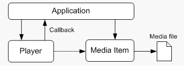

# Getting Started with MFPlay

\[MFPlay is available for use in the operating systems specified in the Requirements section. It may be altered or unavailable in subsequent versions. \]

MFPlay is an API for creating media playback applications in C++.

This topic contains the following sections:

-   [Requirements](#requirements)
-   [About MFPlay](#about-mfplay)
-   [Playing a Media File](#playing-a-media-file)
-   [Controlling Playback](#controlling-playback)
-   [Receiving Events From the Player](#receiving-events-from-the-player)
-   [Getting Information About a Media File](#getting-information-about-a-media-file)
-   [Managing Video Playback](#managing-video-playback)
-   [Limitations of MFPlay](#limitations-of-mfplay)
-   [Related topics](#related-topics)

## Requirements

MFPlay requires Windows 7.

## About MFPlay

MFPlay has a simple programming model, while providing the core set of features that most playback applications need. An application creates a *player* object that controls playback. To play a media file, the player object creates a *media item*, which can be used to get information about the contents of the media file. The application controls playback through methods on the player object's [**IMFPMediaPlayer**](/windows/desktop/api/mfplay/nn-mfplay-imfpmediaplayer) interface. Optionally, the application can get event notifications through a callback interface The following diagram illustrates this process.



## Playing a Media File

To play a media file, call the [**MFPCreateMediaPlayer**](/windows/desktop/api/mfplay/nf-mfplay-mfpcreatemediaplayer) function.


```C++
// Global variables
IMFPMediaPlayer *g_pPlayer = NULL;

const WCHAR *sURL = L"C:\\Users\\Public\\Videos\\example.wmv";

HRESULT PlayVideo(HWND hwnd, const WCHAR* sURL)
{
    // Create the player object and play a video file.

    return MFPCreateMediaPlayer(
        sURL,
        TRUE,   // Start playback automatically?
        0,      // Flags.
        NULL,   // Callback pointer.
        hwnd,
        &g_pPlayer
        );
}
```


The [**MFPCreateMediaPlayer**](/windows/desktop/api/mfplay/nf-mfplay-mfpcreatemediaplayer) function creates a new instance of the MFPlay player object. The function takes the following parameters:

-   The first parameter is the URL of the file to open. This can be a local file or a file on a media server.
-   The second parameter specifies whether playback starts automatically. By setting this paremeter to **TRUE**, the file will play as soon as MFPlay loads it.
-   The third parameter sets various options. For the default options, pass zero (0).
-   The fourth parameter is a pointer to an optional callback interface. This parameter can be **NULL**, as shown. The callback is described in the section [Receiving Events From the Player](#receiving-events-from-the-player).
-   The fifth parameter is a handle to the application window. If the media file contains a video stream, the video will appear inside the client area of this window. For audio-only playback, this parameter can be **NULL**.

The last parameter receives a pointer to the player object's [**IMFPMediaPlayer**](/windows/desktop/api/mfplay/nn-mfplay-imfpmediaplayer) interface.

Before the application shuts down, be sure to release the [**IMFPMediaPlayer**](/windows/desktop/api/mfplay/nn-mfplay-imfpmediaplayer) pointer. You can do this in your **WM\_CLOSE** message handler.


```C++
void OnClose(HWND /*hwnd*/)
{
    SafeRelease(&g_pPlayer);
    SafeRelease(&g_pPlayerCB);
    PostQuitMessage(0);
}
```


> [!Note]  
> This example uses the [SafeRelease](saferelease.md) function to release interface pointers.

 

For simple video playback, that's all the code you need. The rest of this tutorial will show how to add more features, starting with how to control playback.

## Controlling Playback

The code shown in the previous section will play the media file until it reaches the end of the file. You can stop and start playback by calling the following methods on the [**IMFPMediaPlayer**](/windows/desktop/api/mfplay/nn-mfplay-imfpmediaplayer) interface:

-   [**IMFPMediaPlayer::Pause**](/windows/desktop/api/mfplay/nf-mfplay-imfpmediaplayer-pause) pauses playback. While playback is paused, the most recent video frame is displayed, and audio is silent.
-   [**IMFPMediaPlayer::Stop**](/windows/desktop/api/mfplay/nf-mfplay-imfpmediaplayer-stop) stops playback. No video is displayed, and the playback position resets to the start of the file.
-   [**IMFPMediaPlayer::Play**](/windows/desktop/api/mfplay/nf-mfplay-imfpmediaplayer-play) resumes playback after stopping or pausing.

The following code pauses or resumes playback when you press the **SPACEBAR**.


```C++
//-------------------------------------------------------------------
// OnKeyDown
//
// Handles the WM_KEYDOWN message.
//-------------------------------------------------------------------

void OnKeyDown(HWND hwnd, UINT vk, BOOL fDown, int cRepeat, UINT flags)
{
    HRESULT hr = S_OK;

    switch (vk)
    {
    case VK_SPACE:

        // Toggle between playback and paused/stopped.
        if (g_pPlayer)
        {
            MFP_MEDIAPLAYER_STATE state = MFP_MEDIAPLAYER_STATE_EMPTY;
            
            g_pPlayer->GetState(&state);

            if (state == MFP_MEDIAPLAYER_STATE_PAUSED ||  
                state == MFP_MEDIAPLAYER_STATE_STOPPED)
            {
                g_pPlayer->Play();
            }
            else if (state == MFP_MEDIAPLAYER_STATE_PLAYING)
            {
                g_pPlayer->Pause();
            }
        }
        break;
    }
}
```


This example calls the [**IMFPMediaPlayer::GetState**](/windows/desktop/api/mfplay/nf-mfplay-imfpmediaplayer-getstate) method to get the current playback state (paused, stopped, or playing) and pauses or resumes accordingly.

## Receiving Events From the Player

MFPlay uses a callback interface to send events to your application. There are two reasons for this callback:

-   Playback occurs on a separate thread. During playback, certain events might occur, such as reaching the end of the file. MFPlay uses the callback to notify your application of the event.
-   Many of the [**IMFPMediaPlayer**](/windows/desktop/api/mfplay/nn-mfplay-imfpmediaplayer) methods are asynchronous, meaning they return before the operation completes. Asynchronous methods let you start an operation from your UI thread that might take a long time to complete, without it causing your UI to block. After the operation completes, MFPlay signals the callback.

To receive callback notifications, implement the [**IMFPMediaPlayerCallback**](/windows/desktop/api/mfplay/nn-mfplay-imfpmediaplayercallback) interface. This interface inherits **IUnknown** and defines a single method, [**OnMediaPlayerEvent**](/windows/desktop/api/mfplay/nf-mfplay-imfpmediaplayercallback-onmediaplayerevent). To set up the callback, pass a pointer to your **IMFPMediaPlayerCallback** implementation in the *pCallback* parameter of the [**MFPCreateMediaPlayer**](/windows/desktop/api/mfplay/nf-mfplay-mfpcreatemediaplayer) function.

Here is the first example from this tutorial, modified to include the callback.


```
// Global variables.
IMFPMediaPlayer *g_pPlayer = NULL;
IMFPMediaPlayerCallback *g_pCallback = NULL;

// Call an application-defined function to create the callback object.
hr = CreateMyCallback(&g_pCallback);

// Create the player object and play a video file.

const WCHAR *sURL = L"C:\\Users\\Public\\Videos\\example.wmv";

if (SUCCEEDED(hr))
{
    hr = MFPCreateMediaPlayer(
        sURL,
        TRUE,        // Start playback automatically?
        0,           // Flags.
        g_pCallback, // Callback pointer.
        hwnd,
        &g_pPlayer
        );
}
```


The [**OnMediaPlayerEvent**](/windows/desktop/api/mfplay/nf-mfplay-imfpmediaplayercallback-onmediaplayerevent) method has a single parameter, which is a pointer to the [**MFP\_EVENT\_HEADER**](/windows/desktop/api/mfplay/ns-mfplay-mfp_event_header) structure. The **eEventType** member of this structure tells you which event occurred. For example, when playback starts, MFPlay sends the **MFP\_EVENT\_TYPE\_PLAY** event.

Each event type has a corresponding data structure that contains information for that event. Each of these structures starts with an [**MFP\_EVENT\_HEADER**](/windows/desktop/api/mfplay/ns-mfplay-mfp_event_header) structure. In your callback, cast the **MFP\_EVENT\_HEADER** pointer to the event-specific data structure. For example, if the event type is **MFP\_PLAY\_EVENT**, the data structure is [**MFP\_PLAY\_EVENT**](/windows/desktop/api/mfplay/ns-mfplay-mfp_play_event). The following code shows how to handle this event in the callback.


```
void STDMETHODCALLTYPE MediaPlayerCallback::OnMediaPlayerEvent(
    MFP_EVENT_HEADER *pEventHeader
    )
{
    switch (pEventHeader->eEventType)
    {
    case MFP_EVENT_TYPE_PLAY:
        OnPlay(MFP_GET_PLAY_EVENT(pEventHeader));
        break;

    // Other event types (not shown).

    }
}

// Function to handle the event.
void OnPlay(MFP_PLAY_EVENT *pEvent)
{
    if (FAILED(pEvent->header.hrEvent))
    {  
        // Error occurred during playback.
    }  
}
```


This example uses the [**MFP\_GET\_PLAY\_EVENT**](/windows/desktop/api/mfplay/nf-mfplay-mfp_get_play_event) event to cast the *pEventHeader* pointer to an [**MFP\_PLAY\_EVENT**](/windows/desktop/api/mfplay/ns-mfplay-mfp_play_event) structure. The **HRESULT** from the operation that triggered the event is stored in the **hrEvent** field of the structure.

For a list of all the event types and the corresponding data structures, see [**MFP\_EVENT\_TYPE**](/windows/desktop/api/mfplay/ne-mfplay-mfp_event_type).

A note about threading: By default, MFPlay invokes the callback from the same thread that called [**MFPCreateMediaPlayer**](/windows/desktop/api/mfplay/nf-mfplay-mfpcreatemediaplayer). This thread must have a message loop. Alternatively, you can pass the **MFP\_OPTION\_FREE\_THREADED\_CALLBACK** flag in the *creationOptions* parameter of **MFPCreateMediaPlayer**. This flag causes MFPlay to invoke callbacks from a separate thread. Either option has implications for your application. The default option means your callback cannot do anything that waits on your message loop, such as waiting for a UI action, because that will block your window procedure. The free-threaded option means you need to use critical sections to protect any data that you access in your callback. In most cases, the default option is simplest.

## Getting Information About a Media File

When you open a media file in MFPlay, the player creates an object called a *media item* that represents the media file. This object exposes the [**IMFPMediaItem**](/windows/desktop/api/mfplay/nn-mfplay-imfpmediaitem) interface, which you can use to get information about the media file. Many of the MFPlay event structures contain a pointer to the current media item. You can also get the current media item by calling [**IMFPMediaPlayer::GetMediaItem**](/windows/desktop/api/mfplay/nf-mfplay-imfpmediaplayer-getmediaitem) on the player.

Two particularly useful methods are [**IMFPMediaItem::HasVideo**](/windows/desktop/api/mfplay/nf-mfplay-imfpmediaitem-hasvideo) and [**IMFPMediaItem::HasAudio**](/windows/desktop/api/mfplay/nf-mfplay-imfpmediaitem-hasaudio). These methods query whether the media source contains video or audio.

For example, the following code tests whether the current media file contains a video stream.


```
IMFPMediaItem *pItem;
BOOL bHasVideo = FALSE;
BOOL bIsSelected = FALSE;

hr = g_pPlayer->GetMediaItem(TRUE, &pItem);
if (SUCCEEDED(hr))
{
    hr = pItem->HasVideo(&bHasVideo, &bIsSelected);
    pItem->Release();
}
```


If the source file contains a video stream that is selected for playback, *bHasVideo* and *bIsSelected* are both set to **TRUE**.

## Managing Video Playback

When MFPlay plays a video file, it draws the video in the window that you specified in the [**MFPCreateMediaPlayer**](/windows/desktop/api/mfplay/nf-mfplay-mfpcreatemediaplayer) function. This occurs on a separate thread owned by the Microsoft Media Foundation playback pipeline. For the most part, your application does not need to manage this process. However, there are two situations where the application must notify MFPlay to update the video.

-   If playback is paused or stopped, MFPlay must be notified whenever the application's video window receives a WM\_PAINT message. This allows MFPlay to repaint the window.
-   If the window is resized, MFPlay must be notified so that it can scale the video to match the new window size.

The [**IMFPMediaPlayer::UpdateVideo**](/windows/desktop/api/mfplay/nf-mfplay-imfpmediaplayer-updatevideo) method handles both cases. Call this method inside both the WM\_PAINT and WM\_SIZE message handlers for the video window.

> [!IMPORTANT]
> Call the GDI **BeginPaint** function before calling [**UpdateVideo**](/windows/desktop/api/mfplay/nf-mfplay-imfpmediaplayer-updatevideo).

 


```
IMFPMediaPlayer *g_pPlayer;   // MFPlay player object

void OnSize(HWND hwnd, UINT state, int cx, int cy)
{
    HDC hdc;
    PAINTSTRUCT ps;

    if (g_pPlayer && (state == SIZE_RESTORED))
    {
        hdc = BeginPaint(hwnd, &ps);
        g_pPlayer->UpdateVideo();
         EndPaint(hwnd, &ps);
    }
}

void OnPaint(HWND hwnd)
{
    HDC hdc;
    PAINTSTRUCT ps;

    hdc = BeginPaint(hwnd, &ps);
    if (g_pPlayer)
    {
        g_pPlayer->UpdateVideo();
    }
      EndPaint(hwnd, &ps);
}
```


Unless you specify otherwise, MFPlay shows the video at the correct aspect ratio, using letterboxing if needed. If you do not want to preserve the aspect ratio, call [**IMFPMediaPlayer::SetAspectRatioMode**](/windows/desktop/api/mfplay/nf-mfplay-imfpmediaplayer-setaspectratiomode) with the **MFVideoARMode\_None** flag. This will cause MFPlay to stretch the video to fill the entire rectangle, with no letterboxing. Typically you should use the default setting and let MFPlay letterbox the video. The default letterbox color is black, but you can change this by calling [**IMFPMediaPlayer::SetBorderColor**](/windows/desktop/api/mfplay/nf-mfplay-imfpmediaplayer-setbordercolor).

## Limitations of MFPlay

The current version of MFPlay has the following limitations:

-   MFPlay does not support DRM-protected content.
-   By default, MFPlay does not support network streaming protocols. For more information, see [**IMFPMediaPlayer::CreateMediaItemFromURL**](/windows/desktop/api/mfplay/nf-mfplay-imfpmediaplayer-createmediaitemfromurl).
-   MFPlay does not support server-side playlists (SSPLs) or other types of source that play more than one segment. In technical terms, MFPlay stops playback after the first presentation, and ignores any [MENewPresentation](menewpresentation.md) events from the media source.
-   MFPlay does not support seamless transitions between media sources.
-   MFPlay does not support mixing multiple video streams.
-   Only media formats supported natively in Media Foundation are supported by MFPlay. (This includes third-party Media Foundation components that might be installed on the system.)

## Related topics

<dl> <dt>

[Using MFPlay for Audio/Video Playback](using-mfplay-for-audio-video-playback.md)
</dt> </dl>

 

 


