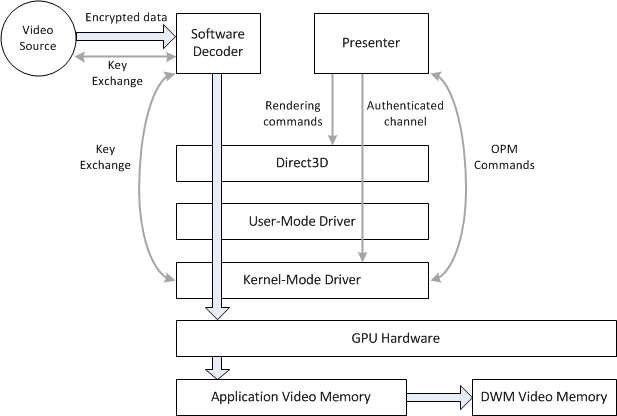
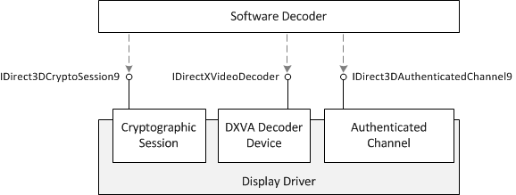

# GPU-Based Content Protection

This topic describes video content–protection capabilities that a graphics driver can provide.

-   [Introduction](#introduction)
-   [Overview of the Decoding Process](#overview-of-the-decoding-process)
-   [Encrypting Compressed Video Buffers for the Decoder](#encrypting-compressed-video-buffers-for-the-decoder)
    -   [1. Query the Content Protection Capabilities of the Driver](#1-query-the-content-protection-capabilities-of-the-driver)
    -   [2. Configure the Authenticated Channel](#2-configure-the-authenticated-channel)
    -   [3. Configure the Cryptographic Session](#3-configure-the-cryptographic-session)
    -   [4. Get a Handle to the DXVA Decoder Device](#4-get-a-handle-to-the-dxva-decoder-device)
    -   [5. Associate the DXVA Decoder with the Cryptographic Session](#5-associate-the-dxva-decoder-with-the-cryptographic-session)
-   [Sending Authenticated Channel Commands](#sending-authenticated-channel-commands)
-   [Sending Authenticated Channel Queries](#sending-authenticated-channel-queries)
-   [Related topics](#related-topics)

## Introduction

The following diagram shows a simplified view of how protected video content travels through the pipeline to be rendered.



> [!Note]  
> The [Protected Media Path](protected-media-path.md) (PMP) is not depicted in this diagram. The data flow that is shown here might occur within a PMP process, or within an application process.

 

The decoder receives encrypted, compressed video data from an external source. It is assumed also the decoder also receives a cryptographic key to decrypt this data. This topic does not describe the key exchange between the video source and decoder, but the PMP defines one possible mechanism. The GPU is not involved at this stage.

For hardware-accelerated decoding, the software decoder passes compressed video content to the GPU. To protect this content, the decoder re-encrypts the data, typically using AES-CTR, before passing it to the hardware accelerator. A key-exchange mechanism is defined between the decoder and the graphics driver.

Decoded video frames are stored in video memory, generally in the clear. At this point, the frames are processed and then presented. There are two main options for presentation.

-   Frames can be presented using a hardware overlay. For more information, see [Hardware Overlay Support](hardware-overlay-support.md).
-   Frames can be presented by the Desktop Window Manage (DWM) using a shared surface.

The last step is to display the frame on the monitor, which may require link protection between the graphics card and the display device. An example of link protection is High-Bandwidth Digital Content Protection (HDCP). Link protection is configured using [Output Protection Manager](output-protection-manager.md) (OPM). This topic does not describe OPM; for more information, see [Using Output Protection Manager](using-output-protection-manager.md).

## Overview of the Decoding Process

During hardware-accelerated decoding, the software decoder must pass compressed video data to the graphics card. For premium content, this data typically must be encrypted, using symmetric-key encryption, before it is sent to the GPU.

To encrypt the video for decoding, the software decoder uses the following interfaces:

-   [**IDirectXVideoDecoder**](/windows/desktop/api/dxva2api/nn-dxva2api-idirectxvideodecoder). Represents the DXVA decoder device, also called the accelerator.
-   [**IDirect3DCryptoSession9**](/windows/desktop/api/d3d9/nn-d3d9-idirect3dcryptosession9). Represents a cryptographic session, which provides the encryption key.
-   [**IDirect3DAuthenticatedChannel9**](/windows/desktop/api/d3d9/nn-d3d9-idirect3dauthenticatedchannel9). Represents an authenticated channel, which enables the software decoder to associate the cryptographic session with the DXVA decoder.



All of these interfaces are obtained from the Direct3D device, as follows:


| Interface                                                                | Creation                                                                                                                                                                      |
|--------------------------------------------------------------------------|-------------------------------------------------------------------------------------------------------------------------------------------------------------------------------|
| [**IDirectXVideoDecoder**](/windows/desktop/api/dxva2api/nn-dxva2api-idirectxvideodecoder)                     | Call [**IDirectXVideoDecoderService::CreateVideoDecoder**](/windows/desktop/api/dxva2api/nf-dxva2api-idirectxvideodecoderservice-createvideodecoder). The DXVA decoder device is identified by a DXVA profile GUID. |
| [**IDirect3DCryptoSession9**](/windows/desktop/api/d3d9/nn-d3d9-idirect3dcryptosession9)               | Call [**IDirect3DDevice9Video::CreateCryptoSession**](/windows/desktop/api/d3d9/nf-d3d9-idirect3ddevice9video-createcryptosession).                                                                         |
| [**IDirect3DAuthenticatedChannel9**](/windows/desktop/api/d3d9/nn-d3d9-idirect3dauthenticatedchannel9) | Call [**IDirect3DDevice9Video::CreateAuthenticatedChannel**](/windows/desktop/api/d3d9/nf-d3d9-idirect3ddevice9video-createauthenticatedchannel).                                                           |


 

> [!Note]  
> To get a pointer to the [**IDirect3DDevice9Video**](/windows/desktop/api/d3d9/nn-d3d9-idirect3ddevice9video) interface, call [**QueryInterface**](/windows/win32/api/unknwn/nf-unknwn-iunknown-queryinterface(q)) on a D3D9Ex device.

 

The authenticated channel provides a trusted communication channel between the software decoder and the driver. The communication channel works as follows:

-   The driver provides an X.509 certificate chain whose root certificate is signed by Microsoft.
-   The certificate contains an RSA public key for the driver.
-   The software decoder uses the public key to send the driver a 128-bit AES session key.
-   The software decoder sends queries and commands to the authenticated channel.
-   The session key is used to compute message authentication codes (MACs) for the queries and commands. The driver uses the MACs to verify the integrity of the query/command data, and the software decoder uses them to verify the integrity of the response data from the driver.

## Encrypting Compressed Video Buffers for the Decoder

Here is a high-level overview of the encryption and decoding process:

1.  The software decoder receives a stream of encrypted data from the video source. The decoder decrypts this stream.
2.  The software decoder negotiates a session key with the cryptographic session.
3.  The software decoder uses the authenticated channel to associate the cryptographic session with the DXVA decoder device.
4.  The software decoder puts compressed data in DXVA buffers that it gets from the DXVA decoder device (accelerator). For protected content, the software encoder encrypts the data that is puts into the DXVA buffers, using the session key for the encryption.
    > [!Note]  
    > Some drivers use a content key, instead of the session key, for encryption. The content key could change from one frame to the next.

     

5.  The decoder submits the encrypted compressed buffers to the accelerator. For AES-CTR, the decoder also passes the initialization vector. If a content key is used, the decoder passes content key, encrypted using the session key.

Direct3D has standard support for 128-bit AES-CTR, but is designed to extend to additional encryption types.

The next five sections give more detailed steps.

-   [1. Query the Content Protection Capabilities of the Driver](#1-query-the-content-protection-capabilities-of-the-driver)
-   [2. Configure the Authenticated Channel](#2-configure-the-authenticated-channel)
-   [3. Configure the Cryptographic Session](#3-configure-the-cryptographic-session)
-   [4. Get a Handle to the DXVA Decoder Device](#4-get-a-handle-to-the-dxva-decoder-device)
-   [5. Associate the DXVA Decoder with the Cryptographic Session](#5-associate-the-dxva-decoder-with-the-cryptographic-session)

### 1. Query the Content Protection Capabilities of the Driver

Before attempting to apply encryption, get the content protection capabilities of the driver.

1.  Get a pointer to the Direct3D 9 device.
2.  Call [**QueryInterface**](/windows/win32/api/unknwn/nf-unknwn-iunknown-queryinterface(q)) for the [**IDirect3DDevice9Video**](/windows/desktop/api/d3d9/nn-d3d9-idirect3ddevice9video) interface.
3.  Call [**IDirect3DDevice9Video::GetContentProtectionCaps**](/windows/desktop/api/d3d9/nf-d3d9-idirect3ddevice9video-getcontentprotectioncaps). This method fills in a [**D3DCONTENTPROTECTIONCAPS**](/windows/desktop/api/d3d9caps/ns-d3d9caps-d3dcontentprotectioncaps) structure with the driver’s content protection capabilities.

In particular, look for the following capabilities:

-   If the **Caps** member contains the **D3DCPCAPS_SOFTWARE** or **D3DCPCAPS_HARDWARE** flag, the driver can perform encryption.
-   The **KeyExchangeType** member specifies how to perform key exchange for the session key.
-   If the **Caps** member contains the **D3DCPCAPS_CONTENTKEY** flag, the driver uses a separate content key for encryption. This is important when you generate the session key.

Additional capabilities are indicated in the **Caps** member.

### 2. Configure the Authenticated Channel

The next step is to configure the authenticated channel.

1.  Call [**IDirect3DDevice9Video::CreateAuthenticatedChannel**](/windows/desktop/api/d3d9/nf-d3d9-idirect3ddevice9video-createauthenticatedchannel) to create the authenticated channel. For the *ChannelType* parameter, specify a channel type that matches the capabilities of the driver.
    -   The **D3DAUTHENTICATEDCHANNEL_DRIVER_SOFTWARE** channel type corresponds to **D3DCPCAPS_SOFTWARE**.
    -   The **D3DAUTHENTICATEDCHANNEL_DRIVER_HARDWARE** channel type corresponds to **D3DCPCAPS_HARDWARE**.

    The **CreateAuthenticatedChannel** method returns a pointer to the [**IDirect3DAuthenticatedChannel9**](/windows/desktop/api/d3d9/nn-d3d9-idirect3dauthenticatedchannel9) interface along with a handle to the channel. The handle is used later to associate the cryptographic session with the authenticated channel.
2.  Call [**IDirect3DAuthenticatedChannel9::GetCertificateSize**](/windows/desktop/api/d3d9/nf-d3d9-idirect3dauthenticatedchannel9-getcertificatesize) to get the size of the driver's X.509 certificate. Allocate a buffer of the required size.
3.  Call [**IDirect3DAuthenticatedChannel9::GetCertificate**](/windows/desktop/api/d3d9/nf-d3d9-idirect3dauthenticatedchannel9-getcertificate) to get the certificate. The method copies the certificate into the buffer that was allocated in the previous step.
4.  Verify that the driver’s certificate was signed by Microsoft and has not been revoked.
5.  Get the public key from the certificate.
6.  Generate a random RSA session key. This session key is used to sign data that is sent to the authenticated channel. Encrypt the session key using the driver's public key.
7.  Call [**IDirect3DAuthenticatedChannel9::NegotiateKeyExchange**](/windows/desktop/api/d3d9/nf-d3d9-idirect3dauthenticatedchannel9-negotiatekeyexchange) to send the encrypted session key to the driver.
8.  Initialize the secure channel as follows:
    1.  Fill in a [**D3DAUTHENTICATEDCHANNEL_CONFIGUREINITIALIZE**](d3dauthenticatedchannel-configureinitialize.md) structure as described in the documentation.
    2.  Send the [**D3DAUTHENTICATEDCONFIGURE_INITIALIZE**](d3dauthenticatedconfigure-initialize.md) command by calling [**IDirect3DAuthenticatedChannel9::Configure**](/windows/desktop/api/d3d9/nf-d3d9-idirect3dauthenticatedchannel9-configure) as described in the section [Sending Authenticated Channel Commands](#sending-authenticated-channel-commands). This command contains the starting sequence numbers for the commands and queries that are sent to the authenticated channel.
9.  Verify the channel type by sending a [**D3DAUTHENTICATEDQUERY_CHANNELTYPE**](d3dauthenticatedquery-channeltype.md) query to the authenticated channel, as described in the section [Sending Authenticated Channel Queries](#sending-authenticated-channel-queries). Check that the channel type matches what you specified in the [**CreateAuthenticatedChannel**](/windows/desktop/api/d3d9/nf-d3d9-idirect3ddevice9video-createauthenticatedchannel) method.

### 3. Configure the Cryptographic Session

Next, configure the cryptographic session and establish the session key.

1.  Call [**IDirect3DDevice9Video::CreateCryptoSession**](/windows/desktop/api/d3d9/nf-d3d9-idirect3ddevice9video-createcryptosession) to create the cryptographic session. This method returns a pointer to the [**IDirect3DCryptoSession9**](/windows/desktop/api/d3d9/nn-d3d9-idirect3dcryptosession9) interface and along with a handle to the cryptographic session.
2.  Call [**IDirect3DCryptoSession9::GetCertificateSize**](/windows/desktop/api/d3d9/nf-d3d9-idirect3dcryptosession9-getcertificatesize) to get the size of the driver's X.509 certificate. Allocate a buffer of the required size.
3.  Call [**IDirect3DCryptoSession9::GetCertificate**](/windows/desktop/api/d3d9/nf-d3d9-idirect3dcryptosession9-getcertificate) to get the certificate. The method copies the certificate into the buffer that was allocated in the previous step.
4.  Verify that the driver’s certificate was signed by Microsoft and has not been revoked.
5.  Get the public key from the certificate.
6.  Generate a random RSA session key. This is a separate session key from the authenticated channel session key. Encrypt the session key using the driver's public key.
7.  Call [**IDirect3DCryptoSession9::NegotiateKeyExchange**](/windows/desktop/api/d3d9/nf-d3d9-idirect3dauthenticatedchannel9-negotiatekeyexchange) to send the encrypted session key to the driver.
8.  If the content protection capabilities include **D3DCPCAPS_CONTENTKEY**, create a random RSA content key. This will be used later in the decoding process.

### 4. Get a Handle to the DXVA Decoder Device

For the next step, you will need a handle to the DXVA decoder device. To get this handle, fill in a DXVA2_DecodeExecuteParams structure as follows:


```C++
HANDLE hDecodeDeviceHandle;

DXVA2_DecodeExecuteParams execParams = {0};
DXVA2_DecodeExtensionData ExtensionExecute = {0};
    
execParams.NumCompBuffers = 0;
execParams.pCompressedBuffers = NULL;
execParams.pExtensionData = &ExtensionExecute;

ExtensionExecute.Function = DXVA2_DECODE_GET_DRIVER_HANDLE;
ExtensionExecute.pPrivateInputData = NULL;
ExtensionExecute.PrivateInputDataSize = 0;
ExtensionExecute.pPrivateOutputData = &hDecodeDeviceHandle;
ExtensionExecute.PrivateOutputDataSize = sizeof(HANDLE);
```


Set the **pExtensionData** member of the [**DXVA2_DecodeExecuteParams**](/windows/desktop/api/dxva2api/ns-dxva2api-dxva2_decodeexecuteparams) structure to the address of a [**DXVA2_DecodeExtensionData**](/windows/desktop/api/dxva2api/ns-dxva2api-dxva2_decodeextensiondata) structure.

In the [**DXVA2_DecodeExtensionData**](/windows/desktop/api/dxva2api/ns-dxva2api-dxva2_decodeextensiondata) structure, set the **Function** member to **DXVA2_DECODE_GET_DRIVER_HANDLE**. Set **pPrivateOutputData** to the address of a buffer that is large enough to store a **HANDLE** value. (In the previous example, this buffer is the *hDecodeDeviceHandle* variable.)

Then call [**IDirectXVideoDecoder::Execute**](/windows/desktop/api/dxva2api/nf-dxva2api-idirectxvideodecoder-execute) and pass in the address of the [**DXVA2_DecodeExecuteParams**](/windows/desktop/api/dxva2api/ns-dxva2api-dxva2_decodeexecuteparams) structure. The handle to the DXVA decoder is returned in **pPrivateOutputData**.

### 5. Associate the DXVA Decoder with the Cryptographic Session

Next, associate the DXVA decoder device with the Direct3D device and the cryptographic session, as follows:

1.  Get a handle to the DXVA decoder device, as described in the previous section.
2.  Get a handle to the Direct3D device, by sending a [**D3DAUTHENTICATEDQUERY_DEVICEHANDLE**](d3dauthenticatedquery-devicehandle.md) query to the authenticated channel.
3.  Fill in a [**D3DAUTHENTICATEDCHANNEL_CONFIGURECRYPTOSESSION**](d3dauthenticatedchannel-configurecryptosession.md) structure with the following information:
    -   Set the **DXVA2DecodeHandle** member to the handle to the DXVA decoder device.
    -   Set the **CryptoSessionHandle** member to the handle to the cryptographic session. This handle is returned by the [**IDirect3DDevice9Video::CreateCryptoSession**](/windows/desktop/api/d3d9/nf-d3d9-idirect3ddevice9video-createcryptosession) method.
    -   Set the **DeviceHandle** member to the Direct3D device handle.
4.  Call [**IDirect3DAuthenticatedChannel9::Configure**](/windows/desktop/api/d3d9/nf-d3d9-idirect3dauthenticatedchannel9-configure) to send a [**D3DAUTHENTICATEDCONFIGURE_CRYPTOSESSION**](d3dauthenticatedconfigure-cryptosession.md) command to the authenticated channel.

The following diagram illustrates the exchange of handles:


The software decoder can now use the cryptographic session key to encrypt the compressed video buffers. Each compressed buffer will have its own initialization vector (IV) specified in the **pvPVPState** member of the [**DXVA2_DecodeBufferDesc**](/windows/desktop/api/dxva2api/ns-dxva2api-dxva2_decodebufferdesc) structure.

## Sending Authenticated Channel Commands

A set of commands are defined for configuring the authenticated channel and setting various content protections. For a list of commands, see [Content Protection Commands](content-protection-commands.md).

To send a command to the authenticated channel, perform the following steps.

1.  Fill in the input data structure. This data structure is always a [**D3DAUTHENTICATEDCHANNEL_CONFIGURE_INPUT**](d3dauthenticatedchannel-configure-input.md) structure followed by additional fields. Fill in the **D3DAUTHENTICATEDCHANNEL_CONFIGURE_INPUT** structure as shown in the following table.

    <table>
    <colgroup>
    <col style="width: 50%" />
    <col style="width: 50%" />
    </colgroup>
    <thead>
    <tr class="header">
    <th>Member</th>
    <th>Description</th>
    </tr>
    </thead>
    <tbody>
    <tr class="odd">
    <td><strong>omac</strong></td>
    <td>Skip this field for now.</td>
    </tr>
    <tr class="even">
    <td><strong>ConfigureType</strong></td>
    <td>GUID that identifies the command. For a list of commands, see <a href="content-protection-commands.md">Content Protection Commands</a>.</td>
    </tr>
    <tr class="odd">
    <td><strong>hChannel</strong></td>
    <td>The handle to the authenticated channel.</td>
    </tr>
    <tr class="even">
    <td><strong>SequenceNumber</strong></td>
    <td>The sequence number. The first sequence number is specified by sending a <a href="d3dauthenticatedconfigure-initialize.md"><strong>D3DAUTHENTICATEDCONFIGURE_INITIALIZE</strong></a> command. Each time you send another command, increment this number by 1. The sequence number guards against replay attacks.
    <blockquote>
    [!Note]<br />
    Two separate sequence numbers are used, one for commands and one for queries.
    </blockquote>
    <br/> <br/></td>
    </tr>
    </tbody>
    </table>

    

     

2.  Calculate the OMAC tag for the block of data that appears after the **omac** member of the input structure. Then copy this tag value into the **omac** member.
3.  Call [**IDirect3DAuthenticatedChannel9::Configure**](/windows/desktop/api/d3d9/nf-d3d9-idirect3dauthenticatedchannel9-configure).
4.  The driver places the output from the command in the [**D3DAUTHENTICATEDCHANNEL_CONFIGURE_OUTPUT**](d3dauthenticatedchannel-configure-output.md) structure.
5.  Calculate the OMAC tag for the block of data that appears after the **omac** member of the output structure. Compare this with the value of the **omac** member. Fail if they do not match.
6.  Compare the values of the **ConfigureType**, **hChannel**, and **SequenceNumber** members in the output structure against your values for those members. Fail if they do not match.
7.  Increment the sequence number for the next command.

## Sending Authenticated Channel Queries

A set of queries are defined for retrieving information about the authenticated channel. For a list of queries, see [Content Protection Queries](content-protection-queries.md).

To send a command to the authenticated channel, perform the following steps.

1.  Fill in the input data structure. This data structure is always a [**D3DAUTHENTICATEDCHANNEL_QUERY_INPUT**](d3dauthenticatedchannel-query-input.md) structure, possibly followed by additional fields. Fill in the **D3DAUTHENTICATEDCHANNEL_QUERY_INPUT** structure as shown in the following table.

    <table>
    <colgroup>
    <col style="width: 50%" />
    <col style="width: 50%" />
    </colgroup>
    <thead>
    <tr class="header">
    <th>Member</th>
    <th>Description</th>
    </tr>
    </thead>
    <tbody>
    <tr class="odd">
    <td><strong>QueryType</strong></td>
    <td>GUID that identifies the query. For a list of queries, see <a href="content-protection-queries.md">Content Protection Queries</a>.</td>
    </tr>
    <tr class="even">
    <td><strong>hChannel</strong></td>
    <td>The handle to the authenticated channel.</td>
    </tr>
    <tr class="odd">
    <td><strong>SequenceNumber</strong></td>
    <td>The sequence number. The first sequence number is specified by sending a <a href="d3dauthenticatedconfigure-initialize.md"><strong>D3DAUTHENTICATEDCONFIGURE_INITIALIZE</strong></a> command. Each time you send another query, increment this number by 1. The sequence number guards against replay attacks.
    <blockquote>
    [!Note]<br />
    Two separate sequence numbers are used, one for commands and one for queries.
    </blockquote>
    <br/> <br/></td>
    </tr>
    </tbody>
    </table>

    

     

2.  Call [**IDirect3DAuthenticatedChannel9::Query**](/windows/desktop/api/d3d9/nf-d3d9-idirect3dauthenticatedchannel9-query).
3.  The driver places the output from the query in a [**D3DAUTHENTICATEDCHANNEL_QUERY_OUTPUT**](d3dauthenticatedchannel-query-output.md) structure. This structure is followed by additional fields, depending on the query type.
4.  Calculate the OMAC tag for the block of data that appears after the **omac** member of the output structure. Compare this with the value of the **omac** member. Fail if they do not match.
5.  Compare the values of the **ConfigureType**, **hChannel**, and **SequenceNumber** members in the output structure against your values for those members. Fail if they do not match.
6.  Increment the sequence number for the next query.

## Related topics

<dl> <dt>

[Direct3D 9 Video APIs](direct3d-video-apis.md)
</dt> </dl>

 

 
