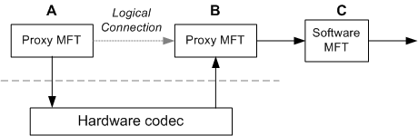

# Hardware MFTs

> [!Note]  
> This topic applies to Windows 7 or later.

 

This topic describes how to write a Media Foundation transform (MFT) that acts as a proxy to a hardware encoder, decoder, or digital signal processor (DSP).

> [!IMPORTANT]
> If a hardware codec uses the AVStream multimedia class driver, it does not require a custom MFT. Media Foundation provides an AVStream proxy for this purpose. The information in this topic applies only in the special case where the hardware codec does not use AVStream. For more information, see [Hardware Codec Support in AVStream](https://msdn.microsoft.com/library/dd568169.aspx).

 

This topic contains the following sections:

-   [Introduction](#introduction)
-   [Hardware MFT Attributes](#hardware-mft-attributes)
-   [Hardware Handshake Sequence](#hardware-handshake-sequence)
-   [Data Processing](#data-processing)
-   [Paired Decoder/Encoder](#paired-decoderencoder)
-   [Related topics](#related-topics)

## Introduction

Any hardware codec that is not based on AVStream must provide its own MFT to act as a proxy to the driver. A hardware codec might incorporate several distinct functional blocks:

-   Encoder
-   Decoder
-   Frame scaling/format conversion

Each of these functions should be managed by a separate MFT. A hardware MFT should never act as a multi-purpose "transcoder." Instead, put encoding functions into an encoder MFT and decoding functions into a decoder MFT. If the hardware offers frame scaling and format conversions, place those functions in a separate video processor, registered in the **MFT\_CATEGORY\_VIDEO\_PROCESSOR** category. If the hardware does not support frame scaling or format conversion, Media Foundation provides a software video processor.

Hardware MFTs have the following general requirements:

-   Hardware MFTs must use the new asynchronous processing model, as described in [Asynchronous MFTs](asynchronous-mfts.md).
-   Hardware MFTs must support dynamic format changes, as described in [Dynamic Format Changes](basic-mft-processing-model.md).

## Hardware MFT Attributes

A hardware MFT must implement following methods related to attributes:

-   [**IMFTransform::GetAttributes**](/windows/desktop/api/mftransform/nf-mftransform-imftransform-getattributes): Returns an attribute store for global MFT attributes.
-   [**IMFTransform::GetInputStreamAttributes**](/windows/desktop/api/mftransform/nf-mftransform-imftransform-getinputstreamattributes): Returns an attribute store for an input stream.
-   [**IMFTransform::GetOutputStreamAttributes**](/windows/desktop/api/mftransform/nf-mftransform-imftransform-getoutputstreamattributes): Returns an attribute store for an output stream.

When the MFT is first created, it must set the following attributes on its own global attribute store (that is, the attribute store returned by [**GetAttributes**](/windows/desktop/api/mftransform/nf-mftransform-imftransform-getattributes)):

| Attribute                                                                                    | Description                                                                                                                                                                            |
|----------------------------------------------------------------------------------------------|----------------------------------------------------------------------------------------------------------------------------------------------------------------------------------------|
| [MF\_TRANSFORM\_ASYNC](mf-transform-async.md)                                               | Must be set to **TRUE**. Indicates that the MFT performs asynchronous processing.                                                                                                      |
| [MFT\_ENUM\_HARDWARE\_URL\_Attribute](mft-enum-hardware-url-attribute.md)                   | Contains the symbolic link for the hardware device.  The topology loader uses the presence of this attribute to test whether an MFT represents a hardware device.  |
| [**MFT\_SUPPORT\_DYNAMIC\_FORMAT\_CHANGE**](mft-support-dynamic-format-change-attribute.md) | Must be set to **TRUE**. Indicates that the MFT supports dynamic format changes.                                                                                                       |

 

## Hardware Handshake Sequence

If two MFTs represent the same physical device, they can exchange data within the hardware—for example, over a hardware bus. There is no need to copy the data into system memory and then back to the device.

In the following diagram, the MFTs labeled "A" and "B" represent functional blocks within the same hardware. For example, in a transcoding scenario, "A" might represent a hardware decoder and "B" might represent a hardware encoder. The data flow between "A" and "B" occurs within the hardware. The MFT labeled "C" is a software MFT. Data flow from "B" to "C" uses system memory.

To establish a hardware connection, the two hardware MFTs must use a private communication channel. This connection is established during format negotiation, before the media types are set and before the first call to [**ProcessInput**](/windows/desktop/api/mftransform/nf-mftransform-imftransform-processinput). The connection process works as follows:

1.  The topology loader checks both MFTs for the presence of the [MFT\_ENUM\_HARDWARE\_URL\_Attribute](mft-enum-hardware-url-attribute.md) attribute. Note that it does not examine the value of this attribute.
2.  If [MFT\_ENUM\_HARDWARE\_URL\_Attribute](mft-enum-hardware-url-attribute.md) is present on both MFTs, the topology loader does the following:
    1.  The topology loader calls [**IMFTransform::GetOutputStreamAttributes**](/windows/desktop/api/mftransform/nf-mftransform-imftransform-getoutputstreamattributes) on the upstream MFT (A). This method returns an [**IMFAttributes**](/windows/desktop/api/mfobjects/nn-mfobjects-imfattributes) pointer. Let this pointer be denoted *pUpstream*.
    2.  The topology loader calls [**IMFTransform::GetInputStreamAttributes**](/windows/desktop/api/mftransform/nf-mftransform-imftransform-getinputstreamattributes) on the downstream MFT (B). This call also returns an [**IMFAttributes**](/windows/desktop/api/mfobjects/nn-mfobjects-imfattributes) pointer. Let this pointer be denoted *pDownstream*.
    3.  The topology loader sets the [MFT\_CONNECTED\_STREAM\_ATTRIBUTE](mft-connected-stream-attribute.md) attribute on *pDownstream* by calling [**IMFAttributes::SetUnknown**](/windows/desktop/api/mfobjects/nf-mfobjects-imfattributes-setunknown). The value of the attribute is the *pUpstream* pointer.
    4.  The topology loader sets the [MFT\_CONNECTED\_TO\_HW\_STREAM](mft-connected-to-hw-stream.md) attribute to **TRUE** on both *pDownstream* and *pUpstream*.
3.  At this point, the downstream MFT has a pointer to the upstream MFT's attribute store, as shown in the following diagram.

    

    > [!Note]  
    > For clarity, this diagram shows the streams and the attribute stores as distinct objects, but that is not required for the implementation.

     

4.  The downstream MFT uses the [**IMFAttributes**](/windows/desktop/api/mfobjects/nn-mfobjects-imfattributes) pointer to establish a private communication channel with the upstream MFT. Because the channel is private, the exact mechanism is defined by the implementation. For example, the MFT might query for a private COM interface.

During step 4, the downstream MFT must verify whether the two MFTs share the same physical device. If not, they must fall back to using system memory for data transport. This enables the MFT to operate correctly with software MFTs and other hardware devices.

If the handshake succeeds and the two MFTs share a private data channel, they do not use the standard data processing model (described in the next section) at the connection point. Specifically, the downstream MFT does not send [METransformNeedInput](metransformneedinput.md) events; for more details, refer to the next section in this topic.

## Data Processing

When a hardware MFT uses system memory for data transport, the process works as follows:

1.  To request more input, the MFT sends an [METransformNeedInput](metransformneedinput.md) event.
2.  The [METransformNeedInput](metransformneedinput.md) event causes the pipeline to call [**IMFTransform::ProcessInput**](/windows/desktop/api/mftransform/nf-mftransform-imftransform-processinput).
3.  When the MFT has output data, the MFT sends an [METransformHaveOutput](metransformhaveoutput.md) event.
4.  The [METransformHaveOutput](metransformhaveoutput.md) event causes the pipeline to call [**IMFTransform::ProcessOutput**](/windows/desktop/api/mftransform/nf-mftransform-imftransform-processoutput).

For details, refer to [Asynchronous MFTs](asynchronous-mfts.md).

If the MFT uses a hardware channel, however, it does not send these events at the hardware connection point, because all data transfer happens internally within the hardware. Therefore, the pipeline does not call [**ProcessInput**](/windows/desktop/api/mftransform/nf-mftransform-imftransform-processinput) or [**ProcessOutput**](/windows/desktop/api/mftransform/nf-mftransform-imftransform-processoutput) at the connection point.

For example, consider the first diagram in this topic. Given this configuration, data processing would occur as follows:

1.  "A" sends [METransformNeedInput](metransformneedinput.md) to request data.
2.  The pipeline calls [**ProcessInput**](/windows/desktop/api/mftransform/nf-mftransform-imftransform-processinput) on "A".
3.  "A" and "B" process the data in hardware.
4.  When the processing is complete, "B" sends an [METransformHaveOutput](metransformhaveoutput.md) event.
5.  The pipeline calls [**ProcessOutput**](/windows/desktop/api/mftransform/nf-mftransform-imftransform-processoutput) on "B".

## Paired Decoder/Encoder

If a decoder and encoder are located on the same hardware chip, it may be preferable to use them together when transcoding. That is, selecting one should cause the other to be selected in the transcoding pipeline. To ensure that matching hardware codecs are chosen, both codec MFTs should offer a custom media type. To create a custom media type:

-   Set the [**MF\_MT\_MAJOR\_TYPE**](mf-mt-major-type-attribute.md) attribute to **MFMediaType\_Audio** or **MFMediaType\_Video**, as appropriate.
-   Set the [**MF\_MT\_SUBTYPE**](mf-mt-subtype-attribute.md) attribute to a custom GUID value.

Other type attributes are optional. The decoder returns the custom type from its [**IMFTransform::GetOutputAvailableType**](/windows/desktop/api/mftransform/nf-mftransform-imftransform-getoutputavailabletype), and the encoder returns the custom type from its [**IMFTransform::GetInputAvailableType**](/windows/desktop/api/mftransform/nf-mftransform-imftransform-getinputavailabletype) method. In both cases, the custom type must be the first entry in the list (*dwTypeIndex* = 0).

To work with software codecs, the codec should also return at least one standard format, such as NV12 for video. Standard formats should appear after the custom type (*dwTypeIndex* > 0). If the two codecs must always be paired and cannot interoperate with software codecs, the MFTs should return only the custom format and not return any standard formats.

> [!Note]  
> If a decoder does not return any standard formats, it cannot be used for playback with the [Enhanced Video Renderer](enhanced-video-renderer.md). In that case, it should be registered as a transcode-only decoder. See [Transcode-Only Decoders](implementing-a-codec-mft.md).

 

## Related topics

<dl> <dt>

[Writing a Custom MFT](writing-a-custom-mft.md)
</dt> <dt>

[Implementing a Codec MFT](implementing-a-codec-mft.md)
</dt> <dt>

[Media Foundation Transforms](media-foundation-transforms.md)
</dt> </dl>

 

 

