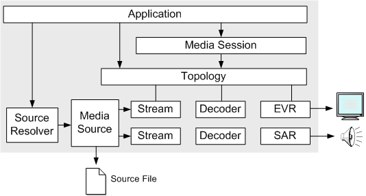

# How to Play Media Files with Media Foundation

This tutorial shows how to play media files using the [Media Session](media-session.md) object.

## Prerequisites

Before reading this topic, you should be familiar with the following Media Foundation concepts:

-   [Media Session](media-session.md)
-   [Source Resolver](source-resolver.md)
-   [Topologies](topologies.md)
-   [Media Event Generators](media-event-generators.md)
-   [Presentation Descriptors](presentation-descriptors.md)

> [!Note]  
> This topic does not describe how to play files that are protected by digital rights management (DRM). For information about DRM in Microsoft Media Foundation, see [How to Play Protected Media Files](how-to-play-protected-media-files.md).

 

## Overview

The following objects are used to play a media file with the Media Session:

-   A *media source* is an object that parses a media file or other source of media data. The media source creates *stream* objects for each audio or video stream in the file. *Decoders* convert encoded media data into uncompressed video and audio.
-   The *Source Resolver* creates a media source from a URL.
-   The [Enhanced Video Renderer](enhanced-video-renderer.md) (EVR) renders video to the screen.
-   The [Streaming Audio Renderer](streaming-audio-renderer.md) (SAR) renders audio to a speaker or other audio output device.
-   A *topology* defines the flow of data from the media source to the EVR and SAR.
-   The *Media Session* controls the data flow and sends status events to the application. The following diagram illustrates this process.

The following is a general outline of the steps needed to play a media file using the Media Session:

1.  Call the [**MFStartup**](/windows/desktop/api/mfapi/nf-mfapi-mfstartup) function to initialize the Media Foundation platform.
2.  Call [**MFCreateMediaSession**](/windows/desktop/api/mfidl/nf-mfidl-mfcreatemediasession) to create a new instance of the Media Session.
3.  Use the source resolver to create a media source. For more information, see [Using the Source Resolver](using-the-source-resolver.md).
4.  Create a topology that connects the media source to the EVR and SAR. In this step, the application creates a *partial* topology that does not include the decoders. For more information, see [Creating Playback Topologies](creating-playback-topologies.md).
5.  Call [**IMFMediaSession::SetTopology**](/windows/desktop/api/mfidl/nf-mfidl-imfmediasession-settopology) to set the topology on the Media Session.
6.  Use the [**IMFMediaEventGenerator**](/windows/desktop/api/mfobjects/nn-mfobjects-imfmediaeventgenerator) interface to get events from the Media Session.
7.  Call [**IMFMediaSession::Start**](/windows/desktop/api/mfidl/nf-mfidl-imfmediasession-start) to start playback. After playback starts, you can pause it by calling [**IMFMediaSession::Pause**](/windows/desktop/api/mfidl/nf-mfidl-imfmediasession-pause), or stop it by calling [**IMFMediaSession::Stop**](/windows/desktop/api/mfidl/nf-mfidl-imfmediasession-stop).
8.  When the application exits, release resources:

    1.  Call [**IMFMediaSession::Close**](/windows/desktop/api/mfidl/nf-mfidl-imfmediasession-close) to close the Media Session. This method is asynchronous. When it completes, the Media Session sends an [MESessionClosed](mesessionclosed.md) event. Then it is safe to perform the remaining steps.
    2.  Call [**IMFMediaSource::Shutdown**](/windows/desktop/api/mfidl/nf-mfidl-imfmediasource-shutdown) to shut down the media source.
    3.  Call [**IMFMediaSession::Shutdown**](/windows/desktop/api/mfidl/nf-mfidl-imfmediasession-shutdown) to shut down the Media Session.
    4.  Call [**MFShutdown**](/windows/desktop/api/mfapi/nf-mfapi-mfshutdown) to shut down the Media Foundation platform.

The following sections show a complete code example:

-   [Step 1: Declare the CPlayer Class](step-1--declare-the-cplayer-class.md)
-   [Step 2: Create the CPlayer Object](step-2--create-the-cplayer-object.md)
-   [Step 3: Open a Media File](step-3--open-a-media-file.md)
-   [Step 4: Create the Media Session](step-4--create-the-media-session.md)
-   [Step 5: Handle Media Session Events](step-5--handle-media-session-events.md)
-   [Step 6: Control Playback](step-6--control-playback.md)
-   [Step 7: Shut Down the Media Session](step-7--shut-down-the-media-session.md)
-   [Media Session Playback Example](media-session-playback-example.md)

## Related topics

<dl> <dt>

[Media Session](media-session.md)
</dt> <dt>

[Audio/Video Playback](audio-video-playback.md)
</dt> </dl>

 

 

