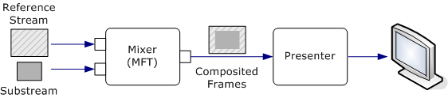
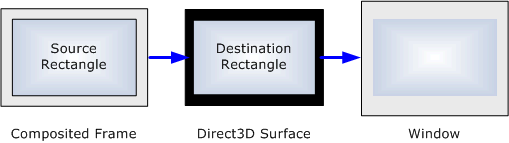
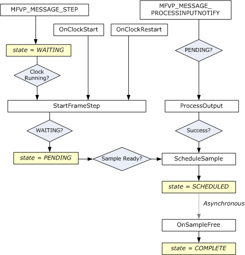

# How to Write an EVR Presenter

This article describes how to write a custom presenter for the enhanced video renderer (EVR). A custom presenter can be used with both DirectShow and Media Foundation; the interfaces and object model are the same for both technologies, although the exact sequence of operations might vary.

The example code in this topic is adapted from the [EVRPresenter Sample](evrpresenter-sample.md), which is provided in the Windows SDK.

This topic contains the following sections:

-   [Prerequisites](#prerequisites)
-   [Presenter Object Model](#presenter-object-model)
    -   [Data Flow Inside the EVR](#data-flow-inside-the-evr)
    -   [Presenter States](#presenter-states)
    -   [Presenter Interfaces](#presenter-interfaces)
    -   [Implementing IMFVideoDeviceID](#implementing-imfvideodeviceid)
    -   [Implementing IMFTopologyServiceLookupClient](#implementing-imftopologyservicelookupclient)
    -   [Implementing IMFVideoPresenter](#implementing-imfvideopresenter)
    -   [Implementing IMFClockStateSink](#implementing-imfclockstatesink)
    -   [Implementing IMFRateSupport](#implementing-imfratesupport)
    -   [Sending Events to the EVR](#sending-events-to-the-evr)
-   [Negotiating Formats](#negotiating-formats)
-   [Managing the Direct3D Device](#managing-the-direct3d-device)
    -   [Allocating Direct3D Surfaces](#allocating-direct3d-surfaces)
    -   [Tracking Samples](#tracking-samples)
-   [Processing Output](#processing-output)
    -   [Repainting Frames](#repainting-frames)
    -   [Scheduling Samples](#scheduling-samples)
    -   [Presenting Samples](#presenting-samples)
    -   [Source and Destination Rectangles](#source-and-destination-rectangles)
    -   [End of Stream](#end-of-stream)
-   [Frame Stepping](#frame-stepping)
    -   [Implementing Frame Stepping](#implementing-frame-stepping)
-   [Setting the Presenter on the EVR](#setting-the-presenter-on-the-evr)
    -   [Setting the Presenter in DirectShow](#setting-the-presenter-in-directshow)
    -   [Setting the Presenter in Media Foundation](#setting-the-presenter-in-media-foundation)
-   [Related topics](#related-topics)

## Prerequisites

Before writing a custom presenter, you should be familiar with the following technologies:

-   The enhanced video renderer. See [Enhanced Video Renderer](enhanced-video-renderer.md).
-   Direct3D graphics. You don't need to understand 3-D graphics to write a presenter, but you must know how to create a Direct3D device and manage Direct3D surfaces. If you aren't familiar with Direct3D, read the sections "Direct3D Devices" and "Direct3D Resources" in the DirectX Graphics SDK documentation.
-   DirectShow filter graphs or the Media Foundation pipeline, depending on which technology your application will use to render video.
-   [Media Foundation Transforms](media-foundation-transforms.md). The EVR mixer is a Media Foundation transform, and the presenter calls methods directly on the mixer.
-   Implementing COM objects. The presenter is an in-process, free-threaded COM object.

## Presenter Object Model

This section contains an overview the presenter object model and interfaces.

### Data Flow Inside the EVR

The EVR uses two plug-in components to render video: the *mixer* and the *presenter*. The mixer blends the video streams and deinterlaces the video if needed. The presenter draws (or *presents*) the video onto the display and schedules when each frame is drawn. Applications can replace either of these objects with a custom implementation.

The EVR has one or more input streams, and the mixer has a corresponding number of input streams. Stream 0 is always the *reference stream*. The other streams are *substreams*, which the mixer alpha-blends onto the reference stream. The reference stream determines the master frame-rate for the composited video. For each reference frame, the mixer takes the most recent frame from each substream, alpha-blends them onto the reference frame, and outputs a single composited frame. The mixer also performs deinterlacing and color conversion from YUV to RGB if needed. The EVR always inserts the mixer into the video pipeline, regardless of the number of input streams or the video format. The following image illustrates this process.



The presenter performs the following tasks:

-   Sets the output format on the mixer. Before streaming begins, the presenter sets a media type on the mixer's output stream. This media type defines the format of the composited image.
-   Creates the Direct3D device.
-   Allocates Direct3D surfaces. The mixer blits the composited frames onto these surfaces.
-   Gets the output from the mixer.
-   Schedules when the frames are presented. The EVR provides the presentation clock, and the presenter schedules frames according to this clock.
-   Presents each frame using Direct3D.
-   Performs frame stepping and scrubbing.

### Presenter States

At any time, the presenter is in one of following states:

-   *Started*. The EVR's presentation clock is running. The presenter schedules video frames for presentation as they arrive.
-   *Paused*. The presentation clock is suspended. The presenter does not present any new samples but maintains its queue of scheduled samples. If new samples are received, the presenter adds them to the queue.
-   *Stopped*. The presentation clock is stopped. The presenter discards any samples that were scheduled.
-   *Shut down*. The presenter releases any resources related to streaming, such as Direct3D surfaces. This is the presenter's initial state, and the final state before the presenter is destroyed.

In the example code in this topic, the presenter state is represented by an enumeration:


```C++
enum RENDER_STATE
{
    RENDER_STATE_STARTED = 1,
    RENDER_STATE_STOPPED,
    RENDER_STATE_PAUSED,
    RENDER_STATE_SHUTDOWN,  // Initial state.
};
```


Some operations are not valid while the presenter is in the shutdown state. The example code checks for this state by calling a helper method:


```C++
    HRESULT CheckShutdown() const
    {
        if (m_RenderState == RENDER_STATE_SHUTDOWN)
        {
            return MF_E_SHUTDOWN;
        }
        else
        {
            return S_OK;
        }
    }
```


### Presenter Interfaces

A presenter is required to implement the following interfaces:


| Interface                                                                | Description                                                                                                                                                         |
|--------------------------------------------------------------------------|---------------------------------------------------------------------------------------------------------------------------------------------------------------------|
| [**IMFClockStateSink**](/windows/desktop/api/mfidl/nn-mfidl-imfclockstatesink)                           | Notifies the presenter when the EVR's clock changes state. See [Implementing IMFClockStateSink](#implementing-imfclockstatesink).                                   |
| [**IMFGetService**](/windows/desktop/api/mfidl/nn-mfidl-imfgetservice)                                   | Provides a way for the application and other components in the pipeline to get interfaces from the presenter.                                                       |
| [**IMFTopologyServiceLookupClient**](/windows/desktop/api/evr/nn-evr-imftopologyservicelookupclient) | Enables the presenter to get interfaces from the EVR or the mixer. See [Implementing IMFTopologyServiceLookupClient](#implementing-imftopologyservicelookupclient). |
| [**IMFVideoDeviceID**](/windows/desktop/api/evr/nn-evr-imfvideodeviceid)                             | Ensures that the presenter and the mixer use compatible technologies. See [Implementing IMFVideoDeviceID](#implementing-imfvideodeviceid).                          |
| [**IMFVideoPresenter**](/windows/desktop/api/evr/nn-evr-imfvideopresenter)                           | Processes messages from the EVR. See [Implementing IMFVideoPresenter](#implementing-imfvideopresenter).                                                             |


 

The following interfaces are optional:


| Interface                                                | Description                                                                                                                                                               |
|----------------------------------------------------------|---------------------------------------------------------------------------------------------------------------------------------------------------------------------------|
| [**IEVRTrustedVideoPlugin**](/windows/desktop/api/evr/nn-evr-ievrtrustedvideoplugin) | Enables the presenter to work with protected media. Implement this interface if your presenter is a trusted component designed to work in the protected media path (PMP). |
| [**IMFRateSupport**](/windows/desktop/api/mfidl/nn-mfidl-imfratesupport)                 | Reports the range of playback rates that the presenter supports. See [Implementing IMFRateSupport](#implementing-imfratesupport).                                         |
| [**IMFVideoPositionMapper**](/windows/desktop/api/evr/nn-evr-imfvideopositionmapper) | Maps coordinates on the output video frame to coordinates on the input video frame.                                                                                       |
| [**IQualProp**](/previous-versions/windows/desktop/api/amvideo/nn-amvideo-iqualprop)                         | Reports performance information. The EVR uses this information for quality-control management. This interface is documented in the DirectShow SDK.                        |


 

You can also provide interfaces for the application to communicate with the presenter. The standard presenter implements the [**IMFVideoDisplayControl**](/windows/desktop/api/evr/nn-evr-imfvideodisplaycontrol) interface for this purpose. You can implement this interface or define your own. The application obtains interfaces from the presenter by calling [**IMFGetService::GetService**](/windows/desktop/api/mfidl/nf-mfidl-imfgetservice-getservice) on the EVR. When the service GUID is **MR_VIDEO_RENDER_SERVICE**, the EVR passes the **GetService** request to the presenter.

### Implementing IMFVideoDeviceID

The [**IMFVideoDeviceID**](/windows/desktop/api/evr/nn-evr-imfvideodeviceid) interface contains one method, [**GetDeviceID**](/windows/desktop/api/evr/nf-evr-imfvideodeviceid-getdeviceid), which returns a device GUID. The device GUID ensures that the presenter and the mixer use compatible technologies. If the device GUIDs do not match, the EVR fails to initialize.

The standard mixer and presenter both use Direct3D 9, with the device GUID equal to **IID_IDirect3DDevice9**. If you intend to use your custom presenter with the standard mixer, the presenter's device GUID must be **IID_IDirect3DDevice9**. If you replace both components, you could define a new device GUID. For the remainder of this article, it is assumed that the presenter uses Direct3D 9. Here is the standard implementation of [**GetDeviceID**](/windows/desktop/api/evr/nf-evr-imfvideodeviceid-getdeviceid):


```C++
HRESULT EVRCustomPresenter::GetDeviceID(IID* pDeviceID)
{
    if (pDeviceID == NULL)
    {
        return E_POINTER;
    }

    *pDeviceID = __uuidof(IDirect3DDevice9);
    return S_OK;
}
```


The method should succeed even when the presenter is shut down.

### Implementing IMFTopologyServiceLookupClient

The [**IMFTopologyServiceLookupClient**](/windows/desktop/api/evr/nn-evr-imftopologyservicelookupclient) interface enables the presenter to get interface pointers from the EVR and from the mixer as follows:

1.  When the EVR initializes the presenter, it calls the presenter's [**IMFTopologyServiceLookupClient::InitServicePointers**](/windows/desktop/api/evr/nf-evr-imftopologyservicelookupclient-initservicepointers) method. The argument is a pointer to the EVR's [**IMFTopologyServiceLookup**](/windows/desktop/api/evr/nn-evr-imftopologyservicelookup) interface.
2.  The presenter calls [**IMFTopologyServiceLookup::LookupService**](/windows/desktop/api/evr/nf-evr-imftopologyservicelookup-lookupservice) to get interface pointers from either the EVR or the mixer.

The [**LookupService**](/windows/desktop/api/evr/nf-evr-imftopologyservicelookup-lookupservice) method is similar to the [**IMFGetService::GetService**](/windows/desktop/api/mfidl/nf-mfidl-imfgetservice-getservice) method. Both methods take a service GUID and an interface identifier (IID) as input, but **LookupService** returns an array of interface pointers, while **GetService** returns a single pointer. In practice, however, you can always set the array size to 1. The object queried depends on the service GUID:

-   If the service GUID is **MR_VIDEO_RENDER_SERVICE**, the EVR is queried.
-   If the service GUID is **MR_VIDEO_MIXER_SERVICE**, the mixer is queried.

In your implementation of [**InitServicePointers**](/windows/desktop/api/evr/nf-evr-imftopologyservicelookupclient-initservicepointers), get the following interfaces from the EVR:


| EVR Interface                                | Description                                                                                                                                                                                                                                                                                                                                                                                                                                                                                                                                                   |
|----------------------------------------------|---------------------------------------------------------------------------------------------------------------------------------------------------------------------------------------------------------------------------------------------------------------------------------------------------------------------------------------------------------------------------------------------------------------------------------------------------------------------------------------------------------------------------------------------------------------|
| [**IMediaEventSink**](/windows/win32/api/strmif/nn-strmif-imediaeventsink) | Provides a way for the presenter to send messages to the EVR. This interface is defined in the DirectShow SDK, so the messages follow the pattern for DirectShow events, not Media Foundation events.<br/>                                                                                                                                                                                                                                                                                                                                              |
| [**IMFClock**](/windows/desktop/api/mfidl/nn-mfidl-imfclock)                 | Represents the EVR's clock. The presenter uses this interface to schedule samples for presentation. The EVR can run without a clock, so this interface might not be available. If not, ignore the error code from [**LookupService**](/windows/desktop/api/evr/nf-evr-imftopologyservicelookup-lookupservice).<br/> The clock also implements the [**IMFTimer**](/windows/desktop/api/mfidl/nn-mfidl-imftimer) interface. In the Media Foundation pipeline, the clock implements the [**IMFPresentationClock**](/windows/desktop/api/mfidl/nn-mfidl-imfpresentationclock) interface. It does not implement this interface in DirectShow.<br/> |


 

Get the following interfaces from the mixer:


| Mixer Interface                              | Description                                                |
|----------------------------------------------|------------------------------------------------------------|
| [**IMFTransform**](/windows/desktop/api/mftransform/nn-mftransform-imftransform)         | Enables the presenter to communicate with the mixer.       |
| [**IMFVideoDeviceID**](/windows/desktop/api/evr/nn-evr-imfvideodeviceid) | Enables the presenter to validate the mixer's device GUID. |


 

The following code implements the [**InitServicePointers**](/windows/desktop/api/evr/nf-evr-imftopologyservicelookupclient-initservicepointers) method :


```C++
HRESULT EVRCustomPresenter::InitServicePointers(
    IMFTopologyServiceLookup *pLookup
    )
{
    if (pLookup == NULL)
    {
        return E_POINTER;
    }

    HRESULT             hr = S_OK;
    DWORD               dwObjectCount = 0;

    EnterCriticalSection(&m_ObjectLock);

    // Do not allow initializing when playing or paused.
    if (IsActive())
    {
        hr = MF_E_INVALIDREQUEST;
        goto done;
    }

    SafeRelease(&m_pClock);
    SafeRelease(&m_pMixer);
    SafeRelease(&m_pMediaEventSink);

    // Ask for the clock. Optional, because the EVR might not have a clock.
    dwObjectCount = 1;

    (void)pLookup->LookupService(
        MF_SERVICE_LOOKUP_GLOBAL,   // Not used.
        0,                          // Reserved.
        MR_VIDEO_RENDER_SERVICE,    // Service to look up.
        IID_PPV_ARGS(&m_pClock),    // Interface to retrieve.
        &dwObjectCount              // Number of elements retrieved.
        );

    // Ask for the mixer. (Required.)
    dwObjectCount = 1;

    hr = pLookup->LookupService(
        MF_SERVICE_LOOKUP_GLOBAL, 0,
        MR_VIDEO_MIXER_SERVICE, IID_PPV_ARGS(&m_pMixer), &dwObjectCount
        );

    if (FAILED(hr))
    {
        goto done;
    }

    // Make sure that we can work with this mixer.
    hr = ConfigureMixer(m_pMixer);
    if (FAILED(hr))
    {
        goto done;
    }

    // Ask for the EVR's event-sink interface. (Required.)
    dwObjectCount = 1;

    hr = pLookup->LookupService(
        MF_SERVICE_LOOKUP_GLOBAL, 0,
        MR_VIDEO_RENDER_SERVICE, IID_PPV_ARGS(&m_pMediaEventSink),
        &dwObjectCount
        );

    if (FAILED(hr))
    {
        goto done;
    }

    // Successfully initialized. Set the state to "stopped."
    m_RenderState = RENDER_STATE_STOPPED;

done:
    LeaveCriticalSection(&m_ObjectLock);
    return hr;
}
```


When the interface pointers obtained from [**LookupService**](/windows/desktop/api/evr/nf-evr-imftopologyservicelookup-lookupservice) are no longer valid, the EVR calls [**IMFTopologyServiceLookupClient::ReleaseServicePointers**](/windows/desktop/api/evr/nf-evr-imftopologyservicelookupclient-releaseservicepointers). Inside this method, release all interface pointers and set the presenter state to shut down:


```C++
HRESULT EVRCustomPresenter::ReleaseServicePointers()
{
    // Enter the shut-down state.
    EnterCriticalSection(&m_ObjectLock);

    m_RenderState = RENDER_STATE_SHUTDOWN;

    LeaveCriticalSection(&m_ObjectLock);

    // Flush any samples that were scheduled.
    Flush();

    // Clear the media type and release related resources.
    SetMediaType(NULL);

    // Release all services that were acquired from InitServicePointers.
    SafeRelease(&m_pClock);
    SafeRelease(&m_pMixer);
    SafeRelease(&m_pMediaEventSink);

    return S_OK;
}
```


The EVR calls [**ReleaseServicePointers**](/windows/desktop/api/evr/nf-evr-imftopologyservicelookupclient-releaseservicepointers) for various reasons, including:

-   Disconnecting or reconnecting pins (DirectShow), or adding or removing stream sinks (Media Foundation).
-   Changing format.
-   Setting a new clock.
-   Final shutdown of the EVR.

During the lifetime of the presenter, the EVR might call [**InitServicePointers**](/windows/desktop/api/evr/nf-evr-imftopologyservicelookupclient-initservicepointers) and [**ReleaseServicePointers**](/windows/desktop/api/evr/nf-evr-imftopologyservicelookupclient-releaseservicepointers) several times.

### Implementing IMFVideoPresenter

The [**IMFVideoPresenter**](/windows/desktop/api/evr/nn-evr-imfvideopresenter) interface inherits [**IMFClockStateSink**](/windows/desktop/api/mfidl/nn-mfidl-imfclockstatesink) and adds two methods:


| Method                                                               | Description                                            |
|----------------------------------------------------------------------|--------------------------------------------------------|
| [**GetCurrentMediaType**](/windows/desktop/api/evr/nf-evr-imfvideopresenter-getcurrentmediatype) | Returns the media type of the composited video frames. |
| [**ProcessMessage**](/windows/desktop/api/evr/nf-evr-imfvideopresenter-processmessage)           | Signals the presenter to perform various actions.      |


 

The [**GetCurrentMediaType**](/windows/desktop/api/evr/nf-evr-imfvideopresenter-getcurrentmediatype) method returns the presenter's media type. (For details about setting the media type, see [Negotiating Formats](#negotiating-formats).) The media type is returned as an [**IMFVideoMediaType**](/windows/desktop/api/mfobjects/nn-mfobjects-imfvideomediatype) interface pointer. The following example assumes that the presenter stores the media type as an [**IMFMediaType**](/windows/desktop/api/mfobjects/nn-mfobjects-imfmediatype) pointer. To get the **IMFVideoMediaType** interface from the media type, call **QueryInterface**:


```C++
HRESULT EVRCustomPresenter::GetCurrentMediaType(
    IMFVideoMediaType** ppMediaType
    )
{
    HRESULT hr = S_OK;

    if (ppMediaType == NULL)
    {
        return E_POINTER;
    }

    *ppMediaType = NULL;

    EnterCriticalSection(&m_ObjectLock);

    hr = CheckShutdown();
    if (FAILED(hr))
    {
        goto done;
    }

    if (m_pMediaType == NULL)
    {
        hr = MF_E_NOT_INITIALIZED;
        goto done;
    }

    hr = m_pMediaType->QueryInterface(IID_PPV_ARGS(ppMediaType));

done:
    LeaveCriticalSection(&m_ObjectLock);
    return hr;
}
```


The [**ProcessMessage**](/windows/desktop/api/evr/nf-evr-imfvideopresenter-processmessage) method is the primary mechanism for the EVR to communicate with the presenter. The following messages are defined. The details of implementing each message are given in the remainder of this topic.


| Message                                | Description                                                                                                                                                                                                                                        |
|----------------------------------------|----------------------------------------------------------------------------------------------------------------------------------------------------------------------------------------------------------------------------------------------------|
| **MFVP_MESSAGE_INVALIDATEMEDIATYPE** | The mixer's output media type is invalid. The presenter should negotiate a new media type with the mixer. See [Negotiating Formats](#negotiating-formats).                                                                                         |
| **MFVP_MESSAGE_BEGINSTREAMING**      | Streaming has started. No particular action is required by this message, but you can use it to allocate resources.                                                                                                                                 |
| **MFVP_MESSAGE_ENDSTREAMING**        | Streaming has ended. Release any resources that you allocated in response to the **MFVP_MESSAGE_BEGINSTREAMING** message.                                                                                                                        |
| **MFVP_MESSAGE_PROCESSINPUTNOTIFY**  | The mixer has received a new input sample and might be able to generate a new output frame. The presenter should call [**IMFTransform::ProcessOutput**](/windows/desktop/api/mftransform/nf-mftransform-imftransform-processoutput) on the mixer. See [Processing Output](#processing-output). |
| **MFVP_MESSAGE_ENDOFSTREAM**         | The presentation has ended. See [End of Stream](#end-of-stream).                                                                                                                                                                                   |
| **MFVP_MESSAGE_FLUSH**               | The EVR is flushing the data in its rendering pipeline. The presenter should discard any video frames that are scheduled for presentation.                                                                                                         |
| **MFVP_MESSAGE_STEP**                | Requests the presenter to step forward N frames. The presenter should discard the next N-1 frames and display the Nth frame. See [Frame Stepping](#frame-stepping).                                                                                |
| **MFVP_MESSAGE_CANCELSTEP**          | Cancels frame stepping.                                                                                                                                                                                                                            |


 

### Implementing IMFClockStateSink

The presenter must implement the [**IMFClockStateSink**](/windows/desktop/api/mfidl/nn-mfidl-imfclockstatesink) interface as part of its implementation of [**IMFVideoPresenter**](/windows/desktop/api/evr/nn-evr-imfvideopresenter), which inherits **IMFClockStateSink**. The EVR uses this interface to notify the presenter whenever the EVR's clock changes state. For more information about the clock states, see [Presentation Clock](presentation-clock.md).

Here are some guidelines for implementing the methods in this interface. All of the methods should fail if the presenter is shut down.

| Method| Description |
|-----|-----|
| <a href="/windows/desktop/api/mfidl/nf-mfidl-imfclockstatesink-onclockstart"><strong>OnClockStart</strong></a> | <ol><li>Set the presenter state to started.</li><li>If the <em>llClockStartOffset</em> is not <strong>PRESENTATION_CURRENT_POSITION</strong>, flush the presenter's queue of samples. (This is equivalent to receiving an <strong>MFVP_MESSAGE_FLUSH</strong> message.)</li><li>If a previous frame-step request is still pending, process the request (see <a href="#frame-stepping">Frame Stepping</a>). Otherwise, try to process output from the mixer (see <a href="#processing-output">Processing Output</a>.</li></ol> | 
| <a href="/windows/desktop/api/mfidl/nf-mfidl-imfclockstatesink-onclockstop"><strong>OnClockStop</strong></a> | <ol><li>Set the presenter state to stopped.</li><li>Flush the presenter's queue of samples.</li><li>Cancel any pending frame-step operation.</li></ol> | 
| <a href="/windows/desktop/api/mfidl/nf-mfidl-imfclockstatesink-onclockpause"><strong>OnClockPause</strong></a> | Set the presenter state to paused. | 
| <a href="/windows/desktop/api/mfidl/nf-mfidl-imfclockstatesink-onclockrestart"><strong>OnClockRestart</strong></a> | Treat the same as <a href="/windows/desktop/api/mfidl/nf-mfidl-imfclockstatesink-onclockstart"><strong>OnClockStart</strong></a> but do not flush the queue of samples. | 
| <a href="/windows/desktop/api/mfidl/nf-mfidl-imfclockstatesink-onclocksetrate"><strong>OnClockSetRate</strong></a> | <ol><li>If the rate is changing from zero to nonzero, cancel frame stepping.</li><li>Store the new clock rate. The clock rate affects when samples are presented. For more information, see <a href="#scheduling-samples">Scheduling Samples</a>.</li></ol>|


 

### Implementing IMFRateSupport

To support playback rates other than 1× speed, the presenter must implement the [**IMFRateSupport**](/windows/desktop/api/mfidl/nn-mfidl-imfratesupport) interface. Here are some guidelines for implementing the methods in this interface. All of the methods should fail after the presenter is shut down. For more information about this interface, see [Rate Control](rate-control.md).


| Value                                                          | Description                                                                                                                                                                                                                                                                                                                                                                                                                                                                                                                      |
|-----------------------------------------------------------|-----------------------------------------------------------------------------------------------------------------------------------------------------------------------------------------------------------------------------------------------------------------------------------------------------------------------------------------------------------------------------------------------------------------------------------------------------------------------------------------------------------------------|
| [**GetSlowestRate**](/windows/desktop/api/mfidl/nf-mfidl-imfratesupport-getslowestrate)   | Return zero to indicate no minimum playback rate.                                                                                                                                                                                                                                                                                                                                                                                                                                                                     |
| [**GetFastestRate**](/windows/desktop/api/mfidl/nf-mfidl-imfratesupport-getfastestrate)   | For non-thinned playback, the playback rate should not exceed the refresh rate of the monitor: *maximum rate* = *refresh rate* (Hz) / *video frame rate* (fps). The video frame rate is specified in the presenter's media type. <br/> For thinned playback, the playback rate is unbounded; return the value **FLT_MAX**. In practice, the source and the decoder will be the limiting factors during thinned playback. <br/> For reverse playback, return the negative of the maximum rate.<br/> |
| [**IsRateSupported**](/windows/desktop/api/mfidl/nf-mfidl-imfratesupport-isratesupported) | Return **MF_E_UNSUPPORTED_RATE** if the absolute value of *flRate* exceeds the presenter's maximum playback rate. Calculate the maximum playback rate as described for [**GetFastestRate**](/windows/desktop/api/mfidl/nf-mfidl-imfratesupport-getfastestrate).                                                                                                                                                                                                                                                                                    |


 

The following example shows how to implement the [**GetFastestRate**](/windows/desktop/api/mfidl/nf-mfidl-imfratesupport-getfastestrate) method:


```C++
float EVRCustomPresenter::GetMaxRate(BOOL bThin)
{
    // Non-thinned:
    // If we have a valid frame rate and a monitor refresh rate, the maximum
    // playback rate is equal to the refresh rate. Otherwise, the maximum rate
    // is unbounded (FLT_MAX).

    // Thinned: The maximum rate is unbounded.

    float   fMaxRate = FLT_MAX;
    MFRatio fps = { 0, 0 };
    UINT    MonitorRateHz = 0;

    if (!bThin && (m_pMediaType != NULL))
    {
        GetFrameRate(m_pMediaType, &fps);
        MonitorRateHz = m_pD3DPresentEngine->RefreshRate();

        if (fps.Denominator && fps.Numerator && MonitorRateHz)
        {
            // Max Rate = Refresh Rate / Frame Rate
            fMaxRate = (float)MulDiv(
                MonitorRateHz, fps.Denominator, fps.Numerator);
        }
    }

    return fMaxRate;
}
```


The previous example calls a helper method, GetMaxRate, to calculate the maximum forward playback rate:

The following example shows how to implement the [**IsRateSupported**](/windows/desktop/api/mfidl/nf-mfidl-imfratesupport-isratesupported) method:


```C++
HRESULT EVRCustomPresenter::IsRateSupported(
    BOOL bThin,
    float fRate,
    float *pfNearestSupportedRate
    )
{
    EnterCriticalSection(&m_ObjectLock);

    float   fMaxRate = 0.0f;
    float   fNearestRate = fRate;  // If we support fRate, that is the nearest.

    HRESULT hr = CheckShutdown();
    if (FAILED(hr))
    {
        goto done;
    }

    // Find the maximum forward rate.
    // Note: We have no minimum rate (that is, we support anything down to 0).
    fMaxRate = GetMaxRate(bThin);

    if (fabsf(fRate) > fMaxRate)
    {
        // The (absolute) requested rate exceeds the maximum rate.
        hr = MF_E_UNSUPPORTED_RATE;

        // The nearest supported rate is fMaxRate.
        fNearestRate = fMaxRate;
        if (fRate < 0)
        {
            // Negative for reverse playback.
            fNearestRate = -fNearestRate;
        }
    }

    // Return the nearest supported rate.
    if (pfNearestSupportedRate != NULL)
    {
        *pfNearestSupportedRate = fNearestRate;
    }

done:
    LeaveCriticalSection(&m_ObjectLock);
    return hr;
}
```


### Sending Events to the EVR

The presenter must notify the EVR of various events. To do so, it uses the EVR's [**IMediaEventSink**](/windows/win32/api/strmif/nn-strmif-imediaeventsink) interface, obtained when the EVR calls the presenter's [**IMFTopologyServiceLookupClient::InitServicePointers**](/windows/desktop/api/evr/nf-evr-imftopologyservicelookupclient-initservicepointers) method. (The **IMediaEventSink** interface is originally a DirectShow interface, but is used in both the DirectShow EVR and the Media Foundation.) The following code shows how to send an event to the EVR:


```C++
    // NotifyEvent: Send an event to the EVR through its IMediaEventSink interface.
    void NotifyEvent(long EventCode, LONG_PTR Param1, LONG_PTR Param2)
    {
        if (m_pMediaEventSink)
        {
            m_pMediaEventSink->Notify(EventCode, Param1, Param2);
        }
    }
```


The following table lists the events that the presenter sends, along with the event parameters.


| Event | Description | 
|-------|-------------|
| <a href="/windows/desktop/DirectShow/ec-complete"><strong>EC_COMPLETE</strong></a> | The presenter has finished rendering all frames after the MFVP_MESSAGE_ENDOFSTREAM message.<br /><ul><li><em>Param1</em>: HRESULT indicating the status of the operation.</li><li><em>Param2</em>: Not used.</li></ul>For more information, see <a href="#end-of-stream">End of Stream</a>.<br /> | 
| <a href="/windows/desktop/DirectShow/ec-display-changed"><strong>EC_DISPLAY_CHANGED</strong></a> | The Direct3D device has changed.<br /><ul><li><em>Param1</em>: Not used.</li><li><em>Param2</em>: Not used.</li></ul>For more information, see <a href="#managing-the-direct3d-device">Managing the Direct3D Device</a>.<br /> | 
| <a href="/windows/desktop/DirectShow/ec-errorabort"><strong>EC_ERRORABORT</strong></a> | An error has occurred that requires streaming to stop.<br /><ul><li><em>Param1</em>: <strong>HRESULT</strong> indicating the error that occurred.</li><li><em>Param2</em>: Not used.</li></ul> | 
| <a href="/windows/desktop/DirectShow/ec-processing-latency"><strong>EC_PROCESSING_LATENCY</strong></a> | Specifies the amount of time that the presenter is taking to render each frame. (Optional.)<br /><ul><li><em>Param1</em>: Pointer to a constant <strong>LONGLONG</strong> value that contains the amount of time to process the frame, in 100-nanosecond units.</li><li><em>Param2</em>: Not used.</li></ul>For more information, see <a href="#processing-output">Processing Output</a>.<br /> | 
| <a href="/windows/desktop/DirectShow/ec-sample-latency"><strong>EC_SAMPLE_LATENCY</strong></a> | Specifies the current lag time in rendering samples. If the value is positive, samples are behind schedule. If the value is negative, samples are ahead of schedule. (Optional.)<br /><ul><li><em>Param1</em>: Pointer to a constant <strong>LONGLONG</strong> value that contains the lag time, in 100-nanosecond units.</li><li><em>Param2</em>: Not used.</li></ul> | 
| <a href="/windows/desktop/DirectShow/ec-scrub-time"><strong>EC_SCRUB_TIME</strong></a> | Sent immediately after <strong>EC_STEP_COMPLETE</strong> if the playback rate is zero. This event contains the time stamp of the frame that was displayed.<br /><ul><li><em>Param1</em>: Lower 32 bits of the time stamp.</li><li><em>Param2</em>: Upper 32 bits of the time stamp.</li></ul>For more information, see <a href="#frame-stepping">Frame Stepping</a>.<br /> | 
| <a href="/windows/desktop/DirectShow/ec-step-complete"><strong>EC_STEP_COMPLETE</strong></a> | The presenter has completed or canceled a frame step.<br /><ul><li><em>Param1</em>: Not used.</li><li><em>Param2</em>: Not used.</li></ul>For more information, see <a href="#frame-stepping">Frame Stepping</a>.<br /><blockquote>[!Note]<br />A previous version of the documentation described <em>Param1</em> incorrectly. This parameter is not used for this event.</blockquote><br /> | 


 

## Negotiating Formats

Whenever the presenter receives an **MFVP_MESSAGE_INVALIDATEMEDIATYPE** message from the EVR, it must set the output format on the mixer, as follows:

1.  Call [**IMFTransform::GetOutputAvailableType**](/windows/desktop/api/mftransform/nf-mftransform-imftransform-getoutputavailabletype) on the mixer to get a possible output type. This type describes a format that the mixer can produce given the input streams and the video processing capabilities of the graphics device.
2.  Check whether the presenter can use this media type as its rendering format. Here are some things to check, although your implementation might have its own requirements:

    -   The video must be uncompressed.
    -   The video must have progressive frames only. Check that the [**MF_MT_INTERLACE_MODE**](mf-mt-interlace-mode-attribute.md) attribute equals **MFVideoInterlace_Progressive**.
    -   The format must be compatible with the Direct3D device.

    If the type is not acceptable, return to step 1 and get the mixer's next proposed type.

3.  Create a new media type that is a clone of the original type and then change the following attributes:

    -   Set the [**MF_MT_FRAME_SIZE**](mf-mt-frame-size-attribute.md) attribute equal to the width and height that you want for the Direct3D surfaces you will allocate.
    -   Set the [**MF_MT_PAN_SCAN_ENABLED**](mf-mt-pan-scan-enabled-attribute.md) attribute to **FALSE**.
    -   Set the [**MF_MT_PIXEL_ASPECT_RATIO**](mf-mt-pixel-aspect-ratio-attribute.md) attribute equal to the PAR of the display (typically 1:1).
    -   Set the geometric aperture ([**MF_MT_GEOMETRIC_APERTURE**](mf-mt-geometric-aperture-attribute.md) attribute) equal to a rectangle within the Direct3D surface. When the mixer generates an output frame, it blits the source image onto this rectangle. The geometric aperture can be as large as the surface, or it can be a subrectangle within the surface. For more information, see [Source and Destination Rectangles](#source-and-destination-rectangles).

4.  To test whether the mixer will accept the modified output type, call [**IMFTransform::SetOutputType**](/windows/desktop/api/mftransform/nf-mftransform-imftransform-setoutputtype) with the **MFT_SET_TYPE_TEST_ONLY** flag. If the mixer rejects the type, go back to step 1 and get the next type.
5.  Allocate a pool of Direct3D surfaces, as described in [Allocating Direct3D Surfaces](#allocating-direct3d-surfaces). The mixer will use these surfaces when it draws the composited video frames.
6.  Set the output type on the mixer by calling [**SetOutputType**](/windows/desktop/api/mftransform/nf-mftransform-imftransform-setoutputtype) with no flags. If the first call to **SetOutputType** succeeded in step 4, the method should succeed again.

If the mixer runs out of types, the [**GetOutputAvailableType**](/windows/desktop/api/mftransform/nf-mftransform-imftransform-getoutputavailabletype) method returns **MF_E_NO_MORE_TYPES**. If the presenter cannot find a suitable output type for the mixer, the stream cannot be rendered. In that case, DirectShow or Media Foundation might try another stream format. Therefore, the presenter might receive several **MFVP_MESSAGE_INVALIDATEMEDIATYPE** messages in a row until a valid type is found.

The mixer automatically letterboxes the video, taking into account the pixel aspect ratio (PAR) of the source and destination. For best results, the surface width and height and the geometric aperture should be equal to the actual size that you want the video to appear on the display. The following image illustrates this process.



The following code shows the outline of the process. Some of the steps are placed in helper functions, the exact details of which will depend on the requirements of your presenter.


```C++
HRESULT EVRCustomPresenter::RenegotiateMediaType()
{
    HRESULT hr = S_OK;
    BOOL bFoundMediaType = FALSE;

    IMFMediaType *pMixerType = NULL;
    IMFMediaType *pOptimalType = NULL;
    IMFVideoMediaType *pVideoType = NULL;

    if (!m_pMixer)
    {
        return MF_E_INVALIDREQUEST;
    }

    // Loop through all of the mixer's proposed output types.
    DWORD iTypeIndex = 0;
    while (!bFoundMediaType && (hr != MF_E_NO_MORE_TYPES))
    {
        SafeRelease(&pMixerType);
        SafeRelease(&pOptimalType);

        // Step 1. Get the next media type supported by mixer.
        hr = m_pMixer->GetOutputAvailableType(0, iTypeIndex++, &pMixerType);
        if (FAILED(hr))
        {
            break;
        }

        // From now on, if anything in this loop fails, try the next type,
        // until we succeed or the mixer runs out of types.

        // Step 2. Check if we support this media type.
        if (SUCCEEDED(hr))
        {
            // Note: None of the modifications that we make later in CreateOptimalVideoType
            // will affect the suitability of the type, at least for us. (Possibly for the mixer.)
            hr = IsMediaTypeSupported(pMixerType);
        }

        // Step 3. Adjust the mixer's type to match our requirements.
        if (SUCCEEDED(hr))
        {
            hr = CreateOptimalVideoType(pMixerType, &pOptimalType);
        }

        // Step 4. Check if the mixer will accept this media type.
        if (SUCCEEDED(hr))
        {
            hr = m_pMixer->SetOutputType(0, pOptimalType, MFT_SET_TYPE_TEST_ONLY);
        }

        // Step 5. Try to set the media type on ourselves.
        if (SUCCEEDED(hr))
        {
            hr = SetMediaType(pOptimalType);
        }

        // Step 6. Set output media type on mixer.
        if (SUCCEEDED(hr))
        {
            hr = m_pMixer->SetOutputType(0, pOptimalType, 0);

            assert(SUCCEEDED(hr)); // This should succeed unless the MFT lied in the previous call.

            // If something went wrong, clear the media type.
            if (FAILED(hr))
            {
                SetMediaType(NULL);
            }
        }

        if (SUCCEEDED(hr))
        {
            bFoundMediaType = TRUE;
        }
    }

    SafeRelease(&pMixerType);
    SafeRelease(&pOptimalType);
    SafeRelease(&pVideoType);

    return hr;
}
```


For more information about video media types, see [Video Media Types](video-media-types.md).

## Managing the Direct3D Device

The presenter creates the Direct3D device and handles any device loss during streaming. The presenter also hosts the Direct3D device manager, which provides a way for other components to use the same device. For example, the mixer uses the Direct3D device to mix substreams, deinterlace, and perform color adjustments. Decoders can use the Direct3D device for video-accelerated decoding. (For more information about video acceleration, see [DirectX Video Acceleration 2.0](directx-video-acceleration-2-0.md).)

To set up the Direct3D device, perform the following steps:

1.  Create the Direct3D object by calling **Direct3DCreate9** or **Direct3DCreate9Ex**.
2.  Create the device by calling **IDirect3D9::CreateDevice** or **IDirect3D9Ex::CreateDevice**.
3.  Create the device manager by calling [**DXVA2CreateDirect3DDeviceManager9**](/windows/desktop/api/dxva2api/nf-dxva2api-dxva2createdirect3ddevicemanager9).
4.  Set the device on the device manager by calling [**IDirect3DDeviceManager9::ResetDevice**](/windows/desktop/api/dxva2api/nf-dxva2api-idirect3ddevicemanager9-resetdevice).

If another pipeline component needs the device manager, it calls [**IMFGetService::GetService**](/windows/desktop/api/mfidl/nf-mfidl-imfgetservice-getservice) on the EVR, specifying **MR_VIDEO_ACCELERATION_SERVICE** for the service GUID. The EVR passes the request to the presenter. After the object gets the [**IDirect3DDeviceManager9**](/windows/desktop/api/dxva2api/nn-dxva2api-idirect3ddevicemanager9) pointer, it can get a handle to the device by calling [**IDirect3DDeviceManager9::OpenDeviceHandle**](/windows/desktop/api/dxva2api/nf-dxva2api-idirect3ddevicemanager9-opendevicehandle). When the object needs to use the device, it passes the device handle to the [**IDirect3DDeviceManager9::LockDevice**](/windows/desktop/api/dxva2api/nf-dxva2api-idirect3ddevicemanager9-lockdevice) method, which returns an **IDirect3DDevice9** pointer.

After the device is created, if the presenter destroys the device and creates a new one, the presenter must call [**ResetDevice**](/windows/desktop/api/dxva2api/nf-dxva2api-idirect3ddevicemanager9-resetdevice) again. The **ResetDevice** method invalidates any existing device handles, which causes [**LockDevice**](/windows/desktop/api/dxva2api/nf-dxva2api-idirect3ddevicemanager9-lockdevice) to return **DXVA2_E_NEW_VIDEO_DEVICE**. This error code signals to other objects using the device that they should open a new device handle. For more information about using the device manager, see [Direct3D Device Manager](direct3d-device-manager.md).

The presenter can create the device in windowed mode or full-screen exclusive mode. For windowed mode, you should provide a way for the application to specify the video window. The standard presenter implements the [**IMFVideoDisplayControl::SetVideoWindow**](/windows/desktop/api/evr/nf-evr-imfvideodisplaycontrol-setvideowindow) method for this purpose. You must create the device when the presenter is first created. Typically, you won't know all of the device parameters at this time, such as the window or the back buffer format. You can create a temporary device and replace it later&\#;just remember to call [**ResetDevice**](/windows/desktop/api/dxva2api/nf-dxva2api-idirect3ddevicemanager9-resetdevice) on the device manager.

If you create a new device, or if you call **IDirect3DDevice9::Reset** or **IDirect3DDevice9Ex::ResetEx** on an existing device, send an [**EC_DISPLAY_CHANGED**](../directshow/ec-display-changed.md) event to the EVR. This event notifies the EVR to renegotiate the media type. The EVR ignores the event parameters for this event.

### Allocating Direct3D Surfaces

After the presenter sets the media type, it can allocate the Direct3D surfaces, which the mixer will use to write the video frames. The surface must match the presenter's media type:

-   The surface format must match the media subtype. For example, if the subtype is **MFVideoFormat_RGB24**, the surface format must be **D3DFMT_X8R8G8B8**. For more information about subtypes and Direct3D formats, see [Video Subtype GUIDs](video-subtype-guids.md).
-   The surface width and height must match the dimensions given in the [**MF_MT_FRAME_SIZE**](mf-mt-frame-size-attribute.md) attribute of the media type.

The recommended way to allocate surfaces depends on whether the presenter runs windowed or full-screen.

If the Direct3D device is windowed, you can create several swap chains, each with a single back buffer. Using this approach, you can present each surface independently, because presenting one swap chain will not interfere with the other swap chains. The mixer can write data to a surface while another surface is scheduled for presentation.

First, decide how many swap chains to create. A minimum of three is recommended. For each swap chain, do the following:

1.  Call **IDirect3DDevice9::CreateAdditionalSwapChain** to create the swap chain.
2.  Call **IDirect3DSwapChain9::GetBackBuffer** to get a pointer to the swap chain's back buffer surface.
3.  Call [**MFCreateVideoSampleFromSurface**](/windows/desktop/api/evr/nc-evr-mfcreatevideosamplefromsurface) and pass in a pointer to the surface. This function returns a pointer to a video sample object. The video sample object implements the [**IMFSample**](/windows/desktop/api/mfobjects/nn-mfobjects-imfsample) interface, and the presenter uses this interface to deliver the surface to the mixer when the presenter calls the mixer's [**IMFTransform::ProcessOutput**](/windows/desktop/api/mftransform/nf-mftransform-imftransform-processoutput) method. For more information about the video sample object, see [Video Samples](video-samples.md).
4.  Store the [**IMFSample**](/windows/desktop/api/mfobjects/nn-mfobjects-imfsample) pointer in a queue. The presenter will pull samples from this queue during processing as described in [Processing Output](#processing-output).
5.  Keep a reference to the **IDirect3DSwapChain9** pointer so the swap chain is not released.

In full-screen exclusive mode, the device cannot have more than one swap chain. This swap chain is created implicitly when you create the full-screen device. The swap chain can have more than one back buffer. Unfortunately, however, if you present one back buffer while you write to another back buffer in the same swap chain, there is no easy way to coordinate the two operations. This is because of the way Direct3D implements surface flipping. When you call Present, the graphics driver updates the surface pointers in graphics memory. If you are holding any **IDirect3DSurface9** pointers when you call **Present**, they will point to different buffers after the **Present** call returns.

The simplest option is to create one video sample for the swap chain. If you choose this option, follow the same steps given for windowed mode. The only difference is that the sample queue contains a single video sample. Another option is to create offscreen surfaces and then blit them to the back buffer. The surfaces that you create must support the [**IDirectXVideoProcessor::VideoProcessBlt**](/windows/desktop/api/dxva2api/nf-dxva2api-idirectxvideoprocessor-videoprocessblt) method, which the mixer uses to composite the output frames.

### Tracking Samples

When the presenter first allocates the video samples, it places them in a queue. The presenter draws from this queue whenever it needs to get a new frame from the mixer. After the mixer outputs the frame, the presenter moves the sample into a second queue. The second queue is for samples that are waiting for their scheduled presentation times.

To make it easier to track the status of each sample, the video sample object implements the [**IMFTrackedSample**](/windows/win32/api/mfidl/nn-mfidl-imftrackedsample) interface. You can use this interface as follows:

1.  Implement the [**IMFAsyncCallback**](/windows/desktop/api/mfobjects/nn-mfobjects-imfasynccallback) interface in your presenter.
2.  Before you place a sample in the scheduled queue, query the video sample object for the [**IMFTrackedSample**](/windows/win32/api/mfidl/nn-mfidl-imftrackedsample) interface.

3.  Call [**IMFTrackedSample::SetAllocator**](/windows/win32/api/mfidl/nf-mfidl-imftrackedsample-setallocator) with a pointer to your callback interface.
4.  When the sample is ready for presentation, remove it from the scheduled queue, present it, and release all references to the sample.
5.  The sample invokes the callback. (The sample object is not deleted in this case because it holds a reference count on itself until the callback is invoked.)
6.  Inside the callback, return the sample to the available queue.

A presenter is not required to use [**IMFTrackedSample**](/windows/win32/api/mfidl/nn-mfidl-imftrackedsample) to track samples; you can implement any technique that works best for your design. One advantage of **IMFTrackedSample** is that you can move the presenter's scheduling and rendering functions into helper objects, and these objects do not need any special mechanism for calling back to the presenter when they release video samples because the sample object provides that mechanism.

The following code shows how to set the callback:


```C++
HRESULT EVRCustomPresenter::TrackSample(IMFSample *pSample)
{
    IMFTrackedSample *pTracked = NULL;

    HRESULT hr = pSample->QueryInterface(IID_PPV_ARGS(&pTracked));

    if (SUCCEEDED(hr))
    {
        hr = pTracked->SetAllocator(&m_SampleFreeCB, NULL);
    }

    SafeRelease(&pTracked);
    return hr;
}
```


In the callback, call [**IMFAsyncResult::GetObject**](/windows/desktop/api/mfobjects/nf-mfobjects-imfasyncresult-getobject) on the asynchronous result object to retrieve a pointer to the sample:


```C++
HRESULT EVRCustomPresenter::OnSampleFree(IMFAsyncResult *pResult)
{
    IUnknown *pObject = NULL;
    IMFSample *pSample = NULL;
    IUnknown *pUnk = NULL;

    // Get the sample from the async result object.
    HRESULT hr = pResult->GetObject(&pObject);
    if (FAILED(hr))
    {
        goto done;
    }

    hr = pObject->QueryInterface(IID_PPV_ARGS(&pSample));
    if (FAILED(hr))
    {
        goto done;
    }

    // If this sample was submitted for a frame-step, the frame step operation
    // is complete.

    if (m_FrameStep.state == FRAMESTEP_SCHEDULED)
    {
        // Query the sample for IUnknown and compare it to our cached value.
        hr = pSample->QueryInterface(IID_PPV_ARGS(&pUnk));
        if (FAILED(hr))
        {
            goto done;
        }

        if (m_FrameStep.pSampleNoRef == (DWORD_PTR)pUnk)
        {
            // Notify the EVR.
            hr = CompleteFrameStep(pSample);
            if (FAILED(hr))
            {
                goto done;
            }
        }

        // Note: Although pObject is also an IUnknown pointer, it is not
        // guaranteed to be the exact pointer value returned through
        // QueryInterface. Therefore, the second QueryInterface call is
        // required.
    }

    /*** Begin lock ***/

    EnterCriticalSection(&m_ObjectLock);

    UINT32 token = MFGetAttributeUINT32(
        pSample, MFSamplePresenter_SampleCounter, (UINT32)-1);

    if (token == m_TokenCounter)
    {
        // Return the sample to the sample pool.
        hr = m_SamplePool.ReturnSample(pSample);
        if (SUCCEEDED(hr))
        {
            // A free sample is available. Process more data if possible.
            (void)ProcessOutputLoop();
        }
    }

    LeaveCriticalSection(&m_ObjectLock);

    /*** End lock ***/

done:
    if (FAILED(hr))
    {
        NotifyEvent(EC_ERRORABORT, hr, 0);
    }
    SafeRelease(&pObject);
    SafeRelease(&pSample);
    SafeRelease(&pUnk);
    return hr;
}
```


## Processing Output

Whenever the mixer receives a new input sample, the EVR sends an **MFVP_MESSAGE_PROCESSINPUTNOTIFY** message to the presenter. This message indicates that the mixer might have a new video frame to deliver. In response, the presenter calls [**IMFTransform::ProcessOutput**](/windows/desktop/api/mftransform/nf-mftransform-imftransform-processoutput) on the mixer. If the method succeeds, the presenter schedules the sample for presentation.

To get output from the mixer, perform the following steps:

1.  Check the clock state. If the clock is paused, ignore the **MFVP_MESSAGE_PROCESSINPUTNOTIFY** message unless this is the first video frame. If the clock is running, or if this is the first video frame, continue.
2.  Get a sample from the queue of available samples. If the queue is empty, it means that all allocated samples are currently scheduled for presenting. In that case, ignore the **MFVP_MESSAGE_PROCESSINPUTNOTIFY** message at this time. When the next sample becomes available, repeat the steps listed here.
3.  (Optional.) If the clock is available, get the current clock time (*T1*) by calling [**IMFClock::GetCorrelatedTime**](/windows/desktop/api/mfidl/nf-mfidl-imfclock-getcorrelatedtime).
4.  Call [**IMFTransform::ProcessOutput**](/windows/desktop/api/mftransform/nf-mftransform-imftransform-processoutput) on the mixer. If **ProcessOutput** succeeds, the sample contains a video frame. If the method fails, check the return code. The following error codes from **ProcessOutput** are not critical failures:

    

    | Error code                              | Description                                                                                                                                                                                                                                                                                                                                                                                    |
    |-----------------------------------------|------------------------------------------------------------------------------------------------------------------------------------------------------------------------------------------------------------------------------------------------------------------------------------------------------------------------------------------------------------------------------------------------|
    | **MF_E_TRANSFORM_NEED_MORE_INPUT** | The mixer needs more input before it can produce a new output frame.<br/> If you get this error code, check whether the EVR has reached the end of the stream and respond accordingly, as described in [End of Stream](#end-of-stream). Otherwise, ignore this **MF_E_TRANSFORM_NEED_MORE_INPUT** message. The EVR will send another one when the mixer gets more input.<br/> |
    | **MF_E_TRANSFORM_STREAM_CHANGE**    | The mixer's output type has become invalid, possibly due to a format change upstream.<br/> If you get this error code, set the presenter's media type to **NULL**. The EVR will request a new format.<br/>                                                                                                                                                                         |
    | **MF_E_TRANSFORM_TYPE_NOT_SET**    | The mixer requires a new media type.<br/> If you get this error code, renegotiate the mixer's output type as described in [Negotiating Formats](#negotiating-formats).<br/>                                                                                                                                                                                                        |

    

     

    If [**ProcessOutput**](/windows/desktop/api/mftransform/nf-mftransform-imftransform-processoutput) succeeds, continue.

5.  (Optional.) If the clock is available, get the current clock time (*T2*). The amount of latency introduced by the mixer is (*T2* - *T1*). Send an **EC_PROCESSING_LATENCY** event with this value to the EVR. The EVR uses this value for quality control. If no clock is available, there is no reason to send the **EC_PROCESSING_LATENCY** event.
6.  (Optional.) Query the sample for [**IMFTrackedSample**](/windows/win32/api/mfidl/nn-mfidl-imftrackedsample) and call [**IMFTrackedSample::SetAllocator**](/windows/win32/api/mfidl/nf-mfidl-imftrackedsample-setallocator) as described in [Tracking Samples](#tracking-samples).
7.  Schedule the sample for presentation.

This sequence of steps can terminate before the presenter gets any output from the mixer. To ensure that no requests are dropped, you should repeat the same steps when the following occur:

-   The presenter's [**IMFClockStateSink::OnClockStart**](/windows/desktop/api/mfidl/nf-mfidl-imfclockstatesink-onclockstart) or **IMFClockStateSink::OnClockStart** method is called. This handles the case where the mixer ignores input because the clock is paused (step 1).
-   The [**IMFTrackedSample**](/windows/win32/api/mfidl/nn-mfidl-imftrackedsample) callback is invoked. This handles the case where the mixer receives input but all of the presenter's video samples are in use (step 2).

The next several code examples show these steps in more detail. The presenter calls the `ProcessInputNotify` method (shown in the following example) when it gets the **MFVP_MESSAGE_PROCESSINPUTNOTIFY** message.


```C++
//-----------------------------------------------------------------------------
// ProcessInputNotify
//
// Attempts to get a new output sample from the mixer.
//
// This method is called when the EVR sends an MFVP_MESSAGE_PROCESSINPUTNOTIFY
// message, which indicates that the mixer has a new input sample.
//
// Note: If there are multiple input streams, the mixer might not deliver an
// output sample for every input sample.
//-----------------------------------------------------------------------------

HRESULT EVRCustomPresenter::ProcessInputNotify()
{
    HRESULT hr = S_OK;

    // Set the flag that says the mixer has a new sample.
    m_bSampleNotify = TRUE;

    if (m_pMediaType == NULL)
    {
        // We don't have a valid media type yet.
        hr = MF_E_TRANSFORM_TYPE_NOT_SET;
    }
    else
    {
        // Try to process an output sample.
        ProcessOutputLoop();
    }
    return hr;
}
```


This `ProcessInputNotify` method sets a Boolean flag to record the fact that the mixer has new input. Then it calls the `ProcessOutputLoop` method, shown in the next example. This method attempts to pull as many samples as possible from the mixer:


```C++
void EVRCustomPresenter::ProcessOutputLoop()
{
    HRESULT hr = S_OK;

    // Process as many samples as possible.
    while (hr == S_OK)
    {
        // If the mixer doesn't have a new input sample, break from the loop.
        if (!m_bSampleNotify)
        {
            hr = MF_E_TRANSFORM_NEED_MORE_INPUT;
            break;
        }

        // Try to process a sample.
        hr = ProcessOutput();

        // NOTE: ProcessOutput can return S_FALSE to indicate it did not
        // process a sample. If so, break out of the loop.
    }

    if (hr == MF_E_TRANSFORM_NEED_MORE_INPUT)
    {
        // The mixer has run out of input data. Check for end-of-stream.
        CheckEndOfStream();
    }
}
```


The `ProcessOutput` method, shown in the next example, attempts to get a single video frame from the mixer. If no video frame is available, `ProcessSample` returns S_FALSE or an error code, either of which interrupts the loop in `ProcessOutputLoop`. Most of the work is done inside the `ProcessOutput` method:


```C++
//-----------------------------------------------------------------------------
// ProcessOutput
//
// Attempts to get a new output sample from the mixer.
//
// Called in two situations:
// (1) ProcessOutputLoop, if the mixer has a new input sample.
// (2) Repainting the last frame.
//-----------------------------------------------------------------------------

HRESULT EVRCustomPresenter::ProcessOutput()
{
    assert(m_bSampleNotify || m_bRepaint);  // See note above.

    HRESULT     hr = S_OK;
    DWORD       dwStatus = 0;
    LONGLONG    mixerStartTime = 0, mixerEndTime = 0;
    MFTIME      systemTime = 0;
    BOOL        bRepaint = m_bRepaint; // Temporarily store this state flag.

    MFT_OUTPUT_DATA_BUFFER dataBuffer;
    ZeroMemory(&dataBuffer, sizeof(dataBuffer));

    IMFSample *pSample = NULL;

    // If the clock is not running, we present the first sample,
    // and then don't present any more until the clock starts.

    if ((m_RenderState != RENDER_STATE_STARTED) &&  // Not running.
         !m_bRepaint &&             // Not a repaint request.
         m_bPrerolled               // At least one sample has been presented.
         )
    {
        return S_FALSE;
    }

    // Make sure we have a pointer to the mixer.
    if (m_pMixer == NULL)
    {
        return MF_E_INVALIDREQUEST;
    }

    // Try to get a free sample from the video sample pool.
    hr = m_SamplePool.GetSample(&pSample);
    if (hr == MF_E_SAMPLEALLOCATOR_EMPTY)
    {
        // No free samples. Try again when a sample is released.
        return S_FALSE;
    }
    else if (FAILED(hr))
    {
        return hr;
    }

    // From now on, we have a valid video sample pointer, where the mixer will
    // write the video data.
    assert(pSample != NULL);

    // (If the following assertion fires, it means we are not managing the sample pool correctly.)
    assert(MFGetAttributeUINT32(pSample, MFSamplePresenter_SampleCounter, (UINT32)-1) == m_TokenCounter);

    if (m_bRepaint)
    {
        // Repaint request. Ask the mixer for the most recent sample.
        SetDesiredSampleTime(
            pSample,
            m_scheduler.LastSampleTime(),
            m_scheduler.FrameDuration()
            );

        m_bRepaint = FALSE; // OK to clear this flag now.
    }
    else
    {
        // Not a repaint request. Clear the desired sample time; the mixer will
        // give us the next frame in the stream.
        ClearDesiredSampleTime(pSample);

        if (m_pClock)
        {
            // Latency: Record the starting time for ProcessOutput.
            (void)m_pClock->GetCorrelatedTime(0, &mixerStartTime, &systemTime);
        }
    }

    // Now we are ready to get an output sample from the mixer.
    dataBuffer.dwStreamID = 0;
    dataBuffer.pSample = pSample;
    dataBuffer.dwStatus = 0;

    hr = m_pMixer->ProcessOutput(0, 1, &dataBuffer, &dwStatus);

    if (FAILED(hr))
    {
        // Return the sample to the pool.
        HRESULT hr2 = m_SamplePool.ReturnSample(pSample);
        if (FAILED(hr2))
        {
            hr = hr2;
            goto done;
        }
        // Handle some known error codes from ProcessOutput.
        if (hr == MF_E_TRANSFORM_TYPE_NOT_SET)
        {
            // The mixer's format is not set. Negotiate a new format.
            hr = RenegotiateMediaType();
        }
        else if (hr == MF_E_TRANSFORM_STREAM_CHANGE)
        {
            // There was a dynamic media type change. Clear our media type.
            SetMediaType(NULL);
        }
        else if (hr == MF_E_TRANSFORM_NEED_MORE_INPUT)
        {
            // The mixer needs more input.
            // We have to wait for the mixer to get more input.
            m_bSampleNotify = FALSE;
        }
    }
    else
    {
        // We got an output sample from the mixer.

        if (m_pClock && !bRepaint)
        {
            // Latency: Record the ending time for the ProcessOutput operation,
            // and notify the EVR of the latency.

            (void)m_pClock->GetCorrelatedTime(0, &mixerEndTime, &systemTime);

            LONGLONG latencyTime = mixerEndTime - mixerStartTime;
            NotifyEvent(EC_PROCESSING_LATENCY, (LONG_PTR)&latencyTime, 0);
        }

        // Set up notification for when the sample is released.
        hr = TrackSample(pSample);
        if (FAILED(hr))
        {
            goto done;
        }

        // Schedule the sample.
        if ((m_FrameStep.state == FRAMESTEP_NONE) || bRepaint)
        {
            hr = DeliverSample(pSample, bRepaint);
            if (FAILED(hr))
            {
                goto done;
            }
        }
        else
        {
            // We are frame-stepping (and this is not a repaint request).
            hr = DeliverFrameStepSample(pSample);
            if (FAILED(hr))
            {
                goto done;
            }
        }

        m_bPrerolled = TRUE; // We have presented at least one sample now.
    }

done:
    SafeRelease(&pSample);

    // Important: Release any events returned from the ProcessOutput method.
    SafeRelease(&dataBuffer.pEvents);
    return hr;
}
```


Some remarks about this example:

-   The *m_SamplePool* variable is assumed to be a collection object that holds the queue of available video samples. The object's `GetSample` method returns **MF_E_SAMPLEALLOCATOR_EMPTY** if the queue is empty.
-   If the mixer's [**ProcessOutput**](/windows/desktop/api/mftransform/nf-mftransform-imftransform-processoutput) method returns MF_E_TRANSFORM_NEED_MORE_INPUT, it means the mixer cannot produce any more output, so the presenter clears the *m_fSampleNotify* flag.
-   The `TrackSample` method, which sets the [**IMFTrackedSample**](/windows/win32/api/mfidl/nn-mfidl-imftrackedsample) callback, is shown in the section [Tracking Samples](#tracking-samples).

### Repainting Frames

Occasionally the presenter might need to repaint the most recent video frame. For example, the standard presenter repaints the frame in the following situations:

-   In windowed mode, in response to **WM_PAINT** messages received by the application's window. See [**IMFVideoDisplayControl::RepaintVideo**](/windows/desktop/api/evr/nf-evr-imfvideodisplaycontrol-repaintvideo).
-   If the destination rectangle changes when the application calls [**IMFVideoDisplayControl::SetVideoPosition**](/windows/desktop/api/evr/nf-evr-imfvideodisplaycontrol-setvideoposition).

Use the following steps to request the mixer to re-create the most recent frame:

1.  Get a video sample from the queue.
2.  Query the sample for the [**IMFDesiredSample**](/windows/desktop/api/evr/nn-evr-imfdesiredsample) interface.
3.  Call [**IMFDesiredSample::SetDesiredSampleTimeAndDuration**](/windows/desktop/api/evr/nf-evr-imfdesiredsample-setdesiredsampletimeandduration). Specify the time stamp of the most recent video frame. (You will need to cache this value and update it for each frame.)
4.  Call [**ProcessOutput**](/windows/desktop/api/mftransform/nf-mftransform-imftransform-processoutput) on the mixer.

When repainting a frame, you can ignore the presentation clock and present the frame immediately.

### Scheduling Samples

Video frames can reach the EVR at any time. The presenter is responsible for presenting each frame at the correct time, based on the time stamp of the frame. When the presenter gets a new sample from the mixer, it puts the sample on the scheduled queue. On a separate thread, the presenter continually gets the first sample from the head of the queue and determines whether to:

-   Present the sample.
-   Keep the sample on the queue because it is early.
-   Discard the sample because it is late. Although you should avoid dropping frames if possible, you might need to if the presenter is continually falling behind.

To get the time stamp for a video frame, call [**IMFSample::GetSampleTime**](/windows/desktop/api/mfobjects/nf-mfobjects-imfsample-getsampletime) on the video sample. The time stamp is relative to the EVR's presentation clock. To get the current clock time, call [**IMFClock::GetCorrelatedTime**](/windows/desktop/api/mfidl/nf-mfidl-imfclock-getcorrelatedtime). If the EVR does not have a presentation clock, or if a sample does not have a time stamp, you can present the sample immediately after you get it.

To get the duration of each sample, call [**IMFSample::GetSampleDuration**](/windows/desktop/api/mfobjects/nf-mfobjects-imfsample-getsampleduration). If the sample does not have a duration, you can use the [**MFFrameRateToAverageTimePerFrame**](/windows/desktop/api/mfapi/nf-mfapi-mfframeratetoaveragetimeperframe) function to calculate the duration from the frame rate.

When you schedule samples, keep in mind the following:

-   If the playback rate is faster or slower than normal speed, the clock runs at a faster or slower rate. That means the time stamp on a sample always gives the correct target time relative to the presentation clock. However, if you translate presentation times into some other clock time (for example, the high-resolution performace counter), then you must scale the times based on the clock speed. If the clock speed changes, the EVR calls the presenter's [**IMFClockStateSink::OnClockSetRate**](/windows/desktop/api/mfidl/nf-mfidl-imfclockstatesink-onclocksetrate) method.
-   The playback rate can be negative for reverse playback. When the playback rate is negative, the presentation clock runs backward. In other words, time *N* + 1 occurs before time *N*.

The following example calculates how early or late a sample is, relative to the presentation clock:


```C++
    LONGLONG hnsPresentationTime = 0;
    LONGLONG hnsTimeNow = 0;
    MFTIME   hnsSystemTime = 0;

    BOOL bPresentNow = TRUE;
    LONG lNextSleep = 0;

    if (m_pClock)
    {
        // Get the sample's time stamp. It is valid for a sample to
        // have no time stamp.
        hr = pSample->GetSampleTime(&hnsPresentationTime);

        // Get the clock time. (But if the sample does not have a time stamp,
        // we don't need the clock time.)
        if (SUCCEEDED(hr))
        {
            hr = m_pClock->GetCorrelatedTime(0, &hnsTimeNow, &hnsSystemTime);
        }

        // Calculate the time until the sample's presentation time.
        // A negative value means the sample is late.
        LONGLONG hnsDelta = hnsPresentationTime - hnsTimeNow;
        if (m_fRate < 0)
        {
            // For reverse playback, the clock runs backward. Therefore, the
            // delta is reversed.
            hnsDelta = - hnsDelta;
        }
```


The presentation clock is usually driven by the system clock or the audio renderer. (The audio renderer derives the time from the rate at which the sound card consumes audio.) In general, the presentation clock is not synchronized with the refresh rate of the monitor.

If your Direct3D presentation parameters specify **D3DPRESENT_INTERVAL_DEFAULT** or **D3DPRESENT_INTERVAL_ONE** for the presentation interval, the **Present** operation waits for the monitor's vertical retrace. This is an easy way to prevent tearing, but reduces the accuracy of your scheduling algorithm. Conversely, if the presentation interval is **D3DPRESENT_INTERVAL_IMMEDIATE**, the **Present** method executes immediately, which causes tearing unless your scheduling algorithm is accurate enough that you call **Present** only during the vertical retrace period.

The following functions can help you get accurate timing information:

-   **IDirect3DDevice9::GetRasterStatus** returns information about the raster, including the current scan line and whether the raster is in the vertical blank period.
-   **DwmGetCompositionTimingInfo** returns timing information for the desktop window manager. This information is useful if desktop composition is enabled.

### Presenting Samples

This section assumes that you created a separate swap chain for each surface as described in [Allocating Direct3D Surfaces](#allocating-direct3d-surfaces). To present a sample, get the swap chain from the video sample as follows:

1.  Call [**IMFSample::GetBufferByIndex**](/windows/desktop/api/mfobjects/nf-mfobjects-imfsample-getbufferbyindex) on the video sample to get the buffer.
2.  Query the buffer for the [**IMFGetService**](/windows/desktop/api/mfidl/nn-mfidl-imfgetservice) interface.
3.  Call [**IMFGetService::GetService**](/windows/desktop/api/mfidl/nf-mfidl-imfgetservice-getservice) to get the **IDirect3DSurface9** interface of the Direct3D surface. (You can combine this step and the previous step into one by calling [**MFGetService**](/windows/desktop/api/mfidl/nf-mfidl-mfgetservice).)
4.  Call **IDirect3DSurface9::GetContainer** on the surface to get a pointer to the swap chain.
5.  Call **IDirect3DSwapChain9::Present** on the swap chain.

The following code shows these steps:


```C++
HRESULT D3DPresentEngine::PresentSample(IMFSample* pSample, LONGLONG llTarget)
{
    HRESULT hr = S_OK;

    IMFMediaBuffer* pBuffer = NULL;
    IDirect3DSurface9* pSurface = NULL;
    IDirect3DSwapChain9* pSwapChain = NULL;

    if (pSample)
    {
        // Get the buffer from the sample.
        hr = pSample->GetBufferByIndex(0, &pBuffer);
        if (FAILED(hr))
        {
            goto done;
        }

        // Get the surface from the buffer.
        hr = MFGetService(pBuffer, MR_BUFFER_SERVICE, IID_PPV_ARGS(&pSurface));
        if (FAILED(hr))
        {
            goto done;
        }
    }
    else if (m_pSurfaceRepaint)
    {
        // Redraw from the last surface.
        pSurface = m_pSurfaceRepaint;
        pSurface->AddRef();
    }

    if (pSurface)
    {
        // Get the swap chain from the surface.
        hr = pSurface->GetContainer(IID_PPV_ARGS(&pSwapChain));
        if (FAILED(hr))
        {
            goto done;
        }

        // Present the swap chain.
        hr = PresentSwapChain(pSwapChain, pSurface);
        if (FAILED(hr))
        {
            goto done;
        }

        // Store this pointer in case we need to repaint the surface.
        CopyComPointer(m_pSurfaceRepaint, pSurface);
    }
    else
    {
        // No surface. All we can do is paint a black rectangle.
        PaintFrameWithGDI();
    }

done:
    SafeRelease(&pSwapChain);
    SafeRelease(&pSurface);
    SafeRelease(&pBuffer);

    if (FAILED(hr))
    {
        if (hr == D3DERR_DEVICELOST || hr == D3DERR_DEVICENOTRESET || hr == D3DERR_DEVICEHUNG)
        {
            // We failed because the device was lost. Fill the destination rectangle.
            PaintFrameWithGDI();

            // Ignore. We need to reset or re-create the device, but this method
            // is probably being called from the scheduler thread, which is not the
            // same thread that created the device. The Reset(Ex) method must be
            // called from the thread that created the device.

            // The presenter will detect the state when it calls CheckDeviceState()
            // on the next sample.
            hr = S_OK;
        }
    }
    return hr;
}
```


### Source and Destination Rectangles

The *source rectangle* is the portion of the video frame to display. It is defined relative to a normalized coordinate system, in which the entire video frame occupies a rectangle with coordinates {0, 0, 1, 1}. The *destination rectangle* is the area within the destination surface where the video frame is drawn. The standard presenter enables an application to set these rectangles by calling [**IMFVideoDisplayControl::SetVideoPosition**](/windows/desktop/api/evr/nf-evr-imfvideodisplaycontrol-setvideoposition).

There are several options for applying source and destination rectangles. The first option is to let the mixer apply them:

-   Set the source rectangle using the [**VIDEO_ZOOM_RECT**](video-zoom-rect-attribute.md) attribute. The mixer will apply the source rectangle when it blits the video to the destination surface. The mixer's default source rectangle is the entire frame.
-   Set the destination rectangle as the geometric aperture in the mixer's output type. For more information, see [Negotiating Formats](#negotiating-formats).

The second option is to apply the rectangles when you **IDirect3DSwapChain9::Present** by specifying the *pSourceRect* and *pDestRect* parameters in the **Present** method. You can combine these options. For example, you could set the source rectangle on the mixer but apply the destination rectangle in the **Present** method.

If the application changes the destination rectangle or resizes the window, you might need to allocate new surfaces. If so, you must be careful to synchronize this operation with your scheduling thread. Flush the scheduling queue and discard the old samples before allocating new surfaces.

### End of Stream

When every input stream on the EVR has ended, the EVR sends an **MFVP_MESSAGE_ENDOFSTREAM** message to the presenter. At the point when you receive the message, however, there might be a few video frames remaining to be processed. Before you respond to the end-of-stream message, you must drain all of the output from the mixer and present all of the remaining frames. After the last frame is presented, send an **EC_COMPLETE** event to the EVR.

The next example shows a method that sends the **EC_COMPLETE** event if various conditions are met. Otherwise, it returns S_OK without sending the event:


```C++
HRESULT EVRCustomPresenter::CheckEndOfStream()
{
    if (!m_bEndStreaming)
    {
        // The EVR did not send the MFVP_MESSAGE_ENDOFSTREAM message.
        return S_OK;
    }

    if (m_bSampleNotify)
    {
        // The mixer still has input.
        return S_OK;
    }

    if (m_SamplePool.AreSamplesPending())
    {
        // Samples are still scheduled for rendering.
        return S_OK;
    }

    // Everything is complete. Now we can tell the EVR that we are done.
    NotifyEvent(EC_COMPLETE, (LONG_PTR)S_OK, 0);
    m_bEndStreaming = FALSE;
    return S_OK;
}
```


This method checks the following states:

-   If the *m_fSampleNotify* variable is **TRUE**, it means the mixer has one or more frames that have not been processed yet. (For details, see [Processing Output](#processing-output).)
-   The *m_fEndStreaming* variable is a Boolean flag whose initial value **FALSE**. The presenter sets the flag to **TRUE** when the EVR sends the **MFVP_MESSAGE_ENDOFSTREAM** message.
-   The `AreSamplesPending` method is assumed to return **TRUE** as long as one or more frames are waiting in the scheduled queue.

In the [**IMFVideoPresenter::ProcessMessage**](/windows/desktop/api/evr/nf-evr-imfvideopresenter-processmessage) method, set *m_fEndStreaming* to **TRUE** and call `CheckEndOfStream` when the EVR sends the **MFVP_MESSAGE_ENDOFSTREAM** message:


```C++
HRESULT EVRCustomPresenter::ProcessMessage(
    MFVP_MESSAGE_TYPE eMessage,
    ULONG_PTR ulParam
    )
{
    HRESULT hr = S_OK;

    EnterCriticalSection(&m_ObjectLock);

    hr = CheckShutdown();
    if (FAILED(hr))
    {
        goto done;
    }

    switch (eMessage)
    {
    // Flush all pending samples.
    case MFVP_MESSAGE_FLUSH:
        hr = Flush();
        break;

    // Renegotiate the media type with the mixer.
    case MFVP_MESSAGE_INVALIDATEMEDIATYPE:
        hr = RenegotiateMediaType();
        break;

    // The mixer received a new input sample.
    case MFVP_MESSAGE_PROCESSINPUTNOTIFY:
        hr = ProcessInputNotify();
        break;

    // Streaming is about to start.
    case MFVP_MESSAGE_BEGINSTREAMING:
        hr = BeginStreaming();
        break;

    // Streaming has ended. (The EVR has stopped.)
    case MFVP_MESSAGE_ENDSTREAMING:
        hr = EndStreaming();
        break;

    // All input streams have ended.
    case MFVP_MESSAGE_ENDOFSTREAM:
        // Set the EOS flag.
        m_bEndStreaming = TRUE;
        // Check if it's time to send the EC_COMPLETE event to the EVR.
        hr = CheckEndOfStream();
        break;

    // Frame-stepping is starting.
    case MFVP_MESSAGE_STEP:
        hr = PrepareFrameStep(LODWORD(ulParam));
        break;

    // Cancels frame-stepping.
    case MFVP_MESSAGE_CANCELSTEP:
        hr = CancelFrameStep();
        break;

    default:
        hr = E_INVALIDARG; // Unknown message. This case should never occur.
        break;
    }

done:
    LeaveCriticalSection(&m_ObjectLock);
    return hr;
}
```


In addition, call `CheckEndOfStream` if the mixer's [**IMFTransform::ProcessOutput**](/windows/desktop/api/mftransform/nf-mftransform-imftransform-processoutput) method returns **MF_E_TRANSFORM_NEED_MORE_INPUT**. This error code indicates that the mixer has no more input samples (see [Processing Output](#processing-output)).

## Frame Stepping

The EVR is designed to support frame stepping in DirectShow and scrubbing in Media Foundation. Frame stepping and scrubbing are conceptually similar. In both cases, the application requests one video frame at a time. Internally, the presenter uses the same mechanism to implement both features.

Frame stepping in DirectShow works as follows:

-   The application calls [**IVideoFrameStep::Step**](/windows/win32/api/strmif/nf-strmif-ivideoframestep-step). The number of steps is given in the *dwSteps* parameter. The EVR sends an **MFVP_MESSAGE_STEP** message to the presenter, where the message parameter (*ulParam*) is the number of steps.
-   If the application calls [**IVideoFrameStep::CancelStep**](/windows/win32/api/strmif/nf-strmif-ivideoframestep-cancelstep) or changes the graph state (running, paused, or stopped), the EVR sends an **MFVP_MESSAGE_CANCELSTEP** message.

Scrubbing in Media Foundation works as follows:

-   The application sets the playback rate to zero by calling [**IMFRateControl::SetRate**](/windows/desktop/api/mfidl/nf-mfidl-imfratecontrol-setrate).
-   To render a new frame, the application calls [**IMFMediaSession::Start**](/windows/desktop/api/mfidl/nf-mfidl-imfmediasession-start) with the desired position. The EVR sends an **MFVP_MESSAGE_STEP** message with *ulParam* equal to 1.
-   To stop scrubbing, the application sets the playback rate to a nonzero value. The EVR sends the **MFVP_MESSAGE_CANCELSTEP** message.

After receiving the **MFVP_MESSAGE_STEP** message, the presenter waits for the target frame to arrive. If the number of steps is *N*, the presenter discards the next (*N* - 1) samples and presents the *N* th sample. When the presenter completes the frame step, it sends an [**EC_STEP_COMPLETE**](../directshow/ec-step-complete.md) event to the EVR with *lParam1* set to **FALSE**. In addition, if the playback rate is zero, the presenter sends an [**EC_SCRUB_TIME**](../directshow/ec-scrub-time.md) event. If the EVR cancels frame stepping while a frame-step operation is still pending, the presenter sends an **EC_STEP_COMPLETE** event with *lParam1* set to **TRUE**.

The application can frame step or scrub multiple times, so the presenter might receive multiple **MFVP_MESSAGE_STEP** messages before it gets an **MFVP_MESSAGE_CANCELSTEP** message. Also, the presenter can receive the **MFVP_MESSAGE_STEP** message before the clock starts or while the clock is running.

### Implementing Frame Stepping

This section describes an algorithm to implement frame stepping. The frame stepping algorithm uses the following variables:

-   *step_count*. An unsigned integer that specifies the number of steps in the current frame stepping operation.
-   *step_queue*. A queue of [**IMFSample**](/windows/desktop/api/mfobjects/nn-mfobjects-imfsample) pointers.
-   *step_state*. At any time, the presenter can be in one of the following states with respect to frame stepping: 

    | State         | Description                                                                                                                                                                                                     |
    |---------------|-----------------------------------------------------------------------------------------------------------------------------------------------------------------------------------------------------------------|
    | NOT_STEPPING | Not frame stepping.                                                                                                                                                                                             |
    | WAITING       | The presenter has received the **MFVP_MESSAGE_STEP** message, but the clock has not started.                                                                                                                  |
    | PENDING       | The presenter has received the **MFVP_MESSAGE_STEP** message and the clock has started, but the presenter is waiting to receive the target frame.                                                             |
    | SCHEDULED     | The presenter has received the target frame and has scheduled it for presentation, but the frame has not been presented.                                                                                        |
    | COMPLETE      | The presenter has presented the target frame and sent the [**EC_STEP_COMPLETE**](../directshow/ec-step-complete.md) event, and is waiting for the next **MFVP_MESSAGE_STEP** or **MFVP_MESSAGE_CANCELSTEP** message. |

    

     

    These states are independent of the presenter states listed in the section [Presenter States](#presenter-states).

The following procedures are defined for the frame-stepping algorithm:

PrepareFrameStep Procedure

1.  Increment *step_count*.
2.  Set *step_state* to WAITING.
3.  If the clock is running, call StartFrameStep.

StartFrameStep Procedure

1.  If *step_state* equals WAITING, set *step_state* to PENDING. For each sample in *step_queue*, call DeliverFrameStepSample.
2.  If *step_state* equals NOT_STEPPING, remove any samples from *step_queue* and schedule them for presentation.

CompleteFrameStep Procedure

1.  Set *step_state* to COMPLETE.
2.  Send the EC_STEP_COMPLETE event with *lParam1* = **FALSE**.
3.  If the clock rate is zero, send the **EC_SCRUB_TIME** event with the sample time.

DeliverFrameStepSample Procedure

1.  If the clock rate is zero and *sample time* + *sample duration* < *clock time*, discard the sample. Exit.
2.  If *step_state* equals SCHEDULED or COMPLETE, add the sample to *step_queue*. Exit.
3.  Decrement *step_count*.
4.  If *step_count* > 0, discard the sample. Exit.
5.  If *step_state* equals WAITING, add the sample to *step_queue*. Exit.
6.  Schedule the sample for presentation.
7.  Set *step_state* to SCHEDULED.

CancelFrameStep Procedure

1.  Set *step_state* to NOT_STEPPING
2.  Reset *step_count* to zero.
3.  If the previous value of *step_state* was WAITING, PENDING, or SCHEDULED, send EC_STEP_COMPLETE with *lParam1* = **TRUE**.

Call these procedures as follows:


| Presenter message or method                                                   | Procedure           |
|-------------------------------------------------------------------------------|---------------------|
| **MFVP_MESSAGE_STEP** message                                               | `PrepareFrameStep`  |
| **MFVP_MESSAGE_STEP** message                                               | `CancelStep`        |
| [**IMFClockStateSink::OnClockStart**](/windows/desktop/api/mfidl/nf-mfidl-imfclockstatesink-onclockstart)     | `StartFrameStep`    |
| [**IMFClockStateSink::OnClockRestart**](/windows/desktop/api/mfidl/nf-mfidl-imfclockstatesink-onclockrestart) | `StartFrameStep`    |
| [**IMFTrackedSample**](/windows/win32/api/mfidl/nn-mfidl-imftrackedsample) callback                         | `CompleteFrameStep` |
| [**IMFClockStateSink::OnClockStop**](/windows/desktop/api/mfidl/nf-mfidl-imfclockstatesink-onclockstop)       | `CancelFrameStep`   |
| [**IMFClockStateSink::OnClockSetRate**](/windows/desktop/api/mfidl/nf-mfidl-imfclockstatesink-onclocksetrate) | `CancelFrameStep`   |


 

The following flow chart shows the frame-stepping procedures.



## Setting the Presenter on the EVR

After implementing the presenter, the next step is to configure the EVR to use it.

### Setting the Presenter in DirectShow

In a DirectShow application, set the presenter on the EVR as follows:

1.  Create the EVR filter by calling **CoCreateInstance**. The CLSID is **CLSID_EnhancedVideoRenderer**.
2.  Add the EVR to the filter graph.
3.  Create an instance of your presenter. Your presenter can support standard COM object creation through **IClassFactory**, but this is not mandatory.
4.  Query the EVR filter for the [**IMFVideoRenderer**](/windows/desktop/api/evr/nn-evr-imfvideorenderer) interface.
5.  Call [**IMFVideoRenderer::InitializeRenderer**](/windows/desktop/api/evr/nf-evr-imfvideorenderer-initializerenderer).

### Setting the Presenter in Media Foundation

In Media Foundation, you have several options, depending on whether you create the EVR media sink or the EVR activation object. For more information about activation objects, see [Activation Objects](activation-objects.md).

For the EVR media sink, do the following:

1.  Call [**MFCreateVideoRenderer**](/windows/desktop/api/evr/nc-evr-mfcreatevideorenderer) to create the media sink.
2.  Create an instance of your presenter.
3.  Query the EVR media sink for the [**IMFVideoRenderer**](/windows/desktop/api/evr/nn-evr-imfvideorenderer) interface.
4.  Call [**IMFVideoRenderer::InitializeRenderer**](/windows/desktop/api/evr/nf-evr-imfvideorenderer-initializerenderer).

For the EVR activation object, do the following:

1.  Call [**MFCreateVideoRendererActivate**](/windows/desktop/api/mfidl/nf-mfidl-mfcreatevideorendereractivate) to create the activation object.
2.  Set one of the following attributes on the activation object: 

    | Attribute                                                                                                         | Description                                                                                                                                                                                                                               |
    |-------------------------------------------------------------------------------------------------------------------|-------------------------------------------------------------------------------------------------------------------------------------------------------------------------------------------------------------------------------------------|
    | [**MF_ACTIVATE_CUSTOM_VIDEO_PRESENTER_ACTIVATE**](mf-activate-custom-video-presenter-activate-attribute.md) | Pointer to an activation object for the presenter.<br/> With this flag, you must provide an activation object for your presenter. The activation object must implement the [**IMFActivate**](/windows/desktop/api/mfobjects/nn-mfobjects-imfactivate) interface.<br/> |
    | [**MF_ACTIVATE_CUSTOM_VIDEO_PRESENTER_CLSID**](mf-activate-custom-video-presenter-clsid-attribute.md)       | CLSID of the presenter.<br/> With this flag, your presenter must support standard COM object creation through **IClassFactory**.<br/>                                                                                         |

    

     

3.  Optionally, set the [**MF_ACTIVATE_CUSTOM_VIDEO_PRESENTER_FLAGS**](mf-activate-custom-video-presenter-flags-attribute.md) attribute on the activation object.

## Related topics

<dl> <dt>

[Enhanced Video Renderer](enhanced-video-renderer.md)
</dt> <dt>

[EVRPresenter Sample](evrpresenter-sample.md)
</dt> </dl>

 

 
