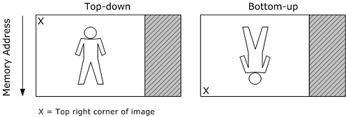

# Image Stride

When a video image is stored in memory, the memory buffer might contain extra padding bytes after each row of pixels. The padding bytes affect how the image is stored in memory, but do not affect how the image is displayed.

The *stride* is the number of bytes from one row of pixels in memory to the next row of pixels in memory. Stride is also called *pitch*. If padding bytes are present, the stride is wider than the width of the image, as shown in the following illustration.


Two buffers that contain video frames with equal dimensions can have two different strides. If you process a video image, you must take the stride into account.

In addition, there are two ways that an image can be arranged in memory. In a *top-down* image, the top row of pixels in the image appears first in memory. In a *bottom-up* image, the last row of pixels appears first in memory. The following illustration shows the difference between a top-down image and a bottom-up image.



A bottom-up image has a negative stride, because stride is defined as the number of bytes need to move down a row of pixels, relative to the displayed image. YUV images should always be top-down, and any image that is contained in a Direct3D surface must be top-down. RGB images in system memory are usually bottom-up.

Video transforms in particular need to handle buffers with mismatched strides, because the input buffer might not match the output buffer. For example, suppose that you want to convert a source image and write the result to a destination image. Assume that both images have the same width and height, but might not have the same pixel format or the same image stride.

The following example code shows a generalized approach for writing this kind of function. This is not a complete working example, because it abstracts many of the specific details.


```C++
void ProcessVideoImage(
    BYTE*       pDestScanLine0,     
    LONG        lDestStride,        
    const BYTE* pSrcScanLine0,      
    LONG        lSrcStride,         
    DWORD       dwWidthInPixels,     
    DWORD       dwHeightInPixels
    )
{
    for (DWORD y = 0; y < dwHeightInPixels; y++)
    {
        SOURCE_PIXEL_TYPE *pSrcPixel = (SOURCE_PIXEL_TYPE*)pSrcScanLine0;
        DEST_PIXEL_TYPE *pDestPixel = (DEST_PIXEL_TYPE*)pDestScanLine0;

        for (DWORD x = 0; x < dwWidthInPixels; x +=2)
        {
            pDestPixel[x] = TransformPixelValue(pSrcPixel[x]);
        }
        pDestScanLine0 += lDestStride;
        pSrcScanLine0 += lSrcStride;
    }
}
```


This function takes six parameters:

-   A pointer to the start of scan line 0 in the destination image.
-   The stride of the destination image.
-   A pointer to the start of scan line 0 in the source image.
-   The stride of the source image.
-   The width of the image in pixels.
-   The height of the image in pixels.

The general idea is to process one row at a time, iterating over each pixel in the row. Assume that SOURCE\_PIXEL\_TYPE and DEST\_PIXEL\_TYPE are structures representing the pixel layout for the source and destination images, respectively. (For example, 32-bit RGB uses the [**RGBQUAD**](/windows/win32/api/wingdi/ns-wingdi-rgbquad) structure. Not every pixel format has a predefined structure.) Casting the array pointer to the structure type enables you to access the RGB or YUV components of each pixel. At the start of each row, the function stores a pointer to the row. At the end of the row, it increments the pointer by the width of the image stride, which advances the pointer to the next row.

This example calls a hypothetical function named TransformPixelValue for each pixel. This could be any function that calculates a target pixel from a source pixel. Of course, the exact details will depend on the particular task. For example, if you have a planar YUV format, you must access the chroma planes independently from the luma plane; with interlaced video, you might need to process the fields separately; and so forth.

To give a more concrete example, the following code converts a 32-bit RGB image into an AYUV image. The RGB pixels are accessed using an [**RGBQUAD**](/windows/win32/api/wingdi/ns-wingdi-rgbquad) structure, and the AYUV pixels are accessed using a [**DXVA2\_AYUVSample8**](/windows/desktop/api/dxva2api/ns-dxva2api-dxva2_ayuvsample8) structure structure.


```C++
//-------------------------------------------------------------------
// Name: RGB32_To_AYUV
// Description: Converts an image from RGB32 to AYUV
//-------------------------------------------------------------------
void RGB32_To_AYUV(
    BYTE*       pDest,
    LONG        lDestStride,
    const BYTE* pSrc,
    LONG        lSrcStride,
    DWORD       dwWidthInPixels,
    DWORD       dwHeightInPixels
    )
{
    for (DWORD y = 0; y < dwHeightInPixels; y++)
    {
        RGBQUAD             *pSrcPixel = (RGBQUAD*)pSrc;
        DXVA2_AYUVSample8   *pDestPixel = (DXVA2_AYUVSample8*)pDest;
        
        for (DWORD x = 0; x < dwWidthInPixels; x++)
        {
            pDestPixel[x].Alpha = 0x80;
            pDestPixel[x].Y = RGBtoY(pSrcPixel[x]);   
            pDestPixel[x].Cb = RGBtoU(pSrcPixel[x]);   
            pDestPixel[x].Cr = RGBtoV(pSrcPixel[x]);   
        }
        pDest += lDestStride;
        pSrc += lSrcStride;
    }
}
```


The next example converts a 32-bit RGB image to a YV12 image. This example shows how to handle a planar YUV format. (YV12 is a planar 4:2:0 format.) In this example, the function maintains three separate pointers for the three planes in the target image. However, the basic approach is the same as the previous example.


```C++
void RGB32_To_YV12(
    BYTE*       pDest,
    LONG        lDestStride,
    const BYTE* pSrc,
    LONG        lSrcStride,
    DWORD       dwWidthInPixels,
    DWORD       dwHeightInPixels
    )
{
    assert(dwWidthInPixels % 2 == 0);
    assert(dwHeightInPixels % 2 == 0);

    const BYTE *pSrcRow = pSrc;
    
    BYTE *pDestY = pDest;

    // Calculate the offsets for the V and U planes.

    // In YV12, each chroma plane has half the stride and half the height  
    // as the Y plane.
    BYTE *pDestV = pDest + (lDestStride * dwHeightInPixels);
    BYTE *pDestU = pDest + 
                   (lDestStride * dwHeightInPixels) + 
                   ((lDestStride * dwHeightInPixels) / 4);

    // Convert the Y plane.
    for (DWORD y = 0; y < dwHeightInPixels; y++)
    {
        RGBQUAD *pSrcPixel = (RGBQUAD*)pSrcRow;
        
        for (DWORD x = 0; x < dwWidthInPixels; x++)
        {
            pDestY[x] = RGBtoY(pSrcPixel[x]);    // Y0
        }
        pDestY += lDestStride;
        pSrcRow += lSrcStride;
    }

    // Convert the V and U planes.

    // YV12 is a 4:2:0 format, so each chroma sample is derived from four 
    // RGB pixels.
    pSrcRow = pSrc;
    for (DWORD y = 0; y < dwHeightInPixels; y += 2)
    {
        RGBQUAD *pSrcPixel = (RGBQUAD*)pSrcRow;
        RGBQUAD *pNextSrcRow = (RGBQUAD*)(pSrcRow + lSrcStride);

        BYTE *pbV = pDestV;
        BYTE *pbU = pDestU;

        for (DWORD x = 0; x < dwWidthInPixels; x += 2)
        {
            // Use a simple average to downsample the chroma.

            *pbV++ = ( RGBtoV(pSrcPixel[x]) +
                       RGBtoV(pSrcPixel[x + 1]) +       
                       RGBtoV(pNextSrcRow[x]) +         
                       RGBtoV(pNextSrcRow[x + 1]) ) / 4;        

            *pbU++ = ( RGBtoU(pSrcPixel[x]) +
                       RGBtoU(pSrcPixel[x + 1]) +       
                       RGBtoU(pNextSrcRow[x]) +         
                       RGBtoU(pNextSrcRow[x + 1]) ) / 4;    
        }
        pDestV += lDestStride / 2;
        pDestU += lDestStride / 2;
        
        // Skip two lines on the source image.
        pSrcRow += (lSrcStride * 2);
    }
}
```


In all of these examples, it is assumed that the application has already determined the image stride. You can sometimes get this information from the media buffer. Otherwise, you must calculate it based on the video format. For more information about calculating image stride and working with media buffers for video, see [Uncompressed Video Buffers](uncompressed-video-buffers.md).

## Related topics

<dl> <dt>

[Video Media Types](video-media-types.md)
</dt> <dt>

[Media Types](media-types.md)
</dt> </dl>

 

 
