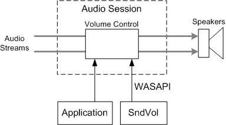
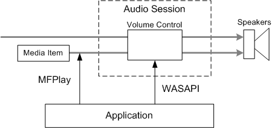

# Managing the Audio Session

\[MFPlay is available for use in the operating systems specified in the Requirements section. It may be altered or unavailable in subsequent versions. \]

This topic describes how to control audio volume when using MFPlay for audio/video playback.

MFPlay provides the following methods to control the audio volume during playback.


| Method                                                            | Description                                           |
|-------------------------------------------------------------------|-------------------------------------------------------|
| [**IMFPMediaPlayer::SetBalance**](/windows/desktop/api/mfplay/nf-mfplay-imfpmediaplayer-setbalance) | Sets the balance between the left and right channels. |
| [**IMFPMediaPlayer::SetMute**](/windows/desktop/api/mfplay/nf-mfplay-imfpmediaplayer-setmute)       | Mutes or unmutes the audio.                           |
| [**IMFPMediaPlayer::SetVolume**](/windows/desktop/api/mfplay/nf-mfplay-imfpmediaplayer-setvolume)   | Sets the volume level.                                |


 

To understand the behavior of these methods, you must know some terminology from the Windows Audio Session API (WASAPI), which implements the low-level audio functionality used by MFPlay.

In WASAPI, every audio stream belongs to exactly one *audio session*, which is a group of related audio streams. Typically, an application maintains a single audio session, although applications can create more than one session. The system volume-control program (Sndvol) displays a volume control for each audio session. Through Sndvol, a user can adjust the volume of an audio session from outside of the application. The following image illustrates this process.



In MFPlay, a media item can have one or more active audio streams (typically only one). Internally, MFPlay uses the [Streaming Audio Renderer](streaming-audio-renderer.md) (SAR) to render the audio streams. Unless you configure it otherwise, the SAR joins the application's default audio session.

The MFPlay audio methods control only the streams that belong to the current media item. They do not affect the volume for any other streams that belong to the same audio session. In terms of WASAPI, the MFPlay methods control the *per-channel* volume levels, not the master volume level. The following image illustrates this process.



It is important to understand some implications of this feature of MFPlay. First, an application can adjust the playback volume without affecting other audio streams. You could use this feature if MFPlay to implement audio cross-fading, by creating two instances of the MFPlay object and adjusting the volume separately.

If you use MFPlay methods to change the volume or mute state, the changes do not appear in Sndvol. For example, you can call [**SetMute**](/windows/desktop/api/mfplay/nf-mfplay-imfpmediaplayer-setmute) to mute the audio, but Sndvol will not show the session as muted. Conversely, if SndVol is used to adjust the session volume, the changes are not reflected in the values returned by [**IMFPMediaPlayer::GetVolume**](/windows/desktop/api/mfplay/nf-mfplay-imfpmediaplayer-getvolume) or [**IMFPMediaPlayer::GetMute**](/windows/desktop/api/mfplay/nf-mfplay-imfpmediaplayer-getmute).

For each instance of the MFPlay player object, the effective volume level equals *fPlayerVolume* × *fSessionVolume*, where *fPlayerVolume* is the value returned by [**GetVolume**](/windows/desktop/api/mfplay/nf-mfplay-imfpmediaplayer-getvolume), and *fSessionVolume* is the master volume for the session.

For simple playback scenarios, it might be preferable to use the WASAPI to control the audio volume for the entire session, rather than use the MFPlay methods.

## Example Code

What follows is a C++ class that handles the basic tasks in WASAPI:

-   Controlling the volume and mute state for the session.
-   Getting notifications whenever the volume or mute state change.

### Class Declaration

The `CAudioSessionVolume` class declaration implements the [**IAudioSessionEvents**](/windows/win32/api/audiopolicy/nn-audiopolicy-iaudiosessionevents) interface, which is the callback interface for audio session events.


```C++
class CAudioSessionVolume : public IAudioSessionEvents
{
public:
    // Static method to create an instance of the object.
    static HRESULT CreateInstance(
        UINT uNotificationMessage,
        HWND hwndNotification,
        CAudioSessionVolume **ppAudioSessionVolume
    );

    // IUnknown methods.
    STDMETHODIMP QueryInterface(REFIID iid, void** ppv);
    STDMETHODIMP_(ULONG) AddRef();
    STDMETHODIMP_(ULONG) Release();

    // IAudioSessionEvents methods.

    STDMETHODIMP OnSimpleVolumeChanged(
        float NewVolume,
        BOOL NewMute,
        LPCGUID EventContext
        );

    // The remaining audio session events do not require any action.
    STDMETHODIMP OnDisplayNameChanged(LPCWSTR,LPCGUID)
    {
        return S_OK;
    }

    STDMETHODIMP OnIconPathChanged(LPCWSTR,LPCGUID)
    {
        return S_OK;
    }

    STDMETHODIMP OnChannelVolumeChanged(DWORD,float[],DWORD,LPCGUID)
    {
        return S_OK;
    }

    STDMETHODIMP OnGroupingParamChanged(LPCGUID,LPCGUID)
    {
        return S_OK;
    }

    STDMETHODIMP OnStateChanged(AudioSessionState)
    {
        return S_OK;
    }

    STDMETHODIMP OnSessionDisconnected(AudioSessionDisconnectReason)
    {
        return S_OK;
    }

    // Other methods
    HRESULT EnableNotifications(BOOL bEnable);
    HRESULT GetVolume(float *pflVolume);
    HRESULT SetVolume(float flVolume);
    HRESULT GetMute(BOOL *pbMute);
    HRESULT SetMute(BOOL bMute);
    HRESULT SetDisplayName(const WCHAR *wszName);

protected:
    CAudioSessionVolume(UINT uNotificationMessage, HWND hwndNotification);
    ~CAudioSessionVolume();

    HRESULT Initialize();

protected:
    LONG m_cRef;                        // Reference count.
    UINT m_uNotificationMessage;        // Window message to send when an audio event occurs.
    HWND m_hwndNotification;            // Window to receives messages.
    BOOL m_bNotificationsEnabled;       // Are audio notifications enabled?

    IAudioSessionControl    *m_pAudioSession;
    ISimpleAudioVolume      *m_pSimpleAudioVolume;
};
```


When the `CAudioSessionVolume` object receives an audio session event, it posts a private window message to the application. The window handle and the window message are given as parameters to the static `CAudioSessionVolume::CreateInstance` method.

### Getting the WASAPI Interface Pointers

`CAudioSessionVolume` uses two main WASAPI interfaces:

-   [**IAudioSessionControl**](/windows/win32/api/audiopolicy/nn-audiopolicy-iaudiosessioncontrol) manages the audio session.
-   [**ISimpleAudioVolume**](/windows/win32/api/audioclient/nn-audioclient-isimpleaudiovolume) controls the volume level and mute state of the session.

To get these interfaces, you must enumerate the audio endpoint that is used by the SAR. An *audio endpoint* is a hardware device that captures or consumes audio data. For audio playback, an endpoint is simply a speaker or other audio output. By default, the SAR uses the default endpoint for the **eConsole** device role. A *device role* is an assigned role for an endpoint. Device roles are specified by the [**ERole**](/windows/win32/api/mmdeviceapi/ne-mmdeviceapi-erole) enumeration, which is documented in [Core Audio APIs](../coreaudio/core-audio-apis-in-windows-vista.md).

The following code shows how to enumerate the endpoint and get the WASAPI interfaces.


```C++
HRESULT CAudioSessionVolume::Initialize()
{
    HRESULT hr = S_OK;

    IMMDeviceEnumerator *pDeviceEnumerator = NULL;
    IMMDevice *pDevice = NULL;
    IAudioSessionManager *pAudioSessionManager = NULL;

    // Get the enumerator for the audio endpoint devices.
    hr = CoCreateInstance(
        __uuidof(MMDeviceEnumerator),
        NULL,
        CLSCTX_INPROC_SERVER,
        IID_PPV_ARGS(&pDeviceEnumerator)
        );

    if (FAILED(hr))
    {
        goto done;
    }

    // Get the default audio endpoint that the SAR will use.
    hr = pDeviceEnumerator->GetDefaultAudioEndpoint(
        eRender,
        eConsole,   // The SAR uses 'eConsole' by default.
        &pDevice
        );

    if (FAILED(hr))
    {
        goto done;
    }

    // Get the session manager for this device.
    hr = pDevice->Activate(
        __uuidof(IAudioSessionManager),
        CLSCTX_INPROC_SERVER,
        NULL,
        (void**) &pAudioSessionManager
        );

    if (FAILED(hr))
    {
        goto done;
    }

    // Get the audio session.
    hr = pAudioSessionManager->GetAudioSessionControl(
        &GUID_NULL,     // Get the default audio session.
        FALSE,          // The session is not cross-process.
        &m_pAudioSession
        );


    if (FAILED(hr))
    {
        goto done;
    }

    hr = pAudioSessionManager->GetSimpleAudioVolume(
        &GUID_NULL, 0, &m_pSimpleAudioVolume
        );

done:
    SafeRelease(&pDeviceEnumerator);
    SafeRelease(&pDevice);
    SafeRelease(&pAudioSessionManager);
    return hr;
}
```


### Controlling the Volume

The `CAudioSessionVolume` methods that control the audio volume call the equivalent [**ISimpleAudioVolume**](/windows/win32/api/audioclient/nn-audioclient-isimpleaudiovolume) methods. For example, `CAudioSessionVolume::SetVolume` calls [**ISimpleAudioVolume::SetMasterVolume**](/windows/win32/api/audioclient/nf-audioclient-isimpleaudiovolume-setmastervolume), as shown in the following code.


```C++
HRESULT CAudioSessionVolume::SetVolume(float flVolume)
{
    if (m_pSimpleAudioVolume == NULL)
    {
        return E_FAIL;
    }
    else
    {
        return m_pSimpleAudioVolume->SetMasterVolume(
            flVolume,
            &AudioSessionVolumeCtx  // Event context.
            );
    }
}
```


## Complete CAudioSessionVolume Code

Here is the complete listing for the methods of the `CAudioSessionVolume` class.


```C++
static const GUID AudioSessionVolumeCtx =
{ 0x2715279f, 0x4139, 0x4ba0, { 0x9c, 0xb1, 0xb3, 0x51, 0xf1, 0xb5, 0x8a, 0x4a } };


CAudioSessionVolume::CAudioSessionVolume(
    UINT uNotificationMessage,
    HWND hwndNotification
    )
    : m_cRef(1),
      m_uNotificationMessage(uNotificationMessage),
      m_hwndNotification(hwndNotification),
      m_bNotificationsEnabled(FALSE),
      m_pAudioSession(NULL),
      m_pSimpleAudioVolume(NULL)
{
}

CAudioSessionVolume::~CAudioSessionVolume()
{
    EnableNotifications(FALSE);

    SafeRelease(&m_pAudioSession);
    SafeRelease(&m_pSimpleAudioVolume);
};


//  Creates an instance of the CAudioSessionVolume object.

/* static */
HRESULT CAudioSessionVolume::CreateInstance(
    UINT uNotificationMessage,
    HWND hwndNotification,
    CAudioSessionVolume **ppAudioSessionVolume
    )
{

    CAudioSessionVolume *pAudioSessionVolume = new (std::nothrow)
        CAudioSessionVolume(uNotificationMessage, hwndNotification);

    if (pAudioSessionVolume == NULL)
    {
        return E_OUTOFMEMORY;
    }

    HRESULT hr = pAudioSessionVolume->Initialize();
    if (SUCCEEDED(hr))
    {
        *ppAudioSessionVolume = pAudioSessionVolume;
    }
    else
    {
        pAudioSessionVolume->Release();
    }

    return hr;
}


//  Initializes the CAudioSessionVolume object.

HRESULT CAudioSessionVolume::Initialize()
{
    HRESULT hr = S_OK;

    IMMDeviceEnumerator *pDeviceEnumerator = NULL;
    IMMDevice *pDevice = NULL;
    IAudioSessionManager *pAudioSessionManager = NULL;

    // Get the enumerator for the audio endpoint devices.
    hr = CoCreateInstance(
        __uuidof(MMDeviceEnumerator),
        NULL,
        CLSCTX_INPROC_SERVER,
        IID_PPV_ARGS(&pDeviceEnumerator)
        );

    if (FAILED(hr))
    {
        goto done;
    }

    // Get the default audio endpoint that the SAR will use.
    hr = pDeviceEnumerator->GetDefaultAudioEndpoint(
        eRender,
        eConsole,   // The SAR uses 'eConsole' by default.
        &pDevice
        );

    if (FAILED(hr))
    {
        goto done;
    }

    // Get the session manager for this device.
    hr = pDevice->Activate(
        __uuidof(IAudioSessionManager),
        CLSCTX_INPROC_SERVER,
        NULL,
        (void**) &pAudioSessionManager
        );

    if (FAILED(hr))
    {
        goto done;
    }

    // Get the audio session.
    hr = pAudioSessionManager->GetAudioSessionControl(
        &GUID_NULL,     // Get the default audio session.
        FALSE,          // The session is not cross-process.
        &m_pAudioSession
        );


    if (FAILED(hr))
    {
        goto done;
    }

    hr = pAudioSessionManager->GetSimpleAudioVolume(
        &GUID_NULL, 0, &m_pSimpleAudioVolume
        );

done:
    SafeRelease(&pDeviceEnumerator);
    SafeRelease(&pDevice);
    SafeRelease(&pAudioSessionManager);
    return hr;
}

STDMETHODIMP CAudioSessionVolume::QueryInterface(REFIID riid, void **ppv)
{
    static const QITAB qit[] =
    {
        QITABENT(CAudioSessionVolume, IAudioSessionEvents),
        { 0 },
    };
    return QISearch(this, qit, riid, ppv);
}

STDMETHODIMP_(ULONG) CAudioSessionVolume::AddRef()
{
    return InterlockedIncrement(&m_cRef);
}

STDMETHODIMP_(ULONG) CAudioSessionVolume::Release()
{
    LONG cRef = InterlockedDecrement( &m_cRef );
    if (cRef == 0)
    {
        delete this;
    }
    return cRef;
}


// Enables or disables notifications from the audio session. For example, the
// application is notified if the user mutes the audio through the system
// volume-control program (Sndvol).

HRESULT CAudioSessionVolume::EnableNotifications(BOOL bEnable)
{
    HRESULT hr = S_OK;

    if (m_hwndNotification == NULL || m_pAudioSession == NULL)
    {
        return E_FAIL;
    }

    if (m_bNotificationsEnabled == bEnable)
    {
        // No change.
        return S_OK;
    }

    if (bEnable)
    {
        hr = m_pAudioSession->RegisterAudioSessionNotification(this);
    }
    else
    {
        hr = m_pAudioSession->UnregisterAudioSessionNotification(this);
    }

    if (SUCCEEDED(hr))
    {
        m_bNotificationsEnabled = bEnable;
    }

    return hr;
}


// Gets the session volume level.

HRESULT CAudioSessionVolume::GetVolume(float *pflVolume)
{
    if ( m_pSimpleAudioVolume == NULL)
    {
        return E_FAIL;
    }
    else
    {
        return m_pSimpleAudioVolume->GetMasterVolume(pflVolume);
    }
}

//  Sets the session volume level.
//
//  flVolume: Ranges from 0 (silent) to 1 (full volume)

HRESULT CAudioSessionVolume::SetVolume(float flVolume)
{
    if (m_pSimpleAudioVolume == NULL)
    {
        return E_FAIL;
    }
    else
    {
        return m_pSimpleAudioVolume->SetMasterVolume(
            flVolume,
            &AudioSessionVolumeCtx  // Event context.
            );
    }
}


//  Gets the muting state of the session.

HRESULT CAudioSessionVolume::GetMute(BOOL *pbMute)
{
    if (m_pSimpleAudioVolume == NULL)
    {
        return E_FAIL;
    }
    else
    {
        return m_pSimpleAudioVolume->GetMute(pbMute);
    }
}

//  Mutes or unmutes the session audio.

HRESULT CAudioSessionVolume::SetMute(BOOL bMute)
{
    if (m_pSimpleAudioVolume == NULL)
    {
        return E_FAIL;
    }
    else
    {
        return m_pSimpleAudioVolume->SetMute(
            bMute,
            &AudioSessionVolumeCtx  // Event context.
            );
    }
}

//  Sets the display name for the session audio.

HRESULT CAudioSessionVolume::SetDisplayName(const WCHAR *wszName)
{
    if (m_pAudioSession == NULL)
    {
        return E_FAIL;
    }
    else
    {
        return m_pAudioSession->SetDisplayName(wszName, NULL);
    }
}


//  Called when the session volume level or muting state changes.
//  (Implements IAudioSessionEvents::OnSimpleVolumeChanged.)

HRESULT CAudioSessionVolume::OnSimpleVolumeChanged(
    float NewVolume,
    BOOL NewMute,
    LPCGUID EventContext
    )
{
    // Check if we should post a message to the application.

    if ( m_bNotificationsEnabled &&
        (*EventContext != AudioSessionVolumeCtx) &&
        (m_hwndNotification != NULL)
        )
    {
        // Notifications are enabled, AND
        // We did not trigger the event ourselves, AND
        // We have a valid window handle.

        // Post the message.
        ::PostMessage(
            m_hwndNotification,
            m_uNotificationMessage,
            *((WPARAM*)(&NewVolume)),  // Coerce the float.
            (LPARAM)NewMute
            );
    }
    return S_OK;
}
```


## Requirements

MFPlay requires Windows 7.

## Related topics

<dl> <dt>

[Using MFPlay for Audio/Video Playback](using-mfplay-for-audio-video-playback.md)
</dt> </dl>

 

 
