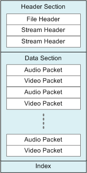
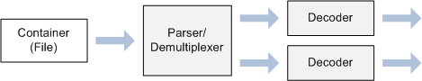
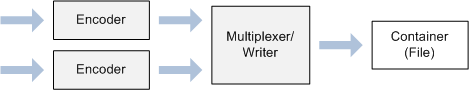

# Media Foundation: Essential Concepts

If you are new to digital media, this topic introduces some concepts that you will need to understand before writing a Media Foundation application.

-   [Streams](#streams)
-   [Compression](#compression)
-   [Media Containers](#media-containers)
-   [Formats](#formats)
-   [Related topics](#related-topics)

## Streams

A *stream* is a sequence of media data with a uniform type. The most common types are audio and video, but a stream can contain almost any kind of data, including text, script commands, and still images. The term *stream* in this documentation does not imply delivery over a network. A media file intended for local playback also contains streams.

Usually, a media file contains either a single audio stream, or exactly one video stream and one audio stream. However, a media file might contain several streams of the same type. For example, a video file might contain audio streams in several different languages. At run time, the application would select which stream to use.

## Compression

*Compression* refers to any process that reduces the size of a data stream by removing redundant information. Compression algorithms fall into two broad categories:

-   *Lossless* compression. Using a lossless algorithm, the reconstructed data is identical to the original.
-   *Lossy* compression. Using a lossy algorithm, the reconstructed data is an approximation of the original, but is not an exact match.

In most other domains, lossy compression is not acceptable. (Imagine getting back an "approximation" of a spreadsheet!) But lossy compression schemes are well-suited to audio and video, for a couple of reasons.

The first reason has to do with the physics of human perception. When we listen to a complex sound, like a music recording, some of the information contained in that sound is not perceptible to the ear. With the help of signal processing theory, it is possible to analyze and separate the frequencies that cannot be perceived. These frequencies can be removed with no perceptual effect. Although the reconstructed audio will not match the original exactly, it will *sound* the same to the listener. Similar principles apply to video.

Second, some degradation in sound or image quality may be acceptable, depending on the intended purpose. In telephony, for example, audio is often highly compressed. The result is good enough for a phone conversation—but you wouldn't want to listen to a symphony orchestra over a telephone.

Compression is also called *encoding*, and a device that encodes is called an *encoder*. The reverse process is *decoding*, and the device is a naturally called a *decoder*. The general term for both encoders and decoders is *codec*. Codecs can be implemented in hardware or software.

Compression technology has changed rapidly since the advent of digital media, and a large number of compression schemes are in use today. This fact is one of the main challenges for digital media programming.

## Media Containers

It is rare to store a raw audio or video stream as a computer file, or to send one directly over the network. For one thing, it would be impossible to decode such a stream, without knowing in advance which codec to use. Therefore, media files usually contain at least some of the following elements:

-   File headers that describe the number of streams, the format of each stream, and so on.
-   An index that enables random access to the content.
-   Metadata that describes the content (for example, the artist or title).
-   Packet headers, to enable network transmission or random access.

This documentation uses the term *container* to describe the entire package of streams, headers, indexes, metadata, and so forth. The reason for using the term *container* rather than *file* is that some container formats are designed for live broadcast. An application could generate the container in real time, never storing it to a file.

An early example of a media container is the AVI file format. Other examples include MP4 and Advanced Systems Format (ASF). Containers can be identified by file name extension (for example, .mp4) or by MIME type.

The following diagram shows a typical structure for a media container. The diagram does not represent any specific format; the details of each format vary widely.

Notice that the structure shown in the diagram is hierarchical, with header information appearing at the start of the container. This structure is typical of many (but not all) container formats. Also notice that the data section contains interleaved audio and video packets. This type of interleaving is common in media containers.

The term *multiplexing* refers to the process of packetizing the audio and video streams and interleaving the packets into the container. The reverse process, reassembling the streams from the packetized data, is called *demultiplexing*.

## Formats

In digital media, the term *format* is ambiguous. A format can refer to the type of *encoding*, such as H.264 video, or the *container*, such as MP4. This distinction is often confusing for ordinary users. The names given to media formats do not always help. For example, *MP3* refers both to an encoding format (MPEG-1 Audio Layer 3) and a file format.

The distinction is important, however, because reading a media file actually involves two stages:

1.  First, the container must be parsed. In most cases, the number of streams and the format of each stream cannot be known until this step is complete.
2.  Next, if the streams are compressed, they must be decoded using the appropriate decoders.

This fact leads quite naturally to a software design where separate components are used to parse containers and decode streams. Further, this approach lends itself to a plug-in model, so that third parties can provide their own parsers and codecs. On Windows, the Component Object Model (COM) provides a standard way to separate an API from its implementation, which is a requirement for any plug-in model. For this reason (among others), Media Foundation uses COM interfaces.

The following diagram shows the components used to read a media file:

Writing a media file also requires two steps:

1.  Encoding the uncompressed audio/video data.
2.  Putting the compressed data into a particular container format.

The following diagram shows the components used to write a media file:

## Related topics

<dl> <dt>

[Media Foundation Programming Guide](media-foundation-programming-guide.md)
</dt> </dl>

 

 

