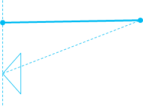

# MF\_MT\_DEPTH\_MEASUREMENT attribute

\[Some information relates to pre-released product which may be substantially modified before it's commercially released. Microsoft makes no warranties, express or implied, with respect to the information provided here.\]

A value that defines the measurement system for a depth value in a video frame.

## Data type

**UINT32**

## Remarks

This value is a member of the [**\_MFDepthMeasurement**](/windows/win32/api/mfapi/ne-mfapi-mfdepthmeasurement) enumeration

If this attribute is not present it is assumed to be **DistanceToFocalPlane**. The distance to focal plane is typically easier to consume in a 3D Euclidian coordinate system.

The distance to focal center format is typically raw data from sensor such as time of flight cameras.

Depth cameras cannot sense the depth of all pixels. When the confidence of a pixel is low, because of material, occlusion, or out of range etc, the depth value on that pixel can be invalid.

When a depth pixel value is 0, the pixel is invalid.

Some depth cameras attach bitmask metadata for each pixel in addition to the depth value to represent the reason why the depth of pixel is invalid, due to material, occlusion or out of range etc. We recommend that you avoid attaching such metadata as bits in depth value, because it will typically lead to difficulty when using such values in pixel shader. Instead. we recommend that you use a separate 8bit image buffer with same resolution and attach it as attribute of the [**IMFSample**](/windows/desktop/api/mfobjects/nn-mfobjects-imfsample). Such metadata varies for each camera vendor and is not standardized by the platform. We recommend using full 16 bits for the depth value for easier processing downstream and using a fixed value such as 0 for invalidation.

## Requirements

| Requirement | Value |
|-------------------------------------|------------------------------------------------------------------------------------|
| Minimum supported client  | Windows 10, version 1709 \[desktop apps only\]                           |
| Minimum supported server  | Windows Server, version 1709 \[desktop apps only\]                       |
| Header                    | <dl> <dt>Mfapi.h</dt> </dl> |

 

 

