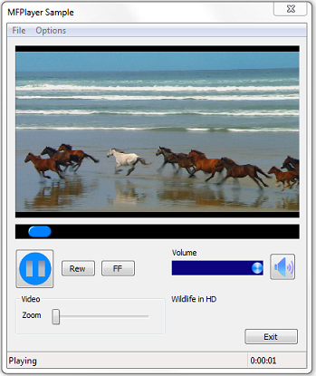

# MFPlayer2 Sample

> [!IMPORTANT]
> Deprecated. This API may be removed from future releases of Windows. Applications should use the [Media Session](media-session.md) for playback.

 

Demonstrates some of the playback features that are omitted from the [SimplePlay](simpleplay-sample.md) sample, such as:

-   Seeking
-   Rate control (fast forward and rewind)
-   Audio volume and mute controls
-   Video zoom

The following image shows the controls used for these features.

## APIs Demonstrated

This sample demonstrates the following APIs.

-   [**IAudioSessionControl**](/windows/win32/api/audiopolicy/nn-audiopolicy-iaudiosessioncontrol)
-   [**IAudioSessionManager**](/windows/win32/api/audiopolicy/nn-audiopolicy-iaudiosessionmanager)
-   [**IMFPMediaItem**](/windows/desktop/api/mfplay/nn-mfplay-imfpmediaitem)
-   [**IMFPMediaPlayer**](/windows/desktop/api/mfplay/nn-mfplay-imfpmediaplayer)
-   [**IMFPMediaPlayerCallback**](/windows/desktop/api/mfplay/nn-mfplay-imfpmediaplayercallback)
-   [**IMMDevice**](/windows/win32/api/mmdeviceapi/nn-mmdeviceapi-immdevice)
-   [**IMMDeviceEnumerator**](/windows/win32/api/mmdeviceapi/nn-mmdeviceapi-immdeviceenumerator)
-   [**ISimpleAudioVolume**](/windows/win32/api/audioclient/nn-audioclient-isimpleaudiovolume)

## Requirements

| Product                                                        | Version   |
|----------------------------------------------------------------|-----------|
| [Windows SDK](https://msdn.microsoft.com/windowsvista/bb980924.aspx) | Windows 7 |

 

## Downloading the Sample

This sample is available in the [Windows classic samples github repository](https://github.com/Microsoft/Windows-classic-samples/tree/master/Samples/Win7Samples/multimedia/mediafoundation/MFPlayer2).

## Related topics

<dl> <dt>

[Media Foundation SDK Samples](media-foundation-sdk-samples.md)
</dt> <dt>

[Using MFPlay for Audio/Video Playback](using-mfplay-for-audio-video-playback.md)
</dt> </dl>

 

 
