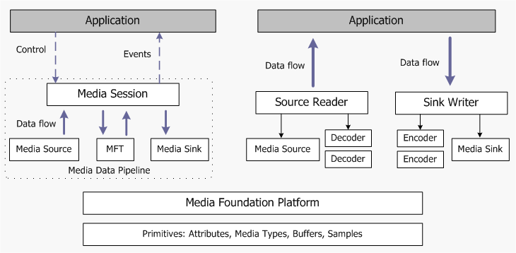

# Overview of the Media Foundation Architecture

This topic describes the general design of Microsoft Media Foundation. For information about using Media Foundation for specific programming tasks, see [Media Foundation Programming Guide](media-foundation-programming-guide.md).

The following diagram shows a high-level view of the Media Foundation architecture.

Media Foundation provides two distinct programming models. The first model, shown on the left side of the diagram, uses an end-to-end pipeline for media data. The application initializes the pipeline—for example, by providing the URL of a file to play—and then calls methods to control streaming. In the second model, shown on the right side of the diagram, the application either pulls data from a source, or pushes it to a destination (or both). This model is particularly useful if you need to process the data, because the application has direct access to the data stream.

### Primitives and Platform

Starting from the bottom of the diagram, the *primitives* are helper objects used throughout the Media Foundation API:

-   [Attributes](attributes-and-properties.md) are a generic way to store information inside an object, as a list of key/value pairs.
-   [Media Types](media-types.md) describe the format of a media data stream.
-   [Media Buffers](media-buffers.md) hold chunks of media data, such as video frames and audio samples, and are used to transport data between objects.
-   [Media Samples](media-samples.md) are containers for media buffers. They also contain metadata about the buffers, such as time stamps.

The [Media Foundation Platform APIs](media-foundation-platform-apis.md) provide some core functionality that is used by the Media Foundation pipeline, such as asynchronous callbacks and work queues. Certain applications might need to call these APIs directly; also, you will need them if you implement a custom source, transform, or sink for Media Foundation.

### Media Pipeline

The media pipeline contains three types of object that generate or process media data:

-   [Media Sources](media-sources.md) introduce data into the pipeline. A media source might get data from a local file, such as a video file; from a network stream; or from a hardware capture device.
-   [Media Foundation Transforms](media-foundation-transforms.md) (MFTs) process data from a stream. Encoders and decoders are implemented as MFTs.
-   [Media Sinks](media-sinks.md) consume the data; for example, by showing video on the display, playing audio, or writing the data to a media file.

Third parties can implement their own custom sources, sinks, and MFTs; for example, to support new media file formats.

The [Media Session](media-session.md) controls the flow of data through the pipeline, and handles tasks such as quality control, audio/video synchronization, and responding to format changes.

### Source Reader and Sink Writer

The [Source Reader](source-reader.md) and [Sink Writer](sink-writer.md) provide an alternative way to use the basic Media Foundation components (media sources, transforms, and media sinks). The source reader hosts a media source and zero or more decoders, while the sink writer hosts a media sink and zero or more encoders. You can use the source reader to get compressed or uncompressed data from a media source, and use the sink writer to encode data and send the data to a media sink.

> [!Note]  
> The source reader and sink writer are available in Windows 7.

 

This programming model gives the application more control over the flow of data, and also gives the application direct access to the data from the source.

## Related topics

<dl> <dt>

[Media Foundation: Essential Concepts](media-foundation-programming--essential-concepts.md)
</dt> <dt>

[Media Foundation Architecture](media-foundation-architecture.md)
</dt> </dl>

 

 

