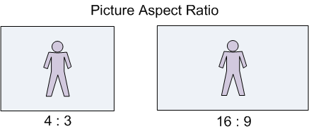
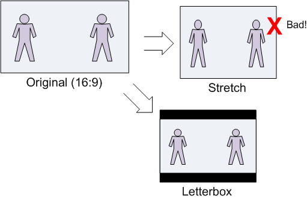
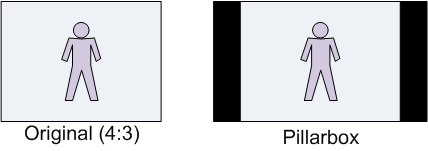
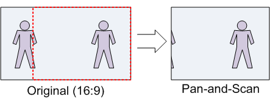
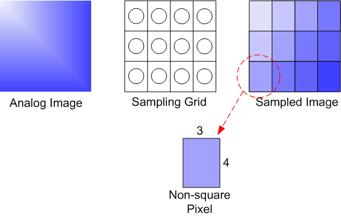

# Picture Aspect Ratio

This topic describes two related concepts, picture aspect ratio and pixel aspect ratio. It then describes how these concepts are expressed in Microsoft Media Foundation using media types.

-   [Picture Aspect Ratio](#picture-aspect-ratio)
    -   [Letterboxing](#letterboxing)
    -   [Pan-and-Scan](#pan-and-scan)
-   [Pixel Aspect Ratio](#pixel-aspect-ratio)
-   [Working with Aspect Ratios](#working-with-aspect-ratios)
-   [Code Examples](#code-examples)
    -   [Finding the Display Area](#finding-the-display-area)
    -   [Converting Between Pixel Aspect Ratios](#converting-between-pixel-aspect-ratios)
    -   [Calculating the Letterbox Area](#calculating-the-letterbox-area)
-   [Related topics](#related-topics)

## Picture Aspect Ratio

*Picture aspect ratio* defines the shape of the displayed video image. Picture aspect ratio is notated X:Y, where X:Y is the ratio of picture width to picture height. Most video standards use either 4:3 or 16:9 picture aspect ratio. The 16:9 aspect ratio is commonly called *widescreen*. Cinema film often uses a 1:85:1 or 1:66:1 aspect ratio. Picture aspect ratio is also called *display aspect ratio* (DAR).



Sometimes the video image does not have the same shape as the display area. For example, a 4:3 video might be shown on a widescreen (16×9) television. In computer video, the video might be shown inside a window that has an arbitrary size. In that case, there are three ways the image can be made to fit within the display area:

-   Stretch the image along one axis to fit the display area.
-   Scale the image to fit the display area, while maintaining the original picture aspect ratio.
-   Crop the image.

Stretching the image to fit the display area is almost always wrong, because it does not preserve the correct picture aspect ratio.

### Letterboxing

The process of scaling a widescreen image to fit a 4:3 display is called *letterboxing*, shown in the next diagram. The resulting rectanglular areas at the top and bottom of the image are typically filled with black, although other colors can be used.



The reverse case, scaling a 4:3 image to fit a widescreen display, is sometimes called *pillarboxing*. However, the term *letterbox* is also used in a general sense, to mean scaling a video image to fit any given display area.



### Pan-and-Scan

Pan-and-scan is a technique whereby a widescreen image is cropped to a 4×3 rectangular area, for display on a 4:3 display device. The resulting image fills the entire display, without requiring black letterbox areas, but portions of the original image are cropped out of the picture. The area that is cropped can move from frame to frame, as the area of interest shifts. The term "pan" in *pan-and-scan* refers to the panning effect that is caused by moving the pan-and-scan area.



## Pixel Aspect Ratio

*Pixel aspect ratio* (PAR) measures the shape of a pixel.

When a digital image is captured, the image is sampled both vertically and horizontally, resulting in a rectangular array of quantized samples, called *pixels* or *pels*. The shape of the sampling grid determines the shape of the pixels in the digitized image.

Here is an example that uses small numbers to keep the math simple. Suppose that the original image is square (that is, the picture aspect ratio is 1:1); and suppose the sampling grid contains 12 elements, arranged in a 4×3 grid. The shape of each resulting pixel will be taller than it is wide. Specifically, the shape of each pixel will be 3×4. Pixels that are not square are called *non-square pixels*.



Pixel aspect ratio also applies to the display device. The physical shape of the display device and the physical pixel resolution (across and down) determine the PAR of the display device. Computer monitors generally use square pixels. If the image PAR and the display PAR do not match, the image must be scaled in one dimension, either vertically or horizontally, in order to display correctly. The following formula relates PAR, display aspect ratio (DAR), and image size in pixels:

*DAR* = (*image width in pixels* / *image height in pixels*) × *PAR*

Note that image width and image height in this formula refer to the image in memory, not the displayed image.

Here is a real-world example: NTSC-M analog video contains 480 scan lines in the active image area. ITU-R Rec. BT.601 specifies a horizontal sampling rate of 704 visible pixels per line, yielding a digital image with 704 x 480 pixels. The intended picture aspect ratio is 4:3, yielding a PAR of 10:11.

-   DAR: 4:3
-   Width in pixels: 704
-   Height in pixels: 480
-   PAR: 10/11

4/3 = (704/420) x (10/11)

To display this image correctly on a display device with square pixels, you must scale either the width by 10/11 or the height by 11/10.

## Working with Aspect Ratios

The correct shape of a video frame is defined by the *pixel aspect ratio* (PAR) and the *display area*.

-   The PAR defines the shape of the pixels in an image. Square pixels have an aspect ratio of 1:1. Any other aspect ratio describes a non-square pixel. For example, NTSC television uses a 10:11 PAR. Assuming that you are presenting the video on a computer monitor, the display will have square pixels (1:1 PAR). The PAR of the source content is given in the [**MF\_MT\_PIXEL\_ASPECT\_RATIO**](mf-mt-pixel-aspect-ratio-attribute.md) attribute on the media type.
-   The display area is the region of the video image that is intended to be shown. There are two relevant display areas that might be specified in the media type:
    -   Pan-and-scan aperture. The pan-and-scan aperture is a 4×3 region of video that should be displayed in pan/scan mode. It is used to show wide-screen content on a 4×3 display without letterboxing. The pan-and-scan aperture is given in the [**MF\_MT\_PAN\_SCAN\_APERTURE**](mf-mt-pan-scan-aperture-attribute.md) attribute and should be used only when the [**MF\_MT\_PAN\_SCAN\_ENABLED**](mf-mt-pan-scan-enabled-attribute.md) attribute is **TRUE**.
    -   Display aperture. This aperture is defined in some video standards. Anything outside of the display aperture is the overscan region and should not be displayed. For example, NTSC television is 720×480 pixels with a display aperture of 704×480. The display aperture is given in the [**MF\_MT\_MINIMUM\_DISPLAY\_APERTURE**](mf-mt-minimum-display-aperture-attribute.md) attribute. If present, it should be used when pan-and-scan mode is **FALSE**.

If pan-and-can mode is **FALSE** and no display aperture is defined, the entire video frame should be displayed. In fact, this is the case for most video content other than television and DVD video. The aspect ratio of the entire picture is calculated as (*display area width* / *display area height*) × *PAR*.

## Code Examples

### Finding the Display Area

The following code shows how to get the display area from the media type.


```C++
MFVideoArea MakeArea(float x, float y, DWORD width, DWORD height);

HRESULT GetVideoDisplayArea(IMFMediaType *pType, MFVideoArea *pArea)
{
    HRESULT hr = S_OK;
    BOOL bPanScan = FALSE;
    UINT32 width = 0, height = 0;

    bPanScan = MFGetAttributeUINT32(pType, MF_MT_PAN_SCAN_ENABLED, FALSE);

    // In pan-and-scan mode, try to get the pan-and-scan region.
    if (bPanScan)
    {
        hr = pType->GetBlob(MF_MT_PAN_SCAN_APERTURE, (UINT8*)pArea, 
            sizeof(MFVideoArea), NULL);
    }

    // If not in pan-and-scan mode, or the pan-and-scan region is not set, 
    // get the minimimum display aperture.

    if (!bPanScan || hr == MF_E_ATTRIBUTENOTFOUND)
    {
        hr = pType->GetBlob(MF_MT_MINIMUM_DISPLAY_APERTURE, (UINT8*)pArea, 
            sizeof(MFVideoArea), NULL);

        if (hr == MF_E_ATTRIBUTENOTFOUND)
        {
            // Minimum display aperture is not set.

            // For backward compatibility with some components, 
            // check for a geometric aperture. 

            hr = pType->GetBlob(MF_MT_GEOMETRIC_APERTURE, (UINT8*)pArea, 
                sizeof(MFVideoArea), NULL);
        }

        // Default: Use the entire video area.

        if (hr == MF_E_ATTRIBUTENOTFOUND)
        {
            hr = MFGetAttributeSize(pType, MF_MT_FRAME_SIZE, &width, &height);

            if (SUCCEEDED(hr))
            {
                *pArea = MakeArea(0.0, 0.0, width, height);
            }
        }
    }
    return hr;
}
```


```C++
MFOffset MakeOffset(float v)
{
    MFOffset offset;
    offset.value = short(v);
    offset.fract = WORD(65536 * (v-offset.value));
    return offset;
}
```


```C++
MFVideoArea MakeArea(float x, float y, DWORD width, DWORD height)
{
    MFVideoArea area;
    area.OffsetX = MakeOffset(x);
    area.OffsetY = MakeOffset(y);
    area.Area.cx = width;
    area.Area.cy = height;
    return area;
}
```


### Converting Between Pixel Aspect Ratios

The following code shows how to convert a rectangle from one pixel aspect ratio (PAR) to another, while preserving the picture aspect ratio.


```C++
//-----------------------------------------------------------------------------
// Converts a rectangle from one pixel aspect ratio (PAR) to another PAR.
// Returns the corrected rectangle.
//
// For example, a 720 x 486 rect with a PAR of 9:10, when converted to 1x1 PAR,
// must be stretched to 720 x 540.
//-----------------------------------------------------------------------------

RECT CorrectAspectRatio(const RECT& src, const MFRatio& srcPAR, const MFRatio& destPAR)
{
    // Start with a rectangle the same size as src, but offset to (0,0).
    RECT rc = {0, 0, src.right - src.left, src.bottom - src.top};

    // If the source and destination have the same PAR, there is nothing to do.
    // Otherwise, adjust the image size, in two steps:
    //  1. Transform from source PAR to 1:1
    //  2. Transform from 1:1 to destination PAR.

    if ((srcPAR.Numerator != destPAR.Numerator) || 
        (srcPAR.Denominator != destPAR.Denominator))
    {
        // Correct for the source's PAR.

        if (srcPAR.Numerator > srcPAR.Denominator)
        {
            // The source has "wide" pixels, so stretch the width.
            rc.right = MulDiv(rc.right, srcPAR.Numerator, srcPAR.Denominator);
        }
        else if (srcPAR.Numerator < srcPAR.Denominator)
        {
            // The source has "tall" pixels, so stretch the height.
            rc.bottom = MulDiv(rc.bottom, srcPAR.Denominator, srcPAR.Numerator);
        }
        // else: PAR is 1:1, which is a no-op.

        // Next, correct for the target's PAR. This is the inverse operation of 
        // the previous.

        if (destPAR.Numerator > destPAR.Denominator)
        {
            // The destination has "wide" pixels, so stretch the height.
            rc.bottom = MulDiv(rc.bottom, destPAR.Numerator, destPAR.Denominator);
        }
        else if (destPAR.Numerator < destPAR.Denominator)
        {
            // The destination has "tall" pixels, so stretch the width.
            rc.right = MulDiv(rc.right, destPAR.Denominator, destPAR.Numerator);
        }
        // else: PAR is 1:1, which is a no-op.
    }
    return rc;
}
```


### Calculating the Letterbox Area

The following code calculates the letterbox area, given a source and destination rectangle. It is assumed that both rectangles have the same PAR.


```C++
RECT LetterBoxRect(const RECT& rcSrc, const RECT& rcDst)
{
    // Compute source/destination ratios.
    int iSrcWidth  = rcSrc.right - rcSrc.left;
    int iSrcHeight = rcSrc.bottom - rcSrc.top;

    int iDstWidth  = rcDst.right - rcDst.left;
    int iDstHeight = rcDst.bottom - rcDst.top;

    int iDstLBWidth;
    int iDstLBHeight;

    if (MulDiv(iSrcWidth, iDstHeight, iSrcHeight) <= iDstWidth) 
    {
        // Column letterboxing ("pillar box")
        iDstLBWidth  = MulDiv(iDstHeight, iSrcWidth, iSrcHeight);
        iDstLBHeight = iDstHeight;
    }
    else 
    {
        // Row letterboxing.
        iDstLBWidth  = iDstWidth;
        iDstLBHeight = MulDiv(iDstWidth, iSrcHeight, iSrcWidth);
    }

    // Create a centered rectangle within the current destination rect

    LONG left = rcDst.left + ((iDstWidth - iDstLBWidth) / 2);
    LONG top = rcDst.top + ((iDstHeight - iDstLBHeight) / 2);

    RECT rc;
    SetRect(&rc, left, top, left + iDstLBWidth, top + iDstLBHeight);
    return rc;
}
```


## Related topics

<dl> <dt>

[Media Types](media-types.md)
</dt> <dt>

[Video Media Types](video-media-types.md)
</dt> <dt>

[**MF\_MT\_MINIMUM\_DISPLAY\_APERTURE**](mf-mt-minimum-display-aperture-attribute.md)
</dt> <dt>

[**MF\_MT\_PAN\_SCAN\_APERTURE**](mf-mt-pan-scan-aperture-attribute.md)
</dt> <dt>

[**MF\_MT\_PAN\_SCAN\_ENABLED**](mf-mt-pan-scan-enabled-attribute.md)
</dt> <dt>

[**MF\_MT\_PIXEL\_ASPECT\_RATIO**](mf-mt-pixel-aspect-ratio-attribute.md)
</dt> </dl>

 

 


