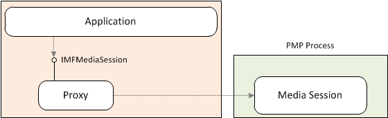
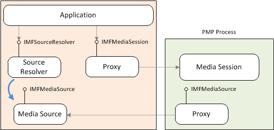
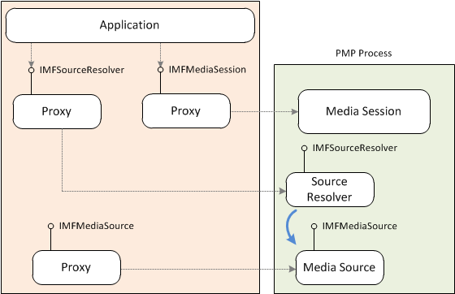

# PMP Media Session

An application can create the [Media Session](media-session.md) in a separate process called the [Protected Media Path](protected-media-path.md) (PMP) process. The main purpose of the PMP process is to enable playback of protected content using digital rights management (DRM). By default, the PMP process is created inside a Protected Environment (PE). Only trusted, signed components can be loaded inside a PE. A secondary benefit of the PMP process is that it isolates the application process from the media pipeline. For more information about the PMP process, see [Protected Media Path](protected-media-path.md).

To create the Media Session inside the PMP process, call the [**MFCreatePMPMediaSession**](/windows/desktop/api/mfidl/nf-mfidl-mfcreatepmpmediasession) function. Optionally, you can pass in the **MFPMPSESSION\_UNPROTECTED\_PROCESS** flag. If this flag is set, the PMP process is created inside an unprotected process, and not a PE process. The unprotected process cannot be used for DRM playback, but does give you the benefits of process isolation.

The [**MFCreatePMPMediaSession**](/windows/desktop/api/mfidl/nf-mfidl-mfcreatepmpmediasession) function returns a pointer to a proxy object for the Media Session. The application communicates with the Media Session through the proxy.

By default, when the application creates a topology, the media source is created inside the application process. A proxy to the media source is created inside the PMP process. The media source can create objects inside the PMP process by using the [**IMFPMPHost**](/windows/desktop/api/mfidl/nf-mfidl-imfpmphost-createobjectbyclsid) interface. For example, to support DRM, a media source creates an object called an *input trust authority* (ITA). The ITA must be created inside the PMP process. (For more information about ITAs, see [Protected Media Path](protected-media-path.md).) To use the [**IMFPMPHost**](/windows/desktop/api/mfidl/nn-mfidl-imfpmphost) interface, do the following:

1.  The media source must implement the [**IMFPMPClient**](/windows/desktop/api/mfidl/nn-mfidl-imfpmpclient) interface.
2.  During topology resolution, the Media Session proxy calls the [**IMFPMPClient::SetPMPHost**](/windows/desktop/api/mfidl/nf-mfidl-imfpmpclient-setpmphost) method on the media source.
3.  The media source calls [**IMFPMPHost::CreateObjectByCLSID**](/windows/desktop/api/mfidl/nf-mfidl-imfpmphost-createobjectbyclsid) to create the object inside the PMP process. The object must have a registered CLSID. Also, to load inside the PE, the object must be trusted and digitally signed. For information about code signing protected media components, see the white paper [Code Signing for Protected Media Components in Windows Vista](/windows-hardware/test/hlk/)

The following illustration shows the media source created in the application process.

Another alternative is to create the media source inside the PMP session.

1.  Set the [**MF\_SESSION\_REMOTE\_SOURCE\_MODE**](mf-session-remote-source-mode-attribute.md) attribute when you create the Media Session. Configuration attributes are specified in the *pConfiguration* parameter of the [**MFCreatePMPMediaSession**](/windows/desktop/api/mfidl/nf-mfidl-mfcreatepmpmediasession) function.
2.  Call [**MFGetService**](/windows/desktop/api/mfidl/nf-mfidl-mfgetservice) on the Media Session to get a pointer to the [**IMFPMPHost**](/windows/desktop/api/mfidl/nn-mfidl-imfpmphost) interface. The service identifier is **MF\_PMP\_SERVICE**.
3.  Call [**IMFPMPHost::CreateObjectByCLSID**](/windows/desktop/api/mfidl/nf-mfidl-imfpmphost-createobjectbyclsid) with the class identifier **CLSID\_MFSourceResolver** to create the source resolver inside the PMP process. The method returns a pointer to a proxy for the source resolver.
4.  Call [**IMFSourceResolver::BeginCreateObjectFromURL**](/windows/desktop/api/mfidl/nf-mfidl-imfsourceresolver-begincreateobjectfromurl) or [**IMFSourceResolver::BeginCreateObjectFromByteStream**](/windows/desktop/api/mfidl/nf-mfidl-imfsourceresolver-begincreateobjectfrombytestream) to create the media source.
    > [!Note]  
    > In this case, you must use the asynchronous versions of these methods, because the synchronous versions are not remotable.

     

The following illustration shows the media source created in the PMP process.

## Related topics

<dl> <dt>

[How to Play Protected Media Files](how-to-play-protected-media-files.md)
</dt> <dt>

[Media Session](media-session.md)
</dt> <dt>

[Protected Media Path](protected-media-path.md)
</dt> </dl>

 

 
