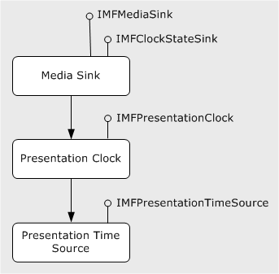

# Presentation Clock

The *presentation clock* is an object that generates the clock time for a presentation. The time reported by the presentation clock is called the *presentation time*. All streams in a presentation are synchronized to the presentation time. The presentation clock exposes the following interfaces.

| Interface                                            | Description                                         |
|------------------------------------------------------|-----------------------------------------------------|
| [**IMFPresentationClock**](/windows/desktop/api/mfidl/nn-mfidl-imfpresentationclock) | Primary interface for using the presentation clock. |
| [**IMFRateControl**](/windows/desktop/api/mfidl/nn-mfidl-imfratecontrol)             | Controls the clock rate.                            |
| [**IMFTimer**](/windows/desktop/api/mfidl/nn-mfidl-imftimer)                         | Provides a timer callback.                          |
| [**IMFShutdown**](/windows/desktop/api/mfidl/nn-mfidl-imfshutdown)                   | Shuts down the presentation clock.                  |

 

Media sinks use the presentation time to schedule when to render samples. Whenever a media sink receives a new sample, it gets the time stamp from the sample and renders the sample at the indicated time, or as close to that time as possible. Because all of the media sinks in a topology share the same presentation clock, multiple streams (such as audio and video) are synchronized. Media sources and transforms do not use the presentation clock, because they do not schedule when to deliver samples. Instead, they produce samples whenever the pipeline requests a new sample.

If you are using the Media Session for playback, the Media Session handles all of the details of creating the presentation clock, selecting a time source, and notifying the media sinks. Your application might use the presentation clock to get the current presentation time during playback, but otherwise will not call any methods on the presentation clock.

## Clock Time and Clock States

To get the latest clock time from the presentation clock, call [**IMFPresentationClock::GetTime**](/windows/desktop/api/mfidl/nf-mfidl-imfpresentationclock-gettime). Clock times are always in 100-nanosecond units, so one second is 10,000,000 (10^7) ticks. This corresponds to a frequency of 10 MHz.

The presentation clock has three states: Running, paused, and stopped.

-   To run the clock, call [**IMFPresentationClock::Start**](/windows/desktop/api/mfidl/nf-mfidl-imfpresentationclock-start). The **Start** method specifies the clock's starting time. While the clock is running, the clock time increments from the starting time, at the current clock rate.
-   To pause the clock, call [**IMFPresentationClock::Pause**](/windows/desktop/api/mfidl/nf-mfidl-imfpresentationclock-pause). While the clock is paused, the clock time does not advance, and [**GetTime**](/windows/desktop/api/mfidl/nf-mfidl-imfpresentationclock-gettime) returns the time at which the clock was paused.
-   To stop the clock, call [**IMFPresentationClock::Stop**](/windows/desktop/api/mfidl/nf-mfidl-imfpresentationclock-stop). When the clock is stopped, the clock time does not advance, and [**GetTime**](/windows/desktop/api/mfidl/nf-mfidl-imfpresentationclock-gettime) returns zero.

By default, the clock advances at a rate of 1.0, meaning 1 tick per 100 nanoseconds. To change the rate at which the clock advances, query the presentation clock for the [**IMFRateControl**](/windows/desktop/api/mfidl/nn-mfidl-imfratecontrol) interface and call [**IMFRateControl::SetRate**](/windows/desktop/api/mfidl/nf-mfidl-imfratecontrol-setrate).

Objects can receive notifications of state changes (including rate changes) from the presentation clock. To receive notifications, implement the [**IMFClockStateSink**](/windows/desktop/api/mfidl/nn-mfidl-imfclockstatesink) interface and call [**IMFPresentationClock::AddClockStateSink**](/windows/desktop/api/mfidl/nf-mfidl-imfpresentationclock-addclockstatesink) on the presentation clock. Before shutting down, call [**IMFPresentationClock::RemoveClockStateSink**](/windows/desktop/api/mfidl/nf-mfidl-imfpresentationclock-removeclockstatesink) to unregister the object. Media sinks use this mechanism to receive notifications from the clock.

## Presentation Times

A media sink tries to schedule each sample so that the sample is rendered at the correct time, or as close to the correct time as possible. The following definitions apply:

-   *Presentation time.* The time when a sample should be rendered. Time is given in units of 100 nanoseconds.
-   *Media time.* Time relative to the start of the content. For example, if a video file is 10 seconds long, the point half way through the file has a media time of 5 seconds.
-   *Time stamp.* The time marked on a media sample. To get the time stamp, call [**IMFSample::GetSampleTime**](/windows/desktop/api/mfobjects/nf-mfobjects-imfsample-getsampletime). When a media source produces a sample, it sets the time stamp equal to the media time. The Media Session translates the time stamp into presentation time.

By default, media time and presentation time are the same, For example, if a video frame appears 5 seconds into the source file, the media time and the presentation time are both 5 seconds. If you are using the [Sequencer Source](sequencer-source.md), the timing model is somewhat more complicated, to enable smooth transitions between segments. For more information about the sequencer source's timing model, see [Sequence Presentation Times](sequence-presentation-times.md).

The media source always sets the time stamp equal to the media time. If presentation time is not aligned with media time, the Media Session converts the time stamps on the media samples. By the time the sink receives a sample, the sample's time stamp has been converted to presentation time. The sink schedules the sample against the presentation clock's current time. (Rateless sinks are an exception, because they ignore the presentation clock.)

If the application seeks to a new position, the Media Session restarts the presentation clock at the specified seek time. For example, if the application seeks to the 5-second position in the file, the Media Session starts the clock at 5 seconds. The media source might deliver samples with a slightly earlier time stamp if the seek time does not fall on a key-frame boundary. This is required so that the decoders can decode all of the frames. The Media Session drops or trims samples before they reach the media sinks, in order to match the requested seek time. For example, if the seek time is 5 seconds, the first audio sample might start at 4.5 seconds. The Media Session will trim the first 0.5 seconds from the first decoded audio sample.

## Creating the Presentation Clock

To create the presentation clock, call [**MFCreatePresentationClock**](/windows/desktop/api/mfidl/nf-mfidl-mfcreatepresentationclock). To shut down the clock, query for the [**IMFShutdown**](/windows/desktop/api/mfidl/nn-mfidl-imfshutdown) interface and call [**IMFShutdown::Shutdown**](/windows/desktop/api/mfidl/nf-mfidl-imfshutdown-shutdown). The caller of **MFCreatePresentationClock** is responsible for calling **Shutdown**; in most cases, this is the Media Session rather than the application.

## Presentation Time Sources

Despite its name, the presentation clock does not actually implement a clock. Instead, it gets the clock times from another object, called a *presentation time source*. The time source can be any object that generates accurate clock ticks and exposes the [**IMFPresentationTimeSource**](/windows/desktop/api/mfidl/nn-mfidl-imfpresentationtimesource) interface. The following illustration shows this process.

When the presentation clock is first created, it does not have a time source. To set the time source, call [**IMFPresentationClock::SetTimeSource**](/windows/desktop/api/mfidl/nf-mfidl-imfpresentationclock-settimesource) with a pointer to the time source's [**IMFPresentationTimeSource**](/windows/desktop/api/mfidl/nn-mfidl-imfpresentationtimesource) interface. A time source supports the same states as the presentation clock (running, paused, and stop), and must implement the [**IMFClockStateSink**](/windows/desktop/api/mfidl/nn-mfidl-imfclockstatesink) interface. The presentation clock uses this interface to notify the time source when to change state. In this way, the time source provides the clock ticks, but the presentation clock initiates state changes in the clock.

Some media sinks have access to an accurate clock, and therefore expose the [**IMFPresentationTimeSource**](/windows/desktop/api/mfidl/nn-mfidl-imfpresentationtimesource) interface. In particular, the audio renderer can use the frequency of the sound card as a clock. In audio playback, it is useful for the audio renderer to act as the time source, so that video is synchronized to the audio playback rate. This generally produces better results than attempting to match the audio to an external clock.

Media Foundation also provides a presentation time source based on the system clock. To create this object, call [**MFCreateSystemTimeSource**](/windows/desktop/api/mfidl/nf-mfidl-mfcreatesystemtimesource). The system time source can be used when no media sinks provide a time source.

In general, a media sink must use the presentation clock provided to it, regardless of which time source the presentation clock uses. This rule applies even when a media sink implements [**IMFPresentationTimeSource**](/windows/desktop/api/mfidl/nn-mfidl-imfpresentationtimesource). If the presentation clock uses some other time source, the media sink must follow that time source, not its own internal clock.

There are two situations when a media sink will not follow the presentation clock:

-   Some media sinks are *rateless*. If a media sink is rateless, it consumes samples as quickly as possible, without scheduling them according to the presentation clock. Typically, rateless sinks write data to a file, so it is desirable to complete the operation as quickly as possible. A rateless sink returns the MEDIASINK\_RATELESS flag in its [**IMFMediaSink::GetCharacteristics**](/windows/desktop/api/mfidl/nf-mfidl-imfmediasink-getcharacteristics) method. When all the sinks in a topology are rateless, the Media Session pushes data through the pipeline as quickly as possible.

-   Some media sinks cannot match rates with a time source other than themselves. If so, the sink returns the MEDIASINK\_CANNOT\_MATCH\_CLOCK flag in its [**GetCharacteristics**](/windows/desktop/api/mfidl/nf-mfidl-imfmediasink-getcharacteristics) method. The pipeline can still use another time source, but the results will be less than optimal. The sink will likely fall behind and cause glitches during playback.

## Related topics

<dl> <dt>

[Media Foundation Platform APIs](media-foundation-platform-apis.md)
</dt> </dl>

 

 

