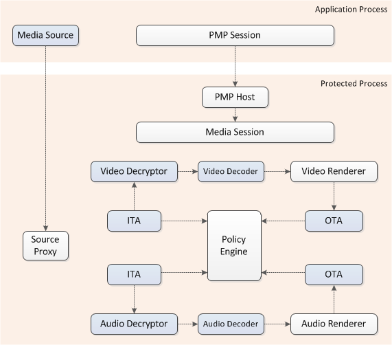
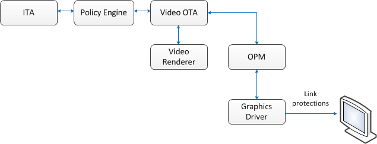

# Protected Media Path

This topic discusses three interrelated topics: protected environment, media interoperability gateway, and revocation and renewal.

-   A protected environment (PE) is a set of technologies that enables protected content to flow from and through Windows Vista in a protected fashion. All components inside a protected environment are trusted and the process is protected against tampering.
-   The protected media path (PMP) is an executable that runs in a protected environment.
-   If a trusted component in the PE becomes compromised, after due process it will be revoked. However, Microsoft provides a renewal mechanism to install a newer trusted version of the component when one becomes available.

For information about code signing protected media components, see the white paper [Code Signing for Protected Media Components in Windows Vista](/windows-hardware/test/hlk/).

This topic contains the following sections:

-   [Protected Environment](#protected-environment)
-   [Design of the Protected Environment](#design-of-the-protected-environment)
-   [Protected Media Path](#protected-media-path)
    -   [Input Trust Authorities](#input-trust-authorities)
    -   [Output Trust Authorities](#output-trust-authorities)
    -   [Policy Objects](#policy-objects)
    -   [Creating Objects in the PMP](#creating-objects-in-the-pmp)
-   [Overview of Policy Negotiation](#overview-of-policy-negotiation)
-   [Revocation and Renewal](#revocation-and-renewal)
-   [Output Link Protection](#output-link-protection)
-   [Related topics](#related-topics)

## Protected Environment

Content protection encompasses multiple technologies, each of which attempts to ensure that content cannot be used in a way that is inconsistent with the intent of the content owner or provider. These technologies include copy protection, link protection, conditional access, and digital rights management (DRM). The foundation of each is trust: Access to the content is granted only to software components that adhere to the terms of use assigned to that content.

To minimize threats against protected content, Windows Vista and Media Foundation Software enable trusted code to run in a protected environment. A PE is a set of components, guidelines, and tools designed to increase protection against content piracy.

Before examining the PE more closely, it is important to understand the threats it is designed to minimize. Suppose you are running a media application in a user-mode process. The application is linked to the various dynamic link libraries (DLLs) that contain media plug-ins, such as decoders. Other processes are also running in user mode, and various drivers are loaded in the kernel. If no trust mechanism is in place, the following threats exist:

-   The application can access protected media directly or hack the process memory.
-   Plug-ins can access the content directly or hack the process memory.
-   Other processes can hack the media process memory either directly or by injecting code.
-   Kernel drivers can hack the media process memory.
-   Content might be sent outside the system over an unprotected medium. (Link protection is designed to mitigate against this threat.)

## Design of the Protected Environment

A protected environment runs in a separate protected process from the media application. The protected process feature of Windows Vista stops other processes from accessing the protected process.

When a protected process is created, core kernel components identify untrusted components and plug-ins so that the protected environment can refuse to load them. A trusted component is one that has been appropriately signed by Microsoft. The kernel also tracks modules that load into it, enabling the protected environment to stop playback of protected content if an untrusted module is loaded. Before a kernel component is loaded, the kernel checks to determine whether it is trusted. If it is not, trusted components already in the PE refuse to process protected content. To enable this, PE components periodically perform a cryptographically-protected handshake with the kernel. If an untrusted kernel mode component is present, the handshake fails and indicates to the PE that an untrusted component exists.

If a trusted component becomes compromised, after due process it can be revoked. Microsoft provides a renewal mechanism to install a newer trusted version when available.

## Protected Media Path

The protected media path (PMP) is the primary PE executable for Media Foundation. The PMP is extensible, so that third-party content protection mechanisms can be supported.

The PMP accepts protected content and associated policies from any Media Foundation source using any content protection system, including those provided by third parties. It sends content to any Media Foundation sink, as long as the sink complies with the policies specified by the source. It also supports transforms between the source and the sink, including third-party transforms, as long as they are trusted.

The PMP runs in a protected process isolated from the media application. The application only has the ability to exchange command and control messages with the PMP, but does not have access to content after it is passed to the PMP. The following diagram illustrates this process.



Shaded boxes represent components that might be provided by third parties. All components created inside the protected process must be signed and trusted.

The application creates an instance of the Media Session inside the protected process and receives a pointer to a proxy Media Session, which marshals interface pointers across the process boundary.

The media source can be created either within the application process, as shown here, or inside the protected process. If the media source is created inside the application process, the source creates a proxy for itself in the protected process.

All other pipeline components, such as decoders and media sinks, are created in the protected process. If these objects expose any custom interfaces for applications, they must provide a DCOM proxy/stub to marshal the interface.

To enforce policy on protected content as it flows through the pipeline, the PMP uses three types of components: input trust authorities (ITAs), output trust authorities (OTAs), and policy objects. These components work together to grant or restrict rights to use content, and to specify the link protections that must be employed when playing content, such as High-bandwidth Digital Content Protection (HDCP).

### Input Trust Authorities

An ITA is created by a trusted media source, and performs several functions:

-   Specifies rights to use content. Rights can include the right to play content, transfer it to a device, and so on. It defines an ordered list of approved output protection systems and the corresponding output policies for each system. The ITA stores this information in a policy object.
-   Provides the decryptor needed to decrypt the content.
-   Establishes trust with the kernel module in the protected environment, to ensure that the ITA is running inside a trusted environment.

An ITA is associated with an individual stream containing protected content. A stream can have only one ITA, and an instance of an ITA can be associated with only one stream.

### Output Trust Authorities

An OTA is associated with a trusted output. The OTA exposes an action that the trusted output can perform on the content, such as playback or copying. Its role is to enforce one or more output protection systems that are required by the ITA. The OTA queries the policy object provided by ITA to determine which protection system it must enforce.

### Policy Objects

A policy object encapsulates the content protection requirements of an ITA. It is used by the policy engine to negotiate content protection support with an OTA. OTAs query policy objects to determine what protection systems they must enforce on each output of the current content.

### Creating Objects in the PMP

To create an object in the protected media path (PMP), the [**IMFMediaSource**](/windows/desktop/api/mfidl/nn-mfidl-imfmediasource) calls [**IMFPMPHostApp::ActivateClassById**](/windows/desktop/api/mfidl/nf-mfidl-imfpmphostapp-activateclassbyid), with the specified input **IStream** formatted in the following way:

``` syntax
Format: (All DWORD values are serialized in little-endian order)
[GUID (content protection system guid, obtained from Windows.Media.Protection.MediaProtectionSystemId)]
[DWORD (track count, use the actual track count even if all tracks are encrypted using the same data, note that zero is invalid)]
[DWORD (next track ID, use -1 if all remaining tracks are encrypted using the same data)]
[DWORD (next track's binary data size)]
[BYTE* (next track's binary data)]
{ Repeat from "next track ID" above for each stream }
```

## Overview of Policy Negotiation

There are three fundamental requirements that must be met before protected content can be processed in the PMP. First, protected content must be sent only to trusted outputs. Second, only permitted actions must be applied to a stream. Third, only approved output protection systems must be used to play a stream. The policy engine coordinates between ITAs and OTAs to ensure that these requirements are met.

The easiest way to understand process is to walk through a simplified example that identifies the steps necessary to play Advanced System Format (ASF) content protected by Windows Media Digital Rights Management (WMDRM).

When a user launches a player application and opens an ASF file that has a protected audio stream and a protected video stream, the following steps must be performed:

1.  The application creates the ASF media source and the protected media path (PMP) session. Media Foundation creates a PMP process.
2.  The application creates a partial topology that contains an audio source node connected to the audio renderer, and a video source node connected to the enhanced video renderer (EVR). For the renderers, the application does not directly create the renderer. Instead, the application creates in the unprotected process an object known as an *activation object*. The PMP uses the activation object to create the renderers in the protected process. (For more information about activation objects, see [Activation Objects](activation-objects.md).)
3.  The application sets the partial topology on the PMP session.
4.  The PMP session serializes the topology and passes it to the PMP host in the protected process. The PMP host sends the topology to the policy engine.
5.  The topology loader calls [**IMFInputTrustAuthority::GetDecrypter**](/windows/desktop/api/mfidl/nf-mfidl-imfinputtrustauthority-getdecrypter) on the ITAs and inserts the decrypters into the topology immediately downstream of the corresponding source nodes.
6.  The topology loader inserts the audio and video decoders downstream of the decrypter nodes.
7.  The policy engine scans the inserted nodes to determine whether any implement the [**IMFTrustedOutput**](/windows/desktop/api/mfidl/nn-mfidl-imftrustedoutput) interface. The EVR and the audio renderer both implement **IMFTrustedOutput**, because they send data outside the PMP.
8.  Each ITA confirms that it is running inside a protected process by performing a cryptographic handshake with a protected environment kernel module.
9.  For each stream, the policy engine negotiates policy by getting a policy object from the ITA and passing it to the OTA. The OTA provides a list of the protection systems that it supports, and the policy object indicates which protection systems must be applied, along with the correct settings. The OTA then applies these settings. If it cannot do so, the content is blocked.

## Revocation and Renewal

A trusted component can be revoked if it becomes compromised or is discovered to be violating the license agreements under which it was initially trusted. A renewal mechanism exists to install a newer, more trusted version of the component.

Trusted components are signed using a cryptographic certificate. Microsoft publishes a global revocation list (GRL) which identifies components that have been revoked. The GRL is digitally signed to ensure its authenticity. Content owners can ensure, through the policy mechanism, that the current version of the GRL is present on the user's computer.

## Output Link Protection

When premium video content is viewed, the decrypted, uncompressed frames travel across a physical connector to the display device. Content providers may require the video frames to be protected at this point, as they travel across the physical connector. Various protection mechanisms exist for this purpose, including High-Bandwidth Digital Content Protection (HDCP) and DisplayPort Content Protection (DPCP). The video OTA enforces these protections by using the [Output Protection Manager](output-protection-manager.md) (OPM). The Output Protection Manager sends commands to the graphics driver, and the graphics driver enforces whatever link protection mechanisms are required by the policy.



## Related topics

<dl> <dt>

[About Media Foundation](about-the-media-foundation-sdk.md)
</dt> <dt>

[Media Foundation Architecture](media-foundation-architecture.md)
</dt> <dt>

[GPU-Based Content Protection](gpu-based-content-protection.md)
</dt> <dt>

[Output Protection Manager](output-protection-manager.md)
</dt> <dt>

[PMP Media Session](pmp-media-session.md)
</dt> </dl>

 

 
