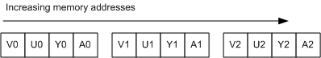
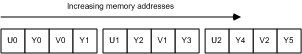
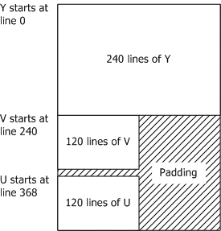
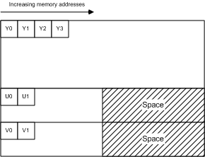
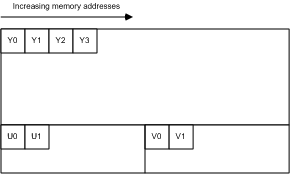
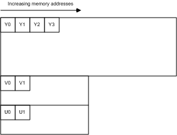
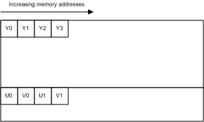
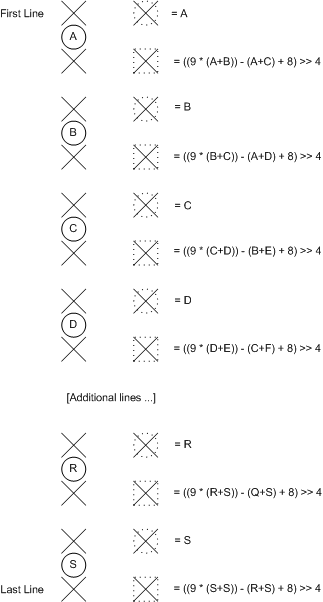

# Recommended 8-Bit YUV Formats for Video Rendering

Gary Sullivan and Stephen Estrop

Microsoft Corporation

April 2002, updated November 2008

This topic describes the 8-bit YUV color formats that are recommended for video rendering in the Windows operating system. This article presents techniques for converting between YUV and RGB formats, and also provides techniques for upsampling YUV formats. This article is intended for anyone working with YUV video decoding or rendering in Windows.

## Introduction

Numerous YUV formats are defined throughout the video industry. This article identifies the 8-bit YUV formats that are recommended for video rendering in Windows. Decoder vendors and display vendors are encouraged to support the formats described in this article. This article does not address other uses of YUV color, such as still photography.

The formats described in this article all use 8 bits per pixel location to encode the Y channel (also called the luma channel), and use 8 bits per sample to encode each U or V chroma sample. However, most YUV formats use fewer than 24 bits per pixel on average, because they contain fewer samples of U and V than of Y. This article does not cover YUV formats with 10-bit or higher Y channels.

> [!Note]  
> For the purposes of this article, the term U is equivalent to Cb, and the term V is equivalent to Cr.

 

This article covers the following topics:

-   [YUV Sampling](#yuv-sampling). Describes the most common YUV sampling techniques.
-   [Surface Definitions](#surface-definitions). Describes the recommended YUV formats.
-   [Color Space and Chroma Sampling Rate Conversions](#color-space-and-chroma-sampling-rate-conversions). Provides some guidelines for converting between YUV and RGB formats and for converting between different YUV formats.
-   [Identifying YUV Formats in Media Foundation](#identifying-yuv-formats-in-media-foundation). Explains how to describe YUV format types in Media Foundation.

## YUV Sampling

Chroma channels can have a lower sampling rate than the luma channel, without any dramatic loss of perceptual quality. A notation called the "A:B:C" notation is used to describe how often U and V are sampled relative to Y:

-   4:4:4 means no downsampling of the chroma channels.
-   4:2:2 means 2:1 horizontal downsampling, with no vertical downsampling. Every scan line contains four Y samples for every two U or V samples.
-   4:2:0 means 2:1 horizontal downsampling, with 2:1 vertical downsampling.
-   4:1:1 means 4:1 horizontal downsampling, with no vertical downsampling. Every scan line contains four Y samples for each U and V sample. 4:1:1 sampling is less common than other formats, and is not discussed in detail in this article.

The following diagrams shows how chroma is sampled for each of the downsampling rates. Luma samples are represented by a cross, and chroma samples are represented by a circle.


The dominant form of 4:2:2 sampling is defined in ITU-R Recommendation BT.601. There are two common variants of 4:2:0 sampling. One of these is used in MPEG-2 video, and the other is used in MPEG-1 and in ITU-T Recommendations H.261 and H.263.

Compared with the MPEG-1 scheme, it is simpler to convert between the MPEG-2 scheme and the sampling grids defined for 4:2:2 and 4:4:4 formats. For this reason, the MPEG-2 scheme is preferred in Windows, and should be considered the default interpretation of 4:2:0 formats.

## Surface Definitions

This section describes the 8-bit YUV formats that are recommended for video rendering. These fall into several categories:

-   [4:4:4 Formats, 32 Bits per Pixel](#444-formats-32-bits-per-pixel)
-   [4:2:2 Formats, 16 Bits per Pixel](#422-formats-16-bits-per-pixel)
-   [4:2:0 Formats, 16 Bits per Pixel](#420-formats-16-bits-per-pixel)
-   [4:2:0 Formats, 12 Bits per Pixel](#420-formats-12-bits-per-pixel)

First, you should be aware of the following concepts in order to understand what follows:

-   *Surface origin*. For the YUV formats described in this article, the origin (0,0) is always the top left corner of the surface.
-   *Stride*. The stride of a surface, sometimes called the pitch, is the width of the surface in bytes. Given a surface origin at the top left corner, the stride is always positive.
-   *Alignment*. The alignment of a surface is at the discretion of the graphics display driver. The surface must always be DWORD aligned; that is, individual lines within the surface are guaranteed to originate on a 32-bit (DWORD) boundary. The alignment can be larger than 32 bits, however, depending on the needs of the hardware.
-   Packed format versus planar format. YUV formats are divided into *packed* formats and *planar* formats. In a packed format, the Y, U, and V components are stored in a single array. Pixels are organized into groups of macropixels, whose layout depends on the format. In a planar format, the Y, U, and V components are stored as three separate planes.

Each of the YUV formats described in this article has an assigned FOURCC code. A FOURCC code is a 32-bit unsigned integer that is created by concatenating four ASCII characters.

-   4:4:4 (32 bpp)
    -   [AYUV](#ayuv)
-   4:2:2 (16 bpp)
    -   [YUY2](#yuy2)
    -   [UYVY](#uyvy)
-   4:2:0 (16 bpp)
    -   [IMC1](#imc1)
    -   [IMC3](#imc3)
-   4:2:0 (12 bpp)
    -   [IMC2](#imc2)
    -   [IMC4](#imc4)
    -   [YV12](#yv12)
    -   [NV12](#nv12)

## 4:4:4 Formats, 32 Bits per Pixel

### AYUV

A single 4:4:4 format is recommended, with the FOURCC code AYUV. This is a packed format, where each pixel is encoded as four consecutive bytes, arranged in the sequence shown in the following illustration.



The bytes marked A contain values for alpha.

## 4:2:2 Formats, 16 Bits per Pixel

Two 4:2:2 formats are recommended, with the following FOURCC codes:

-   YUY2
-   UYVY

Both are packed formats, where each macropixel is two pixels encoded as four consecutive bytes. This results in horizontal downsampling of the chroma by a factor of two.

### YUY2

In YUY2 format, the data can be treated as an array of unsigned **char** values, where the first byte contains the first Y sample, the second byte contains the first U (Cb) sample, the third byte contains the second Y sample, and the fourth byte contains the first V (Cr) sample, as shown in the following diagram.


If the image is addressed as an array of little-endian **WORD** values, the first **WORD** contains the first Y sample in the least significant bits (LSBs) and the first U (Cb) sample in the most significant bits (MSBs). The second **WORD** contains the second Y sample in the LSBs and the first V (Cr) sample in the MSBs.

YUY2 is the preferred 4:2:2 pixel format for Microsoft DirectX Video Acceleration (DirectX VA). It is expected to be an intermediate-term requirement for DirectX VA accelerators supporting 4:2:2 video.

### UYVY

This format is the same as the YUY2 format except the byte order is reversed—that is, the chroma and luma bytes are flipped (Figure 4). If the image is addressed as an array of two little-endian **WORD** values, the first **WORD** contains U in the LSBs and Y0 in the MSBs, and the second **WORD** contains V in the LSBs and Y1 in the MSBs.



## 4:2:0 Formats, 16 Bits per Pixel

Two 4:2:0 16-bits per pixel (bpp) formats are recommended, with the following FOURCC codes:

-   IMC1
-   IMC3

Both of these YUV formats are planar formats. The chroma channels are subsampled by a factor of two in both the horizontal and vertical dimensions.

### IMC1

All of the Y samples appear first in memory as an array of unsigned **char** values. This is followed by all of the V (Cr) samples, and then all of the U (Cb) samples. The V and U planes have the same stride as the Y plane, resulting in unused areas of memory, as shown in Figure 5. The U and V planes must start on memory boundaries that are a multiple of 16 lines. Figure 5 shows the origin of U and V for a 352 x 240 video frame. The starting address of the U and V planes are calculated as follows:

``` syntax
BYTE* pV = pY + (((Height + 15) & ~15) * Stride);
BYTE* pU = pY + (((((Height * 3) / 2) + 15) & ~15) * Stride);
```

where *pY* is a byte pointer to the start of the memory array, as shown in the following diagram.



### IMC3

This format is identical to IMC1, except the U and V planes are swapped, as shown in the following diagram.



## 4:2:0 Formats, 12 Bits per Pixel

Four 4:2:0 12-bpp formats are recommended, with the following FOURCC codes:

-   IMC2
-   IMC4
-   YV12
-   NV12

In all of these formats, the chroma channels are subsampled by a factor of two in both the horizontal and vertical dimensions.

### IMC2

This format is the same as IMC1 except for the following difference: The V (Cr) and U (Cb) lines are interleaved at half-stride boundaries. In other words, each full-stride line in the chroma area starts with a line of V samples, followed by a line of U samples that begins at the next half-stride boundary (Figure 7). This layout makes more efficient use of address space than IMC1. It cuts the chroma address space in half, and thus the total address space by 25 percent. Among 4:2:0 formats, IMC2 is the second-most preferred format, after NV12. The following image illustrates this process.


### IMC4

This format is identical to IMC2, except the U (Cb) and V (Cr) lines are swapped, as shown in the following illustration.



### YV12

All of the Y samples appear first in memory as an array of unsigned **char** values. This array is followed immediately by all of the V (Cr) samples. The stride of the V plane is half the stride of the Y plane; and the V plane contains half as many lines as the Y plane. The V plane is followed immediately by all of the U (Cb) samples, with the same stride and number of lines as the V plane, as shown in the following illustration.



### NV12

All of the Y samples appear first in memory as an array of unsigned **char** values with an even number of lines. The Y plane is followed immediately by an array of unsigned **char** values that contains packed U (Cb) and V (Cr) samples. When the combined U-V array is addressed as an array of little-endian **WORD** values, the LSBs contain the U values, and the MSBs contain the V values. NV12 is the preferred 4:2:0 pixel format for DirectX VA. It is expected to be an intermediate-term requirement for DirectX VA accelerators supporting 4:2:0 video. The following illustration shows the Y plane and the array that contains packed U and V samples.



## Color Space and Chroma Sampling Rate Conversions

This section provides guidelines for converting between YUV and RGB, and for converting between some different YUV formats. We consider two RGB encoding schemes in this section: *8-bit computer RGB*, also known as sRGB or "full-scale" RGB, and *studio video RGB*, or "RGB with head-room and toe-room." These are defined as follows:

-   Computer RGB uses 8 bits for each sample of red, green, and blue. Black is represented by R = G = B = 0, and white is represented by R = G = B = 255.
-   Studio video RGB uses some number of bits N for each sample of red, green, and blue, where N is 8 or more. Studio video RGB uses a different scaling factor than computer RGB, and it has an offset. Black is represented by R = G = B = 16\*2^(N-8), and white is represented by R = G = B = 235\*2^(N-8). However, actual values may fall outside this range.

Studio video RGB is the preferred RGB definition for video in Windows, while computer RGB is the preferred RGB definition for non-video applications. In either form of RGB, the chromaticity coordinates are as specified in ITU-R BT.709 for the definition of the RGB color primaries. The (x,y) coordinates of R, G, and B are (0.64, 0.33), (0.30, 0.60), and (0.15, 0.06), respectively. Reference white is D65 with coordinates (0.3127, 0.3290). Nominal gamma is 1/0.45 (approximately 2.2), with precise gamma defined in detail in ITU-R BT.709.

**Conversion between RGB and 4:4:4 YUV**

We first describe conversion between RGB and 4:4:4 YUV. To convert 4:2:0 or 4:2:2 YUV to RGB, we recommend converting the YUV data to 4:4:4 YUV, and then converting from 4:4:4 YUV to RGB. The AYUV format, which is a 4:4:4 format, uses 8 bits each for the Y, U, and V samples. YUV can also be defined using more than 8 bits per sample for some applications.

Two dominant YUV conversions from RGB have been defined for digital video. Both are based on the specification known as ITU-R Recommendation BT.709. The first conversion is the older YUV form defined for 50-Hz use in BT.709. It is the same as the relation specified in ITU-R Recommendation BT.601, also known by its older name, CCIR 601. It should be considered the preferred YUV format for standard-definition TV resolution (720 x 576) and lower-resolution video. It is characterized by the values of two constants *Kr* and *Kb*:

``` syntax
Kr = 0.299
Kb = 0.114
```

The second conversion is the newer YUV form defined for 60-Hz use in BT.709, and should be considered the preferred format for video resolutions above SDTV. It is characterized by different values for these two constants:

``` syntax
Kr = 0.2126
Kb = 0.0722
```

Conversion from RGB to YUV is defined by starting with the following:

``` syntax
L = Kr * R + Kb * B + (1 - Kr - Kb) * G
```

The YUV values are then obtained as follows:

``` syntax
Y =                   floor(2^(M-8) * (219*(L-Z)/S + 16) + 0.5)
U = clip3(0, (2^M)-1, floor(2^(M-8) * (112*(B-L) / ((1-Kb)*S) + 128) + 0.5))
V = clip3(0, (2^M)-1, floor(2^(M-8) * (112*(R-L) / ((1-Kr)*S) + 128) + 0.5))
```

where

-   M is the number of bits per YUV sample (M >= 8).
-   Z is the black-level variable. For computer RGB, Z equals 0. For studio video RGB, Z equals 16\*2^(N-8), where N is the number of bits per RGB sample (N >= 8).
-   S is the scaling variable. For computer RGB, S equals 255. For studio video RGB, S equals 219\*2^(N-8).

The function floor(x) returns the largest integer less than or equal to x. The function clip3(x, y, z) is defined as follows:

``` syntax
clip3(x, y, z) = ((z < x) ? x : ((z > y) ? y : z))
```

> [!Note]  
> clip3 should be implemented as a function rather than a preprocessor macro; otherwise multiple evaluations of the arguments will occur.

 

The Y sample represents brightness, and the U and V samples represent the color deviations toward blue and red, respectively. The nominal range for Y is 16\*2^(M-8) to 235\*2^(M-8). Black is represented as 16\*2^(M-8), and white is represented as 235\*2^(M-8). The nominal range for U and V are 16\*2^(M-8) to 240\*2^(M-8), with the value 128\*2^(M-8) representing neutral chroma. However, actual values may fall outside these ranges.

For input data in the form of studio video RGB, the clip operation is necessary to keep the U and V values within the range 0 to (2^M)-1. If the input is computer RGB, the clip operation is not required, because the conversion formula cannot produce values outside of this range.

These are the exact formulas without approximation. Everything that follows in this document is derived from these formulas. This section describes the following conversions:

-   [Converting RGB888 to YUV 4:4:4](#converting-rgb888-to-yuv-444)
-   [Converting 8-bit YUV to RGB888](#converting-8-bit-yuv-to-rgb888)
-   [Converting 4:2:0 YUV to 4:2:2 YUV](#converting-420-yuv-to-422-yuv)
-   [Converting 4:2:2 YUV to 4:4:4 YUV](#converting-422-yuv-to-444-yuv)
-   [Converting 4:2:0 YUV to 4:4:4 YUV](#converting-420-yuv-to-444-yuv)

## Converting RGB888 to YUV 4:4:4

In the case of computer RGB input and 8-bit BT.601 YUV output, we believe that the formulas given in the previous section can be reasonably approximated by the following:

``` syntax
Y = ( (  66 * R + 129 * G +  25 * B + 128) >> 8) +  16
U = ( ( -38 * R -  74 * G + 112 * B + 128) >> 8) + 128
V = ( ( 112 * R -  94 * G -  18 * B + 128) >> 8) + 128
```

These formulas produce 8-bit results using coefficients that require no more than 8 bits of (unsigned) precision. Intermediate results will require up to 16 bits of precision.

## Converting 8-bit YUV to RGB888

From the original RGB-to-YUV formulas, one can derive the following relationships for BT.601.

``` syntax
Y = round( 0.256788 * R + 0.504129 * G + 0.097906 * B) +  16 
U = round(-0.148223 * R - 0.290993 * G + 0.439216 * B) + 128
V = round( 0.439216 * R - 0.367788 * G - 0.071427 * B) + 128
```

Therefore, given:

``` syntax
C = Y - 16
D = U - 128
E = V - 128
```

the formulas to convert YUV to RGB can be derived as follows:

``` syntax
R = clip( round( 1.164383 * C                   + 1.596027 * E  ) )
G = clip( round( 1.164383 * C - (0.391762 * D) - (0.812968 * E) ) )
B = clip( round( 1.164383 * C +  2.017232 * D                   ) )
```

where `clip()` denotes clipping to a range of \[0..255\]. We believe these formulas can be reasonably approximated by the following:

``` syntax
R = clip(( 298 * C           + 409 * E + 128) >> 8)
G = clip(( 298 * C - 100 * D - 208 * E + 128) >> 8)
B = clip(( 298 * C + 516 * D           + 128) >> 8)
```

These formulas use some coefficients that require more than 8 bits of precision to produce each 8-bit result, and intermediate results will require more than 16 bits of precision.

To convert 4:2:0 or 4:2:2 YUV to RGB, we recommend converting the YUV data to 4:4:4 YUV, and then converting from 4:4:4 YUV to RGB. The sections that follow present some methods for converting 4:2:0 and 4:2:2 formats to 4:4:4.

## Converting 4:2:0 YUV to 4:2:2 YUV

Converting 4:2:0 YUV to 4:2:2 YUV requires vertical upconversion by a factor of two. This section describes an example method for performing the upconversion. The method assumes that the video pictures are progressive scan.

> [!Note]  
> The 4:2:0 to 4:2:2 interlaced scan conversion process presents atypical problems and is difficult to implement. This article does not address the issue of converting interlaced scan from 4:2:0 to 4:2:2.

 

Let each vertical line of input chroma samples be an array `Cin[]` that ranges from 0 to N - 1. The corresponding vertical line on the output image will be an array `Cout[]` that ranges from 0 to 2N - 1. To convert each vertical line, perform the following process:

``` syntax
Cout[0]     = Cin[0];
Cout[1]     = clip((9 * (Cin[0] + Cin[1]) - (Cin[0] + Cin[2]) + 8) >> 4);
Cout[2]     = Cin[1];
Cout[3]     = clip((9 * (Cin[1] + Cin[2]) - (Cin[0] + Cin[3]) + 8) >> 4);
Cout[4]     = Cin[2]
Cout[5]     = clip((9 * (Cin[2] + Cin[3]) - (Cin[1] + Cin[4]) + 8) >> 4);
...
Cout[2*i]   = Cin[i]
Cout[2*i+1] = clip((9 * (Cin[i] + Cin[i+1]) - (Cin[i-1] + Cin[i+2]) + 8) >> 4);
...
Cout[2*N-3] = clip((9 * (Cin[N-2] + Cin[N-1]) - (Cin[N-3] + Cin[N-1]) + 8) >> 4);
Cout[2*N-2] = Cin[N-1];
Cout[2*N-1] = clip((9 * (Cin[N-1] + Cin[N-1]) - (Cin[N-2] + Cin[N-1]) + 8) >> 4);
```

where clip() denotes clipping to a range of \[0..255\].

> [!Note]  
> The equations for handling the edges can be mathematically simplified. They are shown in this form to illustrate the clamping effect at the edges of the picture.

 

In effect, this method calculates each missing value by interpolating the curve over the four adjacent pixels, weighted toward the values of the two nearest pixels (Figure 11). The specific interpolation method used in this example generates missing samples at half-integer positions using a well-known method called Catmull-Rom interpolation, also known as cubic convolution interpolation.



In signal processing terms, the vertical upconversion should ideally include a phase shift compensation to account for the half-pixel vertical offset (relative to the output 4:2:2 sampling grid) between the locations of the 4:2:0 sample lines and the location of every other 4:2:2 sample line. However, introducing this offset would increase the amount of processing required to generate the samples, and make it impossible to reconstruct the original 4:2:0 samples from the upsampled 4:2:2 image. It would also make it impossible to decode video directly into 4:2:2 surfaces and then use those surfaces as reference pictures for decoding subsequent pictures in the stream. Therefore, the method provided here does not take into account the precise vertical alignment of the samples. Doing so is probably not visually harmful at reasonably high picture resolutions.

If you start with 4:2:0 video that uses the sampling grid defined in H.261, H.263, or MPEG-1 video, the phase of the output 4:2:2 chroma samples will also be shifted by a half-pixel horizontal offset relative to the spacing on the luma sampling grid (a quarter-pixel offset relative to the spacing of the 4:2:2 chroma sampling grid). However, the MPEG-2 form of 4:2:0 video is probably more commonly used on PCs and does not suffer from this problem. Moreover, the distinction is probably not visually harmful at reasonably high picture resolutions. Trying to correct for this problem would create the same sort of problems discussed for the vertical phase offset.

## Converting 4:2:2 YUV to 4:4:4 YUV

Converting 4:2:2 YUV to 4:4:4 YUV requires horizontal upconversion by a factor of two. The method described previously for vertical upconversion can also be applied to horizontal upconversion. For MPEG-2 and ITU-R BT.601 video, this method will produce samples with the correct phase alignment.

## Converting 4:2:0 YUV to 4:4:4 YUV

To convert 4:2:0 YUV to 4:4:4 YUV, you can simply follow the two methods described previously. Convert the 4:2:0 image to 4:2:2, and then convert the 4:2:2 image to 4:4:4. You can also switch the order of the two upconversion processes, as the order of operation does not really matter to the visual quality of the result.

## Other YUV Formats

Some other, less common YUV formats include the following:

-   AI44 is a palettized YUV format with 8 bits per sample. Each sample contains an index in the 4 most significant bits (MSBs) and an alpha value in the 4 least significant bits (LSBs). The index refers to an array of YUV palette entries, which must be defined in the media type for the format. This format is primarily used for subpicture images.
-   NV11 is a 4:1:1 planar format with 12 bits per pixel. The Y samples appear first in memory. The Y plane is followed by an array of packed U (Cb) and V (Cr) samples. When the combined U-V array is addressed as an array of little-endian **WORD** values, the U samples are contained in the LSBs of each **WORD**, and the V samples are contained in the MSBs. (This memory layout is similar to NV12 although the chroma sampling is different.)
-   Y41P is a 4:1:1 packed format, with U and V sampled every fourth pixel horizontally. Each macropixel contains 8 pixels in three bytes, with the following byte layout: `U0 Y0 V0 Y1    U4 Y2 V4 Y3    Y4 Y5 Y6 Y7`
-   Y41T is identical to Y41P, except the least-significant bit of each Y sample specifies the chroma key (0 = transparent, 1 = opaque).
-   Y42T is identical to UYVY, except the least-significant bit of each Y sample specifies the chroma key (0 = transparent, 1 = opaque).
-   YVYU is equivalent to YUYV except the U and V samples are swapped.

## Identifying YUV Formats in Media Foundation

Each of the YUV formats described in this article has an assigned FOURCC code. A FOURCC code is a 32-bit unsigned integer that is created by concatenating four ASCII characters.

There are various C/C++ macros that make it easier to declare FOURCC values in source code. For example, the **MAKEFOURCC** macro is declared in Mmsystem.h, and the **FCC** macro is declared in Aviriff.h. Use them as follows:

``` syntax
DWORD fccYUY2 = MAKEFOURCC('Y','U','Y','2');
DWORD fccYUY2 = FCC('YUY2');
```

You can also declare a FOURCC code directly as a string literal simply by reversing the order of the characters. For example:

``` syntax
DWORD fccYUY2 = '2YUY';  // Declares the FOURCC 'YUY2'
```

Reversing the order is necessary because the Windows operating system uses a little-endian architecture. 'Y' = 0x59, 'U' = 0x55, and '2' = 0x32, so '2YUY' is 0x32595559.

In Media Foundation, formats are identified by a major type GUID and a subtype GUID. The major type for computer video formats is always MFMediaType\_Video . The subtype can be constructed by mapping the FOURCC code to a GUID, as follows:

``` syntax
XXXXXXXX-0000-0010-8000-00AA00389B71 
```

where `XXXXXXXX` is the FOURCC code. Thus, the subtype GUID for YUY2 is:

``` syntax
32595559-0000-0010-8000-00AA00389B71 
```

Constants for the most common YUV format GUIDs are defined in the header file mfapi.h. For a list of these constants, see [Video Subtype GUIDs](video-subtype-guids.md).

## Related topics

<dl> <dt>

[About YUV Video](about-yuv-video.md)
</dt> <dt>

[Video Media Types](video-media-types.md)
</dt> </dl>

 

 


