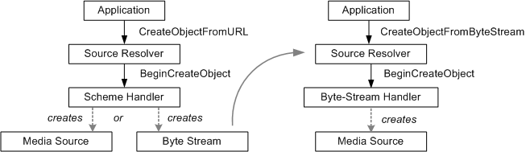

# Scheme Handlers and Byte-Stream Handlers

This topic describes the internal details of how the source resolver creates a media source. Read this topic if you are implementing a custom media source for Media Foundation, and you want the media source to be available to applications via the source resolver.

The source resolver can create a media source from a URL or from a byte stream (that is, an [**IMFByteStream**](/windows/desktop/api/mfobjects/nn-mfobjects-imfbytestream) pointer). To do so, it uses helper objects called *handlers*. For URLs, the source resolver uses *scheme handlers*. For byte streams, it uses *byte-stream handlers*.

A scheme handler takes a URL as input and creates either a media source or a byte stream. If it creates a byte stream, the source resolver will pass that to a byte-stream handler, which creates the media source. The following image illustrates this process.



## Scheme Handlers

Scheme handlers are used when the application calls [**IMFSourceResolver::CreateObjectFromURL**](/windows/desktop/api/mfidl/nf-mfidl-imfsourceresolver-createobjectfromurl) or its asynchronous equivalent, [**BeginCreateObjectFromURL**](/windows/desktop/api/mfidl/nf-mfidl-imfsourceresolver-begincreateobjectfromurl).

The source resolver looks up scheme handlers in the registry. Scheme handlers are listed by URL scheme, under the following keys:

```
HKEY_CURRENT_USER
   Software
      Microsoft
         Windows Media Foundation
            SchemeHandlers
               <scheme>
                  {00000000-0000-0000-0000-000000000000} = REG_SZ
```

```
HKEY_LOCAL_MACHINE
   Software
      Microsoft
         Windows Media Foundation
            SchemeHandlers
               <scheme>
                  {00000000-0000-0000-0000-000000000000} = REG_SZ
```

where *<scheme>* is the URL scheme that the handler is designed to parse. The scheme includes the trailing ':' character; for example, "http:".

To register a new scheme handler, add an entry whose name is the CLSID of the scheme handler, in canonical string form: `{xxxxxxxx-xxxx-xxxx-xxxx-xxxxxxxxxxxx}`. The value of the entry is a string (REG\_SZ) containing a brief description of the handler, such as "My Scheme Handler." The important part of the entry is the CLSID. The source resolver creates the handler by calling **CoCreateInstance** with this CLSID.

Scheme handlers expose the [**IMFSchemeHandler**](/windows/desktop/api/mfidl/nn-mfidl-imfschemehandler) interface. If the source resolver finds a scheme handler that matches the URL scheme, the source resolver calls [**IMFSchemeHandler::BeginCreateObject**](/windows/desktop/api/mfidl/nf-mfidl-imfschemehandler-begincreateobject), passing in the original URL. The scheme handler will open the URL and attempt to parse the contents. At that point, the scheme handler has two options:

-   Create a media source.
-   Create a byte stream.

If it creates a media source, the source resolver returns the media source to the application. If it creates a byte stream, the source resolver attempts to find an appropriate byte-stream handler, as described in the next section.

## Byte-Stream Handlers

Byte-stream handlers are used when the application calls [**IMFSourceResolver::CreateObjectFromByteStream**](/windows/desktop/api/mfidl/nf-mfidl-imfsourceresolver-createobjectfrombytestream) or its asynchronous equivalent, [**BeginCreateObjectFromByteStream**](/windows/desktop/api/mfidl/nf-mfidl-imfsourceresolver-begincreateobjectfrombytestream). They are also used when a scheme handler returns a byte stream, as described previously.

As with scheme handlers, byte-stream handlers are listed in the registry. They are listed either by file name extension or MIME type (or both), under the following keys:

```
HKEY_CURRENT_USER
   Software
      Microsoft
         Windows Media Foundation
            ByteStreamHandlers
               <ExtensionOrMimeType>
                  {00000000-0000-0000-0000-000000000000} = REG_SZ
```

```
HKEY_LOCAL_MACHINE
   Software
      Microsoft
         Windows Media Foundation
            ByteStreamHandlers
               <ExtensionOrMimeType>
                  {00000000-0000-0000-0000-000000000000} = REG_SZ
```

where *<ExtensionOrMimeType>* is the file name extension or MIME type. File extensions include the initial '.' character; for example, ".wmv".

The file name extension is part of the URL, provided by the application. The MIME type might be available through the [**MF\_BYTESTREAM\_CONTENT\_TYPE**](mf-bytestream-content-type-attribute.md) attribute on the byte stream.

To register a new byte-stream handler, add an entry whose name is the CLSID of the handler, in canonical string form. The value of the entry is a string (REG\_SZ) containing a brief description of the handler, such as "My Byte-Stream Handler." The source resolver calls **CoCreateInstance** to create the handler from the CLSID. You can register the same handler under more than one extension or MIME type.

Byte-stream handlers expose the [**IMFByteStreamHandler**](/windows/desktop/api/mfidl/nn-mfidl-imfbytestreamhandler) interface. If the source resolver finds a matching byte-stream handler, it calls [**IMFByteStreamHandler::BeginCreateObject**](/windows/desktop/api/mfidl/nf-mfidl-imfbytestreamhandler-begincreateobject). The input to this method is a pointer to the byte stream, plus the original URL, if available. The byte-stream handler reads from the byte stream until it parses enough data to create the media source.

## Related topics

<dl> <dt>

[Source Resolver](source-resolver.md)
</dt> </dl>

 

 


