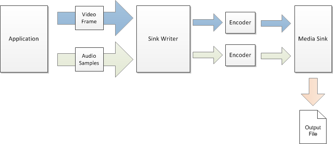

# Sink Writer

The sink writer is a component for encoding audio or video files.

The following diagram shows, at a high level, how an application uses the sink writer to encode and audio/video file.

The sink writer hosts a media sink and optionally one or more encoders. The encoders convert uncompressed audio or video data to encoded bitstreams. The media sink outputs the bitstreams to a file. The sink writer performs the following tasks:

-   Loads the media sink.
-   Finds and loads the encoders.
-   Manages the data flow to the encoders and the media sink.

The application passes audio/video data to the sink writer as input. It does not matter how the application obtains or generates the input data. One option is to use the [Source Reader](source-reader.md), as shown in the following diagram. However, the sink writer does not require the use of the source reader. These two components are independent.

## In this section

-   [Using the Sink Writer](using-the-sink-writer.md)
-   [Tutorial: Using the Sink Writer to Encode Video](tutorial--using-the-sink-writer-to-encode-video.md)

## Related topics

<dl> <dt>

[Encoding and File Authoring](encoding-and-file-authoring.md)
</dt> <dt>

[Overview of Encoding in Media Foundation](overview-of-encoding-in-media-foundation.md)
</dt> </dl>

 

 

