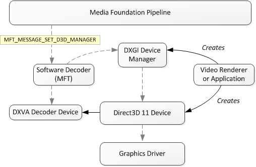

# Supporting Direct3D 11 Video Decoding in Media Foundation

This topic describes how to support Microsoft Direct3D 11 in a Microsoft Media Foundation decoder. Specifically, it describes the communication between the decoder and the video renderer. This topic does not describe how to implement the decoding operations.

-   [Overview](#overview)
-   [Open a Device Handle](#open-a-device-handle)
-   [Find a Decoder Configuration](#find-a-decoder-configuration)
-   [Fallback to Software Decoding](#fallback-to-software-decoding)
-   [Allocating Uncompressed Buffers](#allocating-uncompressed-buffers)
-   [Decoding](#supporting-direct3d-11-video-decoding-in-media-foundation)
-   [Related topics](#related-topics)

## Overview

In the remainder of this topic, the following terms are used:

-   **Software decoder**. The software decoder is the Media Foundation transform (MFT) that receives compressed video samples and outputs uncompressed video frames.
-   **Decoder device**. The decoder device is the video accelerator, and is implemented by the graphics driver. The decoder device performs accelerated decoding operations.
-   **Pipeline**. The pipeline hosts the software decoder and delivers buffers to and from the software decoder. Depending on the application, the pipeline might be the [Media Session](media-session.md), the [Source Reader](source-reader.md), or application code that directly calls into the MFT.

To perform decoding using Direct3D 11, the software decoder must have a pointer to a Direct3D 11 device. The Direct3D 11 device is created externally to the software decoder. In a [Media Session](media-session.md) scenario, the video renderer creates the Direct3D 11 device. In a [Source Reader](source-reader.md) scenario, typically the application creates the Direct3D 11 device.

The DXGI Device Manager is used to share the Direct3D 11 between components. The DXGI Device Manager exposes the [**IMFDXGIDeviceManager**](/windows/desktop/api/mfobjects/nn-mfobjects-imfdxgidevicemanager) interface. The pipeline sets the **IMFDXGIDeviceManager** pointer on the software decoder by sending the [**MFT\_MESSAGE\_SET\_D3D\_MANAGER**](mft-message-set-d3d-manager.md) message.

The following diagram shows the relation between the software decoder, the Direct3D 11, and the pipeline.

Here are the basic steps that a software decoder must perform to support Direct3D 11 in Media Foundation:

1.  Open a handle to the Direct3D 11 device.
2.  Find a decoder configuration.
3.  Allocate uncompressed buffers.
4.  Decode frames.

These steps are described in more detail in the remainder of this topic.

## Open a Device Handle

The decoder MFT uses the DXGI device manager to get a handle to the Direct3D 11 device. To open the device handle, perform the following steps:

1.  The decoder MFT must expose the [MF\_SA\_D3D11\_AWARE](mf-sa-d3d11-aware.md) attribute with the value **TRUE**.
2.  The Topology Loader queries this attribute by calling [**IMFTransform::GetAttributes**](/windows/desktop/api/mftransform/nf-mftransform-imftransform-getattributes). The value **TRUE** indicates that the MFT supports Direct3D 11.
3.  The Topology Loader calls [**IMFTransform::ProcessMessage**](/windows/desktop/api/mftransform/nf-mftransform-imftransform-processmessage) with the [**MFT\_MESSAGE\_SET\_D3D\_MANAGER**](mft-message-set-d3d-manager.md) message. The *ulParam* parameter is an [**IUnknown**](/windows/win32/api/unknwn/nn-unknwn-iunknown) pointer to the DXGI device manager. Query this pointer for the [**IMFDXGIDeviceManager**](/windows/desktop/api/mfobjects/nn-mfobjects-imfdxgidevicemanager) interface.
4.  Call [**IMFDXGIDeviceManager::OpenDeviceHandle**](/windows/desktop/api/mfobjects/nf-mfobjects-imfdxgidevicemanager-opendevicehandle) to get a handle to the Direct3D 11 device.
5.  To get a pointer to the Direct3D 11 device, call [**IMFDXGIDeviceManager::GetVideoService**](/windows/desktop/api/mfobjects/nf-mfobjects-imfdxgidevicemanager-getvideoservice). Pass in the device handle and the value **IID\_ID3D11Device**. The method returns a pointer to the [**ID3D11Device**](/windows/win32/api/d3d11/nn-d3d11-id3d11device) interface.
6.  To get a pointer to the video accelerator, call [**IMFDXGIDeviceManager::GetVideoService**](/windows/desktop/api/mfobjects/nf-mfobjects-imfdxgidevicemanager-getvideoservice) again. This time, pass in the device handle and the value **IID\_ID3D11VideoDevice**. The method returns a pointer to the [**ID3D11VideoDevice**](/windows/desktop/api/d3d11/nn-d3d11-id3d11videodevice) interface.
7.  Call [**ID3D11Device::GetImmediateContext**](/windows/win32/api/d3d11/nf-d3d11-id3d11device-getimmediatecontext) to get an [**ID3D11DeviceContext**](/windows/win32/api/d3d11/nn-d3d11-id3d11devicecontext) pointer.
8.  Call [**QueryInterface**](/windows/win32/api/unknwn/nf-unknwn-iunknown-queryinterface(q)) on the [**ID3D11DeviceContext**](/windows/win32/api/d3d11/nn-d3d11-id3d11devicecontext) to get an [**ID3D11VideoContext**](/windows/desktop/api/d3d11/nn-d3d11-id3d11videocontext) pointer.
9.  It is recommended that you use multi-thread protection on the device context to prevent deadlock issues that can sometimes happen when you call [**ID3D11VideoContext::GetDecoderBuffer**](/windows/desktop/api/d3d11/nf-d3d11-id3d11videocontext-getdecoderbuffer) or [**ID3D11VideoContext::ReleaseDecoderBuffer**](/windows/desktop/api/d3d11/nf-d3d11-id3d11videocontext-releasedecoderbuffer). To set multi-thread protection, first call [**QueryInterface**](/windows/win32/api/unknwn/nf-unknwn-iunknown-queryinterface(q)) on [**ID3D11Device**](/windows/win32/api/d3d11/nn-d3d11-id3d11device) to get an [**ID3D10Multithread**](/windows/win32/api/d3d10/nn-d3d10-id3d10multithread) pointer. Then call [**ID3D10Multithread::SetMultithreadProtected**](/windows/win32/api/d3d10/nf-d3d10-id3d10multithread-setmultithreadprotected), passing in **true** for *bMTProtect*.

## Find a Decoder Configuration

To perform decoding, the software decoder must find a compatible configuration that is supported by the decoder device, including a render-target format. This step occurs inside the [**IMFTransform::SetInputType**](/windows/desktop/api/mftransform/nf-mftransform-imftransform-setinputtype) method, as follows.

1.  Validate the input media type. If the type is rejected, skip the remaining steps and return an error code.
2.  Call [**ID3D11VideoDevice::GetVideoDecoderProfileCount**](/windows/desktop/api/d3d11/nf-d3d11-id3d11videodevice-getvideodecoderprofilecount) to get the number of supported profiles.
3.  Call [**ID3D11VideoDevice::GetVideoDecoderProfile**](/windows/desktop/api/d3d11/nf-d3d11-id3d11videodevice-getvideodecoderprofile) to enumerate the profiles and get the profile GUIDs.
4.  Look for a profile GUID that matches the video format and the capabilities of the software decoder. For example, an MPEG-2 decoder would look for **D3D11\_DECODER\_PROFILE\_MPEG2\_MOCOMP**,**D3D11\_DECODER\_PROFILE\_MPEG2\_IDCT**, and **D3D11\_DECODER\_PROFILE\_MPEG2\_VLD**.
5.  If a suitable decoder GUID is found, check the output format by calling the [**ID3D11VideoDevice::CheckVideoDecoderFormat**](/windows/desktop/api/d3d11/nf-d3d11-id3d11videodevice-checkvideodecoderformat) method. Pass in the decoder GUID and a **DXGI\_FORMAT** value that specifies the render-target format.
6.  Next, find a suitable configuration for the decoder.
    1.  Call [**ID3D11VideoDevice::GetVideoDecoderConfigCount**](/windows/desktop/api/d3d11/nf-d3d11-id3d11videodevice-getvideodecoderconfigcount) to get the number of decoder configurations. Pass in the same decoder device GUID, along with a [**D3D11\_VIDEO\_DECODER\_DESC**](/windows/desktop/api/d3d11/ns-d3d11-d3d11_video_decoder_desc) structure that describes the proposed render-target format.
    2.  Call [**ID3D11VideoDevice::GetVideoDecoderConfig**](/windows/desktop/api/d3d11/nf-d3d11-id3d11videodevice-getvideodecoderconfig) to enumerate the decoder configurations.

In the [**IMFTransform::GetOutputAvailableType**](/windows/desktop/api/mftransform/nf-mftransform-imftransform-getoutputavailabletype) method, return an uncompressed video format based on the proposed render-target format.

In the [**IMFTransform::SetOutputType**](/windows/desktop/api/mftransform/nf-mftransform-imftransform-setoutputtype) method, check the media type against the render target format.

## Fallback to Software Decoding

The MFT might be unable to find a configuration. For example, the graphics driver might not support the right capabilities. In that case, the MFT must fall back to software decoding, as follows.

1.  The [**SetInputType**](/windows/desktop/api/mftransform/nf-mftransform-imftransform-setinputtype) and [**SetOutputType**](/windows/desktop/api/mftransform/nf-mftransform-imftransform-setoutputtype) methods should both return **MF\_E\_UNSUPPORTED\_D3D\_TYPE**.
2.  In response, the Topology Loader will send the [**MFT\_MESSAGE\_SET\_D3D\_MANAGER**](mft-message-set-d3d-manager.md) message with the value **NULL** for the *ulParam* parameter.
3.  The MFT releases its pointer to the [**IMFDXGIDeviceManager**](/windows/desktop/api/mfobjects/nn-mfobjects-imfdxgidevicemanager) interface.
4.  The Topology Loader renegotiates the media type.

At this point, the MFT can use software decoding.

## Allocating Uncompressed Buffers

The decoder is responsible for allocating Direct3D 11 textures to use as uncompressed video buffers. The [MF\_SA\_MINIMUM\_OUTPUT\_SAMPLE\_COUNT](mf-sa-minimum-output-sample-count.md) attribute in the output stream attributes (see[**IMFTransform::GetOutputStreamAttributes**](/windows/desktop/api/mftransform/nf-mftransform-imftransform-getoutputstreamattributes)) is used to determine how many surfaces the decoder should allocate for the video renderer to use for deinterlacing . A decoder should use this value bounding it for some reasonable upper and lower limits, for example 3-32. For progressive content see [MF\_SA\_MINIMUM\_OUTPUT\_SAMPLE\_COUNT\_PROGRESSIVE](mf-sa-minimum-output-sample-count-progressive.md).

In the [**IMFTransform::GetOutputStreamInfo**](/windows/desktop/api/mftransform/nf-mftransform-imftransform-getoutputstreaminfo) method, set the **MFT\_OUTPUT\_STREAM\_PROVIDES\_SAMPLES** flag in the [**MFT\_OUTPUT\_STREAM\_INFO**](/windows/win32/api/mftransform/ne-mftransform-_mft_output_stream_info_flags) structure. This flag notifies the Media Session that the MFT allocates its own output samples. To allocate the output samples, the MFT performs the following steps:

1.  Create a 2D texture array by calling [**ID3D11Device::CreateTexture2D**](/windows/win32/api/d3d11/nf-d3d11-id3d11device-createtexture2d). In the [**D3D11\_TEXTURE2D\_DESC**](/windows/win32/api/d3d11/ns-d3d11-d3d11_texture2d_desc) structure, set **ArraySize** equal to the number of surfaces that the decoder needs. This includes:
    -   Surfaces for reference frames.
    -   Surfaces for deinterlacing (three surfaces).
    -   Surfaces that the decoder needs for buffering.

    The binding flags (**BindFlags**) should include the **D3D11\_BIND\_DECODER** flag and any bind flags set through the [MF\_SA\_D3D11\_BINDFLAGS](mf-sa-d3d11-bindflags.md) attribute in the output stream attributes.
2.  For each surface in the texture array, call [**ID3D11VideoDevice::CreateVideoDecoderOutputView**](/windows/desktop/api/d3d11/nf-d3d11-id3d11videodevice-createvideodecoderoutputview) to create a video decoder output view. During decoding, these output views will be passed to the [**ID3D11VideoContext::DecoderBeginFrame**](/windows/desktop/api/d3d11/nf-d3d11-id3d11videocontext-decoderbeginframe) method.
3.  For each surface in the texture array, create a media sample as follows:
    1.  Create a DXGI media buffer by calling the [**MFCreateDXGISurfaceBuffer**](/windows/desktop/api/mfapi/nf-mfapi-mfcreatedxgisurfacebuffer) function. Pass in the [**ID3D11Texture2D**](/windows/win32/api/d3d11/nn-d3d11-id3d11texture2d) pointer and the offset for each element in the texture array. The function returns an [**IMFMediaBuffer**](/windows/desktop/api/mfobjects/nn-mfobjects-imfmediabuffer) pointer.
    2.  Create an empty media sample by calling the [**MFCreateVideoSampleFromSurface**](/windows/desktop/api/evr/nc-evr-mfcreatevideosamplefromsurface) function. Set the *pUnkSurface* parameter equal to **NULL**. The function returns an [**IMFSample**](/windows/desktop/api/mfobjects/nn-mfobjects-imfsample) pointer.
    3.  Call [**IMFSample::AddBuffer**](/windows/desktop/api/mfobjects/nf-mfobjects-imfsample-addbuffer) to add the media buffer to the sample.

You should destroy all the textures you create at the same time, rather then destroying only some and continuing to use the reminder.

## Decoding

To create the decoder device, call [**ID3D11VideoDevice::CreateVideoDecoder**](/windows/desktop/api/d3d11/nf-d3d11-id3d11videodevice-createvideodecoder). The method returns a pointer to the [**ID3D11VideoDecoder**](/windows/desktop/api/d3d11/nn-d3d11-id3d11videodecoder) interface. Decoding should occur inside the [**IMFTransform::ProcessOutput**](/windows/desktop/api/mftransform/nf-mftransform-imftransform-processoutput) method. On each frame, call [**IMFDXGIDeviceManager::TestDevice**](/windows/desktop/api/mfobjects/nf-mfobjects-imfdxgidevicemanager-testdevice) to test the availability of the DXGI. If the device has changed, the software decoder must recreate the decoder device, as follows:

1.  Close the device handle by calling [**IMFDXGIDeviceManager::CloseDeviceHandle**](/windows/desktop/api/mfobjects/nf-mfobjects-imfdxgidevicemanager-closedevicehandle).
2.  Release all resources associated with the previous Direct3D 11 device, including the [**ID3D11VideoDecoder**](/windows/desktop/api/d3d11/nn-d3d11-id3d11videodecoder), [**ID3D11VideoContext**](/windows/desktop/api/d3d11/nn-d3d11-id3d11videocontext), [**ID3D11Texture2D**](/windows/win32/api/d3d11/nn-d3d11-id3d11texture2d), and [**ID3D11VideoDecoderOutputView**](/windows/desktop/api/d3d11/nn-d3d11-id3d11videodecoderoutputview) interfaces.
3.  Open a new device handle.
4.  Negotiate a new decoder configuration, as described previously in [Find a Decoder Configuration](#find-a-decoder-configuration). This step is necessary because the device capabilities might have changed.
5.  Create a new decoder device.

Assuming that the device handle is valid, the decoding process works as follows:

1.  Get an available surface that is not currently in use. Initially, all of the surfaces are available.
2.  Query the media sample for the [**IMFTrackedSample**](/windows/win32/api/mfidl/nn-mfidl-imftrackedsample) interface.
3.  Call [**IMFTrackedSample::SetAllocator**](/windows/win32/api/mfidl/nf-mfidl-imftrackedsample-setallocator) and provide a pointer to the [**IMFAsyncCallback**](/windows/desktop/api/mfobjects/nn-mfobjects-imfasynccallback) interface. (The software decoder must implement this interface.) When the video renderer releases the sample, the callback will be invoked. Use this callback to keep track of which samples are currently available and which are in use.
4.  Call [**ID3D11VideoContext::DecoderBeginFrame**](/windows/desktop/api/d3d11/nf-d3d11-id3d11videocontext-decoderbeginframe). Pass in the pointers to the [**ID3D11VideoDecoder**](/windows/desktop/api/d3d11/nn-d3d11-id3d11videodecoder) interface for the decoder device and the [**ID3D11VideoDecoderOutputView**](/windows/desktop/api/d3d11/nn-d3d11-id3d11videodecoderoutputview) interface for the output view.
5.  Do the following one or more times:
    1.  Call [**ID3D11VideoContext::GetDecoderBuffer**](/windows/desktop/api/d3d11/nf-d3d11-id3d11videocontext-getdecoderbuffer) to get a buffer.
    2.  Fill the buffer.
    3.  Call [**ID3D11VideoContext::ReleaseDecoderBuffer**](/windows/desktop/api/d3d11/nf-d3d11-id3d11videocontext-releasedecoderbuffer).
    4.  Call [**ID3D11VideoContext::SubmitDecoderBuffer**](/windows/desktop/api/d3d11/nf-d3d11-id3d11videocontext-submitdecoderbuffers). This method instructs the decoder device to perform the decoding operations on the frame.
6.  Call [**ID3D11VideoContext::DecoderEndFrame**](/windows/desktop/api/d3d11/nf-d3d11-id3d11videocontext-decoderendframe) to signal the end of decoding for the current frame.

Direct3D 11 uses the same data structures as DXVA 2.0 for decoding operations. For the original set of DXVA profiles (for H.261, H.263, and MPEG-2), these data structures are described in the [DXVA 1.0 specification](/windows-hardware/drivers/display/directx-video-acceleration).

Within each pair of [**DecoderBeginFrame**](/windows/desktop/api/d3d11/nf-d3d11-id3d11videocontext-decoderbeginframe) and [**SubmitDecoderBuffer**](/windows/desktop/api/d3d11/nf-d3d11-id3d11videocontext-submitdecoderbuffers) calls, you may call [**GetDecoderBuffer**](/windows/desktop/api/d3d11/nf-d3d11-id3d11videocontext-getdecoderbuffer) multiple times, but only once for each type of buffer. If you use the same buffer type twice without calling **SubmitDecoderBuffer**, you will overwrite the data in the buffer.

## Related topics

<dl> <dt>

[Direct3D 11 Video APIs](direct3d-11-video-apis.md)
</dt> <dt>

[DirectX Video Acceleration 2.0](directx-video-acceleration-2-0.md)
</dt> </dl>

 

 
