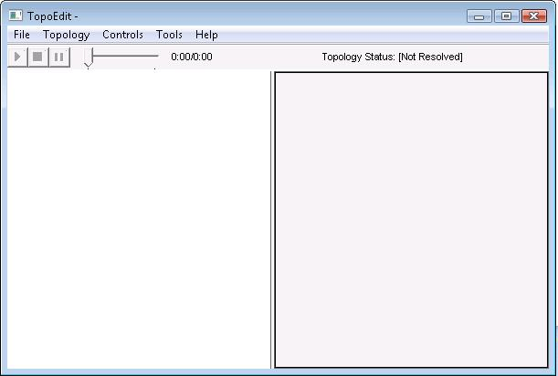

# TopoEdit Main Window

After launching TopoEdit, the window shown in the following screen shot appears.

The TopoEdit main window elements are:

-   **Topology Pane**. Appears on the left of the window. This area is used to add topology nodes, view a topology, and connect the topology nodes. For information about using this pane, see [Building Topologies by Using TopoEdit](building-topologies-by-using-topoedit.md).
-   **Attributes Pane**. Appears on the right of the window. This pane displays the attributes of the currently selected topology node. For information about the attributes that are shown on this pane, see [Viewing Topology Information](viewing-topology-information.md).
-   Menus. See [TopoEdit Menus](topoedit-menus.md).
-   Toolbar. See [TopoEdit Toolbar](topoedit-toolbar.md).

## Related topics

<dl> <dt>

[Introduction to TopoEdit](introduction-to-topoedit.md)
</dt> <dt>

[TopoEdit](topoedit.md)
</dt> </dl>

 

 

