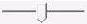

# TopoEdit Toolbar

By default, the toolbar is displayed across the top of the application window and below the menu bar. The toolbar provides quick mouse access to the [Controls Menu](controls-menu.md) items. The toolbar buttons are enabled only after a topology is resolved successfully.

The following screen shot shows the TopoEdit toolbar.

The following table describes the toolbar buttons:

| Toolbar Button | Description | 
|----------------|-------------|
|  | Play button. Starts playback of the last resolved topology. | 
|  | Stop button. Stops playback of the last resolved topology that is currently playing. | 
|  | Pause button. Pauses playback of the last resolved topology that is currently playing. | 
|  | Seek bar. Shows the playback progress. Use this bar to seek to different points in the timeline during playback. | 
|  | Playback timer. Current presentation time and total playback duration in seconds. | 
|  | Rate bar. Shows the current playback rate. Use this bar to increase or decrease the rate. <blockquote>[!Note] The playback rate depends on the rates that are supported by the topology. For more information about rate control support in Media Foundation and the associated APIs, see <a href="rate-control.md">Rate Control</a>.</blockquote>  | 
|  | Topology status. When a topology is resolved, the status is <strong>[Resolved]</strong>.  If the topology is modified, the status is changed to <strong>[Not Resolved]</strong>.  | 

 

## Related topics

<dl> <dt>

[Playback Controls in TopoEdit](playback-controls-in-topoedit.md)
</dt> <dt>

[Introduction to TopoEdit](introduction-to-topoedit.md)
</dt> <dt>

[TopoEdit](topoedit.md)
</dt> </dl>

 

 

