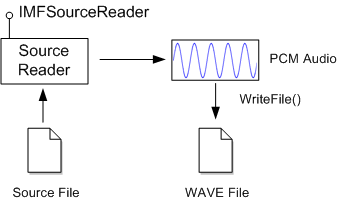

# Tutorial: Decoding Audio

This tutorial shows how to use the [Source Reader](source-reader.md) to decode audio from a media file and write the audio to a WAVE file. The tutorial is based on the [Audio Clip](audio-clip-sample.md) sample.

-   [Overview](#overview)
-   [Header and Library Files](#header-and-library-files)
-   [Implement wmain](#implement-wmain)
-   [Write the WAVE File](#write-the-wave-file)
-   [Configure the Source Reader](#configure-the-source-reader)
-   [Write the WAVE File Header](#write-the-wave-file-header)
-   [Calculate the Maximum Data Size](#calculate-the-maximum-data-size)
-   [Decode the Audio](#decode-the-audio)
-   [Finalize the File Header](#finalize-the-file-header)
-   [Related topics](#related-topics)

## Overview

In this tutorial, you will create a console application that takes two command-line arguments: The name of an input file that contains an audio stream, and the output file name. The application reads five seconds of audio data from the input file and writes the audio to the output file as WAVE data.

To get the decoded audio data, the application uses the source reader object. The source reader exposes the [**IMFSourceReader**](/windows/desktop/api/mfreadwrite/nn-mfreadwrite-imfsourcereader) interface. To write the decoded audio to the WAVE file, the applications uses Windows I/O functions. The following image illustrates this process.



In its simplest form, a WAVE file has the following structure:


| Data Type                              | Size (Bytes) | Value                                                                 |
|----------------------------------------|--------------|-----------------------------------------------------------------------|
| **FOURCC**                             | 4            | 'RIFF'                                                                |
| **DWORD**                              | 4            | Total file size, not including the first 8 bytes                      |
| **FOURCC**                             | 4            | 'WAVE'                                                                |
| **FOURCC**                             | 4            | 'fmt '                                                                |
| **DWORD**                              | 4            | Size of the [**WAVEFORMATEX**](/previous-versions/dd757713(v=vs.85)) data that follows. |
| [**WAVEFORMATEX**](/previous-versions/dd757713(v=vs.85)) | Varies       | Audio format header.                                                  |
| **FOURCC**                             | 4            | 'data'                                                                |
| **DWORD**                              | 4            | Size of the audio data.                                               |
| **BYTE**\[\]                           | Varies       | Audio data.                                                           |


 

> [!Note]  
> A **FOURCC** is a **DWORD** formed by concatenating four ASCII characters.

 

This basic structure can be extended by adding file metadata and other information, which is beyond the scope of this tutorial.

## Header and Library Files

Include the following header files in your project:


```C++
#define WINVER _WIN32_WINNT_WIN7

#include <windows.h>
#include <mfapi.h>
#include <mfidl.h>
#include <mfreadwrite.h>
#include <stdio.h>
#include <mferror.h>
```


Link to the following libraries:

-   mfplat.lib
-   mfreadwrite.lib
-   mfuuid.lib

## Implement wmain

The following code shows the entry-point function for the application.


```C++
int wmain(int argc, wchar_t* argv[])
{
    HeapSetInformation(NULL, HeapEnableTerminationOnCorruption, NULL, 0);

    if (argc != 3)
    {
        printf("arguments: input_file output_file.wav\n");
        return 1;
    }

    const WCHAR *wszSourceFile = argv[1];
    const WCHAR *wszTargetFile = argv[2];

    const LONG MAX_AUDIO_DURATION_MSEC = 5000; // 5 seconds

    HRESULT hr = S_OK;

    IMFSourceReader *pReader = NULL;
    HANDLE hFile = INVALID_HANDLE_VALUE;

    // Initialize the COM library.
    hr = CoInitializeEx(NULL, COINIT_APARTMENTTHREADED | COINIT_DISABLE_OLE1DDE);

    // Initialize the Media Foundation platform.
    if (SUCCEEDED(hr))
    {
        hr = MFStartup(MF_VERSION);
    }

    // Create the source reader to read the input file.
    if (SUCCEEDED(hr))
    {
        hr = MFCreateSourceReaderFromURL(wszSourceFile, NULL, &pReader);
        if (FAILED(hr))
        {
            printf("Error opening input file: %S\n", wszSourceFile, hr);
        }
    }

    // Open the output file for writing.
    if (SUCCEEDED(hr))
    {
        hFile = CreateFile(wszTargetFile, GENERIC_WRITE, FILE_SHARE_READ, NULL,
            CREATE_ALWAYS, 0, NULL);

        if (hFile == INVALID_HANDLE_VALUE)
        {
            hr = HRESULT_FROM_WIN32(GetLastError());
            printf("Cannot create output file: %S\n", wszTargetFile, hr);
        }
    }

    // Write the WAVE file.
    if (SUCCEEDED(hr))
    {
        hr = WriteWaveFile(pReader, hFile, MAX_AUDIO_DURATION_MSEC);
    }

    if (FAILED(hr))
    {
        printf("Failed, hr = 0x%X\n", hr);
    }

    // Clean up.
    if (hFile != INVALID_HANDLE_VALUE)
    {
        CloseHandle(hFile);
    }

    SafeRelease(&pReader);
    MFShutdown();
    CoUninitialize();

    return SUCCEEDED(hr) ? 0 : 1;
};
```


This function does the following:

1.  Calls [**CoInitializeEx**](/windows/win32/api/combaseapi/nf-combaseapi-coinitializeex) to initialize the COM library.
2.  Calls [**MFStartup**](/windows/desktop/api/mfapi/nf-mfapi-mfstartup) to initialize the Media Foundation platform.
3.  Calls [**MFCreateSourceReaderFromURL**](/windows/desktop/api/mfreadwrite/nf-mfreadwrite-mfcreatesourcereaderfromurl) to create the source reader. This function takes the name of the input file and receives an [**IMFSourceReader**](/windows/desktop/api/mfreadwrite/nn-mfreadwrite-imfsourcereader) interface pointer.
4.  Creates the output file by calling the **CreateFile** function, which returns a file handle.
5.  Calls the application-defined [WriteWavFile](#write-the-wave-file) function. This function decodes the audio and writes the WAVE file.
6.  Releases the [**IMFSourceReader**](/windows/desktop/api/mfreadwrite/nn-mfreadwrite-imfsourcereader) pointer and the file handle.
7.  Calls [**MFShutdown**](/windows/desktop/api/mfapi/nf-mfapi-mfshutdown) to shut down the Media Foundation platform.
8.  Calls [**CoUninitialize**](/windows/win32/api/combaseapi/nf-combaseapi-couninitialize) to release the COM library.

## Write the WAVE File

Most of the work happens in the `WriteWavFile` function, which is called from `wmain`.


```C++
//-------------------------------------------------------------------
// WriteWaveFile
//
// Writes a WAVE file by getting audio data from the source reader.
//
//-------------------------------------------------------------------

HRESULT WriteWaveFile(
    IMFSourceReader *pReader,   // Pointer to the source reader.
    HANDLE hFile,               // Handle to the output file.
    LONG msecAudioData          // Maximum amount of audio data to write, in msec.
    )
{
    HRESULT hr = S_OK;

    DWORD cbHeader = 0;         // Size of the WAVE file header, in bytes.
    DWORD cbAudioData = 0;      // Total bytes of PCM audio data written to the file.
    DWORD cbMaxAudioData = 0;

    IMFMediaType *pAudioType = NULL;    // Represents the PCM audio format.

    // Configure the source reader to get uncompressed PCM audio from the source file.

    hr = ConfigureAudioStream(pReader, &pAudioType);

    // Write the WAVE file header.
    if (SUCCEEDED(hr))
    {
        hr = WriteWaveHeader(hFile, pAudioType, &cbHeader);
    }

    // Calculate the maximum amount of audio to decode, in bytes.
    if (SUCCEEDED(hr))
    {
        cbMaxAudioData = CalculateMaxAudioDataSize(pAudioType, cbHeader, msecAudioData);

        // Decode audio data to the file.
        hr = WriteWaveData(hFile, pReader, cbMaxAudioData, &cbAudioData);
    }

    // Fix up the RIFF headers with the correct sizes.
    if (SUCCEEDED(hr))
    {
        hr = FixUpChunkSizes(hFile, cbHeader, cbAudioData);
    }

    SafeRelease(&pAudioType);
    return hr;
}
```


This function calls a series of other application-defined functions:

1.  The [ConfigureAudioStream](#configure-the-source-reader) function initializes the source reader. This function receives a pointer to the [**IMFMediaType**](/windows/desktop/api/mfobjects/nn-mfobjects-imfmediatype) interface, which is used to get a description of the decoded audio format, including sample rate, number of channels, and bit depth (bits per sample).
2.  The WriteWaveHeader function writes the first part of the WAVE file, including the header and the start of the 'data' chunk.
3.  The CalculateMaxAudioDataSize function calculates the maximum amount of audio to write to the file, in bytes.
4.  The WriteWaveData function writes the PCM audio data to the file.
5.  The FixUpChunkSizes function writes the file-size information that appears after the 'RIFF' and 'data' **FOURCC** values in the WAVE file. (These values are not known until `WriteWaveData` completes.)

These functions are shown in the remaining sections of this tutorial.

## Configure the Source Reader

The `ConfigureAudioStream` function configures the source reader to decode the audio stream in the source file. It also returns information about the format of the decoded audio.

In Media Foundation, media formats are described using *media type* objects. A media type object exposes the [**IMFMediaType**](/windows/desktop/api/mfobjects/nn-mfobjects-imfmediatype) interface, which inherits the [**IMFAttributes**](/windows/desktop/api/mfobjects/nn-mfobjects-imfattributes) interface. Essentially, a media type is a collection of properties that describe the format. For more information, see [Media Types](media-types.md).


```C++
//-------------------------------------------------------------------
// ConfigureAudioStream
//
// Selects an audio stream from the source file, and configures the
// stream to deliver decoded PCM audio.
//-------------------------------------------------------------------

HRESULT ConfigureAudioStream(
    IMFSourceReader *pReader,   // Pointer to the source reader.
    IMFMediaType **ppPCMAudio   // Receives the audio format.
    )
{
    IMFMediaType *pUncompressedAudioType = NULL;
    IMFMediaType *pPartialType = NULL;

    // Select the first audio stream, and deselect all other streams.
    HRESULT hr = pReader->SetStreamSelection(
        (DWORD)MF_SOURCE_READER_ALL_STREAMS, FALSE);

    if (SUCCEEDED(hr))
    {
        hr = pReader->SetStreamSelection(
            (DWORD)MF_SOURCE_READER_FIRST_AUDIO_STREAM, TRUE);
    }

    // Create a partial media type that specifies uncompressed PCM audio.
    hr = MFCreateMediaType(&pPartialType);

    if (SUCCEEDED(hr))
    {
        hr = pPartialType->SetGUID(MF_MT_MAJOR_TYPE, MFMediaType_Audio);
    }

    if (SUCCEEDED(hr))
    {
        hr = pPartialType->SetGUID(MF_MT_SUBTYPE, MFAudioFormat_PCM);
    }

    // Set this type on the source reader. The source reader will
    // load the necessary decoder.
    if (SUCCEEDED(hr))
    {
        hr = pReader->SetCurrentMediaType(
            (DWORD)MF_SOURCE_READER_FIRST_AUDIO_STREAM,
            NULL, pPartialType);
    }

    // Get the complete uncompressed format.
    if (SUCCEEDED(hr))
    {
        hr = pReader->GetCurrentMediaType(
            (DWORD)MF_SOURCE_READER_FIRST_AUDIO_STREAM,
            &pUncompressedAudioType);
    }

    // Ensure the stream is selected.
    if (SUCCEEDED(hr))
    {
        hr = pReader->SetStreamSelection(
            (DWORD)MF_SOURCE_READER_FIRST_AUDIO_STREAM,
            TRUE);
    }

    // Return the PCM format to the caller.
    if (SUCCEEDED(hr))
    {
        *ppPCMAudio = pUncompressedAudioType;
        (*ppPCMAudio)->AddRef();
    }

    SafeRelease(&pUncompressedAudioType);
    SafeRelease(&pPartialType);
    return hr;
}
```


The `ConfigureAudioStream` function does the following:

1.  Calls the [**IMFSourceReader::SetStreamSelection**](/windows/desktop/api/mfreadwrite/nf-mfreadwrite-imfsourcereader-setstreamselection) method to select the audio stream and deselect all other streams. This step can improve performance, because it prevents the source reader from holding onto video frames that the application does not use.
2.  Creates a *partial* media type that specifies PCM audio. The function creates the partial type as follows:
    1.  Calls [**MFCreateMediaType**](/windows/desktop/api/mfapi/nf-mfapi-mfcreatemediatype) to create an empty media type object.
    2.  Sets the [**MF\_MT\_MAJOR\_TYPE**](mf-mt-major-type-attribute.md) attribute to **MFMediaType\_Audio**.
    3.  Sets the [**MF\_MT\_SUBTYPE**](mf-mt-subtype-attribute.md) attribute to **MFAudioFormat\_PCM**.
3.  Calls [**IMFSourceReader::SetCurrentMediaType**](/windows/desktop/api/mfreadwrite/nf-mfreadwrite-imfsourcereader-setcurrentmediatype) to set the partial type on the source reader. If the source file contains encoded audio, the source reader automatically loads the necessary audio decoder.
4.  Calls [**IMFSourceReader::GetCurrentMediaType**](/windows/desktop/api/mfreadwrite/nf-mfreadwrite-imfsourcereader-getcurrentmediatype) to get the actual PCM media type. This method returns a media type with all of the format details filled in, such as the audio sample rate and the number of channels.
5.  Calls [**IMFSourceReader::SetStreamSelection**](/windows/desktop/api/mfreadwrite/nf-mfreadwrite-imfsourcereader-setstreamselection) to enable the audio stream.

## Write the WAVE File Header

The `WriteWaveHeader` function writes the WAVE file header.

The only Media Foundation API called from this function is [**MFCreateWaveFormatExFromMFMediaType**](/windows/desktop/api/mfapi/nf-mfapi-mfcreatewaveformatexfrommfmediatype), which converts the media type to a [**WAVEFORMATEX**](/previous-versions/dd757713(v=vs.85)) structure.


```C++
//-------------------------------------------------------------------
// WriteWaveHeader
//
// Write the WAVE file header.
//
// Note: This function writes placeholder values for the file size
// and data size, as these values will need to be filled in later.
//-------------------------------------------------------------------

HRESULT WriteWaveHeader(
    HANDLE hFile,               // Output file.
    IMFMediaType *pMediaType,   // PCM audio format.
    DWORD *pcbWritten           // Receives the size of the header.
    )
{
    HRESULT hr = S_OK;
    UINT32 cbFormat = 0;

    WAVEFORMATEX *pWav = NULL;

    *pcbWritten = 0;

    // Convert the PCM audio format into a WAVEFORMATEX structure.
    hr = MFCreateWaveFormatExFromMFMediaType(pMediaType, &pWav, &cbFormat);

    // Write the 'RIFF' header and the start of the 'fmt ' chunk.
    if (SUCCEEDED(hr))
    {
        DWORD header[] = {
            // RIFF header
            FCC('RIFF'),
            0,
            FCC('WAVE'),
            // Start of 'fmt ' chunk
            FCC('fmt '),
            cbFormat
        };

        DWORD dataHeader[] = { FCC('data'), 0 };

        hr = WriteToFile(hFile, header, sizeof(header));

        // Write the WAVEFORMATEX structure.
        if (SUCCEEDED(hr))
        {
            hr = WriteToFile(hFile, pWav, cbFormat);
        }

        // Write the start of the 'data' chunk

        if (SUCCEEDED(hr))
        {
            hr = WriteToFile(hFile, dataHeader, sizeof(dataHeader));
        }

        if (SUCCEEDED(hr))
        {
            *pcbWritten = sizeof(header) + cbFormat + sizeof(dataHeader);
        }
    }


    CoTaskMemFree(pWav);
    return hr;
}
```


The `WriteToFile` function is a simple helper function that wraps the Windows **WriteFile** function and returns an **HRESULT** value.


```C++
//-------------------------------------------------------------------
//
// Writes a block of data to a file
//
// hFile: Handle to the file.
// p: Pointer to the buffer to write.
// cb: Size of the buffer, in bytes.
//
//-------------------------------------------------------------------

HRESULT WriteToFile(HANDLE hFile, void* p, DWORD cb)
{
    DWORD cbWritten = 0;
    HRESULT hr = S_OK;

    BOOL bResult = WriteFile(hFile, p, cb, &cbWritten, NULL);
    if (!bResult)
    {
        hr = HRESULT_FROM_WIN32(GetLastError());
    }
    return hr;
}
```


## Calculate the Maximum Data Size

Because the file size is stored as a 4-byte value in the file header, a WAVE file is limited to a maximum size of 0xFFFFFFFF bytes—approximately 4 GB. This value includes the size of the file header. PCM audio has a constant bit rate, so you can calculate the maximum data size from the audio format, as follows:


```C++
//-------------------------------------------------------------------
// CalculateMaxAudioDataSize
//
// Calculates how much audio to write to the WAVE file, given the
// audio format and the maximum duration of the WAVE file.
//-------------------------------------------------------------------

DWORD CalculateMaxAudioDataSize(
    IMFMediaType *pAudioType,    // The PCM audio format.
    DWORD cbHeader,              // The size of the WAVE file header.
    DWORD msecAudioData          // Maximum duration, in milliseconds.
    )
{
    UINT32 cbBlockSize = 0;         // Audio frame size, in bytes.
    UINT32 cbBytesPerSecond = 0;    // Bytes per second.

    // Get the audio block size and number of bytes/second from the audio format.

    cbBlockSize = MFGetAttributeUINT32(pAudioType, MF_MT_AUDIO_BLOCK_ALIGNMENT, 0);
    cbBytesPerSecond = MFGetAttributeUINT32(pAudioType, MF_MT_AUDIO_AVG_BYTES_PER_SECOND, 0);

    // Calculate the maximum amount of audio data to write.
    // This value equals (duration in seconds x bytes/second), but cannot
    // exceed the maximum size of the data chunk in the WAVE file.

        // Size of the desired audio clip in bytes:
    DWORD cbAudioClipSize = (DWORD)MulDiv(cbBytesPerSecond, msecAudioData, 1000);

    // Largest possible size of the data chunk:
    DWORD cbMaxSize = MAXDWORD - cbHeader;

    // Maximum size altogether.
    cbAudioClipSize = min(cbAudioClipSize, cbMaxSize);

    // Round to the audio block size, so that we do not write a partial audio frame.
    cbAudioClipSize = (cbAudioClipSize / cbBlockSize) * cbBlockSize;

    return cbAudioClipSize;
}
```


To avoid partial audio frames, the size is rounded to the block alignment, which is stored in the [**MF\_MT\_AUDIO\_BLOCK\_ALIGNMENT**](mf-mt-audio-block-alignment-attribute.md) attribute.

## Decode the Audio

The `WriteWaveData` function reads decoded audio from the source file and writes to the WAVE file.


```C++
//-------------------------------------------------------------------
// WriteWaveData
//
// Decodes PCM audio data from the source file and writes it to
// the WAVE file.
//-------------------------------------------------------------------

HRESULT WriteWaveData(
    HANDLE hFile,               // Output file.
    IMFSourceReader *pReader,   // Source reader.
    DWORD cbMaxAudioData,       // Maximum amount of audio data (bytes).
    DWORD *pcbDataWritten       // Receives the amount of data written.
    )
{
    HRESULT hr = S_OK;
    DWORD cbAudioData = 0;
    DWORD cbBuffer = 0;
    BYTE *pAudioData = NULL;

    IMFSample *pSample = NULL;
    IMFMediaBuffer *pBuffer = NULL;

    // Get audio samples from the source reader.
    while (true)
    {
        DWORD dwFlags = 0;

        // Read the next sample.
        hr = pReader->ReadSample(
            (DWORD)MF_SOURCE_READER_FIRST_AUDIO_STREAM,
            0, NULL, &dwFlags, NULL, &pSample );

        if (FAILED(hr)) { break; }

        if (dwFlags & MF_SOURCE_READERF_CURRENTMEDIATYPECHANGED)
        {
            printf("Type change - not supported by WAVE file format.\n");
            break;
        }
        if (dwFlags & MF_SOURCE_READERF_ENDOFSTREAM)
        {
            printf("End of input file.\n");
            break;
        }

        if (pSample == NULL)
        {
            printf("No sample\n");
            continue;
        }

        // Get a pointer to the audio data in the sample.

        hr = pSample->ConvertToContiguousBuffer(&pBuffer);

        if (FAILED(hr)) { break; }


        hr = pBuffer->Lock(&pAudioData, NULL, &cbBuffer);

        if (FAILED(hr)) { break; }


        // Make sure not to exceed the specified maximum size.
        if (cbMaxAudioData - cbAudioData < cbBuffer)
        {
            cbBuffer = cbMaxAudioData - cbAudioData;
        }

        // Write this data to the output file.
        hr = WriteToFile(hFile, pAudioData, cbBuffer);

        if (FAILED(hr)) { break; }

        // Unlock the buffer.
        hr = pBuffer->Unlock();
        pAudioData = NULL;

        if (FAILED(hr)) { break; }

        // Update running total of audio data.
        cbAudioData += cbBuffer;

        if (cbAudioData >= cbMaxAudioData)
        {
            break;
        }

        SafeRelease(&pSample);
        SafeRelease(&pBuffer);
    }

    if (SUCCEEDED(hr))
    {
        printf("Wrote %d bytes of audio data.\n", cbAudioData);

        *pcbDataWritten = cbAudioData;
    }

    if (pAudioData)
    {
        pBuffer->Unlock();
    }

    SafeRelease(&pBuffer);
    SafeRelease(&pSample);
    return hr;
}
```


The `WriteWaveData` function does the following in a loop:

1.  Calls [**IMFSourceReader::ReadSample**](/windows/desktop/api/mfreadwrite/nf-mfreadwrite-imfsourcereader-readsample) to read audio from the source file. The *dwFlags* parameter receives a bitwise **OR** of flags from the [**MF\_SOURCE\_READER\_FLAG**](/windows/desktop/api/mfreadwrite/ne-mfreadwrite-mf_source_reader_flag) enumeration. The *pSample* parameter receives a pointer to the [**IMFSample**](/windows/desktop/api/mfobjects/nn-mfobjects-imfsample) interface, which is used to access the audio data. In some cases a call to **ReadSample** does not generate data, in which case the **IMFSample** pointer is **NULL**.
2.  Checks *dwFlags* for the following flags:
    -   **MF\_SOURCE\_READERF\_CURRENTMEDIATYPECHANGED**. This flag indicates a format change in the source file. WAVE files do not support format changes.
    -   **MF\_SOURCE\_READERF\_ENDOFSTREAM**. This flag indicates the end of the stream.
3.  Calls [**IMFSample::ConvertToContiguousBuffer**](/windows/desktop/api/mfobjects/nf-mfobjects-imfsample-converttocontiguousbuffer) to get a pointer to a buffer object.
4.  Calls [**IMFMediaBuffer::Lock**](/windows/desktop/api/mfobjects/nf-mfobjects-imfmediabuffer-lock) to get a pointer to the buffer memory.
5.  Writes the audio data to the output file.
6.  Calls [**IMFMediaBuffer::Unlock**](/windows/desktop/api/mfobjects/nf-mfobjects-imfmediabuffer-unlock) to unlock the buffer object.

The function breaks out of the loop when any of the following occur:

-   The stream format changes.
-   The end of the stream is reached.
-   The maximum amount of audio data is written to the output file.
-   An error occurs.

## Finalize the File Header

The size values that are stored in the WAVE header are not known until the previous function completes. The `FixUpChunkSizes` fills in these values:


```C++
//-------------------------------------------------------------------
// FixUpChunkSizes
//
// Writes the file-size information into the WAVE file header.
//
// WAVE files use the RIFF file format. Each RIFF chunk has a data
// size, and the RIFF header has a total file size.
//-------------------------------------------------------------------

HRESULT FixUpChunkSizes(
    HANDLE hFile,           // Output file.
    DWORD cbHeader,         // Size of the 'fmt ' chuck.
    DWORD cbAudioData       // Size of the 'data' chunk.
    )
{
    HRESULT hr = S_OK;

    LARGE_INTEGER ll;
    ll.QuadPart = cbHeader - sizeof(DWORD);

    if (0 == SetFilePointerEx(hFile, ll, NULL, FILE_BEGIN))
    {
        hr = HRESULT_FROM_WIN32(GetLastError());
    }

    // Write the data size.

    if (SUCCEEDED(hr))
    {
        hr = WriteToFile(hFile, &cbAudioData, sizeof(cbAudioData));
    }

    if (SUCCEEDED(hr))
    {
        // Write the file size.
        ll.QuadPart = sizeof(FOURCC);

        if (0 == SetFilePointerEx(hFile, ll, NULL, FILE_BEGIN))
        {
            hr = HRESULT_FROM_WIN32(GetLastError());
        }
    }

    if (SUCCEEDED(hr))
    {
        DWORD cbRiffFileSize = cbHeader + cbAudioData - 8;

        // NOTE: The "size" field in the RIFF header does not include
        // the first 8 bytes of the file. (That is, the size of the
        // data that appears after the size field.)

        hr = WriteToFile(hFile, &cbRiffFileSize, sizeof(cbRiffFileSize));
    }

    return hr;
}
```


## Related topics

<dl> <dt>

[Audio Media Types](audio-media-types.md)
</dt> <dt>

[Source Reader](source-reader.md)
</dt> <dt>

[**IMFSourceReader**](/windows/desktop/api/mfreadwrite/nn-mfreadwrite-imfsourcereader)
</dt> </dl>

 

 
