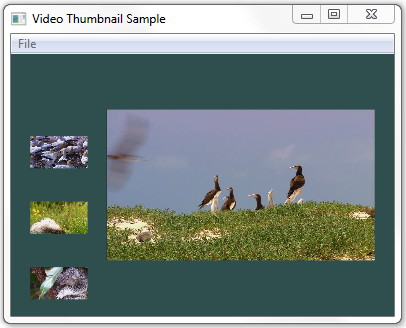

# VideoThumbnail Sample

Shows how to use Microsoft Media Foundation to extract thumbnail images from a video file. The following image shows an example of these thumbnail images.

## APIs Demonstrated

This sample demonstrates the following Media Foundation interfaces:

-   [**IMFSourceReader**](/windows/desktop/api/mfreadwrite/nn-mfreadwrite-imfsourcereader)

## Requirements

| Product                                                        | Version   |
|----------------------------------------------------------------|-----------|
| [Windows SDK](https://msdn.microsoft.com/windowsvista/bb980924.aspx) | Windows 7 |

 

## Downloading the Sample

This sample is available in the [Windows classic samples github repository](https://github.com/Microsoft/Windows-classic-samples/tree/master/Samples/Win7Samples/multimedia/mediafoundation/VideoThumbnail).

## Related topics

<dl> <dt>

[Media Foundation SDK Samples](media-foundation-sdk-samples.md)
</dt> <dt>

[Source Reader](source-reader.md)
</dt> </dl>

 

 

