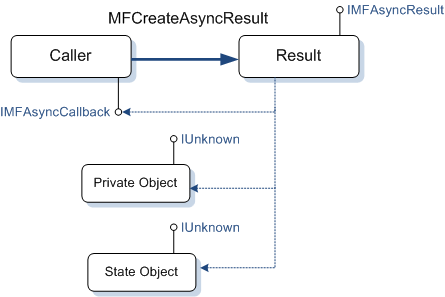
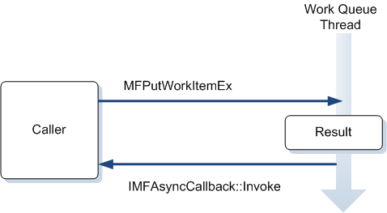
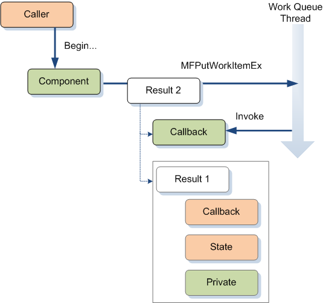

# Writing an Asynchronous Method

This topic describes how to implement an asynchronous method in Microsoft Media Foundation.

Asynchronous methods are ubiquitous in the Media Foundation pipeline. Asynchronous methods make it easier to distribute work among several threads. It is particularly important to perform I/O asynchronously, so that reading from a file or network does not block the rest of the pipeline.

If you are writing a media source or media sink, it is crucial to handle asynchronous operations correctly, because your component's performance has an impact on the entire pipeline.

> [!Note]  
> Media Foundation transforms (MFTs) use synchronous methods by default.

 

### Work Queues For Asynchronous Operations

In Media Foundation, there is a close relationship between [Asynchronous Callback Methods](asynchronous-callback-methods.md) and [Work Queues](work-queues.md). A work queue is an abstraction for moving work from the caller's thread to a worker thread. To perform work on a work queue, do the following:

1.  Implement the [**IMFAsyncCallback**](/windows/desktop/api/mfobjects/nn-mfobjects-imfasynccallback) interface.
2.  Call [**MFCreateAsyncResult**](/windows/desktop/api/mfapi/nf-mfapi-mfcreateasyncresult) to create a *result* object. The result object exposes the [**IMFAsyncResult**](/windows/desktop/api/mfobjects/nn-mfobjects-imfasyncresult). The result object contains three pointers:

    -   A pointer to the caller's [**IMFAsyncCallback**](/windows/desktop/api/mfobjects/nn-mfobjects-imfasynccallback) interface.
    -   An optional pointer to a state object. If specified, the state object must implement **IUnknown**.
    -   An optional pointer to a private object. If specified, this object also must implement **IUnknown**.

    The last two pointers can be **NULL**. Otherwise, use them to hold information about the asynchronous operation.

3.  Call [**MFPutWorkItemEx**](/windows/desktop/api/mfapi/nf-mfapi-mfputworkitemex) to queue to the work item.
4.  The work-queue thread calls your [**IMFAsyncCallback::Invoke**](/windows/desktop/api/mfobjects/nf-mfobjects-imfasynccallback-invoke) method.
5.  Do the work inside your [**Invoke**](/windows/desktop/api/mfobjects/nf-mfobjects-imfasynccallback-invoke) method. The *pAsyncResult* parameter of this method is the [**IMFAsyncResult**](/windows/desktop/api/mfobjects/nn-mfobjects-imfasyncresult) pointer from step 2. Use this pointer to get the state object and private object:
    -   To get the state object, call [**IMFAsyncResult::GetState**](/windows/desktop/api/mfobjects/nf-mfobjects-imfasyncresult-getstate).
    -   To get the private object, call [**IMFAsyncResult::GetObject**](/windows/desktop/api/mfobjects/nf-mfobjects-imfasyncresult-getobject).

As an alternative, you can combine steps 2 and 3 by calling the [**MFPutWorkItem**](/windows/desktop/api/mfapi/nf-mfapi-mfputworkitem) function. Internally, this function calls [**MFCreateAsyncResult**](/windows/desktop/api/mfapi/nf-mfapi-mfcreateasyncresult) to create the result object.

The following diagram shows the relationships between the caller, the result object, the state object, and the private object.



The following sequence diagram shows how an object queues a work item. When the work-queue thread calls [**Invoke**](/windows/desktop/api/mfobjects/nf-mfobjects-imfasynccallback-invoke), the object performs the asynchronous operation on that thread.



It is important to remember [**Invoke**](/windows/desktop/api/mfobjects/nf-mfobjects-imfasynccallback-invoke) is called from a thread that is owned by the work queue. Your implementation of **Invoke** must be thread safe. In addition, if you use the platform work queue (**MFASYNC\_CALLBACK\_QUEUE\_STANDARD**), it is critical that you never block the thread, because that can block the entire Media Foundation pipeline from processing data. If you need to perform an operation that will block or take a long time to complete, use a private work queue. To create a private work queue, call [**MFAllocateWorkQueue**](/windows/desktop/api/mfapi/nf-mfapi-mfallocateworkqueue). Any pipeline component that performs I/O operations should avoid blocking I/O calls for the same reason. The [**IMFByteStream**](/windows/desktop/api/mfobjects/nn-mfobjects-imfbytestream) interface provides a useful abstraction for asynchronous file I/O.

### Implementing the Begin.../End... Pattern

As described in [Calling Asynchronous Methods](calling-asynchronous-methods.md), asynchronous methods in Media Foundation often use the **Begin...**/**End....** pattern. In this pattern, an asynchronous operation uses two methods with signatures similar to the following:

``` syntax
// Starts the asynchronous operation.
HRESULT BeginX(IMFAsyncCallback *pCallback, IUnknown *punkState);

// Completes the asynchronous operation. 
// Call this method from inside the caller's Invoke method.
HRESULT EndX(IMFAsyncResult *pResult);
```

To make the method truly asynchronous, the implementation of **BeginX** must perform the actual work on another thread. This is where work queues come into the picture. In the steps that follow, the *caller* is the code that calls **BeginX** and **EndX**. This might be an application or the Media Foundation pipeline. The *component* is the code that implements **BeginX** and **EndX**.

1.  The caller calls **Begin...**, passing in a pointer to the caller's [**IMFAsyncCallback**](/windows/desktop/api/mfobjects/nn-mfobjects-imfasynccallback) interface.
2.  The component creates a new asynchronous result object. This object stores the caller's callback interface and state object. Typically, it also stores any private state information that the component needs to complete the operation. The result object from this step is labeled "Result 1" in the next diagram.
3.  The component creates a second result object. This result object stores two pointers: The first result object, and the callback interface of the callee. This result object is labeled "Result 2" in the next diagram.
4.  The component calls [**MFPutWorkItemEx**](/windows/desktop/api/mfapi/nf-mfapi-mfputworkitemex) to queue a new work item.
5.  In the [**Invoke**](/windows/desktop/api/mfobjects/nf-mfobjects-imfasynccallback-invoke) method, the component does the asynchronous work.
6.  The component calls [**MFInvokeCallback**](/windows/desktop/api/mfapi/nf-mfapi-mfinvokecallback) to invoke the caller's callback method.
7.  The caller calls the **EndX** method.



## Asynchronous Method Example

To illustrate this discussion, we will use a contrived example. Consider an asynchronous method for computing a square root:


```C++
    HRESULT BeginSquareRoot(double x, IMFAsyncCallback *pCB, IUnknown *pState);
    HRESULT EndSquareRoot(IMFAsyncResult *pResult, double *pVal);
```


The *x* parameter of `BeginSquareRoot` is the value whose square root will be calculated. The square root is returned in the *pVal* parameter of `EndSquareRoot`.

Here is the declaration of a class that implements these two methods:


```C++
class SqrRoot : public IMFAsyncCallback
{
    LONG    m_cRef;
    double  m_sqrt;

    HRESULT DoCalculateSquareRoot(AsyncOp *pOp);

public:

    SqrRoot() : m_cRef(1)
    {

    }

    HRESULT BeginSquareRoot(double x, IMFAsyncCallback *pCB, IUnknown *pState);
    HRESULT EndSquareRoot(IMFAsyncResult *pResult, double *pVal);

    // IUnknown methods.
    STDMETHODIMP QueryInterface(REFIID riid, void **ppv)
    {
        static const QITAB qit[] = 
        {
            QITABENT(SqrRoot, IMFAsyncCallback),
            { 0 }
        };
        return QISearch(this, qit, riid, ppv);
    }

    STDMETHODIMP_(ULONG) AddRef()
    {
        return InterlockedIncrement(&m_cRef);
    }

    STDMETHODIMP_(ULONG) Release()
    {
        LONG cRef = InterlockedDecrement(&m_cRef);
        if (cRef == 0)
        {
            delete this;
        }
        return cRef;
    }

    // IMFAsyncCallback methods.

    STDMETHODIMP GetParameters(DWORD* pdwFlags, DWORD* pdwQueue)
    {
        // Implementation of this method is optional.
        return E_NOTIMPL;  
    }
    // Invoke is where the work is performed.
    STDMETHODIMP Invoke(IMFAsyncResult* pResult);
};
```


The `SqrRoot` class implements [**IMFAsyncCallback**](/windows/desktop/api/mfobjects/nn-mfobjects-imfasynccallback) so that it can put the square root operation on a work queue. The `DoCalculateSquareRoot` method is the private class method that calculates the square root. This method will be called from the work queue thread.

First, we need a way to store the value of *x*, so that it can be retrieved when the work queue thread calls `SqrRoot::Invoke`. Here is a simple class that stores the information:


```C++
class AsyncOp : public IUnknown
{
    LONG    m_cRef;

public:

    double  m_value;

    AsyncOp(double val) : m_cRef(1), m_value(val) { }

    STDMETHODIMP QueryInterface(REFIID riid, void **ppv)
    {
        static const QITAB qit[] = 
        {
            QITABENT(AsyncOp, IUnknown),
            { 0 }
        };
        return QISearch(this, qit, riid, ppv);
    }

    STDMETHODIMP_(ULONG) AddRef()
    {
        return InterlockedIncrement(&m_cRef);
    }

    STDMETHODIMP_(ULONG) Release()
    {
        LONG cRef = InterlockedDecrement(&m_cRef);
        if (cRef == 0)
        {
            delete this;
        }
        return cRef;
    }
};
```


This class implements **IUnknown** so that it can be stored in a result object.

The following code implements the `BeginSquareRoot` method:


```C++
HRESULT SqrRoot::BeginSquareRoot(double x, IMFAsyncCallback *pCB, IUnknown *pState)
{
    AsyncOp *pOp = new (std::nothrow) AsyncOp(x);
    if (pOp == NULL)
    {
        return E_OUTOFMEMORY;
    }

    IMFAsyncResult *pResult = NULL;

    // Create the inner result object. This object contains pointers to:
    // 
    //   1. The caller's callback interface and state object. 
    //   2. The AsyncOp object, which contains the operation data.
    //

    HRESULT hr = MFCreateAsyncResult(pOp, pCB, pState, &pResult);

    if (SUCCEEDED(hr))
    {
        // Queue a work item. The work item contains pointers to:
        // 
        // 1. The callback interface of the SqrRoot object.
        // 2. The inner result object.

        hr = MFPutWorkItem(MFASYNC_CALLBACK_QUEUE_STANDARD, this, pResult);

        pResult->Release();
    }

    return hr;
}
```


This code does the following:

1.  Creates a new instance of the `AsyncOp` class to hold the value of *x*.
2.  Calls [**MFCreateAsyncResult**](/windows/desktop/api/mfapi/nf-mfapi-mfcreateasyncresult) to create a result object. This object holds several pointers:
    -   A pointer to the caller's [**IMFAsyncCallback**](/windows/desktop/api/mfobjects/nn-mfobjects-imfasynccallback) interface.
    -   A pointer to the caller's state object (*pState*).
    -   A pointer to the `AsyncOp` object.
3.  Calls [**MFPutWorkItem**](/windows/desktop/api/mfapi/nf-mfapi-mfputworkitem) to queue a new work item. This call implicitly creates an outer result object, which holds the following pointers:
    -   A pointer to the `SqrRoot` object's [**IMFAsyncCallback**](/windows/desktop/api/mfobjects/nn-mfobjects-imfasynccallback) interface.
    -   A pointer to the inner result object from step 2.

The following code implements the `SqrRoot::Invoke` method:


```C++
// Invoke is called by the work queue. This is where the object performs the
// asynchronous operation.

STDMETHODIMP SqrRoot::Invoke(IMFAsyncResult* pResult)
{
    HRESULT hr = S_OK;

    IUnknown *pState = NULL;
    IUnknown *pUnk = NULL;
    IMFAsyncResult *pCallerResult = NULL;

    AsyncOp *pOp = NULL; 

    // Get the asynchronous result object for the application callback. 

    hr = pResult->GetState(&pState);
    if (FAILED(hr))
    {
        goto done;
    }

    hr = pState->QueryInterface(IID_PPV_ARGS(&pCallerResult));
    if (FAILED(hr))
    {
        goto done;
    }

    // Get the object that holds the state information for the asynchronous method.
    hr = pCallerResult->GetObject(&pUnk);
    if (FAILED(hr))
    {
        goto done;
    }

    pOp = static_cast<AsyncOp*>(pUnk);

    // Do the work.

    hr = DoCalculateSquareRoot(pOp);

done:
    // Signal the application.
    if (pCallerResult)
    {
        pCallerResult->SetStatus(hr);
        MFInvokeCallback(pCallerResult);
    }

    SafeRelease(&pState);
    SafeRelease(&pUnk);
    SafeRelease(&pCallerResult);
    return S_OK;
}
```


This method gets the inner result object and the `AsyncOp` object. Then it passes the `AsyncOp` object to `DoCalculateSquareRoot`. Finally, it calls [**IMFAsyncResult::SetStatus**](/windows/desktop/api/mfobjects/nf-mfobjects-imfasyncresult-setstatus) to set the status code and [**MFInvokeCallback**](/windows/desktop/api/mfapi/nf-mfapi-mfinvokecallback) to invoke the caller's callback method.

The `DoCalculateSquareRoot` method does exactly what you would expect:


```C++
HRESULT SqrRoot::DoCalculateSquareRoot(AsyncOp *pOp)
{
    pOp->m_value = sqrt(pOp->m_value);

    return S_OK;
}
```


When the caller's callback method is invoked, it is the caller's responsibility to call the **End...** method—in this case, `EndSquareRoot`. The `EndSquareRoot` is how the caller retrieves the result of the asynchronous operation, which in this example is the computed square root. This information is stored in the result object:


```C++
HRESULT SqrRoot::EndSquareRoot(IMFAsyncResult *pResult, double *pVal)
{
    *pVal = 0;

    IUnknown *pUnk = NULL;

    HRESULT hr = pResult->GetStatus();

    if (FAILED(hr))
    {
        goto done;
    }

    hr = pResult->GetObject(&pUnk);
    if (FAILED(hr))
    {
        goto done;
    }

    AsyncOp *pOp = static_cast<AsyncOp*>(pUnk);

    // Get the result.
    *pVal = pOp->m_value;

done:
    SafeRelease(&pUnk);
    return hr;
}
```


## Operation Queues

So far, it has been tacitly assumed that an asynchronous operation could be done at any time, regardless of the object's current state. For example, consider what happens if an application calls `BeginSquareRoot` while an earlier call to the same method is still pending. The `SqrRoot` class might queue the new work item before the previous work item is done. However, work queues are not guaranteed to serialize work items. Recall that a work queue can use more than one thread to dispatch work items. In a multithreaded environment, a work item might be invoked before the previous one has completed. Work items can even be invoked out of order, if a context switch happens to occur just before the callback is invoked.

For this reason, it is the object's responsibility to serialize operations on itself, if required. In other words, if the object requires operation *A* to finish before operation *B* can start, the object must not queue a work item for *B* until operation *A* has completed. An object can meet this requirement by having its own queue of pending operations. When an asynchronous method is called on the object, the object puts the request on its own queue. As each asynchronous operation is completed, the object pulls the next request from the queue. The [MPEG1Source Sample](mpeg1source-sample.md) shows an example of how to implement such a queue.

A single method might involve several asynchronous operations, particularly when I/O calls are used. When you implement asynchronous methods, think carefully about serialization requirements. For example, is it valid for the object to start a new operation while a previous I/O request is still pending? If the new operation changes the object's internal state, what happens when a previous I/O request completes and returns data that might now be stale? A good state diagram can help to identify the valid state transitions.

## Cross-Thread and Cross-Process Considerations

Work queues do not use COM marshaling to marshal interface pointers across thread boundaries. Therefore, even if an object is registered as apartment-threaded or the application thread has entered a single-threaded apartment (STA), [**IMFAsyncCallback**](/windows/desktop/api/mfobjects/nn-mfobjects-imfasynccallback) callbacks will be invoked from a different thread. In any case, all Media Foundation pipeline components should use the "Both" threading model.

Some interfaces in Media Foundation define remote versions of some asynchronous methods. When one of these methods is called across process boundaries, the Media Foundation proxy/stub DLL calls the remote version of the method, which performs custom marshaling of the method parameters. In the remote process, the stub translates the call back into the local method on the object. This process is transparent to both the application and the remote object. These custom marshaling methods are provided primarily for objects that are loaded in the protected media path (PMP). For more information about the PMP, see [Protected Media Path](protected-media-path.md).

## Related topics

<dl> <dt>

[Asynchronous Callback Methods](asynchronous-callback-methods.md)
</dt> <dt>

[Work Queues](work-queues.md)
</dt> </dl>

 

 


