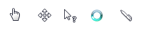
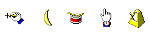
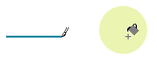
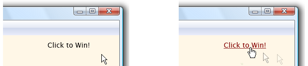

# About Cursors

Windows provides a set of standard cursors that are available for any application to use at any time. The SDK header files contain identifiers for the standard cursors—the identifiers begin with the **IDC\_** prefix.

Each standard cursor has a corresponding default image associated with it. The user or an application can replace the default image associated with any standard cursor at any time. An application replaces a default image by using the [**SetSystemCursor**](/windows/desktop/api/Winuser/nf-winuser-setsystemcursor) function. The following image shows several standard cursors from Windows Vista:

An application can use the [**GetIconInfo**](/windows/desktop/api/Winuser/nf-winuser-geticoninfo) function to retrieve the current image for a cursor and can draw the cursor by using the [**DrawIconEx**](/windows/desktop/api/Winuser/nf-winuser-drawiconex) function. To draw the default image for a standard cursor, specify the **DI\_COMPAT** flag in the call to **DrawIconEx**. If you do not specify the **DI\_COMPAT** flag, **DrawIconEx** draws the standard cursor using the image that the user specified.

Custom cursors are designed for use in a specific application and can be any design the developer defines. The following illustration shows several custom cursors.

Cursors can be either monochrome or color, and either static or animated. The type of cursor used on a particular computer system depends on the system's display. Old displays such as VGA do not support color or animated cursors. New displays, whose display drivers use the device-independent bitmap (DIB) engine, do support them.

Cursors and icons are similar and can be used interchangeably in many situations. The only difference between them is that an image specified as a cursor must be in the format that the display can support. For example, a cursor must be monochrome for a VGA display.

This overview provides information on the following topics:

-   [The Hot Spot](#the-hot-spot)
-   [The Mouse and the Cursor](#the-mouse-and-the-cursor)
-   [Cursor Creation](#cursor-creation)
-   [Cursor Location and Appearance](#cursor-location-and-appearance)
-   [Cursor Confinement](#cursor-confinement)
-   [Cursor Destruction](#cursor-destruction)
-   [Cursor Duplication](#cursor-duplication)
-   [The Window Class Cursor](#the-window-class-cursor)

## The Hot Spot

In the cursor, a pixel called the *hot spot* marks the exact screen location that is affected by a mouse event, such as clicking a mouse button. Typically, the hot spot is the focal point of the cursor. The system tracks and recognizes this point as the position of the cursor. For example, typical hot spots are the pixel at the tip of an arrow-shaped cursor and the pixel in the middle of a crosshair-shaped cursor. The following images shows two cursors from a drawing program, in which hot spots are associated with the tip of the brush and the crosshair of the paint can.

When a mouse input event occurs, the mouse driver translates the event into an appropriate mouse message that includes the coordinates of the hot spot. The system sends the mouse message to the window that contains the hot spot or to the window that is capturing mouse input. For more information, see [Mouse Input](/windows/desktop/inputdev/mouse-input).

## The Mouse and the Cursor

The system reflects the movement of the mouse by moving the cursor on the screen accordingly. As the cursor moves over different parts of windows or into different windows, the system (or an application) changes the appearance of the cursor. For example, when the cursor crosses over a hyperlink, the system changes the cursor from an arrow to a hand.

If the system does not have a mouse, the system displays and moves the cursor only when the user chooses certain system commands, such as those used to size or move a window. To provide the user with a method of displaying and moving the cursor when a mouse is not available, an application can use the cursor functions to simulate mouse movement. Given this simulation capability, the user can use the arrow keys to move the cursor.

## Cursor Creation

Because standard cursors are predefined, it is not necessary to create them. To use a standard cursor, an application retrieves a cursor handle by using the [**LoadCursor**](/windows/desktop/api/Winuser/nf-winuser-loadcursora) or [**LoadImage**](/windows/desktop/api/Winuser/nf-winuser-loadimagea) function. A *cursor handle* is a unique value of the **HCURSOR** type that identifies a standard or custom cursor.

To create a custom cursor for an application, you typically use a graphics application and include the cursor as a resource in the application's resource-definition file. At run time, call [**LoadCursor**](/windows/desktop/api/Winuser/nf-winuser-loadcursora) to retrieve the cursor handle. Cursor resources contain data for several different display devices. The **LoadCursor** function automatically selects the most appropriate data for the current display device. To load a cursor directly from a .CUR or .ANI file, use the [**LoadCursorFromFile**](/windows/desktop/api/Winuser/nf-winuser-loadcursorfromfilea) function.

You can also create a custom cursor at run time by using the [**CreateIconIndirect**](/windows/desktop/api/Winuser/nf-winuser-createiconindirect) function, which creates a cursor based on the content of an [**ICONINFO**](/windows/desktop/api/Winuser/ns-winuser-iconinfo) structure. The [**GetIconInfo**](/windows/desktop/api/Winuser/nf-winuser-geticoninfo) function fills this structure with hot spot coordinates and information concerning the associated mask and color.

Applications should implement custom cursors as resources and use [**LoadCursor**](/windows/desktop/api/Winuser/nf-winuser-loadcursora), [**LoadCursorFromFile**](/windows/desktop/api/Winuser/nf-winuser-loadcursorfromfilea), or [**LoadImage**](/windows/desktop/api/Winuser/nf-winuser-loadimagea) rather than create the cursor at run time. Using cursor resources avoids device dependence, simplifies localization, and enables applications to share cursor designs.

The [**CreateIconFromResourceEx**](/windows/desktop/api/Winuser/nf-winuser-createiconfromresourceex) function enables an application to create icons and cursors based on resource data. **CreateIconFromResourceEx** creates a cursor based on binary resource data from other executable (.exe) files or DLLs. It must be preceded by calls to the [**LookupIconIdFromDirectoryEx**](/windows/desktop/api/Winuser/nf-winuser-lookupiconidfromdirectoryex) function, as well as several resource functions. **LookupIconIdFromDirectoryEx** identifies the most appropriate cursor data for the current display device. For more information about resource functions, see [Resources](resources.md).

## Cursor Location and Appearance

The system automatically displays a cursor for the mouse and updates its position on the screen. You can obtain current screen coordinates of the cursor and move the cursor to any location on the screen by using the [**GetCursorPos**](/windows/desktop/api/Winuser/nf-winuser-getcursorpos) and [**SetCursorPos**](/windows/desktop/api/Winuser/nf-winuser-setcursorpos) functions, respectively.

You can also retrieve the handle to the current cursor by using the [**GetCursor**](/windows/desktop/api/Winuser/nf-winuser-getcursor) function, and you can set the cursor by using the [**SetCursor**](/windows/desktop/api/Winuser/nf-winuser-setcursor) function. After you call **SetCursor**, the appearance of the cursor does not change until either the mouse moves, the cursor is explicitly set to a different cursor, or a system command is executed.

When the user moves the mouse, the system redraws the cursor at the new location. The system automatically redraws the cursor design associated with the window to which the cursor is pointing.

You can hide and redisplay the cursor, without changing the cursor design, by using the [**ShowCursor**](/windows/desktop/api/Winuser/nf-winuser-showcursor) function. This function uses an internal counter to determine when to hide or display the cursor. An attempt to show the cursor increments the counter; an attempt to hide the cursor decrements the counter. The cursor is visible only if this counter is greater than or equal to zero.

The [**GetCursorInfo**](/windows/desktop/api/Winuser/nf-winuser-getcursorinfo) function gets the following information for the global cursor: whether the cursor is hidden or shown, the handle to the cursor, and the coordinates of the cursor.

## Cursor Confinement

You can confine the cursor to a rectangular area on the screen by using the [**ClipCursor**](/windows/desktop/api/Winuser/nf-winuser-clipcursor) function. This is useful for when the user must respond to a certain event within the confined area of the rectangle. For example, you might use **ClipCursor** to confine the cursor to a modal dialog box, preventing the user from interacting with other windows until the dialog box is closed.

The [**GetClipCursor**](/windows/desktop/api/Winuser/nf-winuser-getclipcursor) function retrieves the screen coordinates of the rectangular area to which the cursor is temporarily confined. When it is necessary to confine the cursor, you can also use this function to save the coordinates of the original area in which the cursor can move. Then, you can restore the cursor to the original area when the new confinement is no longer necessary.

## Cursor Destruction

You can destroy the cursor handle and free the memory the cursor used by calling the [**DestroyCursor**](/windows/desktop/api/Winuser/nf-winuser-destroycursor) function. However, this function has no effect on a shared cursor. A shared cursor is valid as long as the module from which it was loaded remains in memory. The following functions obtain a shared cursor:

-   [**LoadCursor**](/windows/desktop/api/Winuser/nf-winuser-loadcursora)
-   [**LoadCursorFromFile**](/windows/desktop/api/Winuser/nf-winuser-loadcursorfromfilea)
-   [**LoadImage**](/windows/desktop/api/Winuser/nf-winuser-loadimagea) (if you use the **LR\_SHARED** flag)
-   [**CopyImage**](/windows/desktop/api/Winuser/nf-winuser-copyimage) (if you use the **LR\_COPYRETURNORG** flag and the *hImage* is a shared cursor)

When you no longer need a cursor you created by using the [**CreateIconIndirect**](/windows/desktop/api/Winuser/nf-winuser-createiconindirect) function, you should destroy the cursor. The [**DestroyIcon**](/windows/desktop/api/Winuser/nf-winuser-destroyicon) function destroys the cursor handle and frees any memory the cursor used. Use this function only on cursors that were created with **CreateIconIndirect**.

## Cursor Duplication

The [**CopyCursor**](/windows/desktop/api/Winuser/nf-winuser-copycursor) function copies a cursor handle. This enables application or DLL code to retrieve the handle to a cursor owned by another module. Then, if the other module is freed, the module that copied the cursor can still use the cursor design.

For information on how to add, remove, or replace cursor resources in executable files, see [Resources](resources.md).

## The Window Class Cursor

When you register a window class, using the [**RegisterClass**](/windows/desktop/api/winuser/nf-winuser-registerclassa) function, you can assign it a default cursor, known as the *class cursor*. After the application registers the window class, each window of that class has the specified class cursor.

To override the class cursor, process the [**WM\_SETCURSOR**](wm-setcursor.md) message. You can also replace a class cursor by using the [**SetClassLong**](/windows/desktop/api/winuser/nf-winuser-setclasslonga) function. This function changes the default window settings for all windows of a specified class. For more information, see [Class Cursor](/windows/desktop/winmsg/about-window-classes).

 

 