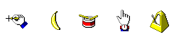
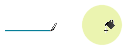
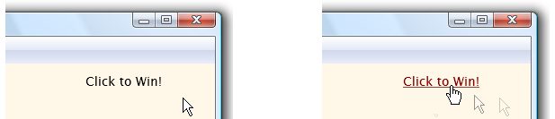

# About Cursors

Windows provides a set of **standard cursors** that can be used by applications. The following cursor identifiers are defined in WinUser.h:

| Value | Meaning |
|---|---|
| **IDC\_ARROW** MAKEINTRESOURCE(32512) | :::image type="icon" source="./images/IDC_ARROW.png"::: Normal select |
| **IDC\_IBEAM** MAKEINTRESOURCE(32513) | :::image type="icon" source="./images/IDC_IBEAM.png"::: Text select |
| **IDC\_WAIT** MAKEINTRESOURCE(32514) | :::image type="icon" source="./images/IDC_WAIT.png"::: Busy |
| **IDC\_CROSS** MAKEINTRESOURCE(32515) | :::image type="icon" source="./images/IDC_CROSS.png"::: Precision select |
| **IDC\_UPARROW** MAKEINTRESOURCE(32516) | :::image type="icon" source="./images/IDC_UPARROW.png"::: Alternate select |
| **IDC\_SIZENWSE** MAKEINTRESOURCE(32642) | :::image type="icon" source="./images/IDC_SIZENWSE.png"::: Diagonal resize 1 |
| **IDC\_SIZENESW** MAKEINTRESOURCE(32643) | :::image type="icon" source="./images/IDC_SIZENESW.png"::: Diagonal resize 2 |
| **IDC\_SIZEWE** MAKEINTRESOURCE(32644) | :::image type="icon" source="./images/IDC_SIZEWE.png"::: Horizontal resize |
| **IDC\_SIZENS** MAKEINTRESOURCE(32645) | :::image type="icon" source="./images/IDC_SIZENS.png"::: Vertical resize |
| **IDC\_SIZEALL** MAKEINTRESOURCE(32646) | :::image type="icon" source="./images/IDC_SIZEALL.png"::: Move |
| **IDC\_NO** MAKEINTRESOURCE(32648) | :::image type="icon" source="./images/IDC_NO.png"::: Unavailable |
| **IDC\_HAND** MAKEINTRESOURCE(32649) | :::image type="icon" source="./images/IDC_HAND.png"::: Link select |
| **IDC\_APPSTARTING** MAKEINTRESOURCE(32650) | :::image type="icon" source="./images/IDC_APPSTARTING.png"::: Working in background |
| **IDC\_HELP** MAKEINTRESOURCE(32651) | :::image type="icon" source="./images/IDC_HELP.png"::: Help select |
| **IDC\_PIN** MAKEINTRESOURCE(32671) | :::image type="icon" source="./images/IDC_PIN.png"::: Location select |
| **IDC\_PERSON** MAKEINTRESOURCE(32672) | :::image type="icon" source="./images/IDC_PERSON.png"::: Person select |

A number of additional cursors are also available that do not have identifiers defined in WinUser.h (or are considered obsolete):

| Value | Meaning |
|---|---|
| MAKEINTRESOURCE(32631) | :::image type="icon" source="./images/OCR_NWPEN.png"::: A pen cursor. |
| MAKEINTRESOURCE(32652) | :::image type="icon" source="./images/OCR_RDRVERT.png"::: A scrolling cursor with arrows pointing north and south. |
| MAKEINTRESOURCE(32653) | :::image type="icon" source="./images/OCR_RDRHORZ.png"::: A scrolling cursor with arrows pointing west and east. |
| MAKEINTRESOURCE(32654) | :::image type="icon" source="./images/OCR_RDR2DIM.png"::: A scrolling cursor with arrows pointing north, south, east, and west. |
| MAKEINTRESOURCE(32655) | :::image type="icon" source="./images/OCR_RDRNORTH.png"::: A scrolling cursor with an arrow pointing north. |
| MAKEINTRESOURCE(32656) | :::image type="icon" source="./images/OCR_RDRSOUTH.png"::: A scrolling cursor with an arrow pointing south. |
| MAKEINTRESOURCE(32657) | :::image type="icon" source="./images/OCR_RDRWEST.png"::: A scrolling cursor with an arrow pointing west. |
| MAKEINTRESOURCE(32658) | :::image type="icon" source="./images/OCR_RDREAST.png"::: A scrolling cursor with an arrow pointing east. |
| MAKEINTRESOURCE(32659) | :::image type="icon" source="./images/OCR_RDRNORTHWEST.png"::: A scrolling cursor with arrows pointing north and west. |
| MAKEINTRESOURCE(32660) | :::image type="icon" source="./images/OCR_RDRNORTHEAST.png"::: A scrolling cursor with arrows pointing north and east. |
| MAKEINTRESOURCE(32661) | :::image type="icon" source="./images/OCR_RDRSOUTHWEST.png"::: A scrolling cursor with arrows pointing south and west. |
| MAKEINTRESOURCE(32662) | :::image type="icon" source="./images/OCR_RDRSOUTHEAST.png"::: A scrolling cursor with arrows pointing south and east. |
| MAKEINTRESOURCE(32663) | :::image type="icon" source="./images/OCR_AUTORUN.png"::: An arrow cd cursor. |

See [Guidelines](/windows/win32/uxguide/inter-mouse) for information on using standard cursors.

Each standard cursor has a corresponding default image. The user can replace the default image of any standard cursor system-wide through mouse settings.

Custom cursors are designed for use in a specific application and can be any design the developer defines. The following illustration shows several custom cursors.

Cursors can be either monochrome or color (including 32bpp ARGB for per-pixel alpha transparency), and either static or animated.

**HCURSOR** and **HICON** are interchangeable - most API functions accept either type. The distinction between cursor and icon is recorded inside the object and affects behavior in a few cases - for example, [**GetIconInfo**](/windows/win32/api/winuser/nf-winuser-geticoninfo) returns **fIcon=FALSE** for a cursor handle.

This overview provides information on the following topics:

-   [The Hot Spot](#the-hot-spot)
-   [The Mouse and the Cursor](#the-mouse-and-the-cursor)
-   [Cursor Creation](#cursor-creation)
-   [The Window Class Cursor](#the-window-class-cursor)
-   [Cursor Sizes](#cursor-sizes)
-   [Cursor Location and Appearance](#cursor-location-and-appearance)
-   [Cursor Confinement](#cursor-confinement)
-   [Cursor Destruction](#cursor-destruction)
-   [Cursor Duplication](#cursor-duplication)

## The Hot Spot

In the cursor, a pixel called the *hot spot* marks the exact screen location that is affected by a mouse event, such as clicking a mouse button. Typically, the hot spot is the focal point of the cursor. The system tracks and recognizes this point as the position of the cursor. For example, typical hot spots are the pixel at the tip of an arrow-shaped cursor and the pixel in the middle of a crosshair-shaped cursor. The following images shows two cursors from a drawing program, in which hot spots are associated with the tip of the brush and the crosshair of the paint can.

When a mouse input event occurs, the mouse driver translates the event into an appropriate mouse message that includes the coordinates of the hot spot. The system sends the mouse message to the window that contains the hot spot or to the window that is capturing mouse input. For more information, see [Mouse Input](/windows/win32/inputdev/mouse-input).

## The Mouse and the Cursor

The system reflects the movement of the mouse by moving the cursor on the screen accordingly. As the cursor moves over different parts of windows or into different windows, the system (or an application) changes the appearance of the cursor. For example, when the cursor crosses over a hyperlink, the system changes the cursor from an arrow to a hand.

If the system does not have a mouse, the system displays and moves the cursor only when the user chooses certain system commands, such as those used to size or move a window. To provide the user with a method of displaying and moving the cursor when a mouse is not available, an application can use the cursor functions to simulate mouse movement. Given this simulation capability, the user can use the arrow keys to move the cursor.

## Cursor Creation

Standard cursors are predefined and do not need to be created. Use [**LoadCursor**](/windows/win32/api/winuser/nf-winuser-loadcursorw) or [**LoadImage**](/windows/win32/api/winuser/nf-winuser-loadimagew) to obtain an **HCURSOR** handle.

To create a custom cursor for an application, you typically use a graphics application and include the cursor as a resource in the application's resource-definition file. Like icon resources, cursor resources (.cur files or **RT\_CURSOR** / **RT\_GROUP\_CURSOR** in a PE file) store multiple images at different sizes - see [Icon Creation](about-icons.md#icon-creation) for details on the multi-image format. At run time, call [**LoadCursor**](/windows/win32/api/winuser/nf-winuser-loadcursorw) to retrieve the cursor handle; the system automatically selects the best-matching image. To load a cursor directly from a .cur or .ani file, use [**LoadCursorFromFile**](/windows/win32/api/winuser/nf-winuser-loadcursorfromfilew) or [**LoadImage**](/windows/win32/api/winuser/nf-winuser-loadimagew) with **LR\_LOADFROMFILE**.

You can also create a custom cursor at run time - see [Icon Creation](about-icons.md#icon-creation) for details on programmatic creation.

## The Window Class Cursor

When you register a window class using the [**RegisterClassEx**](/windows/win32/api/winuser/nf-winuser-registerclassexw) function, set the **hCursor** field of [**WNDCLASSEX**](/windows/win32/api/winuser/ns-winuser-wndclassexa) to the desired cursor handle. Every window of that class uses this cursor by default. For more information, see [Class Cursor](/windows/win32/winmsg/about-window-classes).

To override the class cursor for a specific window or hit-test area, process the [**WM\_SETCURSOR**](wm-setcursor.md) message and call [**SetCursor**](/windows/win32/api/winuser/nf-winuser-setcursor). To replace the class cursor for all windows of a class, use [**SetClassLongPtr**](/windows/win32/api/winuser/nf-winuser-setclasslongptrw) with **GCLP\_HCURSOR**.

## Cursor Sizes

The system reports the nominal cursor size via [**GetSystemMetrics**](/windows/win32/api/winuser/nf-winuser-getsystemmetrics) with **SM\_CXCURSOR** / **SM\_CYCURSOR**. This is the size of the cursor image buffer; the visible cursor shape is typically smaller due to transparent edges. Unlike icon sizes, cursor sizes change in steps - not every DPI value produces a distinct cursor size. The standard sizes at default cursor size setting are:

| Display scale | DPI range | SM\_CXCURSOR / SM\_CYCURSOR |
|---|---|---|
| < 150% | < 144 DPI | 32x32 |
| 150-199% | 144-191 DPI | 48x48 |
| 200-299% | 192-287 DPI | 64x64 |
| 300-399% | 288-383 DPI | 96x96 |
| >= 400% | >= 384 DPI | 128x128 |

The user can also change the cursor size independently of DPI via **Settings > Accessibility > Mouse pointer and touch > Size**. Always call [**GetSystemMetrics**](/windows/win32/api/winuser/nf-winuser-getsystemmetrics) with **SM\_CXCURSOR** to get the actual effective size rather than assuming a fixed value. In per-monitor DPI-aware applications, use [**GetSystemMetricsForDpi**](/windows/win32/api/winuser/nf-winuser-getsystemmetricsfordpi) with the DPI of the target monitor, which you can obtain with [**GetDpiForWindow**](/windows/win32/api/winuser/nf-winuser-getdpiforwindow) or [**GetDpiForMonitor**](/windows/win32/api/shellscalingapi/nf-shellscalingapi-getdpiformonitor). For more information, see [High DPI Desktop Application Development on Windows](/windows/win32/hidpi/high-dpi-desktop-application-development-on-windows).

To retrieve the dimensions of a cursor from its handle, see [Getting a Cursor size](/windows/win32/menurc/using-cursors#getting-a-cursor-size).

## Cursor Location and Appearance

The system automatically displays a cursor for the mouse, updates its position on the screen, and redraws the cursor design associated with the window to which the cursor is pointing. You can obtain current screen coordinates of the cursor and move the cursor to any location on the screen by using the [**GetCursorPos**](/windows/win32/api/winuser/nf-winuser-getcursorpos) and [**SetCursorPos**](/windows/win32/api/winuser/nf-winuser-setcursorpos) functions, respectively. These functions return and accept coordinates in the logical coordinate space of the calling thread's DPI awareness context. To work in physical screen pixels regardless of DPI awareness, use [**GetPhysicalCursorPos**](/windows/win32/api/winuser/nf-winuser-getphysicalcursorpos) and [**SetPhysicalCursorPos**](/windows/win32/api/winuser/nf-winuser-setphysicalcursorpos) instead.

You can retrieve the handle to the current cursor by using the [**GetCursor**](/windows/win32/api/winuser/nf-winuser-getcursor) function, and set the cursor by using the [**SetCursor**](/windows/win32/api/winuser/nf-winuser-setcursor) function. **SetCursor** takes effect only while the calling thread owns mouse input - the reliable place to call it is in a [**WM\_SETCURSOR**](wm-setcursor.md) handler. When handling **WM\_SETCURSOR**, return **TRUE** after calling **SetCursor**; otherwise **DefWindowProc** will override the cursor with the class cursor. See [Displaying a Cursor](/windows/win32/menurc/using-cursors#displaying-a-cursor) for an example.

You can hide and redisplay the cursor by using the [**ShowCursor**](/windows/win32/api/winuser/nf-winuser-showcursor) function. This function maintains a per-thread visibility counter; the cursor is visible only when the counter is greater than or equal to zero. Each call to `ShowCursor(FALSE)` must be paired with a call to `ShowCursor(TRUE)` - an unmatched decrement permanently hides the cursor for that thread.

The [**GetCursorInfo**](/windows/win32/api/winuser/nf-winuser-getcursorinfo) function retrieves whether the cursor is hidden or shown, its handle, and its screen coordinates.

## Cursor Confinement

You can confine the cursor to a rectangular area on the screen by using the [**ClipCursor**](/windows/win32/api/winuser/nf-winuser-clipcursor) function. This is useful for when the user must respond to a certain event within the confined area of the rectangle. For example, you might use **ClipCursor** to confine the cursor to a modal dialog box, preventing the user from interacting with other windows until the dialog box is closed.

The [**GetClipCursor**](/windows/win32/api/winuser/nf-winuser-getclipcursor) function retrieves the screen coordinates of the rectangular area to which the cursor is temporarily confined. When it is necessary to confine the cursor, you can also use this function to save the coordinates of the original area in which the cursor can move. Then, you can restore the cursor to the original area when the new confinement is no longer necessary.

## Cursor Destruction

The same ownership rules that apply to icons also apply to cursors - destroy owned cursor handles by calling [**DestroyCursor**](/windows/win32/api/winuser/nf-winuser-destroycursor). See [Icon Destruction](about-icons.md#icon-destruction) for the shared handle exceptions that apply to both icons and cursors. The cursor-specific shared function is [**LoadCursor**](/windows/win32/api/winuser/nf-winuser-loadcursorw) - it always uses **LR\_SHARED** internally regardless of the instance parameter; use **LoadImage** without **LR\_SHARED** if you need an owned handle.

## Cursor Duplication

The [**CopyCursor**](/windows/win32/api/winuser/nf-winuser-copycursor) function creates a new independent cursor object with the same image and hotspot as the original - analogous to [**CopyIcon**](about-icons.md#icon-duplication) for icons. The copy is owned by the caller.

For information on how to add, remove, or replace cursor resources in executable files, see [Resources](resources.md).
