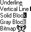

# Carets

A *caret* is a blinking line, block, or bitmap in the client area of a window. The caret typically indicates the place at which text or graphics will be inserted.

The following illustration shows some common variations in the appearance of the caret.

Applications can create a caret, change its blink time, and display, hide, or relocate the caret.

### In This Section

| Name                                   | Description                                                               |
|----------------------------------------|---------------------------------------------------------------------------|
| [About Carets](about-carets.md)       | Discusses carets.                                               |
| [Using Carets](using-carets.md)       | Code samples that show how to perform tasks related to carets.  |
| [Caret Reference](caret-reference.md) | Contains the API reference.                                     |

 

### Caret Functions

| Name                                           | Description                                                                                                                                                                                                                                                   |
|------------------------------------------------|---------------------------------------------------------------------------------------------------------------------------------------------------------------------------------------------------------------------------------------------------------------|
| [**CreateCaret**](/windows/desktop/api/Winuser/nf-winuser-createcaret)             | Creates a new shape for the system caret and assigns ownership of the caret to the specified window. The caret shape can be a line, a block, or a bitmap.                                                                                           |
| [**DestroyCaret**](/windows/desktop/api/Winuser/nf-winuser-destroycaret)           | Destroys the caret's current shape, frees the caret from the window, and removes the caret from the screen.                                                                                                                                         |
| [**GetCaretBlinkTime**](/windows/desktop/api/Winuser/nf-winuser-getcaretblinktime) | Retrieves the time required to invert the caret's pixels. The user can set this value.                                                                                                                                                              |
| [**GetCaretPos**](/windows/desktop/api/Winuser/nf-winuser-getcaretpos)             | Copies the caret's position to the specified [**POINT**](/windows/win32/api/windef/ns-windef-point) structure.                                                                                                                                                                      |
| [**HideCaret**](/windows/desktop/api/Winuser/nf-winuser-hidecaret)                 | Removes the caret from the screen. Hiding a caret does not destroy its current shape or invalidate the insertion point.                                                                                                                             |
| [**SetCaretBlinkTime**](/windows/desktop/api/Winuser/nf-winuser-setcaretblinktime) | Sets the caret blink time to the specified number of milliseconds. The blink time is the elapsed time, in milliseconds, required to invert the caret's pixels.                                                                                      |
| [**SetCaretPos**](/windows/desktop/api/Winuser/nf-winuser-setcaretpos)             | Moves the caret to the specified coordinates. If the window that owns the caret was created with the **CS\_OWNDC** class style, then the specified coordinates are subject to the mapping mode of the device context associated with that window.   |
| [**ShowCaret**](/windows/desktop/api/Winuser/nf-winuser-showcaret)                 | Makes the caret visible on the screen at the caret's current position. When the caret becomes visible, it begins flashing automatically.                                                                                                            |

 

 

