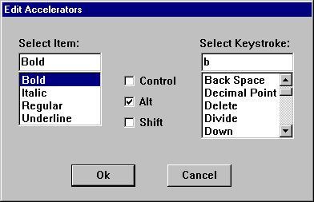

# Using Keyboard Accelerators

This section covers tasks that are associated with keyboard accelerators.

-   [Using an Accelerator Table Resource](#using-an-accelerator-table-resource)
    -   [Creating the Accelerator Table Resource](#creating-the-accelerator-table-resource)
    -   [Loading the Accelerator Table Resource](#loading-the-accelerator-table-resource)
    -   [Calling the Translate Accelerator Function](#calling-the-translate-accelerator-function)
    -   [Processing WM\_COMMAND Messages](/windows)
    -   [Destroying the Accelerator Table Resource](#destroying-the-accelerator-table-resource)
    -   [Creating Accelerators for Font Attributes](#creating-accelerators-for-font-attributes)
-   [Using an Accelerator Table Created at Run Time](#using-an-accelerator-table-created-at-run-time)
    -   [Creating a Run-Time Accelerator Table](#creating-a-run-time-accelerator-table)
    -   [Processing Accelerators](#processing-accelerators)
    -   [Destroying a Run-Time Accelerator Table](#destroying-a-run-time-accelerator-table)
    -   [Creating User Editable Accelerators](#creating-user-editable-accelerators)

## Using an Accelerator Table Resource

The most common way to add accelerator support to an application is to include an accelerator-table resource with the application's executable file and then load the resource at run time.

This section covers the following topics.

-   [Creating the Accelerator Table Resource](#creating-the-accelerator-table-resource)
-   [Loading the Accelerator Table Resource](#loading-the-accelerator-table-resource)
-   [Calling the Translate Accelerator Function](#calling-the-translate-accelerator-function)
-   [Processing WM\_COMMAND Messages](/windows)
-   [Destroying the Accelerator Table Resource](#destroying-the-accelerator-table-resource)
-   [Creating Accelerators for Font Attributes](#creating-accelerators-for-font-attributes)

### Creating the Accelerator Table Resource

You create an accelerator-table resource by using the [ACCELERATORS](./accelerators-resource.md) statement in your application's resource-definition file. You must assign a name or resource identifier to the accelerator table, preferably unlike that of any other resource. The system uses this identifier to load the resource at run time.

Each accelerator you define requires a separate entry in the accelerator table. In each entry, you define the keystroke (either an ASCII character code or virtual-key code) that generates the accelerator and the accelerator's identifier. You must also specify whether the keystroke must be used in some combination with the ALT, SHIFT, or CTRL keys. For more information about virtual keys, see [Keyboard Input](/windows/desktop/inputdev/keyboard-input).

An ASCII keystroke is specified either by enclosing the ASCII character in double quotation marks or by using the integer value of the character in combination with the ASCII flag. The following examples show how to define ASCII accelerators.

``` syntax
"A", ID_ACCEL1         ; SHIFT+A 
65,  ID_ACCEL2, ASCII  ; SHIFT+A 
```

A virtual-key code keystroke is specified differently depending on whether the keystroke is an alphanumeric key or a non-alphanumeric key. For an alphanumeric key, the key's letter or number, enclosed in double quotation marks, is combined with the **VIRTKEY** flag. For a non-alphanumeric key, the virtual-key code for the specific key is combined with the **VIRTKEY** flag. The following examples show how to define virtual-key code accelerators.

``` syntax
"a",       ID_ACCEL3, VIRTKEY   ; A (caps-lock on) or a 
VK_INSERT, ID_ACCEL4, VIRTKEY   ; INSERT key 
```

The following example shows an accelerator-table resource that defines accelerators for file operations. The name of the resource is *FileAccel*.

``` syntax
FileAccel ACCELERATORS 
BEGIN 
    VK_F12, IDM_OPEN, CONTROL, VIRTKEY  ; CTRL+F12 
    VK_F4,  IDM_CLOSE, ALT, VIRTKEY     ; ALT+F4 
    VK_F12, IDM_SAVE, SHIFT, VIRTKEY    ; SHIFT+F12 
    VK_F12, IDM_SAVEAS, VIRTKEY         ; F12 
END 
```

If you want the user to press the ALT, SHIFT, or CTRL keys in some combination with the accelerator keystroke, specify the ALT, SHIFT, and CONTROL flags in the accelerator's definition. Following are some examples.

``` syntax
"B",   ID_ACCEL5, ALT                   ; ALT_SHIFT+B 
"I",   ID_ACCEL6, CONTROL, VIRTKEY      ; CTRL+I 
VK_F5, ID_ACCEL7, CONTROL, ALT, VIRTKEY ; CTRL+ALT+F5 
```

By default, when an accelerator key corresponds to a menu item, the system highlights the menu item. You can use the **NOINVERT** flag to prevent highlighting for an individual accelerator. The following example shows how to use the **NOINVERT** flag:

``` syntax
VK_DELETE, ID_ACCEL8, VIRTKEY, SHIFT, NOINVERT  ; SHIFT+DELETE 
```

To define accelerators that correspond to menu items in your application, include the accelerators in the text of the menu items. The following example shows how to include accelerators in menu-item text in a resource-definition file.

``` syntax
FilePopup MENU 
BEGIN 
    POPUP   "&File" 
    BEGIN 
        MENUITEM    "&New..",           IDM_NEW 
        MENUITEM    "&Open\tCtrl+F12",  IDM_OPEN 
        MENUITEM    "&Close\tAlt+F4"    IDM_CLOSE 
        MENUITEM    "&Save\tShift+F12", IDM_SAVE 
        MENUITEM    "Save &As...\tF12", IDM_SAVEAS 
    END 
END 
```

### Loading the Accelerator Table Resource

An application loads an accelerator-table resource by calling the [**LoadAccelerators**](/windows/desktop/api/Winuser/nf-winuser-loadacceleratorsa) function and specifying the instance handle to the application whose executable file contains the resource and the name or identifier of the resource. **LoadAccelerators** loads the specified accelerator table into memory and returns the handle to the accelerator table.

An application can load an accelerator-table resource at any time. Usually, a single-threaded application loads its accelerator table before entering its main message loop. An application that uses multiple threads typically loads the accelerator-table resource for a thread before entering the message loop for the thread. An application or thread might also use multiple accelerator tables, each associated with a particular window in the application. Such an application would load the accelerator table for the window each time the user activated the window. For more information about threads, see [Processes and Threads](/windows/desktop/ProcThread/processes-and-threads).

### Calling the Translate Accelerator Function

To process accelerators, an application's (or thread's) message loop must contain a call to the [**TranslateAccelerator**](/windows/desktop/api/Winuser/nf-winuser-translateacceleratora) function. **TranslateAccelerator** compares keystrokes to an accelerator table and, if it finds a match, translates the keystrokes into a [**WM\_COMMAND**](wm-command.md) (or [**WM\_SYSCOMMAND**](wm-syscommand.md)) message. The function then sends the message to a window procedure. The parameters of the **TranslateAccelerator** function include the handle to the window that is to receive the **WM\_COMMAND** messages, the handle to the accelerator table used to translate accelerators, and a pointer to an [**MSG**](/windows/win32/api/winuser/ns-winuser-msg) structure containing a message from the queue. The following example shows how to call **TranslateAccelerator** from within a message loop.


```cpp
MSG msg;
BOOL bRet;

while ( (bRet = GetMessage(&msg, (HWND) NULL, 0, 0)) != 0)
{
    if (bRet == -1) 
    {
        // handle the error and possibly exit
    }
    else
    { 
        // Check for accelerator keystrokes. 
     
        if (!TranslateAccelerator( 
                hwndMain,      // handle to receiving window 
                haccel,        // handle to active accelerator table 
                &msg))         // message data 
        {
            TranslateMessage(&msg); 
            DispatchMessage(&msg); 
        } 
    } 
}
```


### Processing WM\_COMMAND Messages

When an accelerator is used, the window specified in the [**TranslateAccelerator**](/windows/desktop/api/Winuser/nf-winuser-translateacceleratora) function receives a [**WM\_COMMAND**](wm-command.md) or [**WM\_SYSCOMMAND**](wm-syscommand.md) message. The low-order word of the *wParam* parameter contains the identifier of the accelerator. The window procedure examines the identifier to determine the source of the **WM\_COMMAND** message and process the message accordingly.

Typically, if an accelerator corresponds to a menu item in the application, the accelerator and menu item are assigned the same identifier. If you need to know whether a [**WM\_COMMAND**](wm-command.md) message was generated by an accelerator or by a menu item, you can examine the high-order word of the *wParam* parameter. If an accelerator generated the message, the high-order word is 1; if a menu item generated the message, the high-order word is 0.

### Destroying the Accelerator Table Resource

The system automatically destroys accelerator-table resources loaded by the [**LoadAccelerators**](/windows/desktop/api/Winuser/nf-winuser-loadacceleratorsa) function, removing the resource from memory after the application closes.

### Creating Accelerators for Font Attributes

The example in this section shows how to perform the following tasks:

-   Create an accelerator-table resource.
-   Load the accelerator table at run time.
-   Translate accelerators in a message loop.
-   Process [**WM\_COMMAND**](wm-command.md) messages generated by the accelerators.

These tasks are demonstrated in the context of an application that includes a **Character** menu and corresponding accelerators that allow the user to select attributes of the current font.

The following portion of a resource-definition file defines the **Character** menu and the associated accelerator table. Note that the menu items show the accelerator keystrokes and that each accelerator has the same identifier as its associated menu item.


```
#include <windows.h> 
#include "acc.h" 
 
MainMenu MENU 
{ 
    POPUP   "&Character" 
    { 
        MENUITEM    "&Regular\tF5",         IDM_REGULAR 
        MENUITEM    "&Bold\tCtrl+B",        IDM_BOLD 
        MENUITEM    "&Italic\tCtrl+I",      IDM_ITALIC 
        MENUITEM    "&Underline\tCtrl+U",   IDM_ULINE 
    }
} 
 
FontAccel ACCELERATORS 
{ 
    VK_F5,  IDM_REGULAR,    VIRTKEY 
    "B",    IDM_BOLD,       CONTROL, VIRTKEY 
    "I",    IDM_ITALIC,     CONTROL, VIRTKEY 
    "U",    IDM_ULINE,      CONTROL, VIRTKEY 
}
 
```


The following sections from the application's source file show how to implement the accelerators.


```cpp
HWND hwndMain;      // handle to main window 
HANDLE hinstAcc;    // handle to application instance 
int WINAPI WinMain(HINSTANCE hinst, HINSTANCE hinstPrev, LPSTR lpCmdLine, int nCmdShow) 
{ 
    MSG msg;            // application messages 
    BOOL bRet;          // for return value of GetMessage
    HACCEL haccel;      // handle to accelerator table 
 
    // Perform the initialization procedure. 
 
    // Create a main window for this application instance. 
 
    hwndMain = CreateWindowEx(0L, "MainWindowClass", 
        "Sample Application", WS_OVERLAPPEDWINDOW, CW_USEDEFAULT, 
        CW_USEDEFAULT, CW_USEDEFAULT, CW_USEDEFAULT, NULL, NULL, 
        hinst, NULL ); 
 
    // If a window cannot be created, return "failure." 
 
    if (!hwndMain) 
        return FALSE; 
 
    // Make the window visible and update its client area. 
 
    ShowWindow(hwndMain, nCmdShow); 
    UpdateWindow(hwndMain); 
 
    // Load the accelerator table. 
 
    haccel = LoadAccelerators(hinstAcc, "FontAccel"); 
    if (haccel == NULL) 
        HandleAccelErr(ERR_LOADING);     // application defined 
 
    // Get and dispatch messages until a WM_QUIT message is 
    // received. 
 
    while ((bRet = GetMessage(&msg, NULL, 0, 0)) != 0)
    {
        if (bRet == -1)
        {
            // handle the error and possibly exit
        }
        else
        { 
            // Check for accelerator keystrokes. 
     
            if (!TranslateAccelerator( 
                    hwndMain,  // handle to receiving window 
                    haccel,    // handle to active accelerator table 
                    &msg))         // message data 
            {
                TranslateMessage(&msg); 
                DispatchMessage(&msg); 
            } 
        } 
    }
    return msg.wParam; 
} 
 
LRESULT APIENTRY MainWndProc(HWND hwndMain, UINT uMsg, WPARAM wParam, LPARAM lParam) 
{ 
    BYTE fbFontAttrib;        // array of font-attribute flags 
    static HMENU hmenu;       // handle to main menu 
 
    switch (uMsg) 
    { 
        case WM_CREATE: 
 
            // Add a check mark to the Regular menu item to 
            // indicate that it is the default. 
 
            hmenu = GetMenu(hwndMain); 
            CheckMenuItem(hmenu, IDM_REGULAR, MF_BYCOMMAND | 
                MF_CHECKED); 
            return 0; 
 
        case WM_COMMAND: 
            switch (LOWORD(wParam)) 
            { 
                // Process the accelerator and menu commands. 
 
                case IDM_REGULAR: 
                case IDM_BOLD: 
                case IDM_ITALIC: 
                case IDM_ULINE: 
 
                    // GetFontAttributes is an application-defined 
                    // function that sets the menu-item check marks 
                    // and returns the user-selected font attributes. 
 
                    fbFontAttrib = GetFontAttributes( 
                        (BYTE) LOWORD(wParam), hmenu); 
 
                    // SetFontAttributes is an application-defined 
                    // function that creates a font with the 
                    // user-specified attributes the font with 
                    // the main window's device context. 
 
                    SetFontAttributes(fbFontAttrib); 
                    break; 
 
                default: 
                    break; 
            } 
            break; 
 
            // Process other messages. 
 
        default: 
            return DefWindowProc(hwndMain, uMsg, wParam, lParam); 
    } 
    return NULL; 
}
```


## Using an Accelerator Table Created at Run Time

This topic discusses how to use accelerator tables created at run time.

-   [Creating a Run-Time Accelerator Table](#creating-a-run-time-accelerator-table)
-   [Processing Accelerators](#processing-accelerators)
-   [Destroying a Run-Time Accelerator Table](#destroying-a-run-time-accelerator-table)
-   [Creating User Editable Accelerators](#creating-user-editable-accelerators)

### Creating a Run-Time Accelerator Table

The first step in creating an accelerator table at run time is filling an array of [**ACCEL**](/windows/win32/api/winuser/ns-winuser-accel) structures. Each structure in the array defines an accelerator in the table. An accelerator's definition includes its flags, its key, and its identifier. The **ACCEL** structure has the following form.

``` syntax
typedef struct tagACCEL { // accl 
    BYTE   fVirt; 
    WORD   key; 
    WORD   cmd; 
} ACCEL;
```

You define an accelerator's keystroke by specifying an ASCII character code or a virtual-key code in the **key** member of the [**ACCEL**](/windows/win32/api/winuser/ns-winuser-accel) structure. If you specify a virtual-key code, you must first include the **FVIRTKEY** flag in the **fVirt** member; otherwise, the system interprets the code as an ASCII character code. You can include the **FCONTROL**, **FALT**, or **FSHIFT** flag, or all three, to combine the CTRL, ALT, or SHIFT key with the keystroke.

To create the accelerator table, pass a pointer to the array of [**ACCEL**](/windows/win32/api/winuser/ns-winuser-accel) structures to the [**CreateAcceleratorTable**](/windows/desktop/api/Winuser/nf-winuser-createacceleratortablea) function. **CreateAcceleratorTable** creates the accelerator table and returns the handle to the table.

### Processing Accelerators

The process of loading and calling accelerators provided by an accelerator table created at run time is the same as processing those provided by an accelerator-table resource. For more information, see [Loading the Accelerator Table Resource](#loading-the-accelerator-table-resource) through [Processing WM\_COMMAND Messages](/windows).

### Destroying a Run-Time Accelerator Table

The system automatically destroys accelerator tables created at run time, removing the resources from memory after the application closes. You can destroy an accelerator table and remove it from memory earlier by passing the table's handle to the [**DestroyAcceleratorTable**](/windows/desktop/api/Winuser/nf-winuser-destroyacceleratortable) function.

### Creating User Editable Accelerators

This example shows how to construct a dialog box that allows the user to change the accelerator associated with a menu item. The dialog box consists of a combo box containing menu items, a combo box containing the names of keys, and check boxes for selecting the CTRL, ALT, and SHIFT keys. The following illustration shows the dialog box.



The following example shows how the dialog box is defined in the resource-definition file.

``` syntax
EdAccelBox DIALOG 5, 17, 193, 114 
STYLE DS_MODALFRAME | WS_POPUP | WS_VISIBLE | WS_CAPTION 
CAPTION "Edit Accelerators" 
BEGIN 
    COMBOBOX        IDD_MENUITEMS, 10, 22, 52, 53, 
                        CBS_SIMPLE | CBS_SORT | WS_VSCROLL | 
                        WS_TABSTOP 
    CONTROL         "Control", IDD_CNTRL, "Button", 
                        BS_AUTOCHECKBOX | WS_TABSTOP, 
                        76, 35, 40, 10 
    CONTROL         "Alt", IDD_ALT, "Button", 
                        BS_AUTOCHECKBOX | WS_TABSTOP, 
                        76, 48, 40, 10 
    CONTROL         "Shift", IDD_SHIFT, "Button", 
                        BS_AUTOCHECKBOX | WS_TABSTOP, 
                        76, 61, 40, 10 
    COMBOBOX        IDD_KEYSTROKES, 124, 22, 58, 58, 
                        CBS_SIMPLE | CBS_SORT | WS_VSCROLL | 
                        WS_TABSTOP 
    PUSHBUTTON      "Ok", IDOK, 43, 92, 40, 14 
    PUSHBUTTON      "Cancel", IDCANCEL, 103, 92, 40, 14 
    LTEXT           "Select Item:", 101, 10, 12, 43, 8 
    LTEXT           "Select Keystroke:", 102, 123, 12, 60, 8 
END
```

The application's menu bar contains a **Character** submenu whose items have accelerators associated with them.

``` syntax
MainMenu MENU 
{ 
    POPUP "&Character" 
    { 
        MENUITEM    "&Regular\tF5",         IDM_REGULAR 
        MENUITEM    "&Bold\tCtrl+B",        IDM_BOLD 
        MENUITEM    "&Italic\tCtrl+I",      IDM_ITALIC 
        MENUITEM    "&Underline\tCtrl+U",   IDM_ULINE 
    }
} 
 
FontAccel ACCELERATORS 
{ 
    VK_F5,  IDM_REGULAR,    VIRTKEY 
    "B",    IDM_BOLD,       CONTROL, VIRTKEY 
    "I",    IDM_ITALIC,     CONTROL, VIRTKEY 
    "U",    IDM_ULINE,      CONTROL, VIRTKEY 
}
 
```

The menu item values for the menu template are constants defined as follows in the application's header file.

``` syntax
#define IDM_REGULAR    1100
#define IDM_BOLD       1200
#define IDM_ITALIC     1300
#define IDM_ULINE      1400
```

The dialog box uses an array of application-defined VKEY structures, each containing a keystroke-text string and an accelerator-text string. When the dialog box is created, it parses the array and adds each keystroke-text string to the **Select Keystroke** combo box. When the user clicks the **OK** button, the dialog box looks up the selected keystroke-text string and retrieves the corresponding accelerator-text string. The dialog box appends the accelerator-text string to the text of the menu item that the user selected. The following example shows the array of VKEY structures:


```cpp
// VKey Lookup Support 
 
#define MAXKEYS 25 
 
typedef struct _VKEYS { 
    char *pKeyName; 
    char *pKeyString; 
} VKEYS; 
 
VKEYS vkeys[MAXKEYS] = { 
    "BkSp",     "Back Space", 
    "PgUp",     "Page Up", 
    "PgDn",     "Page Down", 
    "End",      "End", 
    "Home",     "Home", 
    "Lft",      "Left", 
    "Up",       "Up", 
    "Rgt",      "Right", 
    "Dn",       "Down", 
    "Ins",      "Insert", 
    "Del",      "Delete", 
    "Mult",     "Multiply", 
    "Add",      "Add", 
    "Sub",      "Subtract", 
    "DecPt",    "Decimal Point", 
    "Div",      "Divide", 
    "F2",       "F2", 
    "F3",       "F3", 
    "F5",       "F5", 
    "F6",       "F6", 
    "F7",       "F7", 
    "F8",       "F8", 
    "F9",       "F9", 
    "F11",      "F11", 
    "F12",      "F12" 
};
```


The dialog box's initialization procedure fills the **Select Item** and **Select Keystroke** combo boxes. After the user selects a menu item and associated accelerator, the dialog box examines the controls in the dialog box to get the user's selection, updates the text of the menu item, and then creates a new accelerator table that contains the user-defined new accelerator. The following example shows the dialog-box procedure. Note that you must initialize in your window procedure.


```cpp
// Global variables 
 
HWND hwndMain;      // handle to main window 
HACCEL haccel;      // handle to accelerator table 
 
// Dialog-box procedure 
 
BOOL CALLBACK EdAccelProc(HWND hwndDlg, UINT uMsg, WPARAM wParam, LPARAM lParam) 
{ 
    int nCurSel;            // index of list box item 
    UINT idItem;            // menu-item identifier 
    UINT uItemPos;          // menu-item position 
    UINT i, j = 0;          // loop counters 
    static UINT cItems;     // count of items in menu 
    char szTemp[32];        // temporary buffer 
    char szAccelText[32];   // buffer for accelerator text 
    char szKeyStroke[16];   // buffer for keystroke text 
    static char szItem[32]; // buffer for menu-item text 
    HWND hwndCtl;           // handle to control window 
    static HMENU hmenu;     // handle to "Character" menu 
    PCHAR pch, pch2;        // pointers for string copying 
    WORD wVKCode;           // accelerator virtual-key code 
    BYTE fAccelFlags;       // fVirt flags for ACCEL structure 
    LPACCEL lpaccelNew;     // pointer to new accelerator table 
    HACCEL haccelOld;       // handle to old accelerator table 
    int cAccelerators;      // number of accelerators in table 
    static BOOL fItemSelected = FALSE; // item selection flag 
    static BOOL fKeySelected = FALSE;  // key selection flag 
    HRESULT hr;
    INT numTCHAR;           // TCHARs in listbox text
 
    switch (uMsg) 
    { 
        case WM_INITDIALOG: 
 
            // Get the handle to the menu-item combo box. 
 
            hwndCtl = GetDlgItem(hwndDlg, IDD_MENUITEMS); 
 
            // Get the handle to the Character submenu and
            // count the number of items it has. In this example, 
            // the menu has position 0. You must alter this value 
            // if you add additional menus. 
            hmenu = GetSubMenu(GetMenu(hwndMain), 0); 
            cItems = GetMenuItemCount(hmenu); 
 
            // Get the text of each item, strip out the '&' and 
            // the accelerator text, and add the text to the 
            // menu-item combo box. 
 
            for (i = 0; i < cItems; i++) 
            { 
                if (!(GetMenuString(hmenu, i, szTemp, 
                        sizeof(szTemp)/sizeof(TCHAR), MF_BYPOSITION))) 
                    continue; 
                for (pch = szTemp, pch2 = szItem; *pch != '\0'; ) 
                { 
                    if (*pch != '&') 
                    { 
                        if (*pch == '\t') 
                        { 
                            *pch = '\0'; 
                            *pch2 = '\0'; 
                        } 
                        else *pch2++ = *pch++; 
                    } 
                    else pch++; 
                } 
                SendMessage(hwndCtl, CB_ADDSTRING, 0, 
                    (LONG) (LPSTR) szItem); 
            } 
 
            // Now fill the keystroke combo box with the list of 
            // keystrokes that will be allowed for accelerators. 
            // The list of keystrokes is in the application-defined 
            // structure called "vkeys". 
 
            hwndCtl = GetDlgItem(hwndDlg, IDD_KEYSTROKES); 
            for (i = 0; i < MAXKEYS; i++) 
            {
                SendMessage(hwndCtl, CB_ADDSTRING, 0, 
                    (LONG) (LPSTR) vkeys[i].pKeyString); 
            }
 
            return TRUE; 
 
        case WM_COMMAND: 
            switch (LOWORD(wParam)) 
            { 
                case IDD_MENUITEMS: 
 
                    // The user must select an item from the combo 
                    // box. This flag is checked during IDOK
                    // processing to be sure a selection was made. 
 
                    fItemSelected = TRUE; 
                    return 0; 
 
                case IDD_KEYSTROKES: 
 
                    // The user must select an item from the combo
                    // box. This flag is checked during IDOK
                    // processing to be sure a selection was made. 
 
                    fKeySelected = TRUE; 
 
                    return 0; 
 
                case IDOK: 
 
                    // If the user has not selected a menu item 
                    // and a keystroke, display a reminder in a 
                    // message box. 
 
                    if (!fItemSelected || !fKeySelected) 
                    { 
                        MessageBox(hwndDlg, 
                            "Item or key not selected.", NULL, 
                            MB_OK); 
                        return 0; 
                    } 
 
                    // Determine whether the CTRL, ALT, and SHIFT 
                    // keys are selected. Concatenate the 
                    // appropriate strings to the accelerator- 
                    // text buffer, and set the appropriate 
                    // accelerator flags. 
 
                    szAccelText[0] = '\0'; 
                    hwndCtl = GetDlgItem(hwndDlg, IDD_CNTRL); 
                    if (SendMessage(hwndCtl, BM_GETCHECK, 0, 0) == 1) 
                    { 
                        hr = StringCchCat(szAccelText, 32, "Ctl+");
                        if (FAILED(hr))
                        {
                        // TODO: write error handler
                        }
                        fAccelFlags |= FCONTROL; 
                    } 
                    hwndCtl = GetDlgItem(hwndDlg, IDD_ALT); 
                    if (SendMessage(hwndCtl, BM_GETCHECK, 0, 0) == 1) 
                    { 
                        hr = StringCchCat(szAccelText, 32, "Alt+");
                        if (FAILED(hr))
                        {
                        // TODO: write error handler
                        }
                        fAccelFlags |= FALT; 
                    } 
                    hwndCtl = GetDlgItem(hwndDlg, IDD_SHIFT); 
                    if (SendMessage(hwndCtl, BM_GETCHECK, 0, 0) == 1) 
                    {
                        hr = StringCchCat(szAccelText, 32, "Shft+");
                        if (FAILED(hr))
                        {
                        // TODO: write error handler
                        }
                        fAccelFlags |= FSHIFT; 
                    } 
 
                    // Get the selected keystroke, and look up the 
                    // accelerator text and the virtual-key code 
                    // for the keystroke in the vkeys structure. 
 
                    hwndCtl = GetDlgItem(hwndDlg, IDD_KEYSTROKES); 
                    nCurSel = (int) SendMessage(hwndCtl, 
                        CB_GETCURSEL, 0, 0);
                    numTCHAR = SendMessage(hwndCtl, CB_GETLBTEXTLEN, 
                        nCursel, 0); 
                    if (numTCHAR <= 15)
                        {                   
                        SendMessage(hwndCtl, CB_GETLBTEXT, 
                            nCurSel, (LONG) (LPSTR) szKeyStroke);
                        }
                    else
                        {
                        // TODO: writer error handler
                        }
                         
                    for (i = 0; i < MAXKEYS; i++) 
                    {
                    //
                    // lstrcmp requires that both parameters are
                    // null-terminated.
                    //
                        if(lstrcmp(vkeys[i].pKeyString, szKeyStroke) 
                            == 0) 
                        { 
                            hr = StringCchCopy(szKeyStroke, 16, vkeys[i].pKeyName);
                            if (FAILED(hr))
                            {
                            // TODO: write error handler
                            }
                            break; 
                        } 
                    } 
 
                    // Concatenate the keystroke text to the 
                    // "Ctl+","Alt+", or "Shft+" string. 
 
                        hr = StringCchCat(szAccelText, 32, szKeyStroke);
                        if (FAILED(hr))
                        {
                        // TODO: write error handler
                        }
 
                    // Determine the position in the menu of the 
                    // selected menu item. Menu items in the 
                    // "Character" menu have positions 0,2,3, and 4.
                    // Note: the lstrcmp parameters must be
                    // null-terminated. 
 
                    if (lstrcmp(szItem, "Regular") == 0) 
                        uItemPos = 0; 
                    else if (lstrcmp(szItem, "Bold") == 0) 
                        uItemPos = 2; 
                    else if (lstrcmp(szItem, "Italic") == 0) 
                        uItemPos = 3; 
                    else if (lstrcmp(szItem, "Underline") == 0) 
                        uItemPos = 4; 
 
                    // Get the string that corresponds to the 
                    // selected item. 
 
                    GetMenuString(hmenu, uItemPos, szItem, 
                        sizeof(szItem)/sizeof(TCHAR), MF_BYPOSITION); 
 
                    // Append the new accelerator text to the 
                    // menu-item text. 
 
                    for (pch = szItem; *pch != '\t'; pch++); 
                        ++pch; 
 
                    for (pch2 = szAccelText; *pch2 != '\0'; pch2++) 
                        *pch++ = *pch2; 
                    *pch = '\0'; 
 
                    // Modify the menu item to reflect the new 
                    // accelerator text. 
 
                    idItem = GetMenuItemID(hmenu, uItemPos); 
                    ModifyMenu(hmenu, idItem, MF_BYCOMMAND | 
                        MF_STRING, idItem, szItem); 
 
                    // Reset the selection flags. 
 
                    fItemSelected = FALSE; 
                    fKeySelected = FALSE; 
 
                    // Save the current accelerator table. 
 
                    haccelOld = haccel; 
 
                    // Count the number of entries in the current 
                    // table, allocate a buffer for the table, and 
                    // then copy the table into the buffer. 
 
                    cAccelerators = CopyAcceleratorTable( 
                        haccelOld, NULL, 0); 
                    lpaccelNew = (LPACCEL) LocalAlloc(LPTR, 
                        cAccelerators * sizeof(ACCEL)); 
 
                    if (lpaccelNew != NULL) 
                    {
                        CopyAcceleratorTable(haccel, lpaccelNew, 
                            cAccelerators); 
                    }
 
                    // Find the accelerator that the user modified 
                    // and change its flags and virtual-key code 
                    // as appropriate. 
 
                    for (i = 0; i < (UINT) cAccelerators; i++) 
                    { 
                           if (lpaccelNew[i].cmd == (WORD) idItem)
                        {
                            lpaccelNew[i].fVirt = fAccelFlags; 
                            lpaccelNew[i].key = wVKCode; 
                        }
                    } 
 
                    // Create the new accelerator table, and 
                    // destroy the old one. 
 
                    DestroyAcceleratorTable(haccelOld); 
                    haccel = CreateAcceleratorTable(lpaccelNew, 
                        cAccelerators); 
 
                    // Destroy the dialog box. 
 
                    EndDialog(hwndDlg, TRUE); 
                    return 0; 
 
                case IDCANCEL: 
                    EndDialog(hwndDlg, TRUE); 
                    return TRUE; 
 
                default: 
                    break; 
            } 
        default: 
            break; 
    } 
    return FALSE; 
}
```


 

 