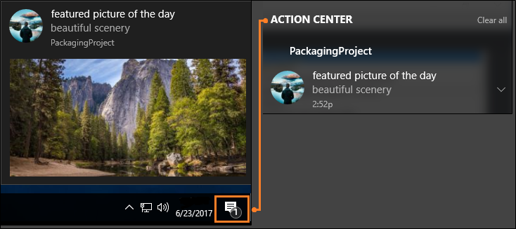

# Desktop guide to the modern platform

The modern platform is being made available as stand-alone building blocks that you can adopt in your desktop applications ala cart without having to completely rewrite applications in UWP. Enhance existing investments in-place. No re-write required. No need to learn a whole new stack to modernize.

## MSIX packages

MSIX is a new containerization package format that applies to all Windows applications including Win32, Windows Forms, WPF, and UWP. This new format inherits great features from UWP and provides robust installation and updating, managed security model with a flexible capability system, and support for the Microsoft Store, enterprise management, and many custom distribution models.

See [MSIX](https://review.docs.microsoft.com/en-us/windows/msix/landing-page-test?branch=master)

## XAML Islands (Preview)

You can add [UWP XAML controls](https://docs.microsoft.com/en-us/windows/uwp/design/controls-and-patterns/controls-by-function) to the user interfaces of your desktop application by using XAML Islands.

A XAML island acts as a wrapper for UWP XAML controls. If you have a Windows Forms or WPF application, You can drag a special control, called a XAML Island host control, to the surface of your designer. This control abstracts away the complexities of a XAML island so that all you have to do is assign that control to your favorite UWP XAML control.

There are several Fluent controls that you can add directly to your design surfaces without even having to first use a host control. These are called **Wrapped Controls**. They go one step further by abstracting away the host control.

If you have a C++ Win32 application, you can add a XAML island by using the XAML Islands API.

| XAML Island Technology            |  Windows Forms | WPF | C++ Win32 |
|------------------------------|----------------|-----|-------|
| XAML Island Host Control    |  ✔             |  ✔ |       |
| XAML Island Wrapped controls|  ✔             |  ✔ |       |
| XAML Island API             |  ✔             |  ✔ |  ✔    |

To learn more about XAML Islands, see [Host UWP controls in WPF and Windows Forms applications](https://docs.microsoft.com/en-us/windows/uwp/xaml-platform/xaml-host-controls).

### XAML Island Host Control (Preview)

>[!NOTE]
>This feature is in preview only.

You can drag a XAML Island Host control directly to the design surface of your Windows Forms or WPF application. Then, you can set that host control to any UWP XAML control that you want. See  [WindowsXAMLHostControl](https://docs.microsoft.com/en-us/windows/communitytoolkit/controls/WindowsXAMLHost).

For a catalog of UWP XAML controls, See [Controls by function](https://docs.microsoft.com/en-us/windows/uwp/design/controls-and-patterns/controls-by-function).

| Guide |  Description |
|------ |--------------|
| [Controls by function](https://docs.microsoft.com/en-us/windows/uwp/design/controls-and-patterns/controls-by-function) |   Catalog of UWP XAML controls. |
| [UWP XAML controls optimized for desktop applications](#new-packaging-project) | New UWP control such as DataGrid |

### XAML Island Wrapped Controls (Preview)

Wrapped controls that you can use directly on design surfaces.

| Control |  Description |
|------ |--------------|
| [WebView](https://docs.microsoft.com/en-us/windows/communitytoolkit/controls/webview) |   Description |
| [InkCanvas]() | Description |
| [InkToolbar]() | Description |
| [MediaPlayerElement]() | Description |
| [WebViewCompatible]() | Description  |

### XAML Island API (Preview)

>[!NOTE]
>This feature is in preview only.

For C++ win32 apps, use the XAML Island API to incorporate UWP XAML controls into your desktop application UIs.

See [Using the UWP XAML hosting API in a desktop application](https://review.docs.microsoft.com/en-us/windows/uwp/xaml-platform/using-the-xaml-hosting-api?branch=mcleans-xamlhosting).

Here's some new UWP XAML controls that you can use to create desktop-optimized experiences with a modern Fluent design.

| Guide |  Description |
|------ |--------------|
| [Controls by function](https://docs.microsoft.com/en-us/windows/uwp/design/controls-and-patterns/controls-by-function) |   Catalog of UWP XAML controls. |
| [UWP XAML controls optimized for desktop applications](#new-packaging-project) | New UWP control such as DataGrid |

<a id="desktop-uwp-controls"/>

## UWP XAML controls optimized for desktop applications

Here's some new UWP XAML controls that you can use to create desktop-optimized experiences with a modern Fluent design.

| Control |  Description |
|------ |--------------|
| [MenuBar](https://review.docs.microsoft.com/en-us/windows/uwp/design/controls-and-patterns/menus?branch=jimwalk%2Frs5-menu-bar) | MenuBar |
| [DropDownButton](https://docs.microsoft.com/en-us/windows/uwp/design/controls-and-patterns/buttons#create-a-drop-down-button) | DropDownButton |
| [SplitButton](https://docs.microsoft.com/en-us/windows/uwp/design/controls-and-patterns/buttons#create-a-split-button) | SplitButton|
| [CommandBarFlyout](https://review.docs.microsoft.com/en-us/windows/uwp/design/controls-and-patterns/command-bar-flyout?branch=jimwalk%2Frs5-command-bar-flyout) |  CommandBarFlyout |
| [EditableComboBox](https://review.docs.microsoft.com/en-us/windows/uwp/design/controls-and-patterns/combo-box?branch=rs5#make-a-combo-box-editable) | EditableComboBox |
| [DataGridView](https://docs.microsoft.com/en-us/windows/communitytoolkit/controls/datagrid) |   DataGridView |

## Windows UI library

The Windows UI library contains new platform controls that haven't yet shipped as part of the Windows platform. It also contains updated versions of existing controls.

Perhaps the best aspect of this library is that it ships controls as NuGet packages. Therefore, you can safely adopt new controls as they are released without having to worry about whether your users are running a compatible version of Windows 10.  That let's you keep your UIs on the cutting edge without having to wait for the rest of the company to catch up on Windows releases and you don't have to include version checks or conditional XAML to hedge against compatibility issues.

See [Windows UI Library (Preview version)](https://docs.microsoft.com/en-us/uwp/toolkits/winui/)

## Other UWP Features

After you've added a few file references to your desktop application project, you can use UWP APIs to add modern experiences that light up for Windows 10 users such toast notifications.

See [Enhance your desktop application for Windows 10](https://docs.microsoft.com/en-us/windows/uwp/porting/desktop-to-uwp-enhance)

## Other Interesting technologies

* [.NET Core 3](https://blogs.msdn.microsoft.com/dotnet/2018/05/07/net-core-3-and-support-for-windows-desktop-applications/)
* [Microsoft Graph](https://developer.microsoft.com/en-us/graph)
* [Adaptive Cards](https://adaptivecards.io/)
* [High DPI support in Windows Forms](https://docs.microsoft.com/en-us/dotnet/framework/winforms/high-dpi-support-in-windows-forms)
