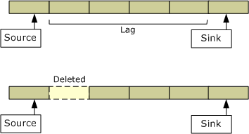

# Buffering in the Stream Buffer Engine

This topic applies to Windows XP Service Pack 1 or later.

The Stream Buffer Sink filter stores the data that it captures in temporary backing files. By default, it uses six files, each holding 5 minutes of data, for a total buffer of 30 minutes. (The default settings can be changed through the [**IStreamBufferConfigure**](/windows/previous-versions/Sbe/nn-sbe-istreambufferconfigure?branch=master) interface.)

Once the buffer limit is reached, the Stream Buffer Sink filter begins to delete files, starting from the oldest file. If a source graph is currently reading from that file, the sink filter deletes the next oldest file instead, creating a "time hole" in the playback. Time holes are caused when the source graph pauses for too long or seeks backward to the beginning of the buffer. The following image illustrates this process.

When the Stream Buffer Source filter reaches the gap where the file was deleted, it moves to the next file. However, because the presentation times haven't changed, the last frame from the older file is displayed for the duration of the deleted file. The video therefore appears to freeze for that period of time. To avoid this, the source graph should seek forward to the next valid data.

The Stream Buffer Engine sends several graph events to warn the application when files have gone stale or are about to go stale:

-   STREAMBUFFER\_EC\_CONTENT\_BECOMING\_STALE. Sent when the source filter lags behind the sink filter by more than a preset number of files. See [**IStreamBufferConfigure::GetBackingFileCount**](/windows/previous-versions/Sbe/nf-sbe-istreambufferconfigure-getbackingfilecount?branch=master).
-   STREAMBUFFER\_EC\_STALE\_DATA\_READ. Sent when the source filter is reading a file that has been marked for deletion.
-   STREAMBUFFER\_EC\_STALE\_FILE\_DELETED. Sent when a file is deleted.
-   STREAMBUFFER\_EC\_TIMEHOLE. Sent when the source filter reaches a time hole. The event parameters indicate the time and size of the hole.

For more information, see [Stream Buffer Engine Event Codes](stream-buffer-engine-codes.md).

The content in a recording never goes stale. For more information, see [Creating Stream Buffer Recordings](creating-stream-buffer-recordings.md).

 

 

