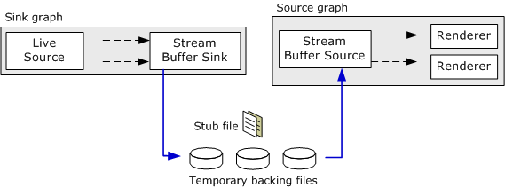
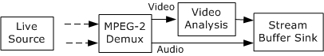

# Creating Stream Buffer Graphs

This topic applies to Windows XP Service Pack 1 or later.

The Stream Buffer Engine uses multiple filter graphs:

-   A sink graph captures data and stores it in temporary backing files. The sink graph uses the [Stream Buffer Sink](stream-buffer-sink-filter.md) filter.
-   One or more source graphs read the data from the backing files. The source graphs use the [Stream Buffer Source](stream-buffer-source-filter.md) filter. The following image illustrates this process.



The sink graph can also create permanent recordings, which can be viewed later using the Stream Buffer Source filter. Currently, the Stream Buffer Engine supports MPEG-2 video and digital video (DV) sources. The source graph must be on the same computer as the sink graph; the source graph cannot read the backing files over a network.

To build the sink graph:

1.  Create an instance of the Filter Graph Manager.
2.  Create the Stream Buffer Sink filter and add it to the filter graph.
3.  Build a regular DirectShow capture graph or television graph, but route all of the streams to the Stream Buffer Sink filter, instead of sending them to the usual renderer filters.
4.  Query the Stream Buffer Sink filter for the [**IStreamBufferSink**](istreambuffersink.md) interface.
5.  Call the [**IStreamBufferSink::LockProfile**](istreambuffersink-lockprofile.md) method. This method does several things:

    -   Creates a named stub file that references the temporary backing files. The Stream Buffer Source filter can use this stub file to access the backing files.
    -   Locks the Stream Buffer Sink filter, which prevents the inputs from changing.
    -   Stores a profile that describes the input streams. This profile enables the Stream Buffer Source filter to render the streams from a separate filter graph.

    The profile is automatically unlocked when the graph stops.

For MPEG-2 content, insert the [MPEG-2 Video Analyzer](mpeg-2-video-analyzer-filter.md) filter directly between the [MPEG-2 Demultiplexer](https://msdn.microsoft.com/library/windows/desktop/dd390715) filter and the Stream Buffer Sink filter. The Video Analyzer filter enables the source graph to use playback rates faster than 4x or less than 0 (reverse playback). The following image illustrates this process.



For more information about building the capture portion of the sink graph, see the following topics:

-   [Video Capture](https://msdn.microsoft.com/library/windows/desktop/dd407331)
-   [Writing Digital TV Applications with DirectX](writing-digital-tv-applications-with-directx.md)

To build the source graph:

1.  Create a new instance of the Filter Graph Manager.
2.  Create the Stream Buffer Source filter and add it to the filter graph.
3.  Establish a source for the Stream Buffer Source filter, by doing one of the following:
    -   Call [**IStreamBufferSource::SetStreamSink**](istreambuffersource-setstreamsink.md) with a pointer to the sink filter's **IStreamBufferSink** interface. With this method, the sink graph and the source graph must share the same process space.
    -   Call [**IFileSourceFilter::Load**](https://msdn.microsoft.com/library/windows/desktop/dd389983) with the name of the stub file that was given in the **LockProfile** method. This is equivalent to calling **SetStreamSink**, but the graphs can be in separate processes.
    -   Call **IFileSourceFilter::Load** with the name of a recorded file. (See [Creating Stream Buffer Recordings](creating-stream-buffer-recordings.md).)
4.  Enumerate the output pins on the Stream Buffer Source filter.
5.  Call [**IGraphBuilder::Render**](https://msdn.microsoft.com/library/windows/desktop/dd390089) on each pin to render the stream.

The following code shows how to create the source graph. Error checking is omitted for brevity.


```C++
// Create the filter graph.
CComPtr<IGraphBuilder> pSourceGraph;
hr = pSourceGraph.CoCreateInstance(CLSID_FilterGraph);

// Add the Stream Buffer Source filter to the graph.
CComPtr<IStreamBufferSource> pSource;
hr = pSource.CoCreateInstance(CLSID_StreamBufferSource);
CComQIPtr<IBaseFilter> pSourceF(pSource);
hr = pSourceGraph->AddFilter(pSourceF, L"SBESource");

// Set the stream sink.
hr = pSource->SetStreamSink(pSink);
// Or, pass in the file name, as follows:
// CComQIPtr<IFileSourceFilter> pFileSource(pSource);
// pFileSource->Load(L"m_gStubFileNameHere", 0);

// Render each output pin.
CComPtr<IPin> pSourcePinOut;
CComPtr<IEnumPins> pPinEnum;
hr = pSourceF->EnumPins(&amp;pPinEnum);
while (hr = pPinEnum->Next(1, &amp;pSourcePinOut, 0), hr == S_OK)
{
    hr = pSourceGraph->Render(pSourcePinOut);
    pSourcePinOut.Release();
}
```


To start capturing, run the sink graph. To start playback, run the source graph. The source graph can be run, paused, or stopped independently of the sink graph.

There is normally no reason to stop the source graph until the viewing or recording session is over. The sink graph uses a ring buffer, so the total size of the temporary backing files will not exceed a preset maximum. Stopping the source graph will create holes in the recorded content. For television sources, it is possible to change channels while the source graph is running.

To seek the source graph, use the [**IStreamBufferMediaSeeking**](istreambuffermediaseeking.md) interface directly on the Stream Buffer Source filter. For finished recordings, you can also use the [**IMediaSeeking**](https://msdn.microsoft.com/library/windows/desktop/dd407023) or [**IMediaPosition**](https://msdn.microsoft.com/library/windows/desktop/dd406977) interfaces on the Filter Graph Manager. Do not use these interfaces for live content, however. For more information, see [Stream Buffer Source Filter](stream-buffer-source-filter.md).

 

 


