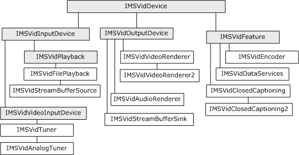

# Video Control Interface Hierarchy

This topic applies to Windows XP or later.

Tuners, renderers, and features expose a variety of interfaces, all of which ultimately derive from the [**IMSVidDevice**](imsviddevice.md) interface. The following diagram shows the inheritance hierarchy for the devices and features that are currently supported.

The shaded interfaces are not directly exposed by any objects. They act as base interfaces, to support polymorphism. For example, the [**IMSVidCtl::get\_InputActive**](imsvidctl-get-inputactive.md) method returns an [**IMSVidInputDevice**](imsvidinputdevice.md) pointer. The returned object might be a digital tuner that exposes [**IMSVidTuner**](imsvidtuner.md), or an analog tuner that exposes [**IMSVidAnalogTuner**](imsvidanalogtuner.md). You can query the returned pointer to learn more about the object.

 

 

