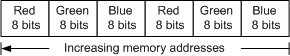

---
Description: 'The IPrintOemUni::ImageProcessing method can be used with Unidrv-supported printers to modify image bitmap data, in order to perform color formatting or halftoning.'
ms.assetid: '201450cb-cda6-4dd3-93ee-056d1627b00d'
title: 'IPrintOemUni::ImageProcessing method'
---

# IPrintOemUni::ImageProcessing method

The `IPrintOemUni::ImageProcessing` method can be used with Unidrv-supported printers to modify image bitmap data, in order to perform color formatting or halftoning. The method can return the modified bitmap to Unidrv or send it directly to the print spooler.

## Syntax


```C++
HRESULT ImageProcessing(
        PDEVOBJ           pdevobj,
        PBYTE             pSrcBitmap,
        PBITMAPINFOHEADER pBitmapInfoHeader,
        PBYTE             pColorTable,
        DWORD             dwCallbackID,
        PIPPARAMS         pIPParams,
  [out] PBYTE             *ppbResult
);
```


## Parameters

<dl> <dt>

*pdevobj* 
</dt> <dd>

Caller-supplied pointer to a [**DEVOBJ**](devobj.md) structure.

</dd> <dt>

*pSrcBitmap* 
</dt> <dd>

Caller-supplied pointer to an input [*DIB*](wdkgloss.d#wdkgloss-device-independent-bitmap--dib-).

</dd> <dt>

*pBitmapInfoHeader* 
</dt> <dd>

Caller-supplied pointer to a BITMAPINFOHEADER structure that describes the bitmap pointed to by *pSrcBitmap*. The BITMAPINFOHEADER structure is described in the Microsoft Windows SDK documentation.

</dd> <dt>

*pColorTable* 
</dt> <dd>

Caller-supplied pointer to a color table. This parameter is used only if the output format is eight bits per pixel. For more information, see the following Remarks section.

When interpreting a bitmap, you must examine the color table. Unidrv can modify the colors in a bitmap, but it will also make corresponding adjustments in the color table, resulting in no net change. However, if you ignore color table changes, and examine only the bitmap, an image might not print properly. For an example, see the discussion of the *pPaletteEntry* parameter in [**HT\_Get8BPPMaskPalette**](display.ht_get8bppmaskpalette).

</dd> <dt>

*dwCallbackID* 
</dt> <dd>

Caller-supplied value assigned to the \***IPCallbackID** attribute of the currently selected option for the ColorMode feature. For more information, see the following Remarks section.

</dd> <dt>

*pIPParams* 
</dt> <dd>

Caller-supplied pointer to an [**IPPARAMS**](ipparams.md) structure.

</dd> <dt>

*ppbResult* \[out\]
</dt> <dd>

Pointer to a memory location that contains the address of a buffer. The contents of the buffer depend on where the converted DIB should be sent.

If this method intends to send the converted DIB back to Unidrv and is successful in the conversion, it should set \**ppbResult* to the address of the buffer containing the converted DIB, and should return S\_OK. If the conversion fails, the method should set \**ppbResult* to **NULL**, and should return E\_FAIL.

If this method intends to send the converted DIB to the spooler and is successful in the conversion, the method should set \**ppbResult* to **TRUE**, and should return S\_OK. If the conversion fails, the method should set \**ppbResult* to **FALSE** and should return E\_FAIL. For more information, see the discussion of the \***DevBPP** and \***DevNumOfPlanes** attributes in the Remarks section.

</dd> </dl>

## Return value

The method must return one of the following values.


| Return code                                                                               | Description                               |
|-------------------------------------------------------------------------------------------|-------------------------------------------|
| <dl> <dt>**S\_OK**</dt> </dl>      | The operation succeeded.<br/>       |
| <dl> <dt>**E\_FAIL**</dt> </dl>    | The operation failed.<br/>          |
| <dl> <dt>**E\_NOTIMPL**</dt> </dl> | The method is not implemented.<br/> |


 

## 

### Source Bitmap Characteristics

### Destination Bitmap Characteristics

## Remarks

The `IPrintOemUni::ImageProcessing` method is used to modify image bitmaps before they are sent to the print spooler. Its purpose is to provide customized support for color modes and halftoning methods not supported by Unidrv. A printer driver that sends a bitmap to the print spooler (as opposed to sending it back to Unidrv) must set the \*DevBPP and \*DevNumOfPlanes attributes to zero in the printer's [*GPD*](wdkgloss.g#wdkgloss-generic-printer-description--gpd-) file.

If the method is implemented, and if the GPD file entry for the current color format contains an \***IPCallbackID** attribute, Unidrv calls the method each time a bitmap is available. The call is made after GDI renders the bitmap, which is then sent to the spooler. (For information about the \***IPCallbackID** attribute, see [Option Attributes for the ColorMode Feature](print.option_attributes_for_the_colormode_feature).)

If the current color mode, as specified by *dwCallbackID*, is one that Unidrv supports, then the `IPrintOemUni::ImageProcessing` method should perform halftoning operations on the received bitmap and return it to Unidrv for spooling. If the current color mode is one that Unidrv does not support, the method must perform halftoning operations and then spool the bitmap.

If the method is performing only halftoning operations, it must do the following:

-   Perform halftoning operations on the data, as indicated by the **pHalftoneOption** member of the [**IPPARAMS**](ipparams.md) structure.

-   Return the modified image data to Unidrv by placing it in a buffer and supplying the buffer's address as the method's return value. The returned buffer can be the one pointed to by *pSrcBitmap*, or it can be one that is locally allocated.

For more information about customizing halftoning operations in Unidrv, see [Customized Halftoning](print.customized_halftoning).

To handle customized color formatting, the `IPrintOemUni::ImageProcessing` method must do the following:

-   Convert DIB data, described by the *pSrcBitmap* and *pBitmapInfoHeader* parameter values, into the color format indicated by *dwCallbackID*.

-   Perform halftoning operations on the data, as indicated by the **pHalftoneOption** member of the [**IPPARAMS**](ipparams.md) structure.

-   Send the data to the print spooler by calling the [**IPrintOemDriverUni::DrvWriteSpoolBuf**](iprintoemdriveruni-drvwritespoolbuf.md) method.

-   Modify the printer's cursor position by making appropriate calls to the [**IPrintOemDriverUni::DrvXMoveTo**](iprintoemdriveruni-drvxmoveto.md) and [**IPrintOemDriverUni::DrvYMoveTo**](iprintoemdriveruni-drvymoveto.md) methods.

For more information about customizing color formatting operations in Unidrv, see [Customized Color Formats](print.customized_color_formats).

The *dwCallbackID* parameter indicates the type of color formatting, if any, that should be performed. Within the printer's GPD file, each \*Option entry for the ColorMode feature describes a color format. If the format requires processing by the `IPrintOemUni::ImageProcessing` method, its \*Option entry must contain an \***IPCallbackID** attribute. When Unidrv calls the `IPrintOemUni::ImageProcessing` method, it supplies the attribute value associated with the currently selected option for the ColorMode feature. This value is the *dwCallbackID* parameter's value.

Whether the `IPrintOemUni::ImageProcessing` method is performing color formatting operations and spooling image data, or just performing halftoning operations and returning processed bitmaps to Unidrv, it should export an [**IPrintOemUni::MemoryUsage**](iprintoemuni-memoryusage.md) method if it allocates significant amounts of memory for destination bitmaps or other purposes. Otherwise, system performance might be degraded.

If the method is implemented, it is called for every raster region on the page. However, if a region is blank, the **bBlankBand** member of the [**IPPARAMS**](ipparams.md) structure is set to **TRUE**, which indicates the block is blank and the data is invalid. Because a band can be broken up into alternating blocks of blank and nonblank regions to optimize performance, the block size does not always correspond to the band size.

The source bitmap described by *pSrcBitmap* and *pBitmapInfoHeader* has the following characteristics:

-   DIB contents are top-down ordered and uncompressed.

-   The data format is one that is listed in [Handling Color Formats](print.handling_color_formats).

-   If the format requires a color table, the table is pointed to by *pColorTable*.

-   Color data is in PRIMARY\_ORDER\_CBA format, as explained in the description of the **ulPrimaryOrder** member of the [**GDIINFO**](display.gdiinfo) structure. In other words, if the color format is RGB or CMY, the least significant *n* bits must contain the blue or yellow value, the next *n* bits must contain the green or magenta value, and the next *n* bits must contain the red or cyan value. Unused bits are in the most significant position. If the format uses 4 bits per pixel, then *n* is 1. For 24 bits per pixel, *n* is 8, as shown in the following figure. For CYMK, the fourth group of *n* bits contains black.

<dl> The preceding figure depicts color data in PRIMARY\_ORDER\_CBA format for two pixels, with 24 bits of color data per pixel. Moving from low memory addresses to high memory addresses, there are eight bits of blue data, then eight bits of green data, and then eight bits of red data, after which the pattern repeats. This is also known as BGR device output order.  
</dl>

For halftoning operations, in which a processed bitmap is returned to Unidrv, the returned bitmap must have the following characteristics:

-   DIB contents must be top-down ordered and uncompressed.

-   The data format must be one that is listed in [Handling Color Formats](print.handling_color_formats), and it must be compatible with the \***DevBPP** and \***DevNumOfPlanes** attributes of the color format identified by *dwCallbackID*. (For information about these attributes, see [Option Attributes for the ColorMode Feature](print.option_attributes_for_the_colormode_feature).)

-   If the format requires a color table, the table must be created and its address must be returned in *pColorTable*.

-   Color data must be returned in PRIMARY\_ORDER\_CBA format, as described for the source bitmap.

-   The BITMAPINFOHEADER structure specified by *pBitmapInfoHeader* must describe both the input and output bitmaps. The `IPrintOemUni::ImageProcessing` method must not change the structure's contents.

The `IPrintOemUni::ImageProcessing` method is optional. If a rendering plug-in implements this method, the plug-in's [**IPrintOemUni::GetImplementedMethod**](iprintoemuni-getimplementedmethod.md) method must return S\_OK when it receives "ImageProcessing" as input.

## Requirements


|                            |                                                                                                            |
|----------------------------|------------------------------------------------------------------------------------------------------------|
| Target platform<br/> | <dl> <dt>Desktop</dt> </dl>                         |
| Header<br/>          | <dl> <dt>Prcomoem.h (include Prcomoem.h)</dt> </dl> |


## See also

<dl> <dt>

[**IPrintOemUni**](iprintoemuni-interface.md)
</dt> <dt>

[**IPrintOemUni::FilterGraphics**](iprintoemuni-filtergraphics.md)
</dt> <dt>

[**HT\_Get8BPPMaskPalette**](display.ht_get8bppmaskpalette)
</dt> </dl>

 

 

[Send comments about this topic to Microsoft](mailto:wsddocfb@microsoft.com?subject=Documentation%20feedback%20%5Bprint\print%5D:%20IPrintOemUni::ImageProcessing%20method%20%20RELEASE:%20%285/12/2018%29&body=%0A%0APRIVACY%20STATEMENT%0A%0AWe%20use%20your%20feedback%20to%20improve%20the%20documentation.%20We%20don't%20use%20your%20email%20address%20for%20any%20other%20purpose,%20and%20we'll%20remove%20your%20email%20address%20from%20our%20system%20after%20the%20issue%20that%20you're%20reporting%20is%20fixed.%20While%20we're%20working%20to%20fix%20this%20issue,%20we%20might%20send%20you%20an%20email%20message%20to%20ask%20for%20more%20info.%20Later,%20we%20might%20also%20send%20you%20an%20email%20message%20to%20let%20you%20know%20that%20we've%20addressed%20your%20feedback.%0A%0AFor%20more%20info%20about%20Microsoft's%20privacy%20policy,%20see%20http://privacy.microsoft.com/en-us/default.aspx. "Send comments about this topic to Microsoft")


