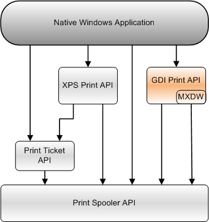

# GDI Print API

The GDI Print API provides applications with a device-independent printing interface. Use this interface if the application uses GDI to render text and graphics.

If you write applications for Windows Vista or later versions of Windows, consider using the [XPS Document API](/previous-versions/windows/desktop/dd316976(v=vs.85)) and the [XPS Print API](xps-printing.md) to use the higher-performance graphics interfaces that are supported by XPSDrv print drivers.

This section provides information about the following topics.

| Topic                                                                                             | Description                                                                                                                                                                                                                                                                                                                                                                                                                                                                                                           |
|---------------------------------------------------------------------------------------------------|-----------------------------------------------------------------------------------------------------------------------------------------------------------------------------------------------------------------------------------------------------------------------------------------------------------------------------------------------------------------------------------------------------------------------------------------------------------------------------------------------------------------------|
| [About the GDI Print API](about-the-gdi-print-api.md)                                  | An overview of the GDI printing functionality.                                                                                                                                                                                                                                                                                                                                                                                                                                                              |
| [Using the GDI Print API](using-the-printing-functions.md)                             | Information about using the GDI Print API in an application.                                                                                                                                                                                                                                                                                                                                                                                                                                                |
| [GDI Print API Reference](gdi-print-api-reference.md)                                  | Detailed descriptions of the functions, structures, and other elements of the GDI Print API.                                                                                                                                                                                                                                                                                                                                                                                                                |
| [Microsoft XPS Document Converter (MXDC)](microsoft-xps-document-converter--mxdc-.md)  | The [Microsoft XPS Document Converter (MXDC)](microsoft-xps-document-converter--mxdc-.md) is a component that enables applications to use the GDI Print API with printers that have an XPSDrv Print Driver.                                                                                                                                                                                                                                                                                                |
| [Microsoft XPS Document Writer (MXDW)](microsoft-xps-document-writer.md)               | The [Microsoft XPS Document Writer (MXDW)](microsoft-xps-document-writer.md) provides applications with "save as XPS" or "export to XPS" functionality. Applications that do not natively create XPS document content can use the MXDW to create XPS document files without using the [XPS Document API](/previous-versions/windows/desktop/dd316976(v=vs.85)). The XPS Document API, however, provides an application with the ability to use the higher-performance graphics interfaces that are supported by XPSDrv print drivers.  |

 

The following diagram shows the relationship of the GDI Print API to the other print APIs that an application can use.

## Related topics

<dl> <dt>

[**AddJob**](addjob.md)
</dt> <dt>

[XPS Document API](/previous-versions/windows/desktop/dd316976(v=vs.85))
</dt> <dt>

[XPS Print API](xps-printing.md)
</dt> <dt>

[Print Spooler API](print-spooler-api.md)
</dt> <dt>

[Print Ticket API](print-ticket-api.md)
</dt> </dl>

 

