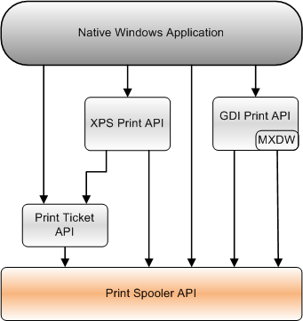

# Print Spooler API

The Print Spooler API provides an interface to the print spooler for applications to manage printers and print jobs.

The Print Spooler API is used by an application as part of its programming and not directly by end users.

This section contains information about the following topics.

| Topic                                                                                             | Description                                                                                                                                                                                                             |
|---------------------------------------------------------------------------------------------------|-------------------------------------------------------------------------------------------------------------------------------------------------------------------------------------------------------------------------|
| [Print Spooler API Reference](printing-and-print-spooler-reference.md)                 | Detailed information about the functions, structures, and other elements of the Print Spooler API.                                                                                                            |
| [Asynchronous Printing Notification Reference](asynchronous-printing-notification.md)  | Descriptions of the functions, interfaces, and enumerations that are used in asynchronous communication between applications and print-spooler-hosted components, such as printer drivers and port monitors.  |
| [Printer Driver Installation Reference](printer-driver-installation-reference.md)      | Describes the functions that install and configure printer drivers on a computer.                                                                                                                             |

 

The following diagram shows the relationship of the Print Spooler API to the other Print APIs that a native Windows application can use.

## Related topics

<dl> <dt>

[XPS Print API](xps-printing.md)
</dt> <dt>

[Print Ticket API](print-ticket-api.md)
</dt> <dt>

[GDI Print API](gdi-printing.md)
</dt> </dl>

 

 

