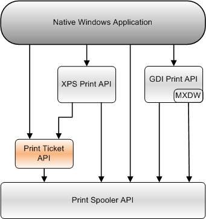

# Print Ticket API

The Print Ticket API provides enables applications to manage and convert print tickets.

A print ticket is an XPS document component that contains the preferred printer settings for a page in a document, or for an entire document, or for a print job that contains one or more documents. Note that print tickets are only found in XPS documents.

Before the printer can use the print ticket, the print ticket must be validated against the printer's characteristics, which are defined in the printer's Print Capabilities. The application performs that validation by calling the Print Ticket API.

The PrintTicket and PrintCapabilities are described by using elements of the Print Schema, which is defined by the [Print Schema Specification](https://download.microsoft.com/download/D/E/C/DECA6E6B-3E81-48E7-B7EF-6D92A547D03C/print-schema-spec-2-0.zip).

This topic contains information about the following API elements:

-   [Print Ticket API Functions](print-ticket-api-functions.md)
-   [Print Ticket API Enumerations](print-ticket-api-enumerations.md)

The following diagram shows the relationship of the Print Ticket API to the other Print APIs that a native Windows application can use.

## Related topics

<dl> <dt>

[XPS Print API](xps-printing.md)
</dt> <dt>

[Print Spooler API](print-spooler-api.md)
</dt> <dt>

[GDI Print API](gdi-printing.md)
</dt> <dt>

[Print Schema Specification](https://go.microsoft.com/fwlink/?linkid=2022117)
</dt> <dt>

[XML Paper Specification](https://go.microsoft.com/fwlink/?linkid=2022122)
</dt> </dl>

 

 

