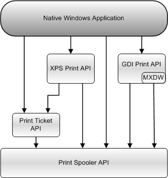

# Printing (Documents and Printing)

Windows provides applications with a complete set of functions that allow printing to various devices, such as laser printers, vector plotters, raster printers, and fax machines.

## Desktop App Printing

Windows programmers can select from several different technologies to print from their application.

| Technology | Description | 
|------------|-------------|
| <a href="/windows/desktop/printdocs/tailored-app-printing-api">Print Document Package API</a>  | Provides an interface that allows an application to access and manage the print document package. This API is available with Windows 8 and later versions of Windows.  | 
| <a href="print-spooler-api.md">Print Spooler API</a>  | Provides an interface to the print spooler so that applications can manage printers and print jobs.  Applications use the <a href="print-spooler-api.md">Print Spooler API</a> to start, stop, control, and configure print jobs managed by the print spooler whether they use the <a href="/windows/desktop/printdocs/tailored-app-printing-api">Print Document Package API</a> or the <a href="gdi-printing.md">GDI Print API</a> to print the content.  | 
| <a href="print-ticket-api.md">Print Ticket API</a>  | Provides applications with functions to manage and convert print tickets.  | 
| <a href="gdi-printing.md">GDI Print API</a>  | Provides applications with a device-independent printing interface.  <blockquote>[!Note] Developers who are writing applications for Windows Vista and later versions of Windows should consider using the <a href="/previous-versions/windows/desktop/dd316976(v=vs.85)">XPS Document API</a> in their application.</blockquote>  The <a href="gdi-printing.md">GDI Print API</a> is suitable for applications that must run on Windows XP and earlier versions of Windows.  | 

 

The following illustration provides a high-level view of how the different printing APIs are related.

 

The [Print Document Package API](./tailored-app-printing-api.md)s in this section describe the print document package and print preview interfaces that you can use with Windows 8 and later versions of Windows desktop.

For more info about printing from Windows Store apps that are written in JavaScript and HTML, see [Printing (Windows Store apps using JavaScript and HTML)](/previous-versions/windows/apps/hh465225(v=win.10)). For more info about printing from Windows Store apps that are written in C#, Microsoft Visual Basic, or C++ and XAML, see [Printing (Windows Store apps using C)](/previous-versions/windows/apps/hh465196(v=win.10)).

> [!Note]  
> See [Win32 and COM for Windows Store apps (printing and documents)](/uwp/win32-and-com/win32-and-com-for-uwp-apps) for the list of the Desktop App Printing APIs that can also be used in Windows Store apps.

 

## Related topics

<dl> <dt>

[XPS Document API](/previous-versions/windows/desktop/dd316976(v=vs.85))
</dt> <dt>

[Bidirectional printer communications (Hardware Dev Center)](/windows-hardware/drivers/print/bidirectional-communication)
</dt> </dl>

