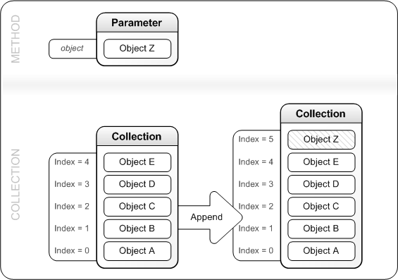
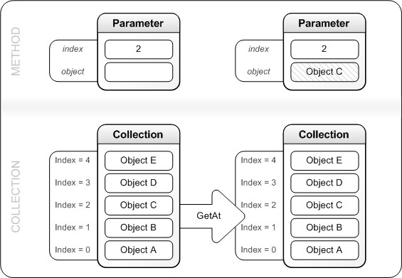
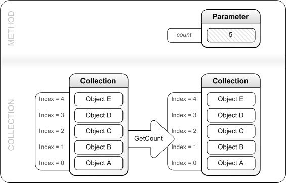
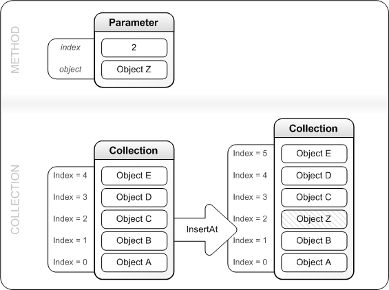
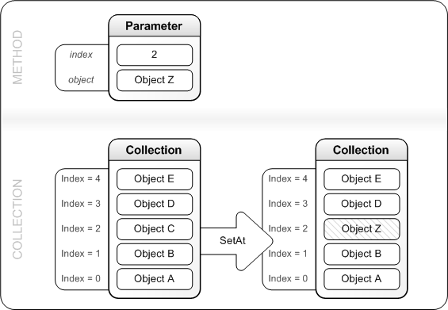

# Working with XPS OM Collection Interfaces

Describes how to use the common methods of the collection interfaces.

## Contents

The methods described in this section are shown in the list that follows. Not all collection interfaces support each of these methods, and some interfaces also support methods that are not described on this page. For the list of methods supported by a specific interface, refer to the description of that interface's description.

<dl>

[Append Method](#append-method)  
[GetAt Method](#getat-method)  
[GetCount Method](#getcount-method)  
[InsertAt Method](#insertat-method)  
[RemoveAt Method](#removeat-method)  
[SetAt Method](#setat-method)  
</dl>

[See also](#see-also)

## Append Method

Appends an object to the end of the collection.

**Generic Syntax**


```C++
HRESULT Append(
  [in]  Object *object
);
```


**Description**

To the end of the collection, this method appends an object that is passed in the parameter list, as shown in the following diagram.



## GetAt Method

Gets an object from a specified location in the collection.

**Generic Syntax**


```C++
HRESULT GetAt(
  [in]           UINT32 index,
  [out, retval]  Object **object
);
```


**Description**

Writes the object that is stored at the collection's location specified by *index* to the variable referenced by *object*. This action does not change the collection's contents. The following diagram illustrates this process.



## GetCount Method

Gets the number of objects stored in the collection.

**Generic Syntax**


```C++
HRESULT GetCount(
  [out, retval]  UINT32 *count
);
```


**Description**

Writes the number of objects that are currently stored in the collection into the variable referenced by *count*. This action does not change the collection's contents. The following diagram illustrates this process.



## InsertAt Method

Inserts an object at a specified location of the collection.

**Generic Syntax**


```C++
HRESULT InsertAt(
  [in]  UINT32 index,
  [in]  Object *object
);
```


**Description**

The object that is passed in *object* is inserted into the collection at the location specified by *index*. Before inserting the new *object*, this method moves by 1 the object that has previously occupied the location at *index* and moves all interface pointers subsequent to *index*. The following diagram illustrates this process.



## RemoveAt Method

Removes the object from a specified location in the collection.

**Generic Syntax**


```C++
HRESULT RemoveAt(
  [in]  UINT32 index
);
```


**Description**

This method releases the object from the location specified by *index*, then compacts the collection by reducing by 1 the index of each pointer subsequent to *index*. The following diagram illustrates this process.


## SetAt Method

Replaces the object at a specified location in the collection.

**Generic Syntax**


```C++
HRESULT SetAt(
  [in]  UINT32 index,
  [in]  Object *object
);
```


**Description**

This method first releases the object at the location referenced by *index*, then replaces that object with the one that is passed in *object*. The following diagram illustrates this process.



## See Also

<dl>

[**IXpsOMColorProfileResourceCollection**](/windows/desktop/api/xpsobjectmodel/nn-xpsobjectmodel-ixpsomcolorprofileresourcecollection)  
[**IXpsOMDashCollection**](/windows/desktop/api/xpsobjectmodel/nn-xpsobjectmodel-ixpsomdashcollection)  
[**IXpsOMDocumentCollection**](/windows/desktop/api/xpsobjectmodel/nn-xpsobjectmodel-ixpsomdocumentcollection)  
[**IXpsOMFontResourceCollection**](/windows/desktop/api/xpsobjectmodel/nn-xpsobjectmodel-ixpsomfontresourcecollection)  
[**IXpsOMGeometryFigureCollection**](/windows/desktop/api/xpsobjectmodel/nn-xpsobjectmodel-ixpsomgeometryfigurecollection)  
[**IXpsOMGradientStopCollection**](/windows/desktop/api/xpsobjectmodel/nn-xpsobjectmodel-ixpsomgradientstopcollection)  
[**IXpsOMImageResourceCollection**](/windows/desktop/api/xpsobjectmodel/nn-xpsobjectmodel-ixpsomimageresourcecollection)  
[**IXpsOMNameCollection**](/windows/desktop/api/xpsobjectmodel/nn-xpsobjectmodel-ixpsomnamecollection)  
[**IXpsOMPageReferenceCollection**](/windows/desktop/api/xpsobjectmodel/nn-xpsobjectmodel-ixpsompagereferencecollection)  
[**IXpsOMPartUriCollection**](/windows/desktop/api/xpsobjectmodel/nn-xpsobjectmodel-ixpsomparturicollection)  
[**IXpsOMRemoteDictionaryResourceCollection**](/windows/desktop/api/xpsobjectmodel/nn-xpsobjectmodel-ixpsomremotedictionaryresourcecollection)  
[**IXpsOMSignatureBlockResourceCollection**](/windows/desktop/api/xpsobjectmodel/nn-xpsobjectmodel-ixpsomsignatureblockresourcecollection)  
[**IXpsOMVisualCollection**](/windows/desktop/api/xpsobjectmodel/nn-xpsobjectmodel-ixpsomvisualcollection)  
[**IXpsSignatureBlockCollection**](/windows/desktop/api/xpsdigitalsignature/nn-xpsdigitalsignature-ixpssignatureblockcollection)  
[**IXpsSignatureCollection**](/windows/desktop/api/xpsdigitalsignature/nn-xpsdigitalsignature-ixpssignaturecollection)  
[**IXpsSignatureRequestCollection**](/windows/desktop/api/xpsdigitalsignature/nn-xpsdigitalsignature-ixpssignaturerequestcollection)  
</dl>

 

 


