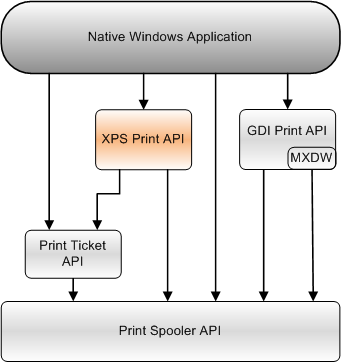

# XPS Print API

\[The XPS Print API is not supported and may be altered or unavailable in the future. Client applications should use the [Print Document Package API](./tailored-app-printing-api.md) instead.\]

Provides an interface to the print spooler. Applications can use this API to send XPS documents to a printer.

This section contains information about the following topics.

<dl>

[About the XPS Print API](about-xps-print-api.md)  
[Using the XPS Print API](using-the-xps-print-api.md)  
[XPS Print API Reference](xpsprint-interfaces.md)  
</dl>

Native Windows applications that create XPS documents, such as by using the [XPS Document API](/previous-versions/windows/desktop/dd316976(v=vs.85)), can use the XPS Print API to send XPS document content to a printer.

The following diagram shows the relationship of the XPS Print API to the other Print APIs that a native Windows application can use.

## Related topics

<dl> <dt>

[**AddJob**](addjob.md)
</dt> <dt>

[Print Spooler API](print-spooler-api.md)
</dt> <dt>

[Print Ticket API](print-ticket-api.md)
</dt> <dt>

[GDI Print API](gdi-printing.md)
</dt> </dl>

 

 
