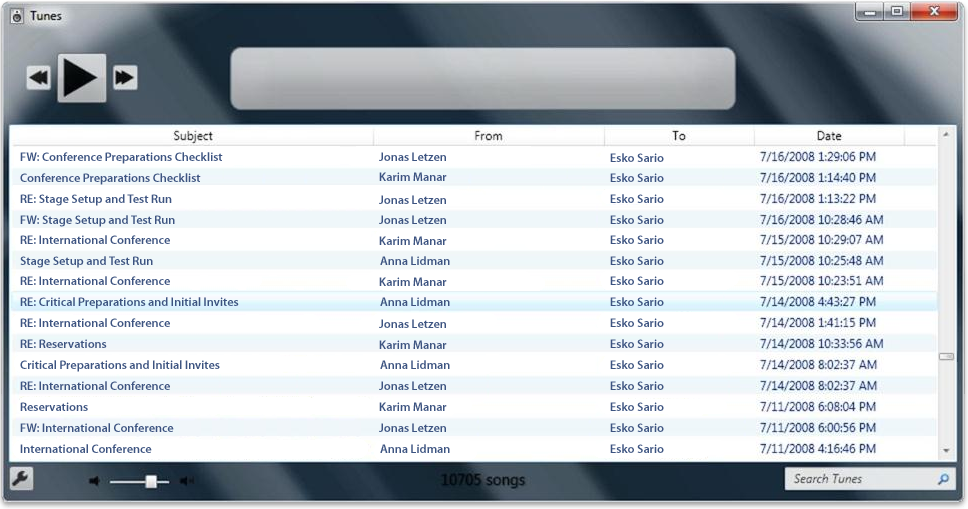

# Using Managed Code with Shell Data and Windows Search

The Windows Search SDK provides an interopability assembly for you to work with Component Object Model (COM) objects that are exposed by Windows Search and other programs against the interfaces and classes using managed code. The interopability assembly is digitally signed by Microsoft and can be found with the [Windows Search samples](-search-samples-ovw.md).

This topic is organized as follows:

-   [Using the Windows API CodePack](#using-the-windows-api-codepack)
    -   [Accessing Index Results](#accessing-index-results)
    -   [Sample Application Using the Windows API Codepack](#sample-application-using-the-windows-api-codepack)
-   [Related topics](#related-topics)

## Using the Windows API CodePack

If you are working in the Microsoft .NET environment, use the [Windows API Code Pack for Microsoft .NET Framework](https://www.nuget.org/packages/Microsoft.Windows.Compatibility) to obtain search results, or just browse the namespace. The [Windows API Code Pack for Microsoft .NET Framework](https://www.nuget.org/packages/Microsoft.Windows.Compatibility) provides you with a collection of Shell items that are essentially wrappers around the native [IShellItem Interface](/windows/win32/api/shobjidl_core/nn-shobjidl_core-ishellitem). You can iterate over this collection and get the various property values in a fashion similar to how you would enumerate the results in a table from an Object Linking and Embedding Database (OLE DB) query.

The following code snippet illustrates how to iterate over Search items and obtain the property values for each.


```
foreach (ShellObject so in KnownFolders.SavedSearches)
{
    searchFolder = new ShellSearchFolder(finalSearchCondition, (ShellContainer)so);
    List<ShellObject> items = new List<ShellObject>();
    foreach (ShellObject so2 in searchFolder) items.Add(so2);   
}
```


### Accessing Index Results

You can access index results through either OLE DB or the Shell data model. There are advantages and disadvantages with either approach. One advantage is that OLE DB and Structured Query Language (SQL) are familiar to database programmers. Other advantages are better control over performance when querying only the indexer, and access to additional functionality such as the ability to locate previous results in a new rowset quickly.

Advantages of the Shell data model are that it abstracts across different sources of information such as OpenSearch, and provides access to additional functionality such as thumbnails and property handlers. Nor does the Shell object model require special case support for non-filename results such as mail items and OneNote results, nor for any item that resides in the user's index. Note that in Shell [KNOWNFOLDERID](../shell/knownfolderid.md) is the known folder scope for local indexed content. For more information on creating a Shell data source, see [Implementing the Basic Folder Object Interfaces](/previous-versions/windows/desktop/legacy/cc144093(v=vs.85)).

OpenSearch data sources are not exposed through OLE DB for federated search in Windows 7 and later. For this reason we recommend that you consider writing a LINQ provider for the Shell namespace instead of using OLE DB to access the indexer results. For more information, see [Walkthrough: Creating an IQueryable LINQ Provider](/previous-versions/bb546158(v=vs.140)).

### Sample Application Using the Windows API Codepack

The following screenshot represents a mock up of a sample application created with the [Windows API Code Pack for Microsoft .NET Framework](https://www.nuget.org/packages/Microsoft.Windows.Compatibility).



## Related topics

<dl> <dt>

**Conceptual**
</dt> <dt>

[Federated Search in Windows](-search-federated-search-overview.md)
</dt> <dt>

**Other Resources**
</dt> <dt>

[Cross-Language Interoperability](/previous-versions/dotnet/netframework-1.1/730f1wy3(v=vs.71))
</dt> </dl>

 

 
