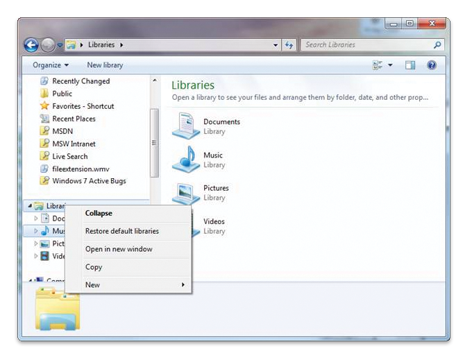

# Creating a Search Connector for a Protocol Handler

Windows Explorer controls the creation of a search connector for a protocol handler through registry key entries. Through the registry both implementers and third parties can enable new and legacy protocol handlers to participate in Windows 7 Search.

This topic is organized as follows:

-   [About Search Connectors for Protocol Handlers in Windows 7](#about-search-connectors-for-protocol-handlers-in-windows-7)
-   [Enabling Protocol Handlers to Participate in Search](#enabling-protocol-handlers-to-participate-in-search)
    -   [Disabling Protocol Handler Search Connector Creation](#disabling-protocol-handler-search-connector-creation)
    -   [Customizing the Name, Description or FolderType for a Protocol Handler Search Connector](#customizing-the-name-description-or-foldertype-for-a-protocol-handler-search-connector)
    -   [Using Registry String Redirection](#using-registry-string-redirection)
    -   [Restoring a Deleted Protocol Handler Search Connector](#restoring-a-deleted-protocol-handler-search-connector)
-   [Additional Resources](#additional-resources)
-   [Related topics](#related-topics)

## About Search Connectors for Protocol Handlers in Windows 7

In Windows 7, searches from the **Start** menu or Windows Explorer include only files in indexed locations, and non-file system items such as remote data stores or protocol handler items that have a search connector. In addition to including the protocol handler items in the scope of **Start** menu and Shell searches, the search connector enables the **Start** menu to group protocol handler items together in **Start** menu results, with the resulting benefit that the user can click the group header and view results from only the protocol handler. Alternatively, the user can navigate to the **Searches** folder, open the search connector file, and perform a search that includes only items from the specific protocol handler associated with that search connector.

When a user first starts an application that registers a protocol handler, Windows Explorer generates a search connector file (.searchConnector-ms) for the protocol handler in the user's **Searches** folder. Applications with protocol handlers can choose to disable this behavior or customize the name and description of the protocol handler search connector.

> [!Note]  
> The location of the user's **Searches** folder is %userprofile%\\Searches, or FOLDERID\_SavedSearches. The GUID for FOLDERID\_SavedSearches is {7d1d3a04-debb-4115-95cf-2f29da2920da}.

 

Windows Explorer controls the creation of a search connector for a protocol handler through registry key entries described in the following sections:

-   [Enabling Protocol Handlers to Participate in Search](#enabling-protocol-handlers-to-participate-in-search)
-   [Disabling Protocol Handler Search Connector Creation](#disabling-protocol-handler-search-connector-creation)
-   [Customizing the Name, Description or FolderType for a Protocol Handler Search Connector](#customizing-the-name-description-or-foldertype-for-a-protocol-handler-search-connector)
-   [Restoring a Deleted Protocol Handler Search Connector](#restoring-a-deleted-protocol-handler-search-connector)

> [!Note]  
> There are no programmatic means to create a search connector for a protocol handler. They must be configured through the registry.

 

## Enabling Protocol Handlers to Participate in Search

Registry keys and their possible values are outlined in the following table. A protocol handler can populate some or all of these registry keys where &lt;protocol&gt; is replaced with the actual name of its protocol, such as MAPI, file, or csc, for example.


| Registry key                                                                                                                 | Possible value(s)                                                                                                                     | Type       | Comments                                                                                                                                                                                                                                                                                                                                                  |
|------------------------------------------------------------------------------------------------------------------------------|---------------------------------------------------------------------------------------------------------------------------------------|------------|-----------------------------------------------------------------------------------------------------------------------------------------------------------------------------------------------------------------------------------------------------------------------------------------------------------------------------------------------------------|
| HKEY\_LOCAL\_MACHINE\\Software\\Microsoft\\Windows Search\\PHSearchConnectors\\&lt;protocol&gt;\\Version                     | Does not exist (default). Otherwise it is 1 or greater.                                                                               | REG\_DWORD | This value is used to detect changes to the location template registrations for search roots that have already been processed. If does not exist, use 0 as a default. Alternatively, increment the version to inform Windows Explorer that the search connector should be regenerated because a newer version of the protocol handler has been installed. |
| HKEY\_LOCAL\_MACHINE\\Software\\Microsoft\\Windows Search\\PHSearchConnectors\\&lt;protocol&gt;\\DoNotCreateSearchConnectors | Does not exist (default). Otherwise set to 1.                                                                                         | REG\_DWORD | If it does not exist, create a .searchconnector-ms file in the Searches folder. If 1, mark as processed and do nothing.                                                                                                                                                                                                                                   |
| HKEY\_LOCAL\_MACHINE\\Software\\Microsoft\\Windows Search\\PHSearchConnectors\\&lt;protocol&gt;\\Default\\Description        | A localizable string containing the description of the search connector.                                                              | REG\_SZ    | Optional. It is used in the Description element of the .searchconnector-ms file.                                                                                                                                                                                                                                                                          |
| HKEY\_LOCAL\_MACHINE\\Software\\Microsoft\\Windows Search\\PHSearchConnectors\\&lt;protocol&gt;\\Default\\Name               | A localized string to name the search connector. Used as the name of the .searchconnector-ms file.                                    | REG\_SZ    | Each location must have a unique name. In the absence of this value, the display name provided by the protocol handler's [IShellFolder Interface](/windows/win32/api/shobjidl_core/nn-shobjidl_core-ishellfolder) will be used.                                                                                                                             |
| HKEY\_LOCAL\_MACHINE\\Software\\Microsoft\\Windows Search\\PHSearchConnectors\\&lt;protocol&gt;\\Default\\FolderType         | A GUID identifying the [FOLDERTYPEID](../shell/foldertypeid.md) to apply to the search connector. | REG\_SZ    | Optional. Used in the folderType element of the .searchconnector-ms file to indicate what templates should be used to display results. For example, the GUID value of FOLDERTYPEID\_Documents.                                                                                                                                                            |


 

### Disabling Protocol Handler Search Connector Creation

If your application exposes items through a protocol handler for use in the application itself and you do not want to expose the items through the Shell (in **Start** menu and Windows Explorer searches), you need to disable the creation of a search connector for your protocol handler.

To disable search connector creation set DoNotCreateSearchConnectors to 0x00000001(1), as shown in the following registry key example.

```
HKEY_LOCAL_MACHINE
   Software
      Microsoft
         Windows Search
            PHSearchConnectors
               <protocol>
                  DoNotCreateSearchConnectors
```

If DoNotCreateSearchConnectors is set to 1, then we recommend that you expose the [System.Shell.OmitFromView](/windows/desktop/properties/props-system-shell-omitfromview) property on each item exposed by the protocol handler, and set the value of this property to **TRUE**. Doing so will prevent the protocol handler items from appearing under the **Start** menu **Files** group.

If DoNotCreateSearchConnectors is present and set to zero, then Windows Explorer will create a search connector for the protocol handler, and the protocol handler items will be returned in in **Start** menu and Windows Explorer searches.

### Customizing the Name, Description or FolderType for a Protocol Handler Search Connector

The search connector name is used not only to identify the search connector in the **Searches** folder, but as the group header for the results in **Start** menu searches. Hence, it is important to provide a descriptive name for the search connector. If a name is not provided in the registry key, by default Windows Explorer uses the name provided by [IShellFolder Interface](/windows/win32/api/shobjidl_core/nn-shobjidl_core-ishellfolder) for the protocol handler's search root and blank description. You can override the default name through a registry key entry without having to rename the IShellFolder Interface. Although it is not as visible as the search connector name, you can also override the description for the search connector by providing your own description.

To override the default name or description, set the entries as shown in the following registry example.

```
HKEY_LOCAL_MACHINE
   Software
      Microsoft
         Windows Search
            PHSearchConnectors
               <protocol>
                  Default
                     Name
                     Description
```

In addition, the FolderType entry can be set to one of the [FOLDERTYPEID](../shell/foldertypeid.md) GUIDs. The value should be the actual GUID, and not its name. For example, {94d6ddcc-4a68-4175-a374-bd584a510b78} rather than FOLDERTYPEID\_Music. The GUID for a FOLDERTYPEID can be obtained in the Shlguid.h header file in the [Windows SDK](https://msdn.microsoft.com/windowsvista/bb980924.aspx).

```
HKEY_LOCAL_MACHINE
   Software
      Microsoft
         Windows Search
            PHSearchConnectors
               <protocol>
                  Default
                     FolderType = {94d6ddcc-4a68-4175-a374-bd584a510b78}
```

### Using Registry String Redirection

You can use a [redirected string](../intl/using-registry-string-redirection.md) to ensure that the name you provide for the search connector can be localized. You can include localizable strings for the name and description registry keys instead of entering the actual string into the registry.

To include a localizable string for the Name or Description values, set the value as shown in the following registry key example.

```
HKEY_LOCAL_MACHINE
   Software
      Microsoft
         Windows Search
            PHSearchConnectors
               <protocol>
                  Name = @dllname.dll,-resourceID
```

The localizable string takes the following format:

-   @dllname.dll,-resourceID, where:
    -   @dllname.dll is the path to the DLL that contains the string resource
    -   resourceID is the integer resource ID of the string resource

The format for an indirect string, and an indirect string appended with a version modifier, is described in [SHLoadIndirectString Function](/windows/win32/api/shlwapi/nf-shlwapi-shloadindirectstring).

### Restoring a Deleted Protocol Handler Search Connector

Because search connectors are files on the user's computer, they can be mistakenly deleted. To restore all deleted protocol handler search connectors, restore the default libraries. To so do, open Windows Explorer, right-click the **Libraries** folder, and then select **Restore Default Libraries**.



## Additional Resources

-   [IShellItem::GetDisplayName](/windows/desktop/api/shobjidl_core/nf-shobjidl_core-ishellitem-getdisplayname)
-   [SIGDN\_NORMALDISPLAY](/windows/win32/api/shobjidl_core/ne-shobjidl_core-sigdn)

## Related topics

<dl> <dt>

**Conceptual**
</dt> <dt>

[Understanding Protocol Handlers](-search-3x-wds-extidx-prot-implementing.md)
</dt> <dt>

[Developing Protocol Handlers](-search-3x-wds-phaddins.md)
</dt> <dt>

[Notifying the Index of Changes](-search-3x-wds-notifyingofchanges.md)
</dt> <dt>

[Adding Icons and Context Menus](-search-3x-wds-ph-ui-extensions.md)
</dt> <dt>

[Code Sample: Shell Extensions for Protocol Handlers](-search-3x-wds-ph-ui-samplecode.md)
</dt> <dt>

[Installing and Registering Protocol Handlers](-search-3x-wds-ph-install-registration.md)
</dt> <dt>

[Debugging Protocol Handlers](-search-ws-protocolhandlertesting.md)
</dt> </dl>

 

 
