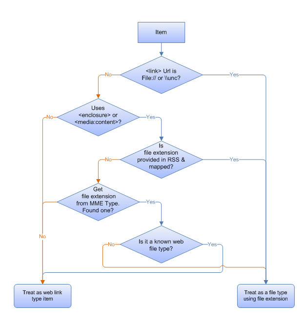

# Enabling Your Data Store in Windows Federated Search

Explains how to enable your data store to be accessed by an [OpenSearch](https://github.com/dewitt/opensearch) web service, and how to avoid potential barriers for doing so.

This topic is organized as follows:

-   [Conditions for Search Request Acceptance](#conditions-for-search-request-acceptance)
    -   [Supported Query Syntax](#supported-query-syntax)
    -   [Supported Authentication Protocols](#supported-authentication-protocols)
-   [Sending Queries and Returning Search Results in RSS or Atom](#sending-queries-and-returning-search-results-in-rss-or-atom)
    -   [Example of an RSS Feed Output](#example-of-an-rss-feed-output)
-   [Automatic Mapping to Windows Shell Properties](#automatic-mapping-to-windows-shell-properties)
-   [Understanding How Windows Maps Items to File Types](#understanding-how-windows-maps-items-to-file-types)
-   [Avoiding Potential Barriers to Enabling a Data Store](#avoiding-potential-barriers-to-enabling-a-data-store)
-   [Additional Resources](#additional-resources)
-   [Related topics](#related-topics)

## Conditions for Search Request Acceptance

The [OpenSearch](https://github.com/dewitt/opensearch) web service you create on your web server **must** fulfill the following two requirements:

-   Be able to accept a `GET URL` query from the client.
-   Permit the search terms to be embedded in the URL.

    The following example shows how a search term can be embedded in a URL.

    ```
    https://example.com/search.aspx?query=terms&param=mysearchword
    ```

    

> [!Note]  
> Federated search does not support sending `POST` requests to a web service.

 

For more information about constructing a URL, see "URL Template Parameters" in [Creating an OpenSearch Description File in Windows Federated Search](-search-federated-search-osdx-file.md).

### Supported Query Syntax

There is no specific query syntax expected in Windows 7. The OpenSearch provider accepts whatever terms the user enters in the input box in Windows Explorer, and encodes it into the URL. It does so according to the URL template described in "URL Template Parameters" in [Creating an OpenSearch Description File in Windows Federated Search](-search-federated-search-osdx-file.md).

Users expect that separate terms are treated as implicitly ANDed together. For example, a query for "Microsoft Windows" should return only results that contain both "Windows" and "Microsoft".

### Supported Authentication Protocols

Windows Federated Search supports Windows-based authentication, and can provide credentials to web services via the following protocols:

-   NTLM.
-   Kerberos.
-   Basic (only over https).
-   Other Security Support Providers (SSPs) installed on Windows that provide additional querying capacity. See the [SSP Interface](../secauthn/sspi.md) SDK documentation to keep abreast of the potential addition of other SSPs.

## Sending Queries and Returning Search Results in RSS or Atom

The [OpenSearch](https://github.com/dewitt/opensearch) provider is responsible for mapping the XML element values to Windows Shell system properties that can be used by Windows applications. But you are not limited to the default mappings of standard RSS or Atom elements, and can include custom XML elements in the Windows namespace for each of the properties. For example, you can add your own custom XML elements within the **item** element to provide additional metadata to Windows. You can also map elements from other XML namespaces, such as iTunes

### Example of an RSS Feed Output

The following example RSS feed output returns one item.


```
<rss version="2.0" xmlns:media="https://search.yahoo.com/mrss/" xmlns:example="https://example.com/namespace">
   <channel>
      <title>Search Results</title>
      <item>
         <title>An example result</title>
         <link>https://example.com/pictures.aspx?id=01</link>
         <description>This is a test of the emergency search results system. If this were a real emergency result, you'd be reading something more useful.</description>
         <pubDate>Wed, 1 Oct 2008 23:12:00 GMT</pubDate>
         <media:content url="https://example.com/pictures/picture01.jpg" fileSize="212889" type="image/jpeg" height="768" width="1024"/>
         <media:thumbnail url="https://example.com/thumbnails/picture01.jpg" height="120" width="160"/>
         <example:dateTaken>Mon, 22 Sep 2008 23:12:00 GMT</example:dateTaken>
      </item>
   </channel>
</rss>
```


For more detailed information about property mapping, see the "Extended Elements in WIndows Federated Search" and "Custom Property Mappings" sections in [Creating an OpenSearch Description File in Windows Federated Search](-search-federated-search-osdx-file.md).

## Automatic Mapping to Windows Shell Properties

Within the items in your RSS feed, you can choose to include other XML elements that automatically map to Windows Shell system properties. To do so, include an element named after the Windows Shell property and prefixed with the Windows Shell system namespace. The following example illustrates the namespace declaration `win=" http://schemas.microsoft.com/windows/2008/propertynamespace"` and the inclusion of an element for the property mapping `win:System.Contact.PrimaryEmailAddress`:


```
<rss version="2.0" xmlns:example="https://example.com/schema/2009" xmlns:win="http://schemas.microsoft.com/windows/2008/propertynamespace">
...
   <item>
      <title>Someone</title>
      <win:System.Contact.PrimaryEmailAddress>someone@example.com
   </win:System.Contact.PrimaryEmailAddress>
   </item>
```


The namespace prefix used here (`"win"`) is a suggestion; you can use any prefix. However, you must use the exact Windows Shell property names, and must include the exact Uniform Resource Identifier (URI), as shown in the following example:


```
http://schemas.microsoft.com/windows/2008/propertynamespace
```


**About Windows Shell System Properties**

Windows defines a complete list of [System Properties](../properties/props.md) and the value type format required for each property. The documentation for the [System.FileExtension](../properties/props-system-fileextension.md) Window Shell property, for example, specifies that the value must contain the leading dot (".docx" and not "docx").

**Date and Time Values**

The preferred date and time format is ISO-8601, as shown in the following example:


```
2008-01-16T 19:20:30:.45+01:00
```


.NET developers should use the DateTime class with `ToString("R") `to output the correct format.

For more detailed information about property mapping, see "Extended Elements in Windows Federated Search" in [Creating an OpenSearch Description File in Windows Federated Search](-search-federated-search-osdx-file.md).

## Understanding How Windows Maps Items to File Types

Searching within the Windows Explorer UI permits users to treat results as files when an RSS item points to a file stored remotely. The user can drag and drop items to the desktop, and the Windows Explorer UI displays the correct icon and provides the appropriate shortcut menu. If the RSS item does not point to a remotely stored file, the file is treated as a link, and users can perform actions on it such as creating a shortcut or opening it in the browser.

The following flowchart shows how Windows determines an item's file type.



The [OpenSearch](https://github.com/dewitt/opensearch) provider performs the following steps to map an item to a file type:

-   Identify whether the item should be treated as a file or a web link.
-   Identify the correct file name extension to use.

For example, if the item has a link URL that uses a file system path (such as `file:///\\server\share\etc\item.ext`), the [OpenSearch](https://github.com/dewitt/opensearch) provider treats the link as a file and determines the type by the file name extension used in the path (.ext in this example).

If the item uses the standard RSS enclosure or **MediaRSS media:content** element, the [OpenSearch](https://github.com/dewitt/opensearch) provider assumes that the item is a file and identifies the file name extension as follows:

-   If the [System.FileExtension](../properties/props-system-fileextension.md) Windows Shell property has been mapped for the item, the provider uses that file name extension.
-   If the [System.FileExtension](../properties/props-system-fileextension.md) Windows Shell property has not been mapped, the provider uses the **Type** attribute specified in the enclosure or content element. This element should contain a `MIMEType` string, such as `"image/jpeg"`. If the `MIMEType` is associated with a file name extension that is registered on the client computer, the item is regarded as a file of that type. If the `MIMEType` is not associated with a file name extension registered on the client computer, the item is treated as a web link type. The [OpenSearch](https://github.com/dewitt/opensearch) provider does not attempt to parse the **Url** attribute to locate the file name extension.
-   If the `MIMEType` is associated with a file name extension that is registered on the client computer, the provider determines whether the file name extension is a known web file type (.htm, .html, .asp, .aspx, .php, .swf, .stm). If so, the file type is regarded as a web link type; otherwise, it is regarded as a file type. For example, if the `MIMEType "text/html"` is associated with the .htm file name extension, that item is regarded as a web link instead of as an .htm file type.

## Avoiding Potential Barriers to Enabling a Data Store

Some data stores do not provide an [OpenSearch](https://github.com/dewitt/opensearch)-compatible web service but can still be connected to Windows Federated Search. Such data stores include:

-   Remote indexes with authentication methods that are not supported in Windows 7 Federated Search.

    Examples include forms-based authentication and other custom authentication methods.

-   If a high-value public store has public web APIs, anyone can write another web service that is [OpenSearch](https://github.com/dewitt/opensearch)-compatible and calls those APIs behind the scenes.

    Examples include the Library of Congress, and medical research databases.

-   Proprietary enterprise data stores or indexes, and legacy content management stores, for which it might be impossible to implement a front end.

However, there are alternatives that can avoid barriers to enabling a data store. The following are some of those alternatives:

**To write a middle-man web service when you cannot modify the web service for the existing data source, or the web service provides a custom API:**

1.  Write a middle-man web service that can accept a Windows 7 query.
2.  Connect to your data source, and retrieve the query results.
3.  Reformat the results in RSS or Atom format.
4.  Return the results to the Windows 7 client.
5.  Note that for enterprise data services and many Internet data services, you may need to pass the user credentials through on behalf of the web service to perform result trimming based on the user's permissions.

**To use an existing search engine when you cannot enable a public data store:**

1.  Use a public search engine that already supports [OpenSearch](https://github.com/dewitt/opensearch) with RSS. You can do so by providing your users with an .osdx file that has a URL template that restricts results to only those for your specific domain.
2.  See the following example of an [OpenSearch](https://github.com/dewitt/opensearch) description for searching only the Help content for Windows by using a query against live.com.

    ```
    <?xml version="1.0" encoding="UTF-8"?>
    <OpenSearchDescription xmlns="https://a9.com/-/spec/opensearch/1.1/">
      <ShortName>Windows Help</ShortName>
      <Description>Search Windows Help using the live.com search engine</Description>
      <Language></Language>
      <Url type="text/html" template="https://windowshelp.microsoft.com/windows/search.aspx?=&amp;qu={searchTerms}"/>
      <Url type="application/rss+xml" template="https://api.search.live.com/rss.aspx?source=web&amp;query={searchTerms} site:windowshelp.microsoft.com&amp;web.count=50"/>
    </OpenSearchDescription>
    ```

    

**To use an existing indexing server that supports OpenSearch when you cannot enable proprietary enterprise data stores or indexes:**

1.  Select an existing indexing server that supports [OpenSearch](https://github.com/dewitt/opensearch) to index your content, such as the SharePoint Search Server.
2.  Create an .osdx file that restricts the results from the SharePoint index to only those from your server by using their KeyWord syntax within the URL template.

**To write a client-side data store if a server-side-only solution does not work:**

1.  Write a client-side [OpenSearch](https://github.com/dewitt/opensearch) data source that sits between the Windows [OpenSearch](https://github.com/dewitt/opensearch) provider and the external data source.
2.  Use the [IOpenSearchSource Interface](/windows/win32/api/shobjidl_core/nn-shobjidl_core-iopensearchsource) API in the Windows SDK to create an appropriately configured .searchconnector-ms file through which Windows Explorer can call your implementation with the query parameters. Your implementation can then return results formatted in RSS or Atom format. Doing so enables your implementation to provide custom authentication UI and to connect to the data source using its proprietary API.

> [!Note]  
> Opening an .osdx file creates a .searchconnector-ms file (search connector) in the %userprofile%/searches directory and places a link to it in the %userprofile%/links directory.

 

## Additional Resources

For additional information about implementing search federation to remote data stores using OpenSearch technologies in Windows 7 and later, see "Additional Resources" at [Federated Search in Windows](/previous-versions//dd742958(v=vs.85)).

## Related topics

<dl> <dt>

[Federated Search in Windows](-search-federated-search-overview.md)
</dt> <dt>

[Getting Started with Federated Search in Windows](getting-started-with-federated-search-in-windows.md)
</dt> <dt>

[Connecting Your web Service in Windows Federated Search](-search-federated-search-web-service.md)
</dt> <dt>

[Creating an OpenSearch Description File in Windows Federated Search](-search-federated-search-osdx-file.md)
</dt> <dt>

[Following Best Practices in Windows Federated Search](-search-fedsearch-best.md)
</dt> <dt>

[Deploying Search Connectors in Windows Federated Search](-search-federated-search-deploying.md)
</dt> </dl>

 

 
