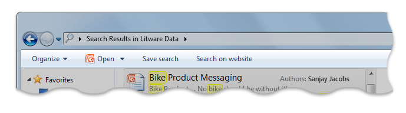
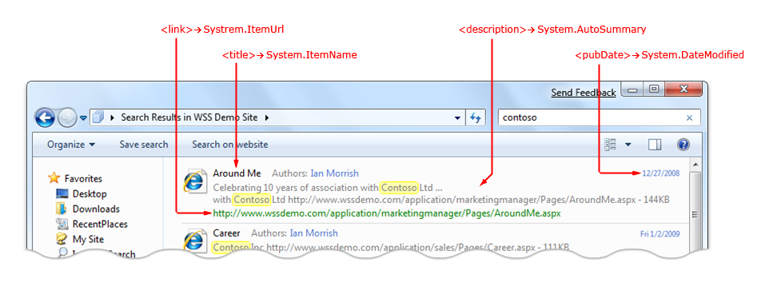
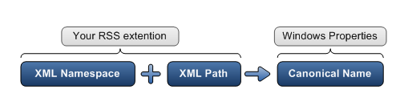
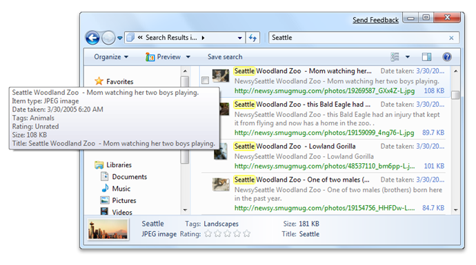
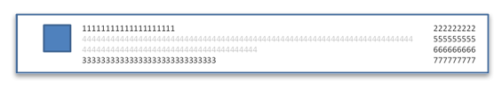
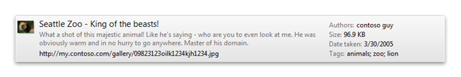
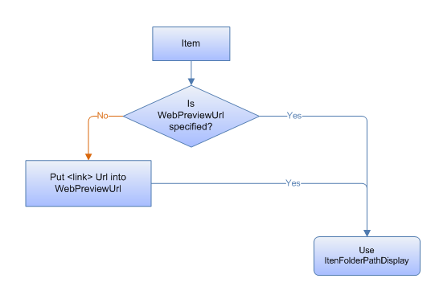
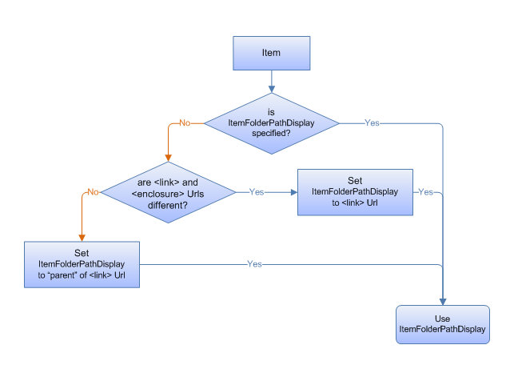

# Creating an OpenSearch Description File in Windows Federated Search

Describes how to create an OpenSearch Description (.osdx) file to connect external data stores to the Windows Client via the [OpenSearch](https://github.com/dewitt/opensearch) protocol. Federated search enables users to search a remote data store and view the results from within Windows Explorer.

This topic contains the following sections:

-   [OpenSearch Description File](#opensearch-description-file)
    -   [Mininum Required Child Elements](#mininum-required-child-elements)
-   [Standard Elements in Windows Federated Search](#standard-elements-in-windows-federated-search)
    -   [Shortname](#shortname)
    -   [Description](#description)
    -   [URL Template for RSS/Atom Results](#url-template-for-rssatom-results)
    -   [URL Template for web Results](#url-template-for-web-results)
    -   [URL Template Parameters](#url-template-parameters)
    -   [Paged Results](#paged-results)
    -   [Paging Using the Item Index](#paging-using-the-item-index)
    -   [Paging Using the Page Index](#paging-using-the-page-index)
    -   [Page Size](#page-size)
-   [Extended Elements in Windows Federated Search](#extended-elements-in-windows-federated-search)
    -   [Maximum Result Count](#maximum-result-count)
    -   [Property Mapping](#property-mapping)
-   [Previews](#previews)
-   [Open File Location Menu Item](#open-file-location-menu-item)
-   [Additional Resources](#additional-resources)
-   [Related topics](#related-topics)

## OpenSearch Description File

An OpenSearch Description (.osdx) file for Windows Federated Search must abide by the following rules:

-   Be a valid OpenSearch Description document, as defined by the [OpenSearch](https://github.com/dewitt/opensearch) 1.1 specification.
-   Provide a URL template with either an RSS or an Atom format type.
-   Use the .osdx file name extension, or be associated with the .osdx file name extension when downloading from the web. For example, a server is not required to use .osdx. A server can return the file with any file name extension, such as .xml for example, and treated as if it were an .osdx file if it uses the correct MIME Type for OpenSearch Description documents (.osdx files).
-   Provide a **ShortName** element value (recommended).

### Mininum Required Child Elements

The following example .osdx file consists of **ShortName** and `Url` elements, which are the minimum required child elements.


```
<OpenSearchDescription xmlns="https://a9.com/-/spec/opensearch/1.1/">
    <ShortName>My web Service</ShortName>
    <Url format="application/rss+xml" 
        template="https://example.com/rss.php?query=
        {searchTerms}&amp;start={startIndex}&amp;cnt={count}" />
</OpenSearchDescription>
```


## Standard Elements in Windows Federated Search

In addition to the minimum child elements, federated search supports the following standard elements.

### Shortname

Windows uses the **ShortName** element value to name the .searchconnector-ms (search connector) file that is created when the user opens the .osdx file. Windows ensures that the generated file name uses only characters that are allowed in Windows file names. If no **ShortName** value is provided, the .searchconnector-ms file tries to use the file name of the .osdx file instead.

The following code illustrates how to use the **ShortName** element in an .osdx file.


```
<OpenSearchDescription xmlns="https://a9.com/-/spec/opensearch/1.1/">
    <ShortName>My web Service</ShortName>
    ...
</OpenSearchDescription>
```


### Description

Windows uses the **Description** element value to populate the file description shown in the Windows Explorer details pane when a user selects a .searchconnector-ms file.


```
<OpenSearchDescription xmlns="https://a9.com/-/spec/opensearch/1.1/">
    ...
    <Description>Searches the example company book catalog</Description>
</OpenSearchDescription>
```


### URL Template for RSS/Atom Results

The .osdx file must include one **Url format** element and **template** attribute (a URL template) that returns results in either RSS or Atom format. The format attribute must be set to `application/rss+xml` for RSS formatted results, or `application/atom+xml` for Atom formatted results, as shown in the following code.

> [!Note]  
> The **Url format** element and **template** attribute are commonly known as a URL template.

 


```
<OpenSearchDescription xmlns="https://a9.com/-/spec/opensearch/1.1/">
   ...
        <Url format="application/rss+xml" template="https://example.com/rss.php?query=
            {searchTerms}&amp;start={startIndex}&amp;cnt={count}" />
</OpenSearchDescription>
```


### URL Template for web Results

If there is a version of the search results that can be viewed in a web browser, you should provide a **Url format=**`text/html` element, and **template** attribute, as shown in the following code.


```
<OpenSearchDescription xmlns="https://a9.com/-/spec/opensearch/1.1/">
    ...
    <Url format="text/html" template="https://example.com/html.php?query={searchTerms}" />
</OpenSearchDescription>
```


If you provide a **Url format="text/html"** element and **template** attribute, a button appears in the Windows Explorer command bar, as shown in the following screen shot, that enables the user to open a web browser to view the search results when the user performs a query.



The roll-over of the query back to the data store's web UI is important in some scenarios. For example, a user may want to view more than 100 results (the default number of items the OpenSearch provider requests). If so, the user may also want to use search features that are available only on the data store's website, such as re-querying with a different sort order, or pivoting and filtering the query with related metadata.

### URL Template Parameters

The OpenSearch provider performs always the following actions:

1.  Uses the URL template to send the request to the web service.
2.  Attempts to replace the tokens found in the URL template before sending the request to the web service, as follows:
    -   Replaces the standard OpenSearch tokens that are listed in the following table.
    -   Removes any tokens that are not listed in the following table.


| Supported token  | How used by OpenSearch provider                                                                                                                 |
|------------------|-------------------------------------------------------------------------------------------------------------------------------------------------|
| {searchTerms}    | Replaced with the search terms that the user types in the Windows Explorer search input box.<br/>                                         |
| {startIndex}     | Used when getting results in "pages".<br/> Replaced with the index for the first result item to return.<br/>                        |
| {startPage}      | Used when getting results in "pages".<br/> Replaced with the page number of the set of search results to return.<br/>               |
| {count}          | Used when getting results in "pages".<br/> Replaced with the number of search results per page that Windows Explorer requests.<br/> |
| {language}       | Replaced with a string that indicates the language of the query being sent.<br/>                                                          |
| {inputEncoding}  | Replaced with a string (such "UTF-16") that indicates the character encoding of the query being sent.<br/>                                |
| {outputEncoding} | Replaced with a string (such as "UTF-16") that indicates the desired character encoding for the response from the web service.<br/>       |


 

### Paged Results

You may want to limit the number of results returned per request. You can opt to return a "page" of results at a time, or to have the OpenSearch provider get additional pages of results either by item number or page number. For example, if you send twenty results per page, the first page you send starts at item index 1 and at page 1; the second page you send starts at item index 21 and at page 2. You can define how you want the OpenSearch provider to request items by using either the `{startItem}` or the `{startPage}` token in the URL template.

### Paging Using the Item Index

An item index identifies the first result item in a page of results. If you want clients to send requests using an item index, you can use the `{startIndex}` token in your **Url** element **template** attribute, as shown in the following code.


```
<Url format="application/rss+xml" 
    template="https://example.com/rss.php?query={searchTerms}&amp;start={startIndex}" />
```


The [OpenSearch](https://github.com/dewitt/opensearch) provider then replaces the token in the URL with a starting index value. The first request starts with the first item, as illustrated in the following example:


```
https://example.com/rss.php?query=frogs&start=1
```


The OpenSearch provider can get additional items by changing the `{startIndex}` parameter value and issuing a new request. The provider repeats this process until it gets enough results to satisfy its limit, or reaches the end of the results. The OpenSearch provider looks at the number of items returned by the web service in the first page of results, and sets the expected page size to that number. It uses that number to increment the `{startIndex}` value for subsequent requests. For example, if the web service returns 20 results in the first request, then the provider sets the expected page size to 20. For the next request, the provider replaces `{startIndex}` with the value of 21 to get the next 20 items.

> [!Note]  
> If a page of results returned by the web service has fewer items than the expected page size, then the OpenSearch provider assumes it has received the last page of results and stops making requests.

 

### Paging Using the Page Index

A page index identifies the specified page of results. If you want clients to send requests using a page number, you can use the `{startPage}` token in your **Url format** element **template** attribute to indicate that, as illustrated in the following example:


```
<Url format="application/rss+xml" 
    template="https://example.com/rss.php?query={searchTerms}&amp;page={startPage}" />
```


The OpenSearch provider then replaces the token in the URL with a page number parameter. The first request starts with the first page, as shown in the following example:


```
https://example.com/rss.php?query=frogs&page=1
```


> [!Note]  
> If a page of results returned by the web service has fewer items than the expected page size, then the OpenSearch provider assumes it has received the last page of results and stops making requests.

 

### Page Size

You may want to configure your web service to permit a request to specify the size of the pages by using some parameter in the URL. A request must be specified in the .osdx file by using the `{count}` token, as follows:


```
<Url format="application/rss+xml" 
    template="https://example.com/rss.php?query={searchTerms}&amp;start={startIndex}&amp;cnt={count}" />
```


The [OpenSearch](https://github.com/dewitt/opensearch) provider can then set the desired page size, in number of results per page, as shown in the following example:


```
https://example.com/rss.php?query=frogs&start=1&cnt=50
```


By default the OpenSearch provider makes requests using a page size of 50. If you want a different page size, then do not provide a `{count}` token, and instead place the desired number directly in the **Url template** element.

The OpenSearch provider determines the page size based on the number of results returned on the first request. If the first page of results received has fewer items than the count requested, the provider resets the page size for any subsequent page requests. If subsequent page requests return fewer items than requested, the OpenSearch provider assumes that it has reached the end of the results.

## Extended Elements in Windows Federated Search

In addition to the standard elements, federated search supports the following extended elements: **MaximumResultCount** and **ResultsProcessing**.

Because these extended child elements are not supported in the [OpenSearch](https://github.com/dewitt/opensearch) v1.1 specification, they must be added by using the following namespace:


```
http://schemas.microsoft.com/opensearchext/2009/
```


### Maximum Result Count

By default, search connectors are limited to 100 results per user query. This limit can be customized by including the **MaximumResultCount** element within the OSD file as shown in the following example:


```
<OpenSearchDescription xmlns="https://a9.com/-/spec/opensearch/1.1/" 
    xmlns:ms-ose="http://schemas.microsoft.com/opensearchext/2009/">
        ...
        <ms-ose:MaximumResultCount>200</ms-ose:MaximumResultCount>
</OpenSearchDescription>
```


The preceding example declares the namespace prefix `ms-ose` in the top-level **OpenSearchDescription** element, and then uses it as a prefix in the element name. This declaration is required because the **MaximumResultCount** is not supported in the [OpenSearch](https://github.com/dewitt/opensearch) v1.1 specification.

### Property Mapping

When results are returned by the web service as an RSS or Atom feed, the OpenSearch provider must map the item metadata in the feeds to properties that the Windows Shell can use. The following screen shot illustrates how the OpenSearch provider maps some of the default RSS elements.



### Default Mappings

The default mappings of RSS XML elements to Windows Shell system properties, are listed in the following table. XML paths are relative to the item element. The `"media:"` prefix is defined by the [Yahoo Search Namespace](https://www.rssboard.org/media-rss) namespace.


| RSS XML path                  | Windows Shell property (canonical name) |
|-------------------------------|-----------------------------------------|
| Link                          | System.ItemUrl                          |
| Title                         | System.ItemName                         |
| Author                        | System.Author                           |
| pubDate                       | System.DateModified                     |
| Description                   | System.AutoSummary                      |
| Category                      | System.Keywords                         |
| enclosure/@type               | System.MIMEType                         |
| enclosure/@length             | System.Size                             |
| enclosure/@url                | System.ContentUrl                       |
| media:category                | System.Keywords                         |
| media:content/@fileSize       | System.Size                             |
| media:content/@type           | System.MIMEType                         |
| media:content/@url            | System.ContentUrl                       |
| media:group/content/@fileSize | System.Size                             |
| media:group/content/@type     | System.MIMEType                         |
| media:group/content/@url      | System.ContentUrl                       |
| media:thumbnail/@url          | System.ItemThumbnailUrl                 |


 

> [!Note]  
> In addition to the default mappings of standard RSS or Atom elements, you can map other Windows Shell system properties by including additional XML elements in the Windows namespace for each of the properties. You can also map elements from other existing XML namespaces such as MediaRSS, iTunes, and so forth, by adding custom property mapping in the .osdx file.

 

### Custom Property Mappings

You can customize the mapping of elements from your RSS output to Windows Shell system properties by specifying the mapping in the .osdx file.

The RSS output specifies:

-   An XML namespace, and
-   For any child element of an item, an element name to map against.

The .osdx file identifies a Windows Shell property for each element name in a namespace. The property mappings that you define in your .osdx file override the default mappings, if they exist, for those specified properties.

The following diagram illustrates how an RSS extension maps to Windows properties (canonical name).



### Example RSS results and OSD Property Mapping

The following example RSS output identifies `https://example.com/schema/2009` as the XML namespace with the prefix "example". This prefix must appear again before the **email** element.


```
<rss version="2.0" xmlns:example="https://example.com/schema/2009">
   ...
    <item>
      <title>Someone</title>
      <example:email>Someone@example.com</example:email>
    </item>
```


In the following example .osdx file, the XML **email** element maps to the Windows Shell property [System.Contact.EmailAddress](../properties/props-system-contact-emailaddress.md).


```
<OpenSearchDescription xmlns="https://a9.com/-/spec/opensearch/1.1/"
    xmlns:ms-ose="http://schemas.microsoft.com/opensearchext/2009/">
...
 <ms-ose:ResultsProcessing format="application/rss+xml">
   <ms-ose:PropertyMapList>
     <ms-ose:PropertyMap sourceNamespaceURI="https://example.com/schema/2009/" >
       <ms-ose:Source path="email">
         <ms-ose:Property schema="http://schemas.microsoft.com/windows/2008/propertynamespace" name="System.Contact.EmailAddress" />
       </ms-ose:Source>
     </ms-ose:PropertyMap>
   </ms-ose:PropertyMapList>
 </ms-ose:ResultsProcessing>
...
</OpenSearchDescription>
```


There are some properties that cannot be mapped because values for them are either overridden later or are not editable. For example, [System.ItemFolderPathDisplay](../properties/props-system-itempathdisplay.md) or [System.ItemPathDisplayNarrow](../properties/props-system-itempathdisplaynarrow.md) cannot be mapped because they are calculated from the URL value provided in either the link or enclosure elements.

### Thumbnails

Thumbnail image URLs can be provided for any item by using the **media:thumbnail url=""** element. The ideal resolution is 150 x 150 pixels. The largest thumbnails supported are 256 x 256 pixels. Providing larger images takes more bandwidth for no extra benefit to the user.

### Open File Location Context Menu

Windows provides a shortcut menu named **Open file location** for result items. If the user selects an item from that menu, the "parent" URL for the selected item is opened. If the URL is a web URL, such as `https://...`, the web browser is opened and navigated to that URL. Your feed should provide a custom URL for each item to ensure that Windows opens a valid URL. This can be accomplished by including the URL within an element inside the item's XML, as illustrated in the following example:


```
<rss version="2.0" xmlns:example="https://example.com/schema/2009" 
    xmlns:win="http://schemas.microsoft.com/windows/2008/propertynamespace">
...
   <item>
      <title>Someone</title>
      <link>https://example.com/pictures.aspx?id=01</link>
      <win:System.ItemFolderPathDisplay>https://example.com/pictures_list.aspx
   </win:System.ItemFolderPathDisplay>
   </item>
...
```


If this property is not explicitly set in the item's XML, the OpenSearch provider sets it to the parent folder of the URL of the item. In the example above, the OpenSearch provider would use the link value, and set the [System.ItemFolderPathDisplay](../properties/props-system-itemfolderpathdisplay.md) Windows Shell property value to `"https://example.com/"`.

### Customize Windows Explorer Views with Property Description Lists

Some Windows Explorer view layouts are defined by property description lists, or proplists. A proplist is a semicolon-delimited list of properties, such as `"prop:System.ItemName; System.Author"`, that is used to control how your results appear in Windows Explorer.

The UI areas of Windows Explorer that can be customized by using proplists are illustrated in the following screen shot:



Each area of Windows Explorer has an associated set of proplists, which themselves are specified as properties. You can specify custom proplists for individual items in your result sets or for all items in a set of results.


| UI Area to customize               | Windows Shell property that implements the customization |
|------------------------------------|----------------------------------------------------------|
| Content view mode (when searching) | System.PropList.ContentViewModeForSearch                 |
| Content view mode (when browsing)  | System.PropList.ContentViewModeForBrowse                 |
| Tile view mode                     | System.PropList.TileInfo                                 |
| Details pane                       | System.PropList.PreviewDetails                           |
| Infotip (item's hover tooltip)     | System.PropList.Infotip                                  |


 

 

**To specify a unique proplist for an individual item:**

1.  In your RSS output, add a custom element representing the proplist you want to customize. For example, the following example sets the list for the details pane:
    ```
    <win:System.PropList.PreviewDetails>
        prop:System.ItemName;System.Author</win:System.PropList.PreviewDetails>
    ```

    

2.  To apply a property to every item in the search results without modifying the RSS output, specify a proplist within an **ms-ose:PropertyDefaultValues** element in the .osdx file, as shown in the following example:

    ```
    <ms-ose:ResultsProcessing format="application/rss+xml">
        <ms-ose:PropertyDefaultValues>
          <ms-ose:Property schema="http://schemas.microsoft.com/windows/2008/propertynamespace"
            name="System.PropList.ContentViewModeForSearch">prop:~System.ItemNameDisplay;System.Photo.DateTaken;
            ~System.ItemPathDisplay;~System.Search.AutoSummary;System.Size;System.Author;System.Keywords</ms-ose:Property>
        </ms-ose:PropertyDefaultValues>
      </ms-ose:ResultsProcessing>
    ```

    

### Content View Mode Layout of Properties

The list of properties specified in the **System.PropList.ContentViewModeForSearch** and **System.PropList.ContentViewModeForBrowse** proplists determines what is shown in Content view mode. For more information about property lists, see [PropList](/windows/win32/api/propsys/nf-propsys-ipropertysystem-getpropertydescriptionlistfromstring).

The properties are laid out according to the numbers shown in the following layout pattern:



If we use the following list of properties,


```
prop:~System.ItemNameDisplay;System.Author;System.ItemPathDisplay;~System.Search.AutoSummary;
    System.Size;System.Photo.DateTaken;System.Keywords
```


Then we see the following display:



> [!Note]  
> For the best readability, the properties shown in the right-most column should be labeled.

 

### Property List Flags

Only one of the flags defined in the proplists documentation applies to the display of items in Content View mode layouts:` "~"`. In the previous examples, the Windows Explorer view labels some of the properties, such as `Tags: animals; zoo; lion`. That is the default behavior when you specify a property in the list. For example, the proplist has `"System.Author"` which is displayed as `"Authors: value"`. When you want to hide the property label, place a `"~"` in front of the property name. For example, if the proplist has `"~System.Size"`, the property is displayed as just a value, without the label.

## Previews

When the user selects a result item in Windows Explorer and the preview pane is open, the content of the item is previewed.

The content to show in the preview is specified by a URL, that is determined as follows:

1.  If the **System.WebPreviewUrl** Windows Shell property is set for the item, then use that URL.
    > [!Note]  
    > The property needs to be provided in the RSS by using the Windows Shell namespace, or explicitly mapped in the .osdx file.

     

2.  If not, then use the link URL instead.

The following flowchart shows this logic.



It is possible to use a different URL for the preview than for the item itself. This means that if you provide different URLs for the link URL and the enclosure or `media:content URL`, Windows Explorer uses the link URL for previews of the item but uses the other URL for file type detection, opening, downloading, and so forth.

How Windows Explorer determines what URL to use:

1.  If you provide a mapping to [System.ItemFolderPathDisplay](../properties/props-system-itemfolderpathdisplay.md), then Windows Explorer uses that URL
2.  If you do not provide a mapping, then Windows Explorer identifies whether the link and enclosure URLs are different. If so, then Windows Explorer uses the link URL.
3.  If the URLs are the same or if there is only a link URL, then Windows Explorer parses the link to find the parent container by removing the file name from the full URL.
    > [!Note]  
    > If you recognize that the URL parsing would result in dead links for your service, you should provide an explicit mapping for the property.

     

## Open File Location Menu Item

When a right-clicks an item, the **Open file location** menu command appears. This command takes the user to the container for or location of that item. For example, in a SharePoint search, selecting this option for a file in a document library would open the document library root in the web browser.

When a user clicks **Open file location**, Windows Explorer attempts to find a parent container, by using the logic shown in the following flowchart:



## Additional Resources

For additional information about implementing search federation to remote data stores using OpenSearch technologies in Windows 7 and later, see "Additional Resources" at [Federated Search in Windows](/previous-versions//dd742958(v=vs.85)).

## Related topics

<dl> <dt>

[Federated Search in Windows](-search-federated-search-overview.md)
</dt> <dt>

[Getting Started with Federated Search in Windows](getting-started-with-federated-search-in-windows.md)
</dt> <dt>

[Connecting Your web Service in Windows Federated Search](-search-federated-search-web-service.md)
</dt> <dt>

[Enabling Your Data Store in Windows Federated Search](-search-federated-search-data-store.md)
</dt> <dt>

[Following Best Practices in Windows Federated Search](-search-fedsearch-best.md)
</dt> <dt>

[Deploying Search Connectors in Windows Federated Search](-search-federated-search-deploying.md)
</dt> </dl>

 

 
