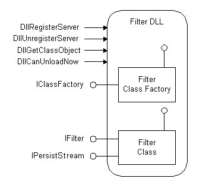

# Understanding Filter Handlers in Windows Search

Filter handlers, which are implementations of the [**IFilter**](https://www.bing.com/search?q=**IFilter**) interface, scan documents for text and properties. Filter handlers extract chunks of text from these items, filtering out embedded formatting and retaining information about the position of the text. They also extract chunks of values, which are document properties. **IFilter** is the foundation for building higher-level applications such as document indexers and application-independent viewers.

This topic is organized as follows:

-   [About the IFilter Interface](#about-the-ifilter-interface)
    -   [Isolation Process](#isolation-process)
    -   [IFilter DLLs](#ifilter-dlls)
    -   [IFilter Structure](#ifilter-structure)
    -   [Native Code](#native-code)
-   [Finding the IFilter Class Identifier](#finding-the-ifilter-class-identifier)
    -   [IFilter::GetChunk and Locale Code Identifiers](#ifiltergetchunk-and-locale-code-identifiers)
-   [Additional Resources](#additional-resources)
-   [Related topics](#related-topics)

## About the IFilter Interface

Microsoft Windows Search uses filters to extract the content of items for inclusion in a full-text index. You can extend Windows Search to index new or proprietary file types by writing filters to extract the content, and property handlers to extract the properties of files.

The [**IFilter**](https://www.bing.com/search?q=**IFilter**) interface is designed to meet the specific needs of full-text search engines. Full-text search engines like Windows Search call the **IFilter** methods to extract text and property information and add them to an index. Windows Search breaks the results of the returned [**IFilter::GetText**](https://www.bing.com/search?q=**IFilter::GetText**) method into words, normalizes them, and saves them in an index. If available, the search engine uses the language code identifier (LCID) of a text chunk to perform language-specific word breaking and normalization.

Windows Search uses three functions, described in the following table, to access registered filter handlers (implementations of the [**IFilter**](https://www.bing.com/search?q=**IFilter**) interface). These functions are especially useful when loading and binding to an embedded object's filter handler.


| Function               | Description                                                                                                                                                                                               |
|------------------------|-----------------------------------------------------------------------------------------------------------------------------------------------------------------------------------------------------------|
| LoadIFilter            | Gets a pointer to the [**IFilter**](https://www.bing.com/search?q=**IFilter**) that is most suitable for the specified content type.                                                                                            |
| BindIFilterFromStorage | Gets a pointer to the [**IFilter**](https://www.bing.com/search?q=**IFilter**) that is most suitable for the content contained in an [IStorage Interface](http://msdn.microsoft.com/en-us/library/aa380015(VS.85).aspx) object. |
| BindIFilterFromStream  | Gets a pointer to the [**IFilter**](https://www.bing.com/search?q=**IFilter**) that is most suitable for a specified class identifier (CLSID) retrieved from a stream variable.                                                 |


 

The [**IFilter**](https://www.bing.com/search?q=**IFilter**) interface has five methods, described in the following table.


| Method                                                    | Description                                                                                                        |
|-----------------------------------------------------------|--------------------------------------------------------------------------------------------------------------------|
| [**IFilter::Init**](https://www.bing.com/search?q=**IFilter::Init**)          | Initializes a filtering session.                                                                                   |
| [**IFilter::GetChunk**](https://www.bing.com/search?q=**IFilter::GetChunk**)     | Positions [**IFilter**](https://www.bing.com/search?q=**IFilter**) at the beginning of the first or next chunk and returns a descriptor. |
| [**IFilter::GetText**](https://www.bing.com/search?q=**IFilter::GetText**)       | Retrieves text from the current chunk.                                                                             |
| [**IFilter::GetValue**](https://www.bing.com/search?q=**IFilter::GetValue**)     | Retrieves values from the current chunk.                                                                           |
| [**IFilter::BindRegion**](https://www.bing.com/search?q=**IFilter::BindRegion**) | Retrieves an interface representing the specified portion of object. Reserved for future use.                      |


 

### Isolation Process

Windows Search runs IFilters in the Local System security context with restricted rights. In this [**IFilter**](https://www.bing.com/search?q=**IFilter**) host isolation process, a number of rights are removed:

-   Restricted Code
-   Everyone
-   Local
-   Interactive
-   Authenticated Users
-   Built-in Users
-   Users' security identifier (SID)

The removal of these rights means the [**IFilter**](https://www.bing.com/search?q=**IFilter**) interface does not have access to the disk system or network or to any user interface or clipboard functions. Furthermore, the isolation process runs under a job object that prevents child processes from being created and imposes a 100 MB limit on the working set. the **IFilter** interface host isolation process increases the stability of the indexing platform, due to the possibility of incorrectly implemented third-party filters.

> [!Note]  
> Filter handlers must be written to manage buffers, and stack correctly. All string copies must have explicit checks to guard against buffer overruns. You should always verify the allocated size of the buffer. You should always test the size of the data against the size of the buffer.

 

### IFilter DLLs

[**IFilter**](https://www.bing.com/search?q=**IFilter**) DLLs implement the **IFilter** interface to enable a client to extract text and property value information from a file type, class, or perceived type. The Windows Search filtering process **SearchFilterHost.exe** binds to the **IFilter** that is registered for the class, perceived type, or name extension of the item.

### IFilter Structure

Each [**IFilter**](https://www.bing.com/search?q=**IFilter**) is a DLL file that implements an in-process Component Object Model (COM) server to supply the specified filtering capabilities. The following figure illustrates shows the overall structure of a typical **IFilter** DLLs. A more complex example could implement more than one **IFilter** class.



### Native Code

Filters must be written in native code due to potential common language runtime (CLR) versioning issues with the process that multiple add-ins run in. In Windows 7 and later and later, filters written in managed code are explicitly blocked.

## Finding the IFilter Class Identifier

The class of the [**IFilter**](https://www.bing.com/search?q=**IFilter**) DLL is registered under the PersistentHandler registry key. The following example, for HTML files, illustrates how to find the **IFilter** DLL for an HTML document. This example follows logic similar to that used by the system to find the **IFilter** associated with an item.

1.  Check whether the extension for the type of files that the DLL filters has a PersistentHandler registered under the registry entry \\HKEY\_LOCAL\_MACHINE\\SOFTWARE\\Classes. Let this key be `Value1`. If that entry already exists, then skip to step 4 of this procedure and use `Value1` in that key. The values are of type REG\_SZ.

    ```
    \HKEY_LOCAL_MACHINE
       SOFTWARE
          Classes
             .htm
                PersistentHandler
                   {EEC97550-47A9-11CF-B952-00AA0051FE20}
    ```

2.  Alternatively, if there is not a PersistentHandler registered for the extension, find the CLSID associated with the document type under the registry entry \\HKEY\_LOCAL\_MACHINE\\SOFTWARE\\Classes. Let this key be `Value2`.

    ```
    \HKEY_LOCAL_MACHINE
       SOFTWARE
          Classes
             htmlfile
                 = Class for WWW HTML files
                CLSID
                   {25336920-03F9-11CF-8FD0-00AA00686F13}
    ```

3.  Determine whether a PersistentHandler is registered for the CLSID. Using `Value2` determined in step 2, find the PersistentHandler for the \\HKEY\_LOCAL\_MACHINE\\SOFTWARE\\Classes\\CLSID\\Value2 entry. Let this key be `Value3`.

    ```
    \HKEY_LOCAL_MACHINE
       SOFTWARE
          Classes
             htmlfile
                 = Class for WWW HTML files
                PersistentHandler
                   {EEC97550-47A9-11CF-B952-00AA0051FE20}
    ```

4.  Determine the [**IFilter**](https://www.bing.com/search?q=**IFilter**) persistent handler GUID. Using `Value1` and `Value3`, find the **IFilter** Persistent Handler GUID for the document type. The value under the registry entry \\HKEY\_LOCAL\_MACHINE\\SOFTWARE\\Classes\\CLSID\\Value1 or 3\\PersistentAddinsRegistered\\ 89BCB740-6119-101A-BCB7-00DD010655AF"/&gt; yields the **IFilter** PersistentHandler GUID for this document type. Let this key be `Value4`. In this example, the **IFilter** interface GUID is 89BCB740-6119-101A-BCB7-00DD010655AF.

    ```
    HKEY_LOCAL_MACHINE
       SOFTWARE
          Classes
             {EEC97550-47A9-11CF-B952-00AA0051FE20}
                 = HTML File Persistent Handler<dl>
    <dt>

            Data type
</dt>
    <dd>            REG_SZ</dd>
    </dl>
                PersistentAddinsRegistered
                   {89BCB740-6119-101A-BCB7-00DD010655AF}
                    = {E0CA5340-4534-11CF-B952-00AA0051FE20}<dl>
    <dt>

               Data type
</dt>
    <dd>               REG_SZ</dd>
    </dl>
    ```

> [!Note]  
> In this example, the [**IFilter**](https://www.bing.com/search?q=**IFilter**) DLL for HTML documents is nlhtml.dll.

 

### IFilter::GetChunk and Locale Code Identifiers

The LCID of text can change within a single file. For example, the text of an instruction manual might alternate between English (en-us) and Spanish (es) or the text may include a single word in a language other than the primary language. In either case, your [**IFilter**](https://www.bing.com/search?q=**IFilter**) must begin a new chunk each time the LCID changes. Because the LCID is used to choose an appropriate word breaker, it is very important that you correctly identify it. If the **IFilter** cannot determine the locale of the text, then it should return an LCID of zero with the chunk. Returning an LCID of zero causes Windows Search to use Language Auto-Detection (LAD) technology to determine the locale ID of the chunk. If Windows Search cannot find a match, it defaults to the system default locale (by calling the [GetSystemDefaultLocaleName Function](http://msdn.microsoft.com/en-us/library/dd318122(VS.85).aspx) function). For more information, see [**IFilter::GetChunk**](https://www.bing.com/search?q=**IFilter::GetChunk**), [**CHUNK\_BREAKTYPE**](/windows/desktop/api/Filter/), [**CHUNKSTATE**](/windows/desktop/api/Filter/), and [**STAT\_CHUNK**](/windows/desktop/api/Filter/).

If you control the file format and it currently does not contain locale information, you should add a user feature to enable proper locale identification. Using a mismatched word breaker can result in a poor query experience for the user. For more information, see [**IWordBreaker**](/windows/desktop/api/Indexsrv/nn-indexsrv-iwordbreaker).

> [!Note]  
> Filters are associated with file types, as denoted by file name extensions, MIME types or CLSIDs. While one filter can handle multiple file types, each type works with only one filter.

 

## Additional Resources

-   The [IFilterSample](-search-sample-ifiltersample.md) code sample, available on [Code Gallery](http://go.microsoft.com/fwlink/p/?linkid=155654) and the [Windows 7 SDK](http://go.microsoft.com/fwlink/p/?linkid=129787), demonstrates how to create an IFilter base class for implementing the [**IFilter**](https://www.bing.com/search?q=**IFilter**) interface.
-   For an overview of the indexing process, see [The Indexing Process](-search-indexing-process-overview.md).
-   For an overview of file types, see [File Types](http://msdn.microsoft.com/en-us/library/cc144148(VS.85).aspx).
-   To query file association attributes for a file type, see [PerceivedTypes, SystemFileAssociations, and Application Registration](http://msdn.microsoft.com/en-us/library/cc144150(VS.85).aspx).

## Related topics

<dl> <dt>

[Developing Filter Handlers](-search-ifilter-conceptual.md)
</dt> <dt>

[Best Practices for Creating Filter Handlers in Windows Search](-search-3x-wds-extidx-filters.md)
</dt> <dt>

[Returning Properties from a Filter Handler](-search-ifilter-property-filtering.md)
</dt> <dt>

[Filter Handlers that Ship with Windows](-search-ifilter-implementations.md)
</dt> <dt>

[Implementing Filter Handlers in Windows Search](-search-ifilter-constructing-filters.md)
</dt> <dt>

[Registering Filter Handlers](-search-ifilter-registering-filters.md)
</dt> <dt>

[Testing Filter Handlers](-search-ifilter-testing-filters.md)
</dt> </dl>

 

 


