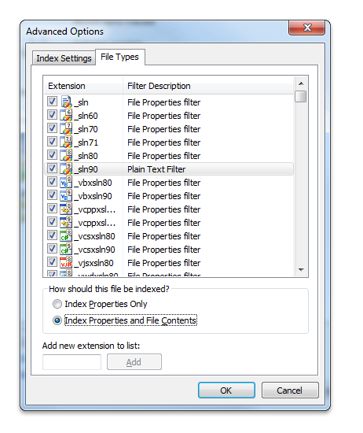

# Filter Handlers that Ship with Windows

Microsoft supplies several standard filters with Windows Search. Clients call these filter handlers (which are implementations of the [**IFilter**](/windows/win32/api/filter/nn-filter-ifilter) interface) to extract text and properties from a document.

This topic is organized as follows:

- [Windows Search Implementation Notes](#windows-search-implementation-notes)
  - [Windows 7 and 10 Implementation](#windows-7-and-10-implementation)
  - [Windows Vista Implementation](#windows-vista-implementation)
  - [Legacy Implementation](#legacy-implementation)
- [Windows Search Filters](#filter-handlers-that-ship-with-windows)
  - [MIME Filter Handler](#mime-filter-handler)
  - [HTML Filter Handler](#html-filter-handler)
  - [Document Filter Handler](#document-filter-handler)
  - [Plain Text Filter Handler](#plain-text-filter-handler)
  - [Binary or Null Filter Handler](#binary-or-null-filter-handler)
- [Additional Resources](#additional-resources)
- [Related topics](#related-topics)

## Windows Search Implementation Notes

In Windows 7 and later, filters written in managed code are explicitly blocked. Filters MUST be written in native code due to potential CLR versioning issues with the process that multiple add-ins run in.

### Windows 7 and 10 Implementation

In Windows 7 and later, there is new behavior that occurs when registering a filter handler, property handler, or new extension. When a new property handler and/or filter handler is installed, files with the corresponding extensions are automatically re-indexed.

In Windows 7 and later, we recommend that you install a filter handler in conjunction with its corresponding property handlers, and that you register the filter handler before the property handler. The registration of the property handler initiates immediate re-indexing of previously indexed files without first requiring a restart, and takes advantage of any previously registered filter handlers for the purpose of content indexing.

If only a filter handler is installed without a corresponding property handler, then automatic re-indexing occurs either after a restart of the indexing service, or a restart of the system.

For property description flags specific to Windows 7, see the following reference topics: [GETPROPERTYSTOREFLAGS](/windows/win32/api/propsys/ne-propsys-getpropertystoreflags), [PROPDESC\_COLUMNINDEX\_TYPE](/windows/win32/api/propsys/ne-propsys-propdesc_columnindex_type) and [PROPDESC\_SEARCHINFO\_FLAGS](/windows/win32/api/propsys/ne-propsys-propdesc_searchinfo_flags).

### Windows Vista Implementation

In Windows Vista and earlier, installing an [**IFilter**](/windows/win32/api/filter/nn-filter-ifilter) or property handler does not initiate a re-indexing of existing items unless an independent software vendor (ISV) explicitly calls a rebuild or re-indexing of matching URLs.

There are two major differences between legacy applications like Indexing Service and newer applications like Windows Search that you should be aware of when implementing filters:

- Use of the [IPersistStream](/windows/win32/api/objidl/nn-objidl-ipersiststream) interface.
- Use of property handlers.

First, Windows Vista and Windows Search 3.0 and later require you use [IPersistStream](/windows/win32/api/objidl/nn-objidl-ipersiststream) for the following reasons:

- To ensure performance and future compatibility.
- To help increase security. Filters implemented with [IPersistStream](/windows/win32/api/objidl/nn-objidl-ipersiststream) are more secure because the context in which the filter runs does not need the rights to open files on the disk or over the network.

While Windows Search uses only [IPersistStream](/windows/win32/api/objidl/nn-objidl-ipersiststream), you can also include [IPersistFile Interface](/windows/win32/api/objidl/nn-objidl-ipersistfile) and/or [IPersistStorage Interface](/windows/win32/api/objidl/nn-objidl-ipersiststorage) implementations in your filters for backward compatibility.

The second major difference is that Windows Vista and Windows Search 3.0 and later have a new [Property System](../properties/building-property-handlers.md) that uses property handlers to enumerate properties of items.

However, there are times when you need to implement a filter that handles both content and properties in order to:

- Support legacy MSSearch implementations.
- Traverse links.
- Preserve language information.
- Recursively filter embedded items.

In these situations, you need a full filter implementation, including the [**IFilter::GetValue**](/windows/win32/api/filter/nf-filter-ifilter-getvalue) method to access property values.

### Legacy Implementation

As noted earlier, Windows Vista and Windows Search include a new property system that encapsulates an item's properties that is separate from an item's content. This property system does not exist in earlier versions of Microsoft Windows Desktop Search (WDS) 2.x. If your filter must support other applications as described above, it may need to handle both content and properties.

For more information on developing a compatible filter, see the following topics, [IFilter (for legacy applications)](/windows/win32/api/filter/nn-filter-ifilter), and [Developing Filter Add-ins (for legacy applications)](../lwef/-search-2x-wds-ifilteraddins.md).

## Windows Search Filters

Microsoft supplies several standard filters with Windows Search. The [**IFilter**](/windows/win32/api/filter/nn-filter-ifilter)  DLL contents are summarized in the following table. Clicking the name of a filter handler takes you to the description for that **IFilter** implementation.

| Filter handler                                                  | Files filtered                              | IFilter DLL  |
|-----------------------------------------------------------------|---------------------------------------------|--------------|
| [MIME Filter Handler](#mime-filter-handler)                     | Multipurpose Internet Mail Extension (MIME) | mimefilt.dll |
| [HTML Filter Handler](#html-filter-handler)                     | HTML 3.0 or earlier                         | nlhtml.dll   |
| [Document Filter Handler](#document-filter-handler)             | Microsoft Word, Excel, PowerPoint           | offfilt.dll  |
| [Plain Text Filter Handler](#plain-text-filter-handler)         | Plain text files - Default IFilter          | query.dll    |
| [Binary or Null Filter Handler](#binary-or-null-filter-handler) | Binary files - Null IFilter                 | query.dll    |

### MIME Filter Handler

The MIME filter handler (in mimefilt.dll) extracts text and property information from files with the extensions .eml, .mht and .mhtml.

### HTML Filter Handler

The HTML filter handler (in nlhtml.dll) extracts text and property information from the class "htmlfiles" so that it can be indexed by Windows Search. For a description of the association between [**IFilter**](/windows/win32/api/filter/nn-filter-ifilter) and file type, see "Finding the IFilter DLL for a File" in [Registering Filter Handlers](-search-ifilter-registering-filters.md).

You can use the `META` tag feature of HTML documents to convey special handling requests to the HTML [**IFilter**](/windows/win32/api/filter/nn-filter-ifilter). `META` tags occur near the beginning of an html file within the `HEAD ... /HEAD` tags, as illustrated in the following example.

```XML
   <head>
     <META NAME="DESCRIPTION"
           CONTENT="This text appears on the results page as the document's summary.">
   </head>
```

Some HTML `META` tags are automatically mapped to well known property set and property ID (property identifier (PID)) values so that queries on these properties will search the mapped contents. Some examples are listed in the following table. For a list of system properties that you can use for your file formats, see [System-Defined Properties for Custom File Formats](-shell-systemdefinedpropertiesforfileformats.md).

| Property example                              | Mapped to                                                               |
|-----------------------------------------------|-------------------------------------------------------------------------|
| meta name="author" content="ruth"             | The author property in the Summary Information property set.            |
| meta name="subject" content="word processing" | The subject property in the Summary Information property set.           |
| meta name="keywords" content="fonts, serif"   | The keyword property in the Summary Information property set.           |
| meta name="ms.category" content="fiction"     | The category property in the document Summary Information property set. |

Some features of the HTML [**IFilter**](/windows/win32/api/filter/nn-filter-ifilter) are listed in the following table.

[comment]: # (This table needs to be HTML to have the samples formated in it correctly)

<!-- markdownlint-disable MD033 -->
<table>
<colgroup>
<col  />
<col  />
<col  />
</colgroup>
<thead>
<tr class="header">
<th>Task</th>
<th>Action</th>
<th>Example</th>
</tr>
</thead>
<tbody>
<tr class="odd">
<td>Creating special abstracts from files</td>
<td>Use the <code>META NAME=&quot;DESCRIPTION&quot;...</code> tag to instruct the <a href="https://www.bing.com/search?q=<strong>IFilter</strong>"><strong>IFilter</strong></a> to use the string following the <code>CONTENT</code> keyword as the document abstract.
<blockquote>
[!Note]<br />
The filtering process can generate abstracts for each filtered file, which default to being a set of characters at the beginning of the file.
</blockquote>
<br/></td>
<td><span data-codelanguage=""></span>
<table>
<colgroup>
<col  />
</colgroup>
<tbody>
<tr class="odd">
<td><pre>
&lt;head&gt;
  &lt;META NAME=&quot;DESCRIPTION&quot; CONTENT=&quot;This text will appear on the results page as the document&#39;s summary.&quot;&gt;
&lt;/head&gt;
 </pre></td>
</tr>
</tbody>
</table>
</td>
</tr>
<tr class="even">
<td>Preventing individual files from being filtered</td>
<td>Add a <code>meta name</code> tag to the file.</td>
<td><div class="code">
<span data-codelanguage=""></span>
<table>
<colgroup>
<col  />
</colgroup>
<tbody>
<tr class="odd">
<td><pre>
  &lt;meta name=&quot;robots&quot; content=&quot;noindex&quot;&gt;
</pre></td>
</tr>
</tbody>
</table>

</div></td>
</tr>
<tr class="odd">
<td>Setting the language code for a file (to ensure the system chooses the correct language word breakers and noise word files)</td>
<td>Add the following <code>meta name</code> tag to the file, where the content field specifies the appropriate language code (either in characters or by using the locale value).</td>
<td><div class="code">
<span data-codelanguage=""></span>
<table>
<colgroup>
<col  />
</colgroup>
<tbody>
<tr class="odd">
<td><pre>
&lt;meta name=&quot;ms.locale&quot; content=&quot;EN&quot;&gt;
&lt;meta name=&quot;ms.locale&quot; content=1033&gt;
</pre></td>
</tr>
</tbody>
</table>

</div></td>
</tr>
</tbody>
</table>
<!-- markdownlint-enable MD033 -->

### Document Filter Handler

The Document filter handler (in offilt.dll) filters files for some extensions of documents in Microsoft Office. These include files with the extensions .doc, .mdb, .ppt, and .xlt, for example.

### Plain Text Filter Handler

For plain-text files, Windows Search uses the text filter handler, which filters both the system properties (such as file names) and the contents of a file. When a file type does not have an [**IFilter**](/windows/win32/api/filter/nn-filter-ifilter) association in the registry, Windows Search indexes only the Shell properties for the file. However the user can use the **Advanced Options** in the **Indexing Options** control panel to **Index Properties** or **Index Properties and File Contents**.



If the user chooses this option for a file type without an associated [**IFilter**](/windows/win32/api/filter/nn-filter-ifilter), the text filter handler is used to extract the content of the file. The text filter handler does not "understand" any document format; when filtering the contents of a file, it treats the file as a sequence of characters. It does check for the Unicode byte-order mark at the beginning of the file.

### Binary or Null Filter Handler

When a registered binary file is encountered, the null filter handler is used. The null filter handler retrieves only the system properties. The contents of a binary file are not filtered. Examples of system properties are **FileName**, **LastWriteTime**, **FileSize**, and **Attributes**.

## Additional Resources

- The [IFilterSample](-search-sample-ifiltersample.md) code sample, available on [GitHub](https://github.com/Microsoft/Windows-classic-samples/tree/master/Samples/Win7Samples/winui/WindowsSearch/IFilterSample), demonstrates how to create an IFilter base class for implementing the [**IFilter**](/windows/win32/api/filter/nn-filter-ifilter) interface.
- For an overview of the indexing process, see [The Indexing Process](-search-indexing-process-overview.md).
- For an overview of file types, see [File Types](../shell/fa-file-types.md).
- To query file association attributes for a file type, see [PerceivedTypes, SystemFileAssociations, and Application Registration](/previous-versions/windows/desktop/legacy/cc144150(v=vs.85)).

## Related topics

[Developing Filter Handlers](-search-ifilter-conceptual.md)

[About Filter Handlers in Windows Search](-search-ifilter-about.md)

[Best Practices for Creating Filter Handlers in Windows Search](-search-3x-wds-extidx-filters.md)

[Returning Properties from a Filter Handler](-search-ifilter-property-filtering.md)

[Implementing Filter Handlers in Windows Search](-search-ifilter-constructing-filters.md)

[Registering Filter Handlers](-search-ifilter-registering-filters.md)

[Testing Filter Handlers](-search-ifilter-testing-filters.md)
