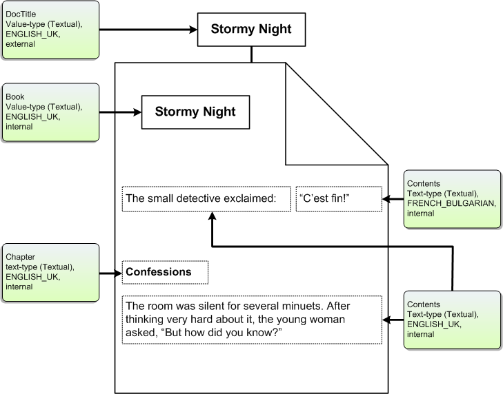

# Returning Properties from a Filter Handler

Properties are extracted from items using registered property handlers, or using filters registered for specific file types. A filter handler (an implementation of the [**IFilter**](/windows/win32/api/filter/nn-filter-ifilter) interface) can interpret the contents of a file type in any number of ways.

This topic is organized as follows:

- [Property Filtering](#returning-properties-from-a-filter-handler)
  - [Property Size Limitations](#property-size-limitations)
- [Additional Resources](#additional-resources)
- [Related topics](#related-topics)

## Property Filtering

Best practices for property filtering are listed in the following table.

| Method                                                | Description                                                                                                                                                                                                                                                                                                                                                                                                                                     |
|-------------------------------------------------------|-------------------------------------------------------------------------------------------------------------------------------------------------------------------------------------------------------------------------------------------------------------------------------------------------------------------------------------------------------------------------------------------------------------------------------------------------|
| [**IFilter::Init**](/windows/win32/api/filter/nf-filter-ifilter-init)      | Returns the [**IFILTER\_FLAGS**](/windows/win32/api/filter/ne-filter-ifilter_flags) enumeration. If the *IFILTER\_FLAGS\_OLE\_PROPERTIES* member of this enumeration is set to one, then Windows Search uses the [IPropertySetStorage](/windows/win32/api/propidl/nn-propidl-ipropertysetstorage) and [IPropertyStorage](/windows/win32/api/propidlbase/nn-propidlbase-ipropertystorage) interfaces interfaces to enumerate and access external value-type properties. |
| [**IFilter::GetChunk**](/windows/win32/api/filter/nf-filter-ifilter-getchunk) | Returns information from a document in "chunks" with chunk type (text or value), name, and locale. A chunk contains one document property.                                                                                                                                                                                                                                                                                                      |
| [**IFilter::GetText**](/windows/win32/api/filter/nf-filter-ifilter-gettext)   | Gets a text-type property from a chunk.                                                                                                                                                                                                                                                                                                                                                                                                         |
| [**IFilter::GetValue**](/windows/win32/api/filter/nf-filter-ifilter-getvalue) | Gets a value-type property from a chunk.                                                                                                                                                                                                                                                                                                                                                                                                        |

The following illustration shows an example document. The external value-type property `DocTitle` (obtained using methods of the [IPropertySetStorage](/windows/win32/api/propidl/nn-propidl-ipropertysetstorage) and [IPropertyStorage](/windows/win32/api/propidlbase/nn-propidlbase-ipropertystorage) interfaces) and the internal value-type property `Book` (obtained as a result of a custom [**IFilter**](/windows/win32/api/filter/nn-filter-ifilter) implementation) describe the document as a whole. The text-type properties `Contents` and `Chapter` describe the content of the document. When processing this document, the filter handler (an implementation of the **IFilter** interface) identifies and extracts these properties.



### Property Size Limitations

There are two potential limitations to property size:

- The maximum size of data that Windows Search accepts per file.
- The maximum size per property as defined in the property description file.

Currently, Windows Search does not use the defined property size when calculating the amount of data it accepts from an item. Instead, the limit Windows Search uses is the product of the size of the file and the `MaxGrowFactor` (file size N \* MaxGrowFactor) read from the registry. The default `MaxGrowFactor` is four.

```
HKEY_LOCAL_MACHINE
   SOFTWARE
      Microsoft
         Gathering Manager
            MaxGrowFactor
```

Consequently, if your file type tends to be small in total size but have larger properties, Windows Search may not accept all the property data you want to emit. However, you can increase the `MaxGrowFactor` to suit your needs.

## Additional Resources

- The [IFilterSample](-search-sample-ifiltersample.md) code sample, available on [GitHub](https://github.com/Microsoft/Windows-classic-samples/tree/master/Samples/Win7Samples/winui/WindowsSearch/IFilterSample), demonstrates how to create an IFilter base class for implementing the [**IFilter**](/windows/win32/api/filter/nn-filter-ifilter) interface.
- For an overview of the indexing process, see [The Indexing Process](-search-indexing-process-overview.md).
- For an overview of file types, see [File Types](../shell/fa-file-types.md).
- To query file association attributes for a file type, see [PerceivedTypes, SystemFileAssociations, and Application Registration](/previous-versions/windows/desktop/legacy/cc144150(v=vs.85)).
- For an overview of properties and property handlers, and a list of system properties that you can use for your file formats, see [Developing Property Handlers for Windows Search](-search-3x-wds-extidx-propertyhandlers.md).

## Related topics

[Developing Filter Handlers](-search-ifilter-conceptual.md)

[About Filter Handlers in Windows Search](-search-ifilter-about.md)

[Best Practices for Creating Filter Handlers in Windows Search](-search-3x-wds-extidx-filters.md)

[Filter Handlers that Ship with Windows](-search-ifilter-implementations.md)

[Implementing Filter Handlers in Windows Search](-search-ifilter-constructing-filters.md)

[Registering Filter Handlers](-search-ifilter-registering-filters.md)

[Testing Filter Handlers](-search-ifilter-testing-filters.md)
