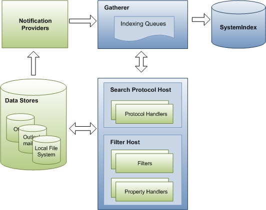
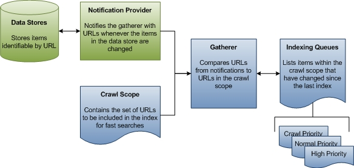
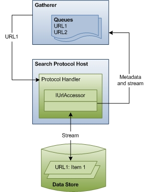
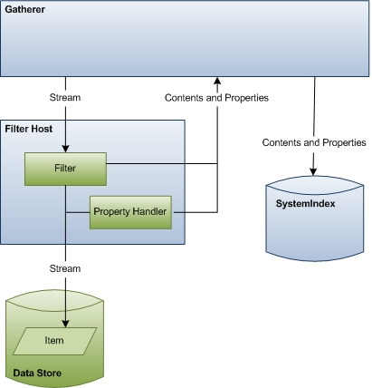

# Indexing Process in Windows Search

This topic describes the three stages of the indexing process and the primary components involved in each, explains the timing of indexing activity, and provides some notes for third-party developers who want their data stores or file formats indexed.

This topic is organized as follows:

- [Overview](#overview)
- [Stage 1: Queuing URLs for Indexing](#stage-1-queuing-urls-for-indexing)
- [Stage 2: Crawling URLs](#stage-2-crawling-urls)
- [Stage 3: Updating the Index](#stage-3-updating-the-index)
- [How Indexing is Scheduled](#how-indexing-is-scheduled)
- [Notes to Implementers](#notes-to-implementers)
- [Related topics](#related-topics)

## Overview

Windows Search supports the indexing of properties and content from files of different file formats, such as .doc or .jpeg formats, and data stores, such as the file system or Windows Outlook mailboxes. There are two kinds of indices: value indices that allow filtering and sorting by the whole value of a property and inverted indices that index words within textual properties or content. If you have a custom file format or data store, you need to understand how Windows Search indexes in order to get your items indexed correctly.

The indexing process happens in three stages controlled by a Windows Search component called the gatherer. In the first stage, the gatherer adds URLs to queues. The URLs identify items to be indexed, and the queues are merely prioritized lists of URLs. In the second stage, the gatherer coordinates other Windows Search and third-party components to access the items and collect data about them. Finally, in the third stage, the data collected is added to the index.

The following diagram shows the principal components and flow of data through the indexing process. A number of components are involved in collecting data for the index. Some of these are a part of Windows Search, and some come from third-party applications. If you have a custom data store or file format, Windows Search relies on your protocol handler and filter for accessing URLs and emitting properties for indexing. Windows Search components are shown in blue, and third-party components are shown in green.

## Stage 1: Queuing URLs for Indexing

In the first stage of indexing, the gatherer collects information about updates to data stores, compares that information to the known crawl scope, and then builds a queue of URLs to traverse to collect data for the index. For sources that are not based on notification, such as FAT drives, the gatherer periodically initiates a full traversal of the crawl scope so that the data in the index is kept fresh. For sources such as NTFS, there is only a single crawl and everything else is handled by notifications from the [USN Change Journal](/windows/desktop/FileIO/change-journals). There is also no crawl of Microsoft Outlook. The following diagram shows a high-level view of the queuing process for non-crawl indexing.

The rest of this section explains how Windows Search determines what URLs to crawl, and defines some important terms along the way.

**Crawl Scope**  The crawl scope is a set of URLs that Windows Search traverses to collect data about items that the user wants indexed for faster searches. Windows Search adds some URLs to the crawl scope by default, like paths to users' **Documents** and **Pictures** folders. Other URLs can be added by third-party applications, users, and Group Policy. Finally, both users and Group Policy can explicitly exclude URLs. Windows Search takes all the added URLs and removes the excluded URLs to determine the crawl scope. This is the working set of URLs from which the gatherer begins its work.

**Gatherer**  The gatherer is a Windows Search component that collects information about URLs within the crawl scope and creates a queue of URLs for the indexer to crawl. When an item in the crawl scope is added, deleted, or updated, the gatherer is notified by the data store's notifications provider. There is an initial crawl where the gatherer starts at the crawl scope root. The URL is passed to the protocol handler and then to the appropriate [**IFilter**](/windows/win32/api/filter/nn-filter-ifilter). The filter is usually a directory enumeration that produces more URLs. Notifications are the steady-state. Typically, each data store has its own protocol handler that provides these notifications. For example, on the local file system, the [USN Change Journal](/windows/desktop/FileIO/change-journals) acts as a notifications provider for all URLs under the file:// protocol. Similarly, Microsoft Outlook acts as a notifications provider for all URLs under the mapi:// protocol. When a user receives, moves, or deletes email, Outlook notifies the gatherer of the changed status of the email. From these notifications, the gatherer creates indexing queues of URLs to crawl.

**Indexing Queues**  The indexing queues are lists of URLs that identify items that need to be indexed or re-indexed. The gatherer compares the URLs it receives from notifications providers to the URLs in the crawl scope. Every URL from notifications providers that falls within the crawl scope is added to a queue that the gatherer uses to prioritize which URLs to process next.

There are three queues: high priority notifications, normal notifications, and periodic crawls. The high priority queue is for notifications that should be processed immediately. For example, when a user changes an item's title property in Windows Explorer, the Windows Explorer view needs to be updated immediately after the change. The normal notification queue is for all remaining change notifications. The notification queues are processed before the crawl queue because changed items are more likely to be of interest to a user. The gatherer accesses data for the URLs on each queue in first in, first out (FIFO) order.

For more information on prioritization, and eventing APIs introduced in Windows 7, see [Indexing Prioritization and Rowset Events in Windows 7](indexing-prioritization-and-rowset-events.md). For more information on crawl scope management and notifications, see [Providing Change Notifications](-search-3x-wds-notifyingofchanges.md) and [Using the Crawl Scope Manager](-search-3x-wds-extidx-csm.md).

## Stage 2: Crawling URLs

In the second stage of indexing, the gatherer crawls through the queues, accessing data stores and retrieving item streams. First, the gatherer finds the appropriate protocol handler for each URL. Then, the gatherer passes the URL to the protocol handler. The protocol handler accesses the item and passes item metadata back to the gatherer. The gatherer uses the metadata to identify the correct filter.

The following diagram shows a high-level view of the URL-crawling process. This stage includes considerable coordination and communication between components.

The rest of this section describes how Windows Search accesses items for indexing and explains the roles of each of the components involved.

**Gatherer**  In stage 2, the crawling stage, the gatherer processes the URLs in the queues, beginning with the high priority queue. Each URL is examined to identify its protocol. The gatherer then looks up the protocol handler registered for that protocol and instantiates it in the search protocol host process.

**Search Protocol Host**  The search protocol host is merely a boxed, host process for protocol handlers. Typically, Windows Search creates two such host processes, one that runs in the system security context and one that runs in the user security context. This separation ensures that data specific to a user is never run in the system context.

Windows Search also uses the host process to isolate an instance of a protocol handler from other processes or applications. This way, no outside application can access that specific instance of the protocol handler, and if the protocol handler fails unexpectedly, only the indexing process is affected. Because the host process runs third party code (protocol handlers), Windows Search periodically recycles the process to minimize the time a successful attack has to exploit information in the process. Beyond this, the search protocol host does not affect the crawling of URLs or indexing of items.

**Protocol Handlers**  Protocol handlers provide access to items in a data store using the data store's protocol. For example, the NTFS protocol handler provides access to files on a local drive using the file:// protocol. The protocol handler knows how to traverse the data store, identify new or updated items, and notify the gatherer. Then, when crawling begins, the protocol handler provides an [**IUrlAccessor**](/windows/desktop/api/Searchapi/nn-searchapi-iurlaccessor) object to the gatherer to bind to the item's underlying stream and return item metadata such as security restrictions and last modified time.

> [!NOTE]  
> Protocol handlers are not Windows Search components; they are components of the specific protocol and data store they are designed to access. If you have a custom data store you want indexed, you need to implement a protocol handler. For more information on protocol handlers and how to implement one, refer to [Developing Protocol Handlers](-search-3x-wds-phaddins.md).

**Metadata and Stream**  Using metadata returned by the protocol handler's [**IUrlAccessor**](/windows/desktop/api/Searchapi/nn-searchapi-iurlaccessor) object, the gatherer identifies the correct filter for the URL. The gatherer parses the item's file name extension and looks up the filter registered for that extension. If the gatherer is unable to find a filter, Windows Search uses the metadata to derive a minimal set of system property information (like System.ItemName) and updates the index. Otherwise, if the gatherer finds the filter, the third stage of indexing begins.

## Stage 3: Updating the Index

In the third stage of indexing, the gatherer instantiates the correct filter for the URL and initializes the filter with the stream from the [**IUrlAccessor**](/windows/desktop/api/Searchapi/nn-searchapi-iurlaccessor) object. The filter then accesses the item and returns content for the index. If you have a custom file format, Windows Search relies on your filter to access URLs and emit content and properties for indexing.

The following diagram shows a high-level view of the data access process. This stage includes considerable coordination and communication between components.

The rest of this section describes how Windows Search accesses item data for indexing and explains the roles of each of the components involved.

**Gatherer**  At the beginning of this stage, the gatherer's role is to instantiate the correct filter for the item and pass it the item stream. At the end of this stage, the gatherer takes the content and properties emitted by the filter and property handler and updates the index.

**Filter Host**  The filter host is merely a host process for filters and property handlers and serves a purpose similar to the search protocol host. The host process isolates filters and property handlers from the rest of the system for the same security and stability reasons that search protocol host processes isolate protocol handlers. The host process runs with minimal rights (it can't even access the file system) and is occasionally recycled to protect against security attacks. Windows Search also monitors resource use so that if a filter consumes too many resources, the host process is recycled.

**Filters**  Filters are critical components in the indexing process that emit item information for the gatherer. Filters are named after the principal interface used in their implementation, the [**IFilter**](/windows/win32/api/filter/nn-filter-ifilter) interface, and consequently are sometimes referred to as IFilters. There are two kinds of filters: one that interacts with individual items like files and one that interacts with containers like folders. Both provide data for the index.

Using metadata returned by the protocol handler's [**IUrlAccessor**](/windows/desktop/api/Searchapi/nn-searchapi-iurlaccessor) object, the gatherer identifies the correct filter for a particular URL and passes it to the stream. The gatherer identifies the correct filter either through a protocol handler or by the file name extension, MIME type, or class identifier (CLSID). If the URL points to a container, the filter emits properties for the container and enumerates the items in the container (child URLs). If the URL points to an item, the filter returns the textual content, if any the reading of properties and are more complex than property handlers. Generally, we recommend that filters emit item contents while property handlers emit item properties. However, if your filter needs to work with older applications that do not recognize property handlers, you can implement the filter to emit properties as well.

> [!NOTE]  
> Filters are not Windows Search components; they are components related to the specific file format or container they are designed to access. For more information on filters and how to implement one for a custom file format or container, see [Best Practices for Creating Filter Handlers in Windows Search](-search-3x-wds-extidx-filters.md).

The following table lists the results that the gatherer receives from a filter ([**IFilter**](/windows/win32/api/filter/nn-filter-ifilter)) and property handler ([**IPropertyStore**](/windows/win32/api/propsys/nn-propsys-ipropertystore)) during the indexing process.

|                            | [**IFilter**](/windows/win32/api/filter/nn-filter-ifilter) | [**IPropertyStore**](/windows/win32/api/propsys/nn-propsys-ipropertystore) |
|----------------------------|------------------------------------|-------------------------------------------------|
| Allow write                | No                                 | Yes                                             |
| Mix content and properties | Yes                                | No                                              |
| Multilingual               | Yes                                | No                                              |
| Emit links                 | Yes                                | No                                              |
| MIME                       | Yes                                | No                                              |
| Text boundaries            | Sentence, paragraph, chapter       | None                                            |
| Client / server            | Both                               | Client                                          |
| Implementation             | Complex                            | Simple                                          |

**Property Handlers**  Property handlers are components that read and write properties for a particular file format. They access items and emit properties for the gatherer in the same way that filters do for content. Property handlers are easier to implement than filters. If a text-based file format is very simple or the files are expected to be very small, the property handler can emit both properties and content.

> [!NOTE]  
> Property handlers are not Windows Search components; they are components related to the specific file format they are designed to access. For more information on property handlers and how to implement one for a custom file format, see [Developing Property Handlers for Windows Search](-search-3x-wds-extidx-propertyhandlers.md).

**Properties** Windows Search provides a [property system](https://msdn.microsoft.com/library/bb763010(VS.85).aspx) that includes a large library of properties. Any property can appear on any item as defined by the filter or property handler. If you have a custom file format, you can map your file format's properties to these system properties, and you can create new custom properties. When your filter or property handler emits these properties, the gatherer updates the index so users can search using your properties. For more information on creating and registering custom properties for a file format, see [Property System](../properties/building-property-handlers.md).

**SystemIndex**  The index, called SystemIndex, stores indexed data and is composed of a property store and indices over the properties and content for item properties, and an inverted index for textual content and properties. After the gatherer updates the index, the index can be queried by Windows Search and other applications. For more information on ways to query the index, see [Querying the Index Programmatically](-search-3x-wds-qryidx-overview.md).

> [!NOTE]  
> Remember that when you re-register a schema, changes made to attributes of previously defined properties may not be respected by the indexer. The solution is either to rebuild the index, or introduce new properties that reflect the changes instead of updating old ones (not recommended). For more information, see [Note to Implementers](#notes-to-implementers) in [Properties System Overview](../properties/property-system-overview.md).

## How Indexing is Scheduled

When Windows Search is first installed, it performs a full indexing of the crawl scope, pausing during periods of high I/O and user activity. The default crawl scope consists of the default library locations, such as **Documents**, **Music**, **Pictures**, and **Videos**. Notifications are processed even before the initial crawl is finished. Occasionally, the gatherer crawls the URLs from the full crawl scope. These full crawls ensure that the data in the index is fresh. For example, if a notification provider fails to send notifications or if the Windows Search service is terminated unexpectedly, the gatherer would have no knowledge of new or changed items and would not index these items. There are two kinds of sources: notification only and notification enabled. In both sources, the gatherer initially crawls the index. After the initial crawl, the notification-only sources will never do a full crawl again unless there is a failure, such as the [USN Change Journal](/windows/desktop/FileIO/change-journals) rolling over. Notification-enabled sources do an incremental crawl when the indexer is started, but then listen to notifications while running. NTFS and Microsoft Outlook are notification only. Internet Explorer and FAT are notification enabled.

## Notes to Implementers

The quality of the data in the index and the efficiency of the indexing process depend largely on your filter and property handler implementation. Because the filter is called every time a URL identifies your file format, the indexing process can slow down dramatically if your filter is inefficient. If your property handler doesn't correctly map all file properties to system properties or doesn't correctly emit these properties, the data in the index will be incorrect and later searches for those properties will return incorrect results. If your filter or property handler fails, the indexer won't be able to index data.

Applications and processes other than Windows Search rely on protocol handlers, filters, and property handlers. Your implementations can affect those applications in ways you may not expect. The [Windows Search Development Guide](-search-developers-guide-entry-page.md) provides advice on design choices and on testing each of these components.

## Related topics

[Indexing, Querying and Notifications in Windows Search](-search-3x-wds-included-in-index.md)

[What is Included in the Index](-search-indexing-process-overview.md)

[Querying Process in Windows Search](querying-process--windows-search-.md)

[Notifications Process in Windows Search](-search-3x-wds-support.md)

[URL Formatting Requirements](url-formatting-requirements.md)
