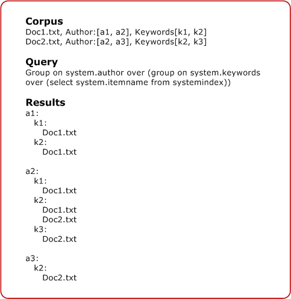

# Aggregate Functions

An aggregate function performs a calculation on a set of values and returns a value. Doing so makes it possible to generate summary statistics for multi-level groups with little overhead.

## About Aggregate Functions

Aggregate functions in Windows Search Structured Query Language (SQL) have the following syntax:


```
AGGREGATE <function> [AS <label>] [,<function> [AS <label>]]*
```


The function portion can include any of the following functions and syntax:


| Function                                                              | Description                                                                                                                                                                                                 |
|-----------------------------------------------------------------------|-------------------------------------------------------------------------------------------------------------------------------------------------------------------------------------------------------------|
| AVG(&lt;column&gt;)                                                   | Returns the average of the values in a group. Applies only to numbers.                                                                                                                                      |
| BYFREQUENCY(&lt;column&gt;, &lt;N&gt;)                                | Returns the most frequent N column values from the results in the group. Also includes a count of how many times each value occurred and document identifiers for results that contain each returned value. |
| CHILDCOUNT()                                                          | Returns the number of items in a group (excluding subgroups). If there are multiple levels of grouping, this returns the number of immediate child groups.                                                  |
| COUNT()                                                               | Returns the number of items in a group and all subgroups.                                                                                                                                                   |
| DATERANGE(&lt;column&gt;)                                             | Returns the lower and upper bounds of the column values found in the group results group. Valid only for filetime properties.                                                                               |
| FIRST(&lt;column&gt;, &lt;N&gt;)                                      | Returns the first N column values from leaf results found in a group.                                                                                                                                       |
| MAX(&lt;column&gt;)                                                   | Returns the maximum value in the expression. Applies only to numbers or dates.                                                                                                                              |
| MIN(&lt;column&gt;)                                                   | Returns the minimum value in the expression. Applies only to numbers or dates.                                                                                                                              |
| REPRESENTATIVEOF(&lt;column&gt;, &lt;idRepresentative&gt;, &lt;N&gt;) | Returns N idRepresentative values, each selected from one of the result subsets that has a unique column value. Each value is also returned with a document identifier that has the idRepresentative value. |
| SUM(&lt;column&gt;)                                                   | Returns the sum of the values in a group. Applies only to numbers.                                                                                                                                          |


 

 

> [!Note]  
> Aggregates are returned as individual columns. They are mostly simple types except for ByFrequency, First, DateRange, and RepresentativeOf which are returned as compound types.

 

You can use any numeric or date column for aggregations, and not only those that are in the SELECT clause. However, you cannot group on aggregates. A syntax error is returned if the column argument passed in is not either a numeric or date type.

The label portion is optional and provides a more readable alias for the label. If you do not include an alias label, then Windows Search transforms the function and column name into a label. For example, MAX(System.Document.WordCount) becomes MAX\_SystemDocumentWordCount.

## Multi-level Groups and Counting

Aggregates are defined over leaves and are duplicated. An aggregate takes as input the leaves of the group that defines it (documents), rather than the subgroups of its children. This functionality is referred to as multi-level grouping.

In addition to aggregates being defined over leaves and duplicated, they are counted only once. While the same document might be represented multiple times under one group, aggregates would only consider it once. The following graphic illustrates this concept.



## Aggregate Examples

The following are examples of aggregate functions within the GROUP ON clause:


```
GROUP ON System.Sender ['d','m','r'] 
    AGGREGATE COUNT() as 'Total',
              MAX(System.Size) as 'Max Size',
              MIN(System.Size) as 'Min Size'
    OVER (SELECT System.Subject FROM systemindex)
              
GROUP ON System.Sender ['d', 'm', 'r']
      AGGREGATE MAX(System.Search.Rank) as 'MaxRank', 
                MIN(System.Search.Rank) as 'MinRank'
      OVER (GROUP ON system.conversationID
                  OVER (SELECT workid, System.ItemUrl FROM systemindex
                        WHERE CONTAINS (*, 'sometext')
                        ORDER BY System.DateCreated))
               
GROUP ON System.FileName [before('a'),before('z')] 
      AGGREGATE MAX(System.Size) as 'maxsize', MIN(System.Size) as 'MinSize' 
      OVER (SELECT System.FileName FROM systemindex
            ORDER BY System.FileName)      
            
GROUP ON System.author 
      AGGREGATE MAX(System.size) as 'maxsize' 
      ORDER BY min(System.Size) 
      OVER (GROUP ON System.DateCreated 
                  AGGREGATE Count() 
                  ORDER BY MAX(System.size) 
                  OVER (SELECT filename, System.DateCreated, System.Size FROM systemindex
                        WHERE CONTAINS('text')))
```


## Return Value

The return value is a variant found on the rowset as a custom property, either as the specified aliases or as "Aggregates" if no alias label is specified.

 

 


